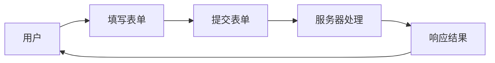

# Python 表单处理

表单是Web应用程序中用户交互的基础组件，它们允许用户向网站提交数据。在Python Web开发中，了解如何处理表单输入对于构建交互式网站至关重要。本文将介绍Python中表单处理的基本概念和实现方法。

## 什么是Web表单？

Web表单是HTML页面中的一个区域，包含各种输入元素如文本字段、复选框、单选按钮、下拉列表等，允许用户输入信息并提交给服务器。



## 基础HTML表单

在处理Python表单之前，我们需要先了解HTML表单的结构：

```html
<form action="/submit" method="POST">
    <label for="username">用户名：</label>
    <input type="text" id="username" name="username"><br />
    
    <label for="password">密码：</label>
    <input type="password" id="password" name="password"><br />
    
    <input type="submit" value="提交">
</form>
```

:::note
`action` 属性指定表单提交的URL
`method` 属性指定提交方法，通常是GET或POST
:::

## Python 中的表单处理方法

在Python中，处理表单的方式取决于你使用的Web框架。下面我们将介绍三种主流框架中的表单处理方法。

### 1. Flask中的表单处理

Flask是一个轻量级的Python Web框架，它提供了简单的方式来处理表单数据。

#### 基本表单处理

```python
from flask import Flask, request, render_template

app = Flask(__name__)

@app.route('/')
def form():
    return render_template('form.html')

@app.route('/submit', methods=['POST'])
def submit():
    username = request.form.get('username')
    password = request.form.get('password')
    return f'用户名: {username}, 密码: {password}'

if __name__ == '__main__':
    app.run(debug=True)
```

#### 使用Flask-WTF扩展

Flask-WTF是Flask的一个扩展，提供了与WTForms库的集成，使表单处理更加简便：

```python
from flask import Flask, render_template, redirect
from flask_wtf import FlaskForm
from wtforms import StringField, PasswordField, SubmitField
from wtforms.validators import DataRequired, Length

app = Flask(__name__)
app.config['SECRET_KEY'] = 'your-secret-key'

class LoginForm(FlaskForm):
    username = StringField('用户名', validators=[DataRequired(), Length(min=4, max=20)])
    password = PasswordField('密码', validators=[DataRequired(), Length(min=8)])
    submit = SubmitField('登录')

@app.route('/', methods=['GET', 'POST'])
def login():
    form = LoginForm()
    if form.validate_on_submit():
        return f'用户名: {form.username.data}, 密码: {form.password.data}'
    return render_template('login.html', form=form)

if __name__ == '__main__':
    app.run(debug=True)
```

对应的HTML模板(login.html)：

```html
<!DOCTYPE html>
<html>
<head>
    <title>登录</title>
</head>
<body>
    <h1>登录表单</h1>
    <form method="POST">
        {{ form.csrf_token }}
        <div>
            {{ form.username.label }}
            {{ form.username }}
            
                <span>{{ form.username.errors[0] }}</span>
            
        </div>
        <div>
            {{ form.password.label }}
            {{ form.password }}
            
                <span>{{ form.password.errors[0] }}</span>
            
        </div>
        {{ form.submit }}
    </form>
</body>
</html>
```

### 2. Django中的表单处理

Django是一个全功能的Python Web框架，它内置了强大的表单处理功能。

#### 基本表单处理

```python
# forms.py
from django import forms

class LoginForm(forms.Form):
    username = forms.CharField(label='用户名', max_length=20)
    password = forms.CharField(label='密码', widget=forms.PasswordInput)
```

```python
# views.py
from django.shortcuts import render
from django.http import HttpResponse
from .forms import LoginForm

def login_view(request):
    if request.method == 'POST':
        form = LoginForm(request.POST)
        if form.is_valid():
            username = form.cleaned_data['username']
            password = form.cleaned_data['password']
            return HttpResponse(f'用户名: {username}, 密码: {password}')
    else:
        form = LoginForm()
    
    return render(request, 'login.html', {'form': form})
```

对应的HTML模板(login.html)：

```html
<!DOCTYPE html>
<html>
<head>
    <title>登录</title>
</head>
<body>
    <h1>登录表单</h1>
    <form method="POST">
        
        {{ form.as_p }}
        <input type="submit" value="登录">
    </form>
</body>
</html>
```

### 3. FastAPI中的表单处理

FastAPI是一个现代化、高性能的Web框架，它使用Pydantic进行数据验证。

```python
from fastapi import FastAPI, Form, Request
from fastapi.templating import Jinja2Templates
from fastapi.responses import HTMLResponse

app = FastAPI()
templates = Jinja2Templates(directory="templates")

@app.get("/", response_class=HTMLResponse)
async def form(request: Request):
    return templates.TemplateResponse("form.html", {"request": request})

@app.post("/submit")
async def submit(username: str = Form(...), password: str = Form(...)):
    return {"username": username, "password": password}
```

对应的HTML模板(form.html)：

```html
<!DOCTYPE html>
<html>
<head>
    <title>登录</title>
</head>
<body>
    <h1>登录表单</h1>
    <form action="/submit" method="post">
        <div>
            <label for="username">用户名：</label>
            <input type="text" id="username" name="username">
        </div>
        <div>
            <label for="password">密码：</label>
            <input type="password" id="password" name="password">
        </div>
        <input type="submit" value="登录">
    </form>
</body>
</html>
```

## 表单验证

表单验证是确保用户输入正确数据的过程。Python Web框架通常提供内置的验证器。

### 常见的验证类型：

1. **必填字段验证** - 确保字段不能为空
2. **长度验证** - 检查输入的字符串长度
3. **格式验证** - 例如电子邮件格式、URL格式等
4. **数值范围验证** - 检查数值是否在特定范围内
5. **自定义验证** - 根据特定业务规则的验证

### Flask-WTF验证示例

```python
from flask_wtf import FlaskForm
from wtforms import StringField, PasswordField, EmailField
from wtforms.validators import DataRequired, Length, Email, EqualTo

class RegistrationForm(FlaskForm):
    username = StringField('用户名', validators=[
        DataRequired(message='用户名不能为空'),
        Length(min=4, max=20, message='用户名长度必须在4到20个字符之间')
    ])
    email = EmailField('邮箱', validators=[
        DataRequired(message='邮箱不能为空'),
        Email(message='请输入有效的邮箱地址')
    ])
    password = PasswordField('密码', validators=[
        DataRequired(message='密码不能为空'),
        Length(min=8, message='密码至少需要8个字符')
    ])
    confirm_password = PasswordField('确认密码', validators=[
        DataRequired(message='确认密码不能为空'),
        EqualTo('password', message='两次输入的密码必须一致')
    ])
```

## 文件上传处理

Web表单不仅可以处理文本输入，还可以处理文件上传。

### Flask中的文件上传

```python
from flask import Flask, request, render_template

app = Flask(__name__)
app.config['UPLOAD_FOLDER'] = 'uploads/'
app.config['MAX_CONTENT_LENGTH'] = 16 * 1024 * 1024  # 限制16MB

@app.route('/')
def upload_form():
    return render_template('upload.html')

@app.route('/upload', methods=['POST'])
def upload_file():
    if 'file' not in request.files:
        return '没有文件部分'
    file = request.files['file']
    if file.filename == '':
        return '没有选择文件'
    if file:
        filename = secure_filename(file.filename)
        file.save(os.path.join(app.config['UPLOAD_FOLDER'], filename))
        return f'文件上传成功: {filename}'
```

对应的HTML模板：

```html
<!DOCTYPE html>
<html>
<head>
    <title>文件上传</title>
</head>
<body>
    <h1>上传文件</h1>
    <form action="/upload" method="POST" enctype="multipart/form-data">
        <input type="file" name="file">
        <input type="submit" value="上传">
    </form>
</body>
</html>
```

:::caution
处理文件上传时，务必进行安全检查，如验证文件类型、大小，以及使用`secure_filename`函数避免路径遍历攻击。
:::

## 安全考虑

处理表单数据时，安全性是首要考虑的因素：

1. **CSRF保护** - 防止跨站请求伪造攻击
2. **输入验证** - 防止恶意数据注入
3. **转义输出** - 防止XSS攻击
4. **限制上传文件类型和大小** - 防止恶意文件上传

### CSRF保护示例

Flask-WTF自动包含CSRF保护：

```python
# 设置密钥
app.config['SECRET_KEY'] = 'your-secret-key-here'

# 在表单中包含CSRF令牌
class MyForm(FlaskForm):
    name = StringField('Name')
    
# 在模板中包含令牌
<form method="post">
    {{ form.csrf_token }}
    {{ form.name.label }} {{ form.name }}
    <input type="submit" value="Submit">
</form>
```

## 实际案例：用户注册系统

下面我们将实现一个简单的用户注册系统，展示如何在实际应用中处理表单：

```python
from flask import Flask, render_template, redirect, url_for, flash
from flask_sqlalchemy import SQLAlchemy
from flask_wtf import FlaskForm
from wtforms import StringField, PasswordField, SubmitField, EmailField
from wtforms.validators import DataRequired, Length, Email, EqualTo
from werkzeug.security import generate_password_hash

app = Flask(__name__)
app.config['SECRET_KEY'] = 'your-secret-key'
app.config['SQLALCHEMY_DATABASE_URI'] = 'sqlite:///users.db'
db = SQLAlchemy(app)

class User(db.Model):
    id = db.Column(db.Integer, primary_key=True)
    username = db.Column(db.String(20), unique=True, nullable=False)
    email = db.Column(db.String(120), unique=True, nullable=False)
    password = db.Column(db.String(60), nullable=False)

class RegistrationForm(FlaskForm):
    username = StringField('用户名', validators=[DataRequired(), Length(min=4, max=20)])
    email = EmailField('邮箱', validators=[DataRequired(), Email()])
    password = PasswordField('密码', validators=[DataRequired(), Length(min=8)])
    confirm_password = PasswordField('确认密码', 
                                    validators=[DataRequired(), EqualTo('password')])
    submit = SubmitField('注册')

@app.route('/register', methods=['GET', 'POST'])
def register():
    form = RegistrationForm()
    if form.validate_on_submit():
        hashed_password = generate_password_hash(form.password.data)
        user = User(
            username=form.username.data,
            email=form.email.data,
            password=hashed_password
        )
        db.session.add(user)
        db.session.commit()
        flash('账户创建成功！现在可以登录了。', 'success')
        return redirect(url_for('login'))
    return render_template('register.html', form=form)

if __name__ == '__main__':
    with app.app_context():
        db.create_all()
    app.run(debug=True)
```

register.html模板：

```html
<!DOCTYPE html>
<html>
<head>
    <title>注册</title>
</head>
<body>
    <h1>用户注册</h1>
    
        
            
                <div>{{ message }}</div>
            
        
    
    
    <form method="POST">
        {{ form.csrf_token }}
        <div>
            {{ form.username.label }}
            {{ form.username }}
            
                <span>{{ form.username.errors[0] }}</span>
            
        </div>
        <div>
            {{ form.email.label }}
            {{ form.email }}
            
                <span>{{ form.email.errors[0] }}</span>
            
        </div>
        <div>
            {{ form.password.label }}
            {{ form.password }}
            
                <span>{{ form.password.errors[0] }}</span>
            
        </div>
        <div>
            {{ form.confirm_password.label }}
            {{ form.confirm_password }}
            
                <span>{{ form.confirm_password.errors[0] }}</span>
            
        </div>
        {{ form.submit }}
    </form>
</body>
</html>
```

## 总结

在Python Web开发中，表单处理是一项基本但关键的技能。本文介绍了：

1. 表单的基本HTML结构
2. 主流Python Web框架（Flask、Django、FastAPI）中的表单处理方法
3. 表单验证技术
4. 文件上传处理
5. 表单安全性考虑
6. 实际案例：用户注册系统

通过学习和应用这些概念，你将能够在Python Web应用程序中高效、安全地处理用户输入。

## 练习

1. 创建一个简单的联系表单，包含姓名、电子邮件和留言字段，并实现表单验证。
2. 实现一个图片上传功能，限制只能上传jpg、png格式的图片，且大小不超过5MB。
3. 扩展用户注册系统，添加用户登录功能。
4. 创建一个多步骤表单，例如分步骤收集用户信息的向导。

## 扩展资源

- [Flask-WTF文档](https://flask-wtf.readthedocs.io/)
- [Django Forms文档](https://docs.djangoproject.com/en/stable/topics/forms/)
- [FastAPI表单处理](https://fastapi.tiangolo.com/tutorial/request-forms/)
- [OWASP Web安全指南](https://owasp.org/www-project-web-security-testing-guide/)

:::tip
记住，表单处理不仅是关于获取数据，还关乎用户体验和应用安全。始终验证输入并提供清晰的反馈，以创造良好的用户体验。
:::