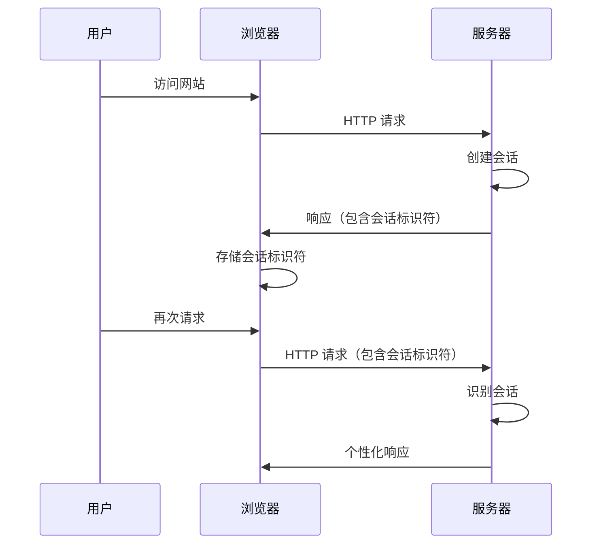

# Python 会话管理

在 Web 应用程序开发过程中，会话管理是一个至关重要的概念。由于 HTTP 协议本身是无状态的，这意味着服务器不会在不同请求之间保留任何用户数据。然而，现代 Web 应用需要"记住"用户的状态，比如用户是否已登录、用户的偏好设置等。这就是会话管理的用武之地。

## 什么是会话管理？

会话管理是指 Web 应用程序跟踪和维护用户状态信息的过程。当用户与网站交互时，会话允许应用记住该用户之前的操作和选择，从而提供个性化和连贯的用户体验。



## Python 中的会话管理机制

### Cookies

Cookies 是存储在用户浏览器中的小型文本文件，用于在客户端存储信息。

#### 在 Python 中设置和读取 Cookies

以下是使用 Python 标准库 `http.cookies` 设置和读取 Cookies 的示例：

```python
import http.cookies

# 创建一个 Cookie
cookie = http.cookies.SimpleCookie()
cookie["user"] = "john_doe"
cookie["user"]["path"] = "/"
cookie["user"]["max-age"] = 3600  # 一小时有效期

# 输出 Cookie 头
print(cookie.output())

# 读取 Cookie
cookie_string = "user=john_doe; path=/; max-age=3600"
cookie.load(cookie_string)
print(cookie["user"].value)  # 输出: john_doe
```

输出：
```
Set-Cookie: user=john_doe; Max-Age=3600; Path=/
john_doe
```

:::caution
Cookies 存在安全隐患，敏感信息不应该直接存储在 Cookie 中，除非进行加密。
:::

### Session

Session 是在服务器端存储用户数据的机制，通常与客户端的唯一标识符（通常存储在 Cookie 中）相关联。

#### 基本 Session 工作原理

1. 用户首次访问网站时，服务器生成唯一的会话 ID
2. 服务器将会话 ID 发送给浏览器（通常通过 Cookie）
3. 服务器在自己的存储中为这个会话 ID 关联创建数据空间
4. 用户后续请求会带上会话 ID，服务器通过该 ID 找到对应的会话数据

## 在主流 Python Web 框架中实现会话管理

### Flask 中的会话管理

Flask 提供了一个简单的会话接口，默认使用签名的 Cookies 来存储会话数据。

```python
from flask import Flask, session, redirect, url_for, request

app = Flask(__name__)
app.secret_key = 'your_very_secret_key_here'  # 用于会话签名

@app.route('/')
def index():
    if 'username' in session:
        return f'已登录为 {session["username"]}'
    return '未登录'

@app.route('/login', methods=['GET', 'POST'])
def login():
    if request.method == 'POST':
        session['username'] = request.form['username']
        return redirect(url_for('index'))
    return '''
        <form method="post">
            <p>用户名: <input type=text name=username></p>
            <p><input type=submit value=登录></p>
        </form>
    '''

@app.route('/logout')
def logout():
    # 从会话中移除用户名
    session.pop('username', None)
    return redirect(url_for('index'))

if __name__ == '__main__':
    app.run(debug=True)
```

:::tip
Flask 的默认会话实现是基于 Cookie 的，会话数据实际上存储在客户端，但经过加密和签名。如果需要服务器端会话，可以使用扩展如 `flask-session`。
:::

### Django 中的会话管理

Django 提供了更完整的会话框架，默认使用数据库存储会话数据。

```python
# settings.py 中的会话配置
SESSION_ENGINE = "django.contrib.sessions.backends.db"  # 默认使用数据库存储
SESSION_COOKIE_AGE = 1209600  # 两周（以秒为单位）

# views.py 中使用会话
from django.shortcuts import render, redirect

def login_view(request):
    if request.method == 'POST':
        username = request.POST.get('username')
        # 验证用户...
        request.session['username'] = username
        return redirect('home')
    return render(request, 'login.html')

def home_view(request):
    username = request.session.get('username', None)
    if username:
        return render(request, 'home.html', {'username': username})
    return redirect('login')

def logout_view(request):
    request.session.flush()  # 清空会话
    return redirect('login')
```

Django 支持多种会话存储后端：
- 数据库（默认）
- 缓存（如 Redis, Memcached）
- 文件系统
- 加密的 Cookie

## 会话管理的高级主题

### 会话安全最佳实践

1. **设置安全的 Cookie 属性**:
   - `Secure`：只通过 HTTPS 发送
   - `HttpOnly`：防止 JavaScript 访问
   - `SameSite`：防止跨站请求伪造 (CSRF) 攻击

2. **会话超时**：
   ```python
   # Flask 示例
   app.config['PERMANENT_SESSION_LIFETIME'] = timedelta(minutes=30)
   
   # Django 示例
   SESSION_COOKIE_AGE = 1800  # 30分钟（秒）
   ```

3. **会话固定攻击防护**：在用户权限变更时（如登录）重新生成会话 ID。

### 使用 Redis 管理会话（高性能解决方案）

对于高流量网站，使用 Redis 作为会话存储可以显著提高性能。

```python
# Flask 使用 Redis 存储会话
from flask import Flask, session
from flask_session import Session
import redis

app = Flask(__name__)
app.config['SESSION_TYPE'] = 'redis'
app.config['SESSION_REDIS'] = redis.from_url('redis://localhost:6379')
Session(app)

# Django 使用 Redis 存储会话
# settings.py
SESSION_ENGINE = "django.contrib.sessions.backends.cache"
SESSION_CACHE_ALIAS = "default"
CACHES = {
    "default": {
        "BACKEND": "django_redis.cache.RedisCache",
        "LOCATION": "redis://127.0.0.1:6379/1",
    }
}
```

## 实际案例：购物车功能实现

下面我们将实现一个简单的购物车功能，展示会话管理在实际应用中的使用。这个例子使用 Flask 框架。

```python
from flask import Flask, session, redirect, url_for, request, render_template_string

app = Flask(__name__)
app.secret_key = 'shopping_cart_secret_key'

# 产品数据（实际应用中通常从数据库获取）
products = {
    '1': {'name': 'Python编程书籍', 'price': 59.99},
    '2': {'name': 'USB充电器', 'price': 19.99},
    '3': {'name': '无线鼠标', 'price': 29.99}
}

@app.route('/')
def index():
    # 确保购物车存在
    if 'cart' not in session:
        session['cart'] = {}
    
    # 计算总价
    total = sum(
        products[product_id]['price'] * quantity
        for product_id, quantity in session['cart'].items()
    )
    
    # 简单的 HTML 模板
    template = '''
    <!DOCTYPE html>
    <html>
    <head>
        <title>Python购物车示例</title>
        <style>
            body { font-family: Arial; max-width: 800px; margin: 0 auto; padding: 20px; }
            table { width: 100%; border-collapse: collapse; }
            table, th, td { border: 1px solid #ddd; padding: 8px; }
            th { background-color: #f2f2f2; }
        </style>
    </head>
    <body>
        <h1>产品列表</h1>
        <table>
            <tr>
                <th>产品</th>
                <th>价格</th>
                <th>操作</th>
            </tr>
            
            <tr>
                <td>{{ product.name }}</td>
                <td>${{ product.price }}</td>
                <td>
                    <form action="/add" method="post">
                        <input type="hidden" name="product_id" value="{{ id }}">
                        <input type="submit" value="添加到购物车">
                    </form>
                </td>
            </tr>
            
        </table>
        
        <h2>购物车</h2>
        
        <table>
            <tr>
                <th>产品</th>
                <th>价格</th>
                <th>数量</th>
                <th>小计</th>
                <th>操作</th>
            </tr>
            
            <tr>
                <td>{{ products[id].name }}</td>
                <td>${{ products[id].price }}</td>
                <td>{{ quantity }}</td>
                <td>${{ (products[id].price * quantity)|round(2) }}</td>
                <td>
                    <form action="/remove" method="post">
                        <input type="hidden" name="product_id" value="{{ id }}">
                        <input type="submit" value="移除">
                    </form>
                </td>
            </tr>
            
            <tr>
                <td colspan="3"><strong>总计</strong></td>
                <td><strong>${{ total|round(2) }}</strong></td>
                <td></td>
            </tr>
        </table>
        <p><a href="/checkout">结账</a> | <a href="/clear">清空购物车</a></p>
        
        <p>购物车空空如也</p>
        
    </body>
    </html>
    '''
    return render_template_string(template, products=products, session=session, total=total)

@app.route('/add', methods=['POST'])
def add_to_cart():
    product_id = request.form['product_id']
    if product_id in products:
        if 'cart' not in session:
            session['cart'] = {}
        session['cart'][product_id] = session['cart'].get(product_id, 0) + 1
        # 标记会话已修改
        session.modified = True
    return redirect(url_for('index'))

@app.route('/remove', methods=['POST'])
def remove_from_cart():
    product_id = request.form['product_id']
    if 'cart' in session and product_id in session['cart']:
        if session['cart'][product_id] > 1:
            session['cart'][product_id] -= 1
        else:
            del session['cart'][product_id]
        session.modified = True
    return redirect(url_for('index'))

@app.route('/clear')
def clear_cart():
    session['cart'] = {}
    return redirect(url_for('index'))

@app.route('/checkout')
def checkout():
    # 在实际应用中，这里会处理支付流程
    # 完成后清空购物车
    total = sum(
        products[product_id]['price'] * quantity
        for product_id, quantity in session['cart'].items()
    )
    session['cart'] = {}
    return f'<h1>订单已完成</h1><p>总金额: ${total:.2f}</p><p><a href="/">返回首页</a></p>'

if __name__ == '__main__':
    app.run(debug=True)
```

这个购物车应用程序展示了会话管理的实际应用：

1. 创建会话存储（购物车）
2. 在会话中添加/删除数据
3. 在请求之间保持状态
4. 会话数据处理（计算总价等）
5. 会话清理（结账后清空购物车）

## 总结

会话管理是构建交互式 Web 应用的关键组成部分。它解决了 HTTP 无状态特性带来的问题，使应用能够"记住"用户并提供个性化体验。在 Python Web 开发中，我们可以利用各种工具和框架来实现高效、安全的会话管理：

- **Cookies** 用于在客户端存储小量非敏感数据
- **Session** 用于在服务器端安全地存储用户状态信息
- **不同框架**（Flask、Django）提供了自己的会话管理实现
- **高性能解决方案**如 Redis 可用于改进大型应用的会话存储

在实现会话管理时，安全性是首要考虑因素。应用适当的超时策略、安全的 Cookie 配置以及防范会话攻击的措施至关重要。

## 练习

1. 修改购物车示例，添加用户登录功能，并确保每个用户只能看到自己的购物车内容。
2. 在 Django 中实现一个带有会话超时功能的登录系统，要求用户在 30 分钟不活动后重新登录。
3. 研究和实现一个使用 Redis 作为后端的 Flask 会话系统，比较其性能与默认会话系统的差异。
4. 尝试实现一个同时支持 Cookie 和 JSON Web Token (JWT) 的身份验证系统。

## 进一步学习资源

- [Flask 官方文档：会话](https://flask.palletsprojects.com/en/2.0.x/quickstart/#sessions)
- [Django 官方文档：如何使用会话](https://docs.djangoproject.com/en/3.2/topics/http/sessions/)
- [OWASP 会话管理安全指南](https://cheatsheetseries.owasp.org/cheatsheets/Session_Management_Cheat_Sheet.html)
- [Redis 官方文档](https://redis.io/documentation)

掌握会话管理是成为一名优秀 Web 开发人员的关键技能。通过持续的实践和学习，你将能够构建既安全又用户友好的 Web 应用程序！