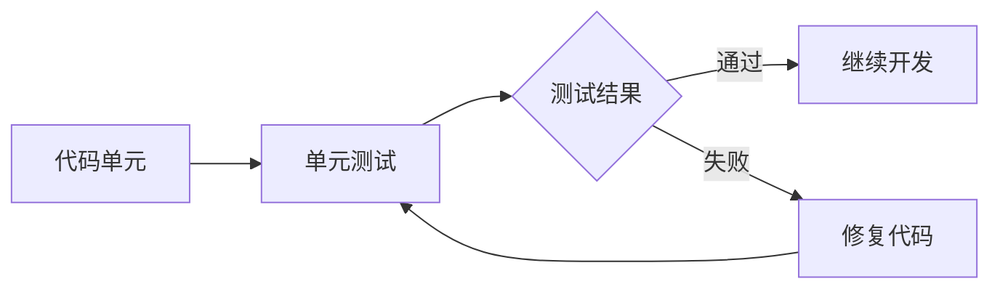
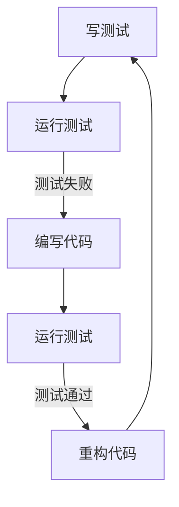

# Python 测试概述

---
title: Python 测试概述
description: 本文介绍Python测试的基础概念、不同测试类型、常用测试框架和最佳实践，帮助初学者建立有效的测试习惯。
---

## 什么是软件测试？

软件测试是一个验证程序是否按照预期工作的过程。对于Python程序员来说，测试是确保代码可靠性和稳定性的关键步骤。良好的测试习惯可以帮助你：

- 提前发现并修复bug
- 确保代码满足需求规格
- 支持安全地修改和重构代码
- 提供代码功能的文档
- 增强对代码的信心

:::tip
即使是最简单的程序，进行适当的测试也能在长期节省你大量的时间和精力！
:::

## 测试的类型

在Python开发中，我们通常会遇到以下几种测试类型：

### 1. 单元测试

单元测试专注于测试代码的最小单元（通常是函数或方法），验证其在各种输入条件下的行为是否正确。



### 2. 集成测试

集成测试检验多个单元如何协同工作，确保它们在被组合后仍然正确运行。

### 3. 功能测试

功能测试验证整个系统是否满足功能需求，通常模拟真实用户的使用场景。

### 4. 回归测试

回归测试确保新的代码更改不会破坏现有功能，通常是在修复bug或添加新功能后运行的。

## Python 的测试框架

Python有多个优秀的测试框架可供选择：

### 1. unittest（Python标准库）

`unittest`是Python标准库的一部分，提供了一套完整的测试工具。

```python
import unittest

def add(a, b):
    return a + b

class TestAddFunction(unittest.TestCase):
    def test_add_positive_numbers(self):
        self.assertEqual(add(1, 2), 3)
        
    def test_add_negative_numbers(self):
        self.assertEqual(add(-1, -2), -3)
        
    def test_add_mixed_numbers(self):
        self.assertEqual(add(-1, 2), 1)

if __name__ == '__main__':
    unittest.main()
```

运行上述代码将显示：

```
...
----------------------------------------------------------------------
Ran 3 tests in 0.001s

OK
```

### 2. pytest

`pytest`是一个更现代且功能更强大的测试框架，语法简洁，功能丰富。

```python
# 安装：pip install pytest

def add(a, b):
    return a + b

def test_add_positive_numbers():
    assert add(1, 2) == 3
    
def test_add_negative_numbers():
    assert add(-1, -2) == -3
    
def test_add_mixed_numbers():
    assert add(-1, 2) == 1
```

将上面的代码保存为`test_add.py`，然后在命令行中运行：

```
pytest test_add.py
```

输出结果:

```
collected 3 items

test_add.py ...                                        [100%]

===================== 3 passed in 0.01s =====================
```

### 3. doctest

`doctest`通过检查函数文档字符串中的示例来测试代码。

```python
def multiply(a, b):
    """
    乘法函数，返回两个数的乘积
    
    Examples:
    >>> multiply(2, 3)
    6
    >>> multiply(-1, 4)
    -4
    >>> multiply(0, 10)
    0
    """
    return a * b

if __name__ == "__main__":
    import doctest
    doctest.testmod()
```

如果所有测试都通过，运行该脚本不会显示任何输出。

## 测试驱动开发（TDD）

测试驱动开发是一种开发方法，它遵循以下循环：

1. 先写测试（这些测试初始会失败）
2. 编写最小量的代码使测试通过
3. 重构代码以提高质量
4. 重复这个过程



:::note
TDD可以帮助你更加关注代码应该完成什么，而不是如何完成，从而提高代码质量。
:::

## 测试的最佳实践

### 1. 测试覆盖率

测试覆盖率是衡量测试执行了多少源代码的指标。你可以使用`coverage`库来衡量测试覆盖率：

```
pip install coverage
coverage run -m pytest test_add.py
coverage report
```

这将显示每个文件的测试覆盖率百分比。

### 2. 测试独立性

每个测试应该是独立的，不依赖于其他测试的执行顺序或结果。

### 3. 测试准备与清理

在测试前后正确设置和清理环境是很重要的，可以使用`setUp`和`tearDown`方法（在`unittest`中）或者`pytest`的fixture。

```python
import unittest
import os

class TestFileOperations(unittest.TestCase):
    def setUp(self):
        # 测试前创建一个临时文件
        with open('temp.txt', 'w') as f:
            f.write('Hello, World!')
    
    def tearDown(self):
        # 测试后删除临时文件
        if os.path.exists('temp.txt'):
            os.remove('temp.txt')
    
    def test_file_content(self):
        with open('temp.txt', 'r') as f:
            content = f.read()
        self.assertEqual(content, 'Hello, World!')
```

## 实际案例：测试一个简单计算器

让我们通过测试一个简单计算器应用来综合运用这些概念。

首先，创建一个名为`calculator.py`的文件：

```python
class Calculator:
    def add(self, a, b):
        return a + b
        
    def subtract(self, a, b):
        return a - b
        
    def multiply(self, a, b):
        return a * b
        
    def divide(self, a, b):
        if b == 0:
            raise ValueError("Cannot divide by zero")
        return a / b
```

然后，创建一个名为`test_calculator.py`的测试文件：

```python
import unittest
from calculator import Calculator

class TestCalculator(unittest.TestCase):
    def setUp(self):
        # 在每个测试方法前创建一个计算器实例
        self.calc = Calculator()
    
    def test_add(self):
        self.assertEqual(self.calc.add(3, 5), 8)
        self.assertEqual(self.calc.add(-1, 1), 0)
        self.assertEqual(self.calc.add(-1, -1), -2)
    
    def test_subtract(self):
        self.assertEqual(self.calc.subtract(5, 3), 2)
        self.assertEqual(self.calc.subtract(1, 5), -4)
        self.assertEqual(self.calc.subtract(-1, -1), 0)
    
    def test_multiply(self):
        self.assertEqual(self.calc.multiply(3, 5), 15)
        self.assertEqual(self.calc.multiply(-1, 5), -5)
        self.assertEqual(self.calc.multiply(-1, -1), 1)
    
    def test_divide(self):
        self.assertEqual(self.calc.divide(6, 3), 2)
        self.assertEqual(self.calc.divide(5, 2), 2.5)
        self.assertEqual(self.calc.divide(-6, 3), -2)
        
        # 测试除以零的异常
        with self.assertRaises(ValueError):
            self.calc.divide(6, 0)

if __name__ == '__main__':
    unittest.main()
```

运行测试：

```
python -m unittest test_calculator.py
```

预期输出：

```
....
----------------------------------------------------------------------
Ran 4 tests in 0.001s

OK
```

## 调试与测试的关系

测试和调试是密切相关但不同的活动：

- **测试**是验证代码是否符合预期
- **调试**是找出代码中错误的原因并修复它

良好的测试可以减少调试的需要，因为它能够在早期发现问题，并且可以精确地指出问题所在。

## 总结

Python测试是确保代码质量和可靠性的关键实践：

- 测试帮助你验证代码是否按预期工作
- Python有多种测试框架可供选择，包括`unittest`、`pytest`和`doctest`
- 不同类型的测试（单元测试、集成测试、功能测试、回归测试）满足不同的测试需求
- 遵循测试最佳实践可以提高测试的有效性
- 测试驱动开发(TDD)是一种先写测试再写代码的开发方法

通过建立良好的测试习惯，你将编写出更可靠、更易于维护的代码，同时减少bug的数量和调试的时间。

## 练习

1. 为一个简单的字符串处理函数编写单元测试，如编写一个函数计算给定字符串中某个字符的出现次数。
2. 使用pytest框架为一个列表排序函数编写测试。
3. 尝试使用TDD方法开发一个函数，该函数接受一个数字列表并返回其中的最大值和最小值。
4. 为上面的计算器类添加更多功能（如平方根、幂运算），并为这些新功能编写测试。

## 延伸阅读

- Python官方文档中的[unittest模块](https://docs.python.org/3/library/unittest.html)
- [pytest文档](https://docs.pytest.org/)
- [Python测试之道](https://pragprog.com/titles/bopytest/python-testing-with-pytest/)
- 关于测试驱动开发的书籍：《测试驱动开发：实例与模式》

开始测试你的Python代码吧，你会因此成为一个更好的开发者！