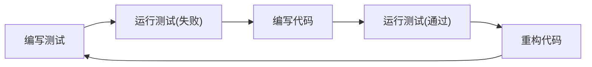

# Python 单元测试

单元测试是软件开发中至关重要的环节，它允许开发者验证代码的各个"单元"（通常是函数或方法）是否按预期工作。在Python中，单元测试帮助我们确保代码质量、减少bug，并使代码重构变得更加安全。

## 为什么需要单元测试？

单元测试为我们的代码提供了多种好处：

- 早期发现问题，降低修复成本
- 确保代码按预期工作
- 促进更好的代码设计
- 为代码重构提供安全网
- 作为代码功能的文档
- 提高开发者的信心

## Python 的unittest框架

Python标准库提供了`unittest`模块，它是Python中最常用的测试框架之一。

### unittest的基本结构

unittest测试的基本结构包含以下元素：

1. **测试用例(TestCase)** - 继承自`unittest.TestCase`的类，包含一系列测试方法
2. **测试方法** - 测试用例类中以`test_`开头的方法
3. **断言(assertions)** - 用于验证测试结果的方法
4. **测试套件(TestSuite)** - 测试用例的集合
5. **测试运行器(TestRunner)** - 执行测试并报告结果的组件

## 编写你的第一个单元测试

让我们从一个简单的例子开始。假设我们有一个计算函数：

```python
# calculator.py
def add(a, b):
    return a + b

def subtract(a, b):
    return a - b
```

现在，我们来为这些函数编写测试：

```python
# test_calculator.py
import unittest
from calculator import add, subtract

class TestCalculator(unittest.TestCase):
    
    def test_add(self):
        self.assertEqual(add(3, 5), 8)
        self.assertEqual(add(-1, 1), 0)
        self.assertEqual(add(-1, -1), -2)
        
    def test_subtract(self):
        self.assertEqual(subtract(5, 3), 2)
        self.assertEqual(subtract(1, 1), 0)
        self.assertEqual(subtract(-1, -1), 0)

if __name__ == '__main__':
    unittest.main()
```

运行测试：

```
$ python test_calculator.py
...
----------------------------------------------------------------------
Ran 2 tests in 0.001s

OK
```

## unittest常用断言方法

`unittest.TestCase`类提供了许多断言方法，用于验证代码的行为：

| 断言方法 | 描述 |
|---------|------|
| `assertEqual(a, b)` | 验证a == b |
| `assertNotEqual(a, b)` | 验证a != b |
| `assertTrue(x)` | 验证x为True |
| `assertFalse(x)` | 验证x为False |
| `assertIs(a, b)` | 验证a是b |
| `assertIsNot(a, b)` | 验证a不是b |
| `assertIsNone(x)` | 验证x是None |
| `assertIsNotNone(x)` | 验证x不是None |
| `assertIn(a, b)` | 验证a在b中 |
| `assertNotIn(a, b)` | 验证a不在b中 |
| `assertRaises(exc, func, *args, **kwargs)` | 验证func(*args, **kwargs)引发exc异常 |

## 测试前后的设置和清理

有时候我们需要在测试前进行设置工作（例如创建测试数据），或在测试后进行清理工作。`unittest.TestCase`提供了几个特殊方法：

```python
import unittest

class TestExample(unittest.TestCase):
    
    def setUp(self):
        """在每个测试方法执行前调用"""
        self.test_data = [1, 2, 3]
        
    def tearDown(self):
        """在每个测试方法执行后调用"""
        self.test_data = None
        
    @classmethod
    def setUpClass(cls):
        """在所有测试方法执行前调用一次"""
        print("测试类开始执行")
        
    @classmethod
    def tearDownClass(cls):
        """在所有测试方法执行后调用一次"""
        print("测试类执行完毕")
        
    def test_something(self):
        self.assertEqual(sum(self.test_data), 6)
```

## 实际案例：测试一个简单的用户系统

让我们看一个更复杂的例子。假设我们有一个简单的用户系统：

```python
# user_system.py
class UserDatabase:
    def __init__(self):
        self.users = {}
        
    def add_user(self, username, password):
        if username in self.users:
            raise ValueError(f"用户 {username} 已存在")
        self.users[username] = password
        return True
        
    def authenticate(self, username, password):
        if username not in self.users:
            return False
        return self.users[username] == password
```

为这个系统编写测试：

```python
# test_user_system.py
import unittest
from user_system import UserDatabase

class TestUserDatabase(unittest.TestCase):
    
    def setUp(self):
        self.db = UserDatabase()
        # 添加测试用户
        self.db.add_user("test_user", "password123")
        
    def test_add_user(self):
        # 测试添加新用户
        result = self.db.add_user("new_user", "password456")
        self.assertTrue(result)
        self.assertIn("new_user", self.db.users)
        
        # 测试添加已存在用户
        with self.assertRaises(ValueError):
            self.db.add_user("test_user", "another_password")
            
    def test_authenticate(self):
        # 测试正确的用户名和密码
        self.assertTrue(self.db.authenticate("test_user", "password123"))
        
        # 测试错误的密码
        self.assertFalse(self.db.authenticate("test_user", "wrong_password"))
        
        # 测试不存在的用户
        self.assertFalse(self.db.authenticate("non_existent", "any_password"))

if __name__ == '__main__':
    unittest.main()
```

## 测试覆盖率

测试覆盖率是衡量你的测试有多全面的指标。Python中可以使用`coverage`库来检查测试覆盖率。

首先安装coverage：

```
pip install coverage
```

然后运行测试并生成覆盖率报告：

```
coverage run -m unittest test_user_system.py
coverage report -m
```

这将显示每个文件的代码覆盖率，以及哪些行没有被测试覆盖。

## 测试驱动开发 (TDD)

测试驱动开发是一种开发方法，它遵循以下循环：

1. 编写测试，描述功能应该如何工作（测试会失败）
2. 编写最小量的代码使测试通过
3. 重构代码以改进设计，保持测试通过



### TDD示例

假设我们想要创建一个计算器类，包含加法功能。使用TDD方法：

1. 首先编写测试：

```python
# test_calculator_class.py
import unittest

class TestCalculatorClass(unittest.TestCase):
    
    def test_add(self):
        from calculator_class import Calculator
        calc = Calculator()
        self.assertEqual(calc.add(2, 3), 5)
        self.assertEqual(calc.add(-1, 1), 0)

if __name__ == '__main__':
    unittest.main()
```

2. 运行测试（将会失败，因为还没有Calculator类）

3. 编写最小量的代码使测试通过：

```python
# calculator_class.py
class Calculator:
    def add(self, a, b):
        return a + b
```

4. 运行测试（应该通过）

5. 如果需要，重构代码（此例中的代码已经很简单）

## 模拟对象 (Mocks)

在测试中，我们常常需要"模拟"外部依赖，例如数据库、网络请求等。Python的`unittest.mock`模块提供了这种功能。

:::note
模拟对象让我们能够测试代码在各种情况下的行为，而无需依赖实际的外部系统。这使得测试更快速、更可靠。
:::

### 模拟示例

假设我们有一个函数，它调用外部API获取天气数据：

```python
# weather.py
import requests

def get_temperature(city):
    response = requests.get(f"https://api.example.com/weather/{city}")
    data = response.json()
    return data["temperature"]
```

我们可以使用模拟对象来测试这个函数：

```python
# test_weather.py
import unittest
from unittest.mock import patch
from weather import get_temperature

class TestWeather(unittest.TestCase):
    
    @patch('weather.requests.get')
    def test_get_temperature(self, mock_get):
        # 设置模拟返回值
        mock_get.return_value.json.return_value = {"temperature": 25}
        
        # 调用函数
        temp = get_temperature("Beijing")
        
        # 验证函数调用和返回值
        mock_get.assert_called_with("https://api.example.com/weather/Beijing")
        self.assertEqual(temp, 25)

if __name__ == '__main__':
    unittest.main()
```

## 总结

单元测试是Python开发的重要部分，它帮助我们确保代码正确性，并使重构变得安全。通过本教程，你已经了解了：

- Python中`unittest`框架的基础
- 如何编写和运行单元测试
- 各种断言方法的用途
- 如何进行测试前后的设置和清理
- 实际测试案例的编写方法
- 测试覆盖率的概念
- 测试驱动开发的流程
- 如何使用模拟对象测试依赖外部系统的代码

## 练习

1. 为下面的函数编写测试：
   ```python
   def is_palindrome(text):
       """检查文本是否为回文"""
       cleaned_text = ''.join(c.lower() for c in text if c.isalnum())
       return cleaned_text == cleaned_text[::-1]
   ```

2. 使用TDD方法开发一个简单的购物车类，包含添加商品、移除商品和计算总价功能。

3. 为一个使用数据库的函数编写测试，使用模拟对象模拟数据库连接。

## 附加资源

- [Python unittest 官方文档](https://docs.python.org/3/library/unittest.html)
- [pytest 框架](https://docs.pytest.org/) - 另一个流行的Python测试框架
- [coverage.py 文档](https://coverage.readthedocs.io/) - 用于测量代码覆盖率
- 《Python测试驱动开发》- Harry Percival著

记住，编写测试是一项投资 - 它可能会延长初始开发时间，但将会在项目的整个生命周期中为你节省大量的时间和精力！