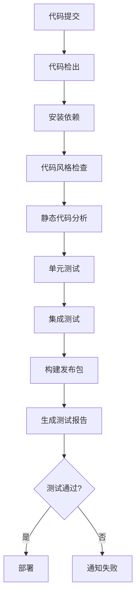
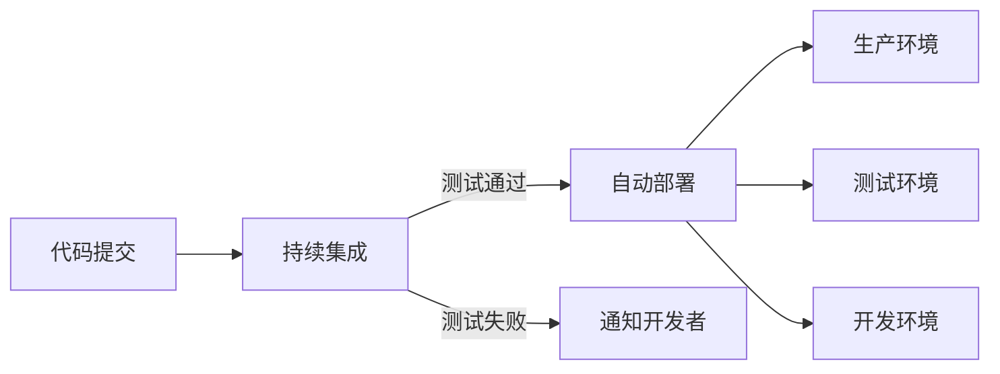

# Python 持续集成

## 什么是持续集成

持续集成（Continuous Integration，简称CI）是一种软件开发实践，团队成员频繁地（通常每天多次）将他们的代码变更合并到共享代码库中，然后自动执行构建、测试和验证过程。这种实践有助于尽早发现问题，确保软件质量，并加快开发周期。

:::tip 核心理念
持续集成的核心理念是："频繁提交，早期验证，快速反馈"。
:::

## 持续集成的主要优势

- **早期发现问题**：问题在开发过程早期被发现，修复成本更低
- **提高代码质量**：自动化测试确保代码符合质量标准
- **减少手动工作**：自动化流程减轻了开发者的负担
- **加速交付过程**：频繁集成和验证使得功能更快地到达用户手中
- **增强团队协作**：提高代码集成的透明度和可见性

## Python 持续集成工具介绍

Python生态系统中有多种持续集成工具和平台可供选择：

1. **GitHub Actions**：直接集成在GitHub中的CI/CD平台
2. **GitLab CI/CD**：GitLab提供的集成式CI/CD解决方案
3. **Travis CI**：简单易用的持续集成服务
4. **Jenkins**：灵活且功能强大的开源自动化服务器
5. **CircleCI**：云原生CI/CD平台

## 持续集成流程基本步骤



## 实现Python项目的持续集成

让我们一步步实现一个基本的Python项目CI流程。我们将使用GitHub Actions作为示例，因为它使用简单且免费。

### 步骤1：创建测试

首先，确保你的项目有适当的测试。例如，使用`pytest`创建测试：

```python
# 假设我们有一个简单的计算器模块 calculator.py
def add(a, b):
    return a + b

def subtract(a, b):
    return a - b

def multiply(a, b):
    return a * b

def divide(a, b):
    if b == 0:
        raise ValueError("Cannot divide by zero!")
    return a / b
```

为这个模块创建测试：

```python
# test_calculator.py
import pytest
from calculator import add, subtract, multiply, divide

def test_add():
    assert add(2, 3) == 5
    assert add(-1, 1) == 0
    assert add(0, 0) == 0

def test_subtract():
    assert subtract(5, 3) == 2
    assert subtract(2, 3) == -1
    assert subtract(0, 0) == 0

def test_multiply():
    assert multiply(2, 3) == 6
    assert multiply(-1, 3) == -3
    assert multiply(0, 5) == 0

def test_divide():
    assert divide(6, 3) == 2
    assert divide(5, 2) == 2.5
    with pytest.raises(ValueError):
        divide(5, 0)
```

### 步骤2：配置代码风格检查

使用`flake8`或`pylint`等工具检查代码风格：

安装：
```bash
pip install flake8
```

创建配置文件 `.flake8`：
```ini
[flake8]
max-line-length = 88
exclude = .git,__pycache__,build,dist
```

### 步骤3：创建依赖管理文件

创建 `requirements.txt` 以管理项目依赖：

```text
pytest==7.3.1
flake8==6.0.0
```

可能还需要 `requirements-dev.txt` 用于开发环境：

```text
pytest==7.3.1
flake8==6.0.0
pytest-cov==4.1.0
black==23.3.0
```

### 步骤4：创建GitHub Actions工作流文件

在项目根目录创建 `.github/workflows/python-ci.yml`：

```yaml
name: Python CI

on:
  push:
    branches: [ main ]
  pull_request:
    branches: [ main ]

jobs:
  test:
    runs-on: ubuntu-latest
    strategy:
      matrix:
        python-version: [3.8, 3.9, '3.10']

    steps:
    - uses: actions/checkout@v3
    
    - name: Set up Python ${{ matrix.python-version }}
      uses: actions/setup-python@v4
      with:
        python-version: ${{ matrix.python-version }}
    
    - name: Install dependencies
      run: |
        python -m pip install --upgrade pip
        if [ -f requirements.txt ]; then pip install -r requirements.txt; fi
        pip install flake8 pytest pytest-cov
    
    - name: Lint with flake8
      run: |
        flake8 . --count --select=E9,F63,F7,F82 --show-source --statistics
    
    - name: Test with pytest and generate coverage report
      run: |
        pytest --cov=./ --cov-report=xml
    
    - name: Upload coverage to Codecov
      uses: codecov/codecov-action@v3
      with:
        file: ./coverage.xml
        fail_ci_if_error: true
```

## 实际案例：为Web应用配置持续集成

假设我们有一个基于Flask的Web应用，让我们看看如何为其设置持续集成：

### 项目结构

```
my_flask_app/
├── app/
│   ├── __init__.py
│   ├── routes.py
│   ├── models.py
│   └── utils.py
├── tests/
│   ├── __init__.py
│   ├── test_routes.py
│   └── test_utils.py
├── .github/
│   └── workflows/
│       └── flask-ci.yml
├── requirements.txt
└── run.py
```

### Flask应用示例代码

```python
# app/__init__.py
from flask import Flask

app = Flask(__name__)

from app import routes
```

```python
# app/routes.py
from app import app

@app.route('/')
def home():
    return {"message": "Welcome to our API!"}

@app.route('/add/<int:a>/<int:b>')
def add(a, b):
    return {"result": a + b}
```

### 测试代码

```python
# tests/test_routes.py
import json
import pytest
from app import app

@pytest.fixture
def client():
    app.config['TESTING'] = True
    with app.test_client() as client:
        yield client

def test_home(client):
    response = client.get('/')
    assert response.status_code == 200
    data = json.loads(response.data)
    assert data["message"] == "Welcome to our API!"

def test_add(client):
    response = client.get('/add/2/3')
    assert response.status_code == 200
    data = json.loads(response.data)
    assert data["result"] == 5
```

### CI配置文件

```yaml
name: Flask CI/CD

on:
  push:
    branches: [ main ]
  pull_request:
    branches: [ main ]

jobs:
  test:
    runs-on: ubuntu-latest
    
    steps:
    - uses: actions/checkout@v3
    
    - name: Set up Python
      uses: actions/setup-python@v4
      with:
        python-version: '3.10'
    
    - name: Install dependencies
      run: |
        python -m pip install --upgrade pip
        pip install -r requirements.txt
        pip install pytest pytest-cov
    
    - name: Run tests and collect coverage
      run: |
        pytest --cov=app tests/
    
    - name: Upload coverage report
      uses: codecov/codecov-action@v3
```

## 与持续部署(CD)的结合

持续集成经常与持续部署(Continuous Deployment)结合使用，形成完整的CI/CD流程：



要实现持续部署，可以在CI流程成功后添加部署步骤，例如：

```yaml
# GitHub Actions部署示例
- name: Deploy to Heroku
  if: success() && github.ref == 'refs/heads/main'
  uses: akhileshns/heroku-deploy@v3.12.12
  with:
    heroku_api_key: ${{ secrets.HEROKU_API_KEY }}
    heroku_app_name: "my-python-app"
    heroku_email: ${{ secrets.HEROKU_EMAIL }}
```

## 最佳实践

1. **保持测试快速**：CI流程应该尽可能快速完成，以提供及时反馈
2. **测试覆盖关键代码**：确保重要功能和易出错的部分有充分测试
3. **包含各种测试类型**：单元测试、集成测试、性能测试等
4. **模拟生产环境**：CI环境应尽可能接近生产环境
5. **保持CI配置简单**：配置文件应易于理解和维护
6. **设置通知**：当构建失败时及时通知相关人员
7. **分析和改进**：定期检查CI流程，寻找改进点

## 常见问题与解决方案

### 构建时间过长

- 优化测试套件，使用并行测试
- 使用测试缓存机制
- 将非必要测试移至单独的工作流

```yaml
# 使用矩阵构建并行执行测试
strategy:
  matrix:
    test-group: [unit, integration, e2e]
```

### 测试不稳定

- 识别并修复不稳定测试
- 对于暂时无法修复的测试，考虑隔离或者标记为允许失败

### 资源限制

- 优化资源使用
- 考虑升级CI平台计划
- 使用更有效的缓存策略

## 总结

持续集成是现代软件开发中不可或缺的部分，它通过自动化构建和测试流程，帮助团队提早发现问题、保证代码质量、加快开发节奏。对于Python项目来说，有多种工具和平台可供选择，如GitHub Actions、GitLab CI/CD等。

实施持续集成需要良好的测试覆盖、合适的工具配置和团队的协作。通过遵循最佳实践，可以构建高效可靠的CI流程，进一步结合持续部署，实现完整的自动化交付管道。

无论是个人项目还是团队协作，持续集成都能带来显著的效益，减少人为错误，提升开发体验，值得每个Python开发者学习和应用。

## 练习与资源

### 练习

1. 为你的一个小型Python项目配置GitHub Actions CI流程，包括代码风格检查和单元测试。
2. 扩展CI配置，添加代码覆盖率报告和自动发布到PyPI的功能。
3. 研究如何为不同Python版本和操作系统设置测试矩阵。

### 延伸阅读

- [GitHub Actions官方文档](https://docs.github.com/en/actions)
- [Python测试最佳实践](https://docs.pytest.org/en/latest/goodpractices.html)
- [持续集成与Python](https://realpython.com/python-continuous-integration/)
- [使用pytest进行Python测试](https://docs.pytest.org/)