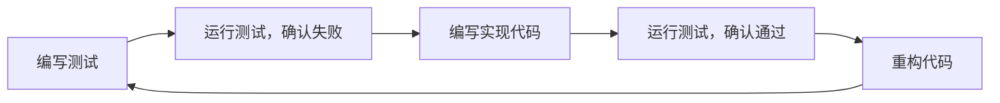

# Python 测试最佳实践

## 介绍

测试是软件开发过程中不可或缺的环节，它帮助我们验证代码的正确性、提高代码质量，同时降低bug出现的风险。对于初学者来说，养成良好的测试习惯将使你的Python编程之旅事半功倍。本文将介绍Python测试的最佳实践，帮助你建立起科学、有效的测试体系。

## 为什么测试很重要？

在深入了解测试最佳实践之前，让我们先明白为什么测试如此重要：

1. **减少bug** - 测试可以帮助我们在部署前发现并修复问题
2. **提高代码质量** - 编写测试通常会促使我们编写更模块化、更清晰的代码
3. **简化重构** - 有了测试，我们可以更自信地重构代码，确保修改后的代码仍然正确
4. **文档作用** - 好的测试也是对API使用方式的最佳文档

## Python 测试的类型

### 单元测试

单元测试关注于测试代码的最小单元（通常是函数或方法），确保它们在隔离环境中正确工作。

```python
# 待测试的函数
def add(a, b):
    return a + b

# 单元测试
def test_add():
    assert add(1, 2) == 3
    assert add(-1, 1) == 0
    assert add(-1, -1) == -2
```

### 集成测试

集成测试用于测试多个组件一起工作时的行为。例如，测试与数据库或外部API的交互。

```python
# 集成测试示例
def test_database_connection():
    db = Database()
    assert db.connect() == True
    result = db.query("SELECT * FROM users")
    assert len(result) > 0
    db.close()
```

### 功能测试

功能测试从用户的角度测试整个应用，确保系统按照预期工作。

```python
# 功能测试示例 (使用Selenium)
def test_login_page():
    driver = webdriver.Chrome()
    driver.get("https://example.com/login")
    
    username_input = driver.find_element_by_id("username")
    password_input = driver.find_element_by_id("password")
    submit_button = driver.find_element_by_id("submit")
    
    username_input.send_keys("test_user")
    password_input.send_keys("password123")
    submit_button.click()
    
    assert "Welcome" in driver.page_source
    driver.close()
```

## Python 测试框架

### pytest

pytest是Python中最流行的测试框架之一，它简单易用，功能强大。

```python
# 安装pytest
# pip install pytest

# 使用pytest编写测试
def test_simple_addition():
    assert 1 + 1 == 2

def test_string_methods():
    assert "hello".capitalize() == "Hello"
    assert "hello".upper() == "HELLO"
```

运行测试：

```
$ pytest test_file.py
```

### unittest

unittest是Python标准库中的测试框架，不需要额外安装。

```python
import unittest

class TestStringMethods(unittest.TestCase):

    def test_upper(self):
        self.assertEqual('hello'.upper(), 'HELLO')

    def test_isupper(self):
        self.assertTrue('HELLO'.isupper())
        self.assertFalse('Hello'.isupper())

if __name__ == '__main__':
    unittest.main()
```

运行测试：

```
$ python test_file.py
```

## 测试驱动开发(TDD)

测试驱动开发是一种开发方法，它遵循以下循环：

1. 编写一个失败的测试
2. 编写最小代码使测试通过
3. 重构代码以改进质量

让我们通过一个简单的例子来演示TDD：



**实际步骤：**

1. 首先，编写一个测试来验证我们要实现的功能：

```python
# test_calculator.py
def test_add():
    from calculator import add
    assert add(2, 3) == 5
```

2. 运行测试，确认它失败了（因为我们还没有实现add函数）：

```
$ pytest test_calculator.py
ImportError: No module named calculator
```

3. 实现最小代码使测试通过：

```python
# calculator.py
def add(a, b):
    return a + b
```

4. 再次运行测试，确认它通过了：

```
$ pytest test_calculator.py
1 passed in 0.01s
```

5. 根据需要重构代码，并确保测试仍然通过。

## 测试最佳实践

### 1. 测试代码组织

将测试代码与源代码分开，但保持相似的目录结构：

```
project/
  ├── src/
  │   └── calculator.py
  └── tests/
      └── test_calculator.py
```

### 2. 命名约定

- 测试文件名以`test_`开头
- 测试函数/方法以`test_`开头
- 测试类以`Test`开头

### 3. 每个测试关注一个功能点

```python
# 好的做法
def test_addition():
    assert add(1, 1) == 2

def test_subtraction():
    assert subtract(5, 2) == 3

# 不好的做法
def test_calculator():
    assert add(1, 1) == 2
    assert subtract(5, 2) == 3
```

### 4. 使用断言辅助方法

使用丰富的断言方法，而不仅仅是`assert`语句：

```python
# unittest方式
self.assertEqual(a, b)
self.assertTrue(x)
self.assertIn(a, b)

# pytest方式
assert a == b
assert x is True
assert a in b
```

### 5. 测试边界条件

不要只测试"快乐路径"，也要测试边界条件和错误情况：

```python
def test_divide():
    assert divide(10, 2) == 5  # 普通情况
    assert divide(0, 5) == 0   # 边界情况
    
    # 测试异常
    import pytest
    with pytest.raises(ZeroDivisionError):
        divide(5, 0)
```

### 6. 使用测试夹具(Fixtures)

在pytest中，夹具可以帮助我们设置测试环境、重用测试代码：

```python
import pytest

@pytest.fixture
def sample_data():
    return {
        'name': 'John',
        'age': 30,
        'city': 'New York'
    }

def test_name(sample_data):
    assert sample_data['name'] == 'John'

def test_age(sample_data):
    assert sample_data['age'] == 30
```

### 7. 使用模拟(Mocks)

当测试涉及外部依赖（如数据库或API调用）时，使用模拟对象：

```python
from unittest.mock import Mock, patch

def test_api_call():
    # 创建一个模拟对象来替换真实API调用
    with patch('module.requests.get') as mock_get:
        mock_get.return_value.status_code = 200
        mock_get.return_value.json.return_value = {'key': 'value'}
        
        result = call_api()
        assert result == {'key': 'value'}
```

### 8. 测试覆盖率

使用工具如`coverage.py`来衡量测试覆盖率：

```
# 安装coverage
# pip install coverage

# 运行测试并收集覆盖率数据
$ coverage run -m pytest

# 生成报告
$ coverage report
```

## 实际案例：电子商务购物车

让我们通过一个实际的案例来展示如何应用测试最佳实践。假设我们正在开发一个电子商务网站的购物车功能：

```python
# cart.py
class ShoppingCart:
    def __init__(self):
        self.items = {}
        
    def add_item(self, product_id, quantity=1):
        if product_id in self.items:
            self.items[product_id] += quantity
        else:
            self.items[product_id] = quantity
    
    def remove_item(self, product_id, quantity=1):
        if product_id not in self.items:
            raise ValueError(f"Product {product_id} not in cart")
        
        if quantity >= self.items[product_id]:
            del self.items[product_id]
        else:
            self.items[product_id] -= quantity
    
    def get_total_items(self):
        return sum(self.items.values())
    
    def clear(self):
        self.items = {}
```

现在，让我们为这个购物车编写测试：

```python
# test_cart.py
import pytest
from cart import ShoppingCart

@pytest.fixture
def cart():
    return ShoppingCart()

def test_empty_cart(cart):
    assert cart.get_total_items() == 0

def test_add_item(cart):
    cart.add_item("apple")
    assert cart.get_total_items() == 1
    assert cart.items["apple"] == 1

def test_add_item_multiple(cart):
    cart.add_item("apple", 3)
    assert cart.get_total_items() == 3
    assert cart.items["apple"] == 3

def test_add_multiple_items(cart):
    cart.add_item("apple")
    cart.add_item("banana", 2)
    assert cart.get_total_items() == 3
    assert cart.items["apple"] == 1
    assert cart.items["banana"] == 2

def test_remove_item(cart):
    cart.add_item("apple", 3)
    cart.remove_item("apple", 1)
    assert cart.items["apple"] == 2

def test_remove_item_completely(cart):
    cart.add_item("apple")
    cart.remove_item("apple")
    assert "apple" not in cart.items

def test_remove_non_existing_item(cart):
    with pytest.raises(ValueError):
        cart.remove_item("apple")

def test_clear_cart(cart):
    cart.add_item("apple")
    cart.add_item("banana")
    cart.clear()
    assert cart.get_total_items() == 0
    assert cart.items == {}
```

运行这些测试：

```
$ pytest test_cart.py -v
```

:::tip
在实际开发中，我们可能还需要测试购物车与产品数据库的集成、价格计算、促销应用等更复杂的功能。
:::

## 总结

测试是软件开发中不可或缺的一部分，掌握Python测试的最佳实践将帮助你编写更可靠、更易维护的代码。记住这些关键点：

- 选择适合项目的测试框架（pytest、unittest）
- 组织良好的测试结构
- 编写专注于单一功能点的测试
- 测试边界条件和错误情况
- 使用夹具和模拟简化测试
- 保持较高的测试覆盖率

随着你的Python技能提升，测试能力也会变得越来越重要。良好的测试习惯将使你在更复杂的项目中游刃有余。

## 练习与资源

### 练习

1. 为一个简单的计算器类编写单元测试，确保测试覆盖了正常操作和错误情况。
2. 尝试使用TDD方法开发一个字符串处理函数，如反转字符串或检查回文。
3. 使用模拟对象测试一个依赖外部API的函数。

### 进一步学习的资源

- [pytest官方文档](https://docs.pytest.org/)
- [Python unittest官方文档](https://docs.python.org/3/library/unittest.html)
- [Python测试之道（书籍）](https://www.amazon.com/Python-Testing-pytest-Brian-Okken/dp/1680502409)
- [测试驱动开发（TDD）与Python](https://www.obeythetestinggoat.com/)

:::note
记住，测试不是为了发现bug而是为了防止bug。养成编写测试的习惯，将使你的Python旅程更加顺畅。
:::