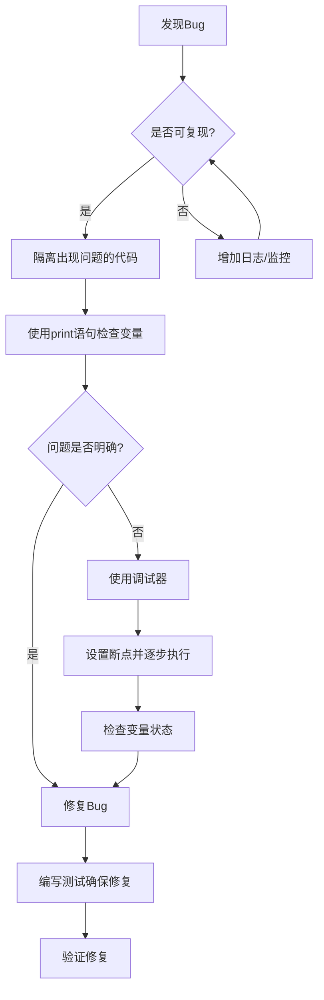

# Python 调试技巧

## 调试的重要性

调试是每个程序员必备的技能，无论你是初学者还是有经验的开发者。当你的代码不按预期工作时，了解如何有效地找出并修复问题可以节省大量的时间和精力。本文将介绍Python中常用的调试技巧和工具，帮助你更高效地解决代码问题。

## 基础调试技巧

### 使用print语句

最简单的调试方法就是使用`print()`语句来查看变量的值和程序的执行流程。

```python
def calculate_average(numbers):
    print(f"Input list: {numbers}")  # 打印输入
    
    total = sum(numbers)
    print(f"Sum: {total}")  # 打印总和
    
    average = total / len(numbers)
    print(f"Average: {average}")  # 打印平均值
    
    return average

result = calculate_average([1, 2, 3, 4, 5])
print(f"Final result: {result}")
```

输出:
```
Input list: [1, 2, 3, 4, 5]
Sum: 15
Average: 3.0
Final result: 3.0
```

:::tip 提示
虽然`print()`语句简单易用，但在大型程序中可能会导致输出过多而难以分析。此外，调试完成后需要手动删除这些语句。
:::

### assert语句

`assert`语句可以帮助你验证代码中的假设，当条件为假时会引发`AssertionError`。

```python
def divide(a, b):
    assert b != 0, "除数不能为零!"
    return a / b

# 正常情况
print(divide(10, 2))

# 异常情况
try:
    print(divide(10, 0))
except AssertionError as e:
    print(f"捕获到断言错误: {e}")
```

输出:
```
5.0
捕获到断言错误: 除数不能为零!
```

## Python 内置调试工具

### 使用pdb - Python调试器

Python的内置调试器`pdb`是一个强大的工具，可以让你逐行执行代码，检查变量，并设置断点。

```python
import pdb

def complex_function(x, y):
    result = x * 2
    pdb.set_trace()  # 代码会在此处暂停
    result = result + y
    return result

complex_function(5, 3)
```

当代码运行到`pdb.set_trace()`时，程序会暂停并进入交互式调试模式，你可以使用以下命令：

- `n` (next): 执行当前行并移动到下一行
- `s` (step): 步入函数调用
- `c` (continue): 继续执行直到遇到下一个断点
- `p expression` (print): 打印表达式的值
- `q` (quit): 退出调试器

:::note 注意
在Python 3.7及以上版本，你可以使用`breakpoint()`函数代替`pdb.set_trace()`。
:::

### 使用logging模块

比起`print`语句，`logging`模块提供了更灵活的日志记录功能，特别适合长期运行的程序。

```python
import logging

# 配置日志级别
logging.basicConfig(level=logging.DEBUG, format='%(asctime)s - %(levelname)s - %(message)s')

def process_data(data):
    logging.debug(f"处理数据: {data}")
    
    if not data:
        logging.warning("收到空数据")
        return None
        
    try:
        result = sum(data) / len(data)
        logging.info(f"计算完成，结果: {result}")
        return result
    except Exception as e:
        logging.error(f"计算出错: {e}", exc_info=True)
        return None

# 测试
process_data([1, 2, 3])
process_data([])
process_data("not a list")
```

输出例子:
```
2023-06-01 14:25:30,123 - DEBUG - 处理数据: [1, 2, 3]
2023-06-01 14:25:30,124 - INFO - 计算完成，结果: 2.0
2023-06-01 14:25:30,125 - DEBUG - 处理数据: []
2023-06-01 14:25:30,126 - WARNING - 收到空数据
2023-06-01 14:25:30,127 - DEBUG - 处理数据: not a list
2023-06-01 14:25:30,128 - ERROR - 计算出错: 'str' object has no attribute 'sum'
Traceback (most recent call last):
  ...
```

## 异常处理与调试

正确的异常处理可以帮助你更好地理解和定位问题。

```python
def safe_division(numerator, denominator):
    try:
        result = numerator / denominator
        return result
    except ZeroDivisionError:
        print("错误：除数不能为零!")
        return None
    except TypeError as e:
        print(f"错误：类型错误 - {e}")
        return None
    finally:
        print("除法运算尝试完成")

# 测试不同情况
print(safe_division(10, 2))
print(safe_division(10, 0))
print(safe_division(10, "2"))
```

输出:
```
除法运算尝试完成
5.0
错误：除数不能为零!
除法运算尝试完成
None
错误：类型错误 - unsupported operand type(s) for /: 'int' and 'str'
除法运算尝试完成
None
```

## 高级调试工具和技巧

### 使用IDE内置调试器

现代Python IDE如PyCharm、VS Code等都提供了强大的可视化调试工具，让调试过程更直观。

使用IDE调试器的典型步骤：
1. 在代码中设置断点
2. 以调试模式运行程序
3. 当程序执行到断点时，检查变量状态
4. 使用步进、步入、步出等功能控制程序执行
5. 使用观察窗口监控特定变量

### 使用装饰器进行函数调试

自定义装饰器可以帮助你监控函数的执行情况。

```python
import functools
import time

def debug_decorator(func):
    @functools.wraps(func)
    def wrapper(*args, **kwargs):
        args_repr = [repr(a) for a in args]
        kwargs_repr = [f"{k}={v!r}" for k, v in kwargs.items()]
        signature = ", ".join(args_repr + kwargs_repr)
        
        print(f"调用: {func.__name__}({signature})")
        start_time = time.time()
        
        try:
            result = func(*args, **kwargs)
            print(f"{func.__name__} 返回: {result!r}")
            return result
        except Exception as e:
            print(f"{func.__name__} 引发异常: {e}")
            raise
        finally:
            end_time = time.time()
            print(f"{func.__name__} 执行时间: {end_time - start_time:.4f}秒")
    
    return wrapper

@debug_decorator
def calculate_factorial(n):
    if n < 0:
        raise ValueError("输入必须是非负整数")
    elif n == 0:
        return 1
    else:
        return n * calculate_factorial(n-1)

# 测试装饰器
calculate_factorial(5)
```

输出例子:
```
调用: calculate_factorial(5)
调用: calculate_factorial(4)
调用: calculate_factorial(3)
调用: calculate_factorial(2)
调用: calculate_factorial(1)
调用: calculate_factorial(0)
calculate_factorial 返回: 1
calculate_factorial 执行时间: 0.0001秒
calculate_factorial 返回: 1
calculate_factorial 执行时间: 0.0003秒
calculate_factorial 返回: 2
calculate_factorial 执行时间: 0.0005秒
calculate_factorial 返回: 6
calculate_factorial 执行时间: 0.0007秒
calculate_factorial 返回: 24
calculate_factorial 执行时间: 0.0009秒
calculate_factorial 返回: 120
calculate_factorial 执行时间: 0.0011秒
```

## 实际案例：调试一个数据处理脚本

让我们通过一个实际案例来应用这些调试技巧。以下是一个有bug的数据处理脚本：

```python
def process_student_scores(data):
    total_scores = {}
    count_scores = {}
    
    for student, score in data:
        if student in total_scores:
            total_scores[student] += score
            count_scores[student] += 1
        else:
            total_scores[student] = score
            count_scores[student] = 1
    
    # 计算平均分
    average_scores = {}
    for student in total_scores:
        average_scores[student] = total_scores[student] / count_scores[student]
    
    return average_scores

# 测试数据 - 每项是(学生名, 分数)
test_data = [
    ("Alice", 85),
    ("Bob", 92),
    ("Alice", 88),
    ("Charlie", 70),
    ("Bob", 95),
    ("Charlie", "75")  # 出错的数据，分数是字符串
]

result = process_student_scores(test_data)
print(result)
```

运行这段代码会得到类型错误：

```
TypeError: unsupported operand type(s) for +=: 'int' and 'str'
```

### 调试过程

1. **识别问题**：从错误信息看，是尝试将整数和字符串相加。

2. **使用print定位**：

```python
def process_student_scores(data):
    total_scores = {}
    count_scores = {}
    
    for student, score in data:
        print(f"处理: {student}, {score}, 类型: {type(score)}")
        if student in total_scores:
            total_scores[student] += score
            count_scores[student] += 1
        else:
            total_scores[student] = score
            count_scores[student] = 1
    
    # ...其余代码相同
```

3. **使用断言确保数据类型**：

```python
def process_student_scores(data):
    total_scores = {}
    count_scores = {}
    
    for student, score in data:
        assert isinstance(score, (int, float)), f"分数必须是数字，但得到: {score}, 类型: {type(score)}"
        if student in total_scores:
            total_scores[student] += score
            count_scores[student] += 1
        else:
            total_scores[student] = score
            count_scores[student] = 1
    
    # ...其余代码相同
```

4. **正确的解决方案**：

```python
def process_student_scores(data):
    total_scores = {}
    count_scores = {}
    
    for student, score in data:
        try:
            # 确保分数是数字
            score_value = float(score)
            
            if student in total_scores:
                total_scores[student] += score_value
                count_scores[student] += 1
            else:
                total_scores[student] = score_value
                count_scores[student] = 1
        except (ValueError, TypeError) as e:
            print(f"警告: 跳过无效的分数值: '{score}' for {student}, 错误: {e}")
    
    # 计算平均分
    average_scores = {}
    for student in total_scores:
        average_scores[student] = round(total_scores[student] / count_scores[student], 2)
    
    return average_scores

# 测试数据
test_data = [
    ("Alice", 85),
    ("Bob", 92),
    ("Alice", 88),
    ("Charlie", 70),
    ("Bob", 95),
    ("Charlie", "75")  # 现在可以处理了，会自动转换为75.0
]

result = process_student_scores(test_data)
print(result)
```

输出:
```
{'Alice': 86.5, 'Bob': 93.5, 'Charlie': 72.5}
```

## 调试流程图



## 总结

调试是编程过程中不可避免的一部分，掌握有效的调试技巧可以让你的开发效率大大提升：

1. **简单技巧**：使用`print`和`assert`快速定位问题
2. **内置工具**：学会使用`pdb`调试器和`logging`模块
3. **异常处理**：适当的异常处理可以防止程序崩溃并提供有用的信息
4. **高级工具**：利用IDE调试器、装饰器等高级技巧进行更复杂的调试
5. **系统化方法**：按照"复现问题->隔离代码->分析原因->修复测试"的流程来调试

记住，调试不仅仅是修复bug的过程，更是深入理解代码的好机会。通过调试，你会对Python的工作原理有更深入的认识。

## 练习题

1. 编写一个带有故意错误的函数，然后使用本文介绍的技巧来调试并修复它。
2. 创建一个自定义的调试装饰器，用于记录函数的输入参数和返回值。
3. 实现一个简单的计算器函数，使用异常处理来捕获各种可能的错误。

## 附加资源

- Python官方文档中的[调试和分析](https://docs.python.org/3/library/debug.html)部分
- Python标准库中的[pdb模块文档](https://docs.python.org/3/library/pdb.html)
- Python标准库中的[logging模块文档](https://docs.python.org/3/library/logging.html)
- 《Python调试之道》一书，深入探讨Python调试技术