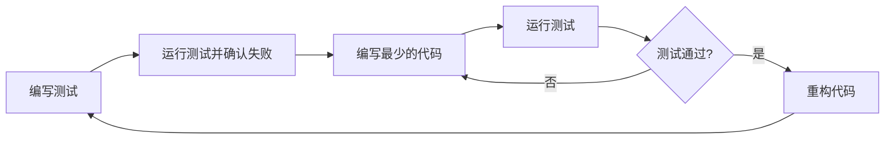

# Python 测试驱动开发

## 什么是测试驱动开发

测试驱动开发（Test-Driven Development，简称TDD）是一种软件开发方法，它倡导在编写功能代码之前先编写测试代码。这种开发模式颠覆了传统的"先开发后测试"的流程，通过"先测试后开发"的方式来保证代码质量，提高代码可靠性。

在TDD中，开发流程通常遵循以下步骤：



这个过程通常被称为"红-绿-重构"循环：
- **红**：编写一个会失败的测试
- **绿**：编写最少量的代码使测试通过
- **重构**：在测试通过的基础上优化和改进代码

## TDD的优势

:::tip 为什么选择TDD？
测试驱动开发不仅仅是一种测试方法，它是一种开发思维和设计方法，能够帮助你构建更可靠、更易维护的代码。
:::

采用TDD方法进行Python开发有以下几个主要优势：

1. **提高代码质量**：通过先编写测试，你会思考代码的使用方式而非实现细节，这往往导致更好的API设计。

2. **减少错误和调试时间**：当你修改代码时，测试能立即告诉你是否打破了现有功能。

3. **形成文档**：测试可以作为代码如何使用的活文档，帮助其他开发者理解代码的功能和使用方式。

4. **增强重构信心**：有了全面的测试覆盖，你可以放心地重构代码而不担心破坏现有功能。

5. **促进模块化设计**：编写可测试的代码通常会促使你将代码分解成小的、功能单一的模块。

## Python 中的TDD工具

Python生态系统中有几个流行的测试框架可以支持TDD方法：

- **unittest**：Python标准库中的测试框架，受到JUnit的启发
- **pytest**：更现代化、更灵活的测试框架，提供更简洁的语法和强大的功能
- **doctest**：可以在函数文档字符串中编写测试

在本教程中，我们将主要使用**pytest**，因为它简单易用且功能强大，特别适合初学者入门TDD。

## 环境准备

在开始使用TDD前，需要安装pytest：

```bash
pip install pytest
```

## TDD实践：一个简单的例子

让我们通过一个简单的例子来学习TDD的基本流程。假设我们需要开发一个函数，用于计算两个数字之和。

### 步骤1：编写测试

首先，我们创建一个名为`test_calculator.py`的文件，编写一个测试函数：

```python
# test_calculator.py
def test_add():
    from calculator import add
    assert add(1, 2) == 3
    assert add(-1, 1) == 0
    assert add(-1, -1) == -2
```

这个测试检查了`add`函数在不同输入下的行为。

### 步骤2：运行测试并确认失败

现在运行这个测试，由于我们还没有实现`add`函数，所以测试应该会失败：

```bash
pytest test_calculator.py
```

输出会类似这样：

```
E       ImportError: No module named 'calculator'
```

这是我们预期的"红"阶段 - 测试失败。

### 步骤3：编写最少的代码使测试通过

现在，让我们创建一个`calculator.py`文件并实现`add`函数：

```python
# calculator.py
def add(a, b):
    return a + b
```

### 步骤4：运行测试并检查是否通过

再次运行测试：

```bash
pytest test_calculator.py
```

这次测试应该通过了：

```
collected 1 item

test_calculator.py .                             [100%]

=========================== 1 passed in 0.01s ===========================
```

恭喜！我们达到了"绿"阶段。

### 步骤5：重构代码

在这个简单的例子中，代码已经很简洁了，不需要重构。在更复杂的项目中，这一步会涉及到改进代码结构、提高性能或者增强可读性，同时保持测试通过。

## 实际案例：开发一个简单的购物车系统

让我们通过一个更复杂的例子来深入理解TDD。我们将开发一个简单的购物车系统，具有添加商品、移除商品和计算总价的功能。

### 第一个测试：初始购物车应该为空

```python
# test_shopping_cart.py
def test_empty_cart():
    from shopping_cart import ShoppingCart
    
    cart = ShoppingCart()
    assert len(cart.items) == 0
    assert cart.total_price() == 0
```

运行这个测试会失败，因为我们还没有实现`ShoppingCart`类。

### 实现最少代码使测试通过

```python
# shopping_cart.py
class ShoppingCart:
    def __init__(self):
        self.items = []
    
    def total_price(self):
        return 0
```

这段代码只实现了最基本的功能，使测试通过。

### 添加新的测试：添加商品

```python
# test_shopping_cart.py
def test_add_item():
    from shopping_cart import ShoppingCart
    
    cart = ShoppingCart()
    cart.add_item("apple", 1.0)
    assert len(cart.items) == 1
    assert cart.total_price() == 1.0
```

运行测试会失败，因为我们还没有实现`add_item`方法。

### 更新代码使新测试通过

```python
# shopping_cart.py
class ShoppingCart:
    def __init__(self):
        self.items = []
    
    def add_item(self, name, price):
        self.items.append({"name": name, "price": price})
    
    def total_price(self):
        return sum(item["price"] for item in self.items)
```

### 继续添加测试和实现

继续这个过程，我们可以添加更多测试和功能，例如：

```python
# test_shopping_cart.py
def test_remove_item():
    from shopping_cart import ShoppingCart
    
    cart = ShoppingCart()
    cart.add_item("apple", 1.0)
    cart.add_item("banana", 1.5)
    cart.remove_item("apple")
    
    assert len(cart.items) == 1
    assert cart.total_price() == 1.5
    assert cart.items[0]["name"] == "banana"
```

然后实现`remove_item`方法：

```python
# shopping_cart.py
class ShoppingCart:
    # ... 现有代码 ...
    
    def remove_item(self, name):
        for i, item in enumerate(self.items):
            if item["name"] == name:
                del self.items[i]
                break
```

通过不断地添加测试，然后实现功能，我们逐步构建了整个购物车系统。

:::caution 注意事项
在实际项目中，你可能需要处理更多边缘情况，例如：
- 尝试移除不存在的商品
- 添加重复商品
- 处理无效输入（如负价格）
:::

## 高级TDD技巧

### 使用夹具(fixtures)

夹具是在测试前准备环境和在测试后清理环境的方法，使用夹具可以减少测试代码中的重复：

```python
# test_shopping_cart.py
import pytest

@pytest.fixture
def cart():
    from shopping_cart import ShoppingCart
    return ShoppingCart()

def test_empty_cart(cart):
    assert len(cart.items) == 0
    assert cart.total_price() == 0

def test_add_item(cart):
    cart.add_item("apple", 1.0)
    assert len(cart.items) == 1
    assert cart.total_price() == 1.0
```

### 参数化测试

参数化测试允许你用不同的输入运行相同的测试：

```python
# test_calculator.py
import pytest

@pytest.mark.parametrize("a,b,expected", [
    (1, 2, 3),
    (-1, 1, 0),
    (-1, -1, -2),
    (0, 0, 0),
])
def test_add(a, b, expected):
    from calculator import add
    assert add(a, b) == expected
```

### 测试异常

有时我们需要测试代码是否正确抛出异常：

```python
# test_shopping_cart.py
import pytest

def test_remove_nonexistent_item(cart):
    with pytest.raises(ValueError):
        cart.remove_item("nonexistent")
```

然后更新`remove_item`方法：

```python
# shopping_cart.py
def remove_item(self, name):
    for i, item in enumerate(self.items):
        if item["name"] == name:
            del self.items[i]
            return
    raise ValueError(f"Item '{name}' not in cart")
```

## TDD最佳实践

1. **小步迭代**：编写一个小测试，再编写刚好能通过这个测试的最少代码，然后再添加下一个测试。

2. **先测试边界条件**：考虑函数的边界情况，如空输入、极端值等。

3. **保持测试独立**：每个测试应该独立于其他测试，不应依赖于测试运行的顺序。

4. **测试行为而非实现**：测试应该关注于函数的行为（输入/输出），而不是内部实现细节。

5. **追求高测试覆盖率**：尽量确保所有代码路径都有测试覆盖。

6. **定期重构**：一旦测试通过，花时间重构代码以提高质量，而不是急于添加新功能。

## 总结

测试驱动开发是一种强大的开发方法，它可以帮助你编写更高质量、更可靠的Python代码。通过"红-绿-重构"的循环，TDD引导你逐步构建功能，同时确保代码始终符合预期行为。

尽管刚开始可能感觉TDD会减慢开发速度，但随着项目规模的增长，它会帮助你避免许多常见的错误和缺陷，最终提高开发效率和代码质量。

## 练习

1. 使用TDD方法开发一个函数，用于检查字符串是否是回文（正读和反读都一样）。

2. 为之前开发的购物车系统添加以下功能：
   - 使用折扣码
   - 设置商品数量
   - 清空购物车

3. 使用TDD开发一个简单的待办事项列表应用，具有添加、完成和删除任务的功能。

## 进一步学习资源

- 《测试驱动开发：实例与原理》(Kent Beck著)
- Python官方文档：[unittest](https://docs.python.org/3/library/unittest.html)和[doctest](https://docs.python.org/3/library/doctest.html)
- [Pytest文档](https://docs.pytest.org/)
- [Python测试之道](https://pragprog.com/book/bopytest/python-testing-with-pytest)（Brian Okken著）

通过持续的实践和学习，你将能够更加熟练地应用TDD方法来开发Python应用，并享受它带来的诸多好处。