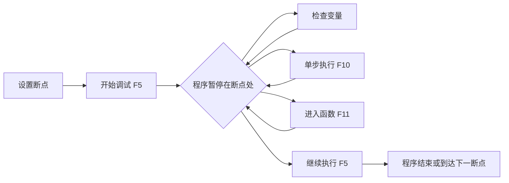

# Python 调试器

## 什么是调试器？

调试器是开发者用来检查程序执行过程的工具，它让你能够逐行运行代码，观察变量值的变化，并在特定位置暂停程序执行。当你的程序出现错误，而错误信息不足以让你理解问题所在时，调试器就变得尤为重要。

:::tip
熟练使用调试器是将你从"初级开发者"提升到"中级开发者"的关键技能之一！
:::

## Python 的常用调试工具

Python提供了多种调试工具，我们将介绍以下几种：

1. 内置的`pdb`模块
2. IDE集成的调试器（如PyCharm、VS Code）
3. `print()`语句调试法（简单但有效）
4. `logging`模块

## pdb - Python的内置调试器

`pdb`是Python标准库中的调试模块，它提供了一系列命令来控制程序的执行流程。

### 基本用法

要使用`pdb`调试程序，你需要先导入它：

```python
import pdb

def calculate_average(numbers):
    total = sum(numbers)
    pdb.set_trace()  # 程序会在这里暂停，进入调试模式
    average = total / len(numbers)
    return average

numbers = [10, 20, 30, 40]
avg = calculate_average(numbers)
print(f"平均值是: {avg}")
```

当程序执行到`pdb.set_trace()`时，它会暂停并进入调试模式，你可以在命令行中使用以下命令：

- `h` (help)：显示命令列表
- `n` (next)：执行当前行，并前进到下一行
- `s` (step)：单步执行，如果当前行调用了函数，则进入该函数
- `c` (continue)：继续执行直到下一个断点
- `p` (print)：打印变量的值，如`p total`
- `q` (quit)：退出调试器

### 命令示例

当程序进入调试模式时，你会看到类似这样的提示：

```
-> average = total / len(numbers)
(Pdb) 
```

此时你可以检查变量：

```
(Pdb) p total
100
(Pdb) p len(numbers)
4
```

然后执行下一步：

```
(Pdb) n
-> return average
(Pdb) p average
25.0
```

:::note
在Python 3.7及以上版本，你可以使用更简单的`breakpoint()`函数代替`import pdb; pdb.set_trace()`。
:::

## IDE中的调试器

现代IDE如PyCharm、VS Code都提供了图形化的调试界面，使调试过程更加直观。

### VS Code中的调试

1. 在VS Code中安装Python扩展
2. 在代码左侧槽中点击设置断点（红点）
3. 按F5开始调试
4. 使用调试工具栏控制程序执行



### PyCharm中的调试

PyCharm提供了类似但更强大的调试功能，支持条件断点、表达式求值等高级特性。

## 使用print()进行调试

虽然不够专业，但使用`print()`语句进行调试是最简单的方法，适合简单场景：

```python
def divide(a, b):
    print(f"正在计算 {a} / {b}")
    result = a / b
    print(f"计算结果: {result}")
    return result

try:
    print("开始计算")
    result = divide(10, 0)
    print(f"最终结果: {result}")
except Exception as e:
    print(f"出错了: {e}")
```

输出：
```
开始计算
正在计算 10 / 0
出错了: division by zero
```

:::caution
`print()`调试有限制：它会污染代码，难以管理，且在复杂情况下效率低下。
:::

## 使用logging模块

与`print()`相比，`logging`模块提供了更结构化的调试信息输出方式：

```python
import logging

# 配置日志格式
logging.basicConfig(
    level=logging.DEBUG,
    format='%(asctime)s - %(name)s - %(levelname)s - %(message)s'
)

def calculate_factorial(n):
    logging.debug(f"计算 {n} 的阶乘")
    if n < 0:
        logging.error("阶乘不能用于负数")
        return None
    elif n == 0:
        return 1
    else:
        result = n * calculate_factorial(n-1)
        logging.debug(f"{n}! = {result}")
        return result

result = calculate_factorial(5)
print(f"5! = {result}")
```

输出：
```
2023-05-15 14:30:22,345 - root - DEBUG - 计算 5 的阶乘
2023-05-15 14:30:22,346 - root - DEBUG - 计算 4 的阶乘
2023-05-15 14:30:22,346 - root - DEBUG - 计算 3 的阶乘
2023-05-15 14:30:22,347 - root - DEBUG - 计算 2 的阶乘
2023-05-15 14:30:22,347 - root - DEBUG - 计算 1 的阶乘
2023-05-15 14:30:22,347 - root - DEBUG - 计算 0 的阶乘
2023-05-15 14:30:22,348 - root - DEBUG - 0! = 1
2023-05-15 14:30:22,348 - root - DEBUG - 1! = 1
2023-05-15 14:30:22,349 - root - DEBUG - 2! = 2
2023-05-15 14:30:22,349 - root - DEBUG - 3! = 6
2023-05-15 14:30:22,350 - root - DEBUG - 4! = 24
2023-05-15 14:30:22,350 - root - DEBUG - 5! = 120
5! = 120
```

## 实际案例：调试递归函数

递归函数是初学者常常感到困惑的地方，我们来看一个使用调试器理解递归的例子：

```python
def fibonacci(n):
    """计算斐波那契数列的第n个数"""
    print(f"计算 fibonacci({n})")
    if n <= 1:
        print(f"fibonacci({n}) = {n}")
        return n
    else:
        result = fibonacci(n-1) + fibonacci(n-2)
        print(f"fibonacci({n}) = {result}")
        return result

# 尝试计算第5个斐波那契数
result = fibonacci(5)
print(f"最终结果: {result}")
```

如果直接运行这段代码，你会看到大量输出，很难跟踪执行流程。这时候使用调试器就很有帮助：

1. 在`fibonacci`函数开始处设置断点
2. 使用"单步执行"观察递归调用栈的变化
3. 观察每次`n`的值如何变化
4. 理解递归的"展开"和"收缩"过程

通过调试器，你可以清晰地看到递归如何工作，以及函数调用如何层层嵌套。

## 高级调试技巧

### 条件断点

在复杂程序中，你可能只关心特定条件下的执行。使用条件断点可以在特定条件满足时才暂停程序：

```python
# 在pdb中设置条件断点
import pdb

def process_items(items):
    for i, item in enumerate(items):
        if i == 5:  # 只在第5个元素时暂停
            pdb.set_trace()
        process_item(item)
```

在IDE中，通常可以右键点击断点设置条件。

### 后置调试

有时错误发生后，你才想到应该调试。Python提供了`pdb.post_mortem()`函数来在异常发生后启动调试器：

```python
def buggy_function():
    a = 10
    b = 0
    return a / b  # 会引发除零错误

import pdb
import traceback

try:
    buggy_function()
except:
    traceback.print_exc()  # 打印错误信息
    pdb.post_mortem()  # 进入调试模式
```

### 调试多线程程序

多线程程序的调试更加复杂，pdb不是线程安全的。建议使用专业IDE或者在线程中使用日志记录关键信息。

## 总结

调试是程序开发过程中不可或缺的一部分。通过本文，你已经学习了：

1. 使用Python内置的`pdb`模块进行调试
2. 在现代IDE中利用图形化调试工具
3. 使用`print()`和`logging`模块记录调试信息
4. 处理递归函数等复杂情况的调试方法
5. 条件断点和后置调试等高级技巧

掌握调试技能将大大提高你的开发效率，减少解决问题的时间。

## 练习

1. 在一个包含循环的函数中使用`pdb`设置断点，并练习使用各种pdb命令。
2. 使用IDE的调试器，为一个递归函数设置断点，并观察变量的变化。
3. 编写一个包含错误的程序，然后使用`pdb.post_mortem()`进行后置调试。
4. 比较使用`print()`和`logging`模块记录调试信息的差异。

## 更多资源

- [Python官方文档 - pdb](https://docs.python.org/3/library/pdb.html)
- [VS Code Python调试指南](https://code.visualstudio.com/docs/python/debugging)
- [PyCharm调试指南](https://www.jetbrains.com/help/pycharm/debugging-code.html)
- [Python Logging模块指南](https://docs.python.org/3/library/logging.html)