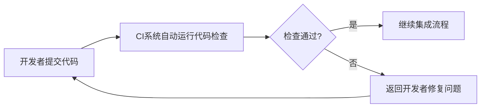

# Python 代码检查

编写代码并不仅仅是让程序能够运行那么简单。编写高质量、可维护且符合最佳实践的代码是每个开发者都应该追求的目标。Python代码检查工具可以帮助我们实现这一目标，它们能够在代码执行前发现潜在问题，提高代码质量。

## 什么是代码检查？

代码检查（Code Linting）是一种静态代码分析技术，它可以：

- 检查代码中的语法错误
- 发现潜在的逻辑问题
- 检查代码风格是否符合规范
- 识别未使用的变量和导入
- 发现安全漏洞
- 提出代码优化建议

与调试不同，代码检查不需要运行程序，它直接分析源代码本身。这使得开发者能够在执行代码前就发现并解决潜在问题。

## 常用的Python代码检查工具

### Pylint

Pylint是Python中最流行的代码检查工具之一，它不仅检查代码错误，还能评估代码遵循Python编码标准（如PEP 8）的程度。

#### 安装Pylint

```bash
pip install pylint
```

#### 使用Pylint

```bash
pylint your_file.py
```

#### 示例

考虑下面这个有问题的Python文件`bad_code.py`：

```python
def calculate_sum(a,b):
    c=a+b
    return c

unused_var = 10

print(calculate_sum(5,10))
```

运行Pylint：

```bash
pylint bad_code.py
```

输出可能如下：

```
************* Module bad_code
bad_code.py:1:0: C0103: Function name "calculate_sum" doesn't conform to snake_case naming style (invalid-name)
bad_code.py:1:16: C0326: No space after comma
                def calculate_sum(a,b): (bad-whitespace)
bad_code.py:2:6: C0326: No space around operator
                c=a+b (bad-whitespace)
bad_code.py:5:0: W0612: Unused variable 'unused_var' (unused-variable)

Your code has been rated at 5.00/10
```

Pylint给出了详细的提示，包括命名不规范、空格使用不当、未使用的变量等问题。

### Flake8

Flake8是另一个受欢迎的代码检查工具，它结合了PyCodeStyle、pyflakes和McCabe复杂度检查工具的功能，但与Pylint相比更加轻量级。

#### 安装Flake8

```bash
pip install flake8
```

#### 使用Flake8

```bash
flake8 your_file.py
```

#### 示例

使用相同的`bad_code.py`文件，运行Flake8：

```bash
flake8 bad_code.py
```

输出可能如下：

```
bad_code.py:1:16: E231 missing whitespace after ','
bad_code.py:2:5: E225 missing whitespace around operator
bad_code.py:5:1: F841 local variable 'unused_var' is assigned to but never used
```

### mypy - 类型检查

mypy是Python的一个可选静态类型检查器，它可以发现类型相关的潜在错误。

#### 安装mypy

```bash
pip install mypy
```

#### 使用类型注解

```python
def add_numbers(a: int, b: int) -> int:
    return a + b

result = add_numbers("hello", 5)  # 类型错误
```

#### 运行mypy检查

```bash
mypy your_file.py
```

```
your_file.py:4: error: Argument 1 to "add_numbers" has incompatible type "str"; expected "int"
```

## 集成开发环境(IDE)中的代码检查

许多现代IDE和文本编辑器已经集成了代码检查功能，如：

1. **PyCharm**: 内置了代码检查和风格检查
2. **Visual Studio Code**: 通过Python扩展支持Pylint、Flake8等
3. **Jupyter Notebook**: 可以通过扩展添加代码检查功能

:::tip
在VS Code中，你可以在设置中配置Python代码检查：
```json
{
  "python.linting.enabled": true,
  "python.linting.pylintEnabled": true,
  "python.linting.flake8Enabled": false
}
```
:::

## 自定义代码检查规则

大多数代码检查工具允许你自定义规则，以适应你的项目需求。

### Pylint配置示例

创建`.pylintrc`文件：

```bash
pylint --generate-rcfile > .pylintrc
```

然后编辑该文件，例如禁用特定警告：

```
[MESSAGES CONTROL]
disable=C0111,R0903
```

### Flake8配置示例

创建`.flake8`或`setup.cfg`文件：

```ini
[flake8]
ignore = E203, W503
max-line-length = 88
exclude = .git,__pycache__,docs/source/conf.py,old,build,dist
```

## 实际应用案例

### 案例1：代码审查自动化

在一个团队开发环境中，你可以将代码检查集成到持续集成(CI)流程中：



### 案例2：保证代码质量的脚本

以下是一个简单的脚本，可以在提交前运行多种检查工具：

```python
#!/usr/bin/env python
import subprocess
import sys

def run_command(command):
    """运行命令并返回成功/失败状态"""
    try:
        subprocess.check_call(command, shell=True)
        return True
    except subprocess.CalledProcessError:
        return False

def main():
    files = sys.argv[1:]
    if not files:
        print("请指定要检查的Python文件")
        sys.exit(1)
    
    all_passed = True
    
    # 运行pylint
    print("运行Pylint...")
    for file in files:
        if not run_command(f"pylint {file}"):
            all_passed = False
    
    # 运行flake8
    print("运行Flake8...")
    for file in files:
        if not run_command(f"flake8 {file}"):
            all_passed = False
    
    # 运行mypy
    print("运行mypy...")
    for file in files:
        if not run_command(f"mypy {file}"):
            all_passed = False
    
    if all_passed:
        print("所有检查通过！")
        sys.exit(0)
    else:
        print("检查发现问题，请修复后再提交。")
        sys.exit(1)

if __name__ == "__main__":
    main()
```

## 代码检查的最佳实践

1. **早期集成**：在开发流程的早期就开始使用代码检查，而不是等到项目接近完成。

2. **逐渐采用**：对于现有项目，逐步引入代码检查，先解决严重问题，再逐渐处理风格问题。

3. **团队共识**：确保团队成员都理解并同意所使用的代码检查规则。

4. **自动化**：将代码检查集成到CI/CD流程中，自动执行。

5. **配置文件版本控制**：将代码检查工具的配置文件加入版本控制，确保团队一致性。

## 总结

代码检查是Python开发中不可或缺的环节，它能帮助你：

- 发现潜在的编程错误和代码气味
- 遵循一致的编码标准和最佳实践
- 提高代码可读性和可维护性
- 减少运行时错误
- 节省调试和修复问题的时间

通过将静态代码分析工具整合到你的开发工作流中，你可以显著提高代码质量，减少技术债务，并确保你的代码库保持健康状态。

## 练习

1. 安装Pylint并对你的一个Python项目进行检查，尝试修复发现的问题。
2. 创建一个自定义的`.pylintrc`配置文件，调整规则以适应你的编码偏好。
3. 编写一个包含故意错误的Python文件，使用不同的代码检查工具进行检查，比较它们的结果。
4. 将代码检查集成到你的Git预提交钩子中，确保只有通过检查的代码才能被提交。
5. 尝试使用mypy为现有代码添加类型注解，并修复发现的类型相关问题。

## 进一步学习资源

- [PEP 8 - Python编码风格指南](https://www.python.org/dev/peps/pep-0008/)
- [Pylint官方文档](https://pylint.pycqa.org/)
- [Flake8官方文档](https://flake8.pycqa.org/)
- [mypy官方文档](https://mypy.readthedocs.io/)
- [Python代码质量保证最佳实践](https://realpython.com/python-code-quality/)