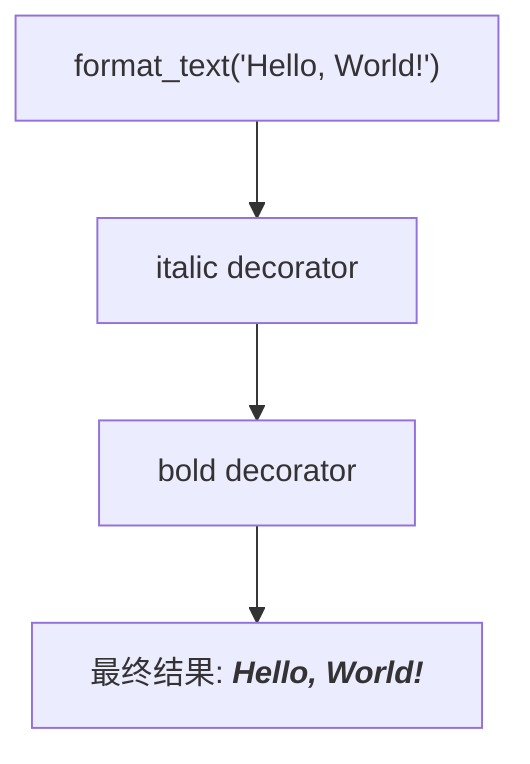

# Python 装饰器高级用法

## 引言

Python装饰器是Python语言中一个强大而优雅的特性，它允许我们以非侵入式的方式修改或增强函数和类的行为。在基础Python课程中，你可能已经学习了装饰器的基本概念，但装饰器的能力远不止于此。本文将深入探讨Python装饰器的高级用法，帮助你更全面地掌握这一强大工具。

## 基础回顾

在深入高级主题前，让我们快速回顾装饰器的基本原理。简单来说，装饰器是一个接收函数并返回函数的函数。它的基本语法是使用`@`符号。

```python
def simple_decorator(func):
    def wrapper(*args, **kwargs):
        print("Something happens before the function is called.")
        result = func(*args, **kwargs)
        print("Something happens after the function is called.")
        return result
    return wrapper

@simple_decorator
def say_hello(name):
    print(f"Hello, {name}!")

# 调用函数
say_hello("Python学习者")
```

输出:
```
Something happens before the function is called.
Hello, Python学习者!
Something happens after the function is called.
```

现在，让我们开始探索更高级的用法。

## 带参数的装饰器

一个更强大的功能是创建可接受参数的装饰器。这需要额外的一层函数嵌套。

```python
def repeat(n=1):
    """一个可以接受参数的装饰器，用于重复执行函数n次"""
    def decorator(func):
        def wrapper(*args, **kwargs):
            results = []
            for _ in range(n):
                results.append(func(*args, **kwargs))
            return results
        return wrapper
    return decorator

@repeat(3)
def greet(name):
    return f"Hello, {name}!"

print(greet("Python爱好者"))
```

输出:
```
['Hello, Python爱好者!', 'Hello, Python爱好者!', 'Hello, Python爱好者!']
```

:::tip 理解参数化装饰器
参数化装饰器实际上是一个返回装饰器的函数。`repeat(3)`返回一个装饰器，这个装饰器然后应用于`greet`函数。
:::

## 保留原函数的元信息

使用装饰器会导致一个问题：被装饰的函数会失去其原始的元信息，如函数名、文档字符串等。Python的`functools`模块提供了`wraps`装饰器来解决这个问题：

```python
from functools import wraps

def log_function_call(func):
    @wraps(func)  # 保留原函数的元信息
    def wrapper(*args, **kwargs):
        print(f"调用函数: {func.__name__}")
        return func(*args, **kwargs)
    return wrapper

@log_function_call
def add(a, b):
    """返回两个数的和"""
    return a + b

print(add(3, 5))
print(add.__name__)  # 如果没有@wraps，这会输出'wrapper'
print(add.__doc__)   # 如果没有@wraps，这会输出None或wrapper的文档
```

输出:
```
调用函数: add
8
add
返回两个数的和
```

## 类装饰器

装饰器不仅可以装饰函数，还可以装饰类。类装饰器接收一个类并返回一个类。

```python
def add_greeting(cls):
    """为类添加greet方法的装饰器"""
    def greet(self, name):
        return f"{self.__class__.__name__}向{name}问好!"
    
    cls.greet = greet
    return cls

@add_greeting
class Person:
    def __init__(self, name):
        self.name = name

p = Person("小明")
print(p.greet("小红"))
```

输出:
```
Person向小红问好!
```

## 使用类作为装饰器

我们也可以定义一个类来充当装饰器。当类的实例被用作装饰器时，需要实现`__call__`方法。

```python
class CountCalls:
    """统计函数被调用次数的装饰器类"""
    def __init__(self, func):
        self.func = func
        self.count = 0
        
    def __call__(self, *args, **kwargs):
        self.count += 1
        print(f"{self.func.__name__}被调用了{self.count}次")
        return self.func(*args, **kwargs)

@CountCalls
def say_hi():
    print("Hi!")

say_hi()
say_hi()
say_hi()
```

输出:
```
say_hi被调用了1次
Hi!
say_hi被调用了2次
Hi!
say_hi被调用了3次
Hi!
```

## 装饰器链

可以将多个装饰器应用于同一个函数。装饰器的执行顺序是从下到上（从最接近函数的装饰器开始）。

```python
def bold(func):
    def wrapper(*args, **kwargs):
        return f"<b>{func(*args, **kwargs)}</b>"
    return wrapper

def italic(func):
    def wrapper(*args, **kwargs):
        return f"<i>{func(*args, **kwargs)}</i>"
    return wrapper

@bold
@italic
def format_text(text):
    return text

print(format_text("Hello, World!"))
```

输出:
```
<b><i>Hello, World!</i></b>
```

装饰器链的执行顺序可以通过下面的流程图来理解:



## 实用案例

下面列出一些装饰器在实际编程中的应用场景：

### 1. 执行时间测量

```python
import time
from functools import wraps

def measure_time(func):
    @wraps(func)
    def wrapper(*args, **kwargs):
        start_time = time.time()
        result = func(*args, **kwargs)
        end_time = time.time()
        print(f"{func.__name__}执行时间: {end_time - start_time:.4f}秒")
        return result
    return wrapper

@measure_time
def calculate_sum(n):
    """计算从1到n的和"""
    return sum(range(1, n+1))

print(calculate_sum(1000000))
```

输出:
```
calculate_sum执行时间: 0.0456秒
500000500000
```

### 2. 缓存机制（记忆化）

```python
def memoize(func):
    """实现简单的缓存机制"""
    cache = {}
    
    @wraps(func)
    def wrapper(*args):
        if args not in cache:
            cache[args] = func(*args)
        return cache[args]
    
    return wrapper

@memoize
def fibonacci(n):
    """计算斐波那契数列的第n项"""
    if n <= 1:
        return n
    return fibonacci(n-1) + fibonacci(n-2)

# 测试性能提升
import time

start = time.time()
print(fibonacci(35))
end = time.time()
print(f"计算耗时: {end - start:.4f}秒")
```

输出:
```
9227465
计算耗时: 0.0001秒
```

:::note
如果没有`@memoize`装饰器，计算`fibonacci(35)`将会花费数秒甚至更长时间，因为会进行大量的重复计算。
:::

### 3. 权限验证

```python
def require_auth(func):
    @wraps(func)
    def wrapper(user, *args, **kwargs):
        if not user.is_authenticated:
            raise PermissionError("需要登录才能执行此操作")
        return func(user, *args, **kwargs)
    return wrapper

# 模拟用户类
class User:
    def __init__(self, name, is_authenticated=False):
        self.name = name
        self.is_authenticated = is_authenticated

@require_auth
def view_profile(user):
    return f"欢迎回来，{user.name}！这是您的个人资料。"

# 测试
try:
    user1 = User("游客")
    print(view_profile(user1))
except PermissionError as e:
    print(f"错误: {e}")

user2 = User("小明", is_authenticated=True)
print(view_profile(user2))
```

输出:
```
错误: 需要登录才能执行此操作
欢迎回来，小明！这是您的个人资料。
```

### 4. 注册模式

装饰器可以用于实现注册模式，这在插件系统、命令处理器等场景下非常有用。

```python
# 创建一个命令注册器
command_registry = {}

def register_command(command_name):
    """注册命令到全局注册表"""
    def decorator(func):
        command_registry[command_name] = func
        return func
    return decorator

@register_command("hello")
def hello_command(name="World"):
    return f"Hello, {name}!"

@register_command("bye")
def bye_command(name="World"):
    return f"Goodbye, {name}!"

# 使用注册的命令
def execute_command(command, **args):
    if command in command_registry:
        return command_registry[command](**args)
    else:
        return f"Unknown command: {command}"

print(execute_command("hello"))
print(execute_command("hello", name="Python"))
print(execute_command("bye", name="Friend"))
print(execute_command("unknown"))
```

输出:
```
Hello, World!
Hello, Python!
Goodbye, Friend!
Unknown command: unknown
```

:::caution 警告
虽然装饰器功能强大，但不应过度使用。复杂的嵌套装饰器可能导致代码难以理解和调试。
:::

## 总结

Python装饰器是一种强大的元编程工具，可以帮助我们编写更简洁、更模块化的代码。通过本文，我们探讨了装饰器的多种高级用法：

1. 带参数的装饰器
2. 保留原函数元信息
3. 类装饰器
4. 使用类作为装饰器
5. 装饰器链
6. 实际应用场景

掌握这些高级技巧将使你能够更有效地使用Python装饰器，编写更优雅的代码。

## 练习

为了巩固所学知识，尝试完成以下练习：

1. 创建一个装饰器，限制函数的执行次数。
2. 实现一个装饰器，记录函数的所有调用参数和返回值。
3. 设计一个重试装饰器，在函数失败时自动重试指定次数。
4. 创建一个装饰器，实现简单的并行执行（提示：可以使用`threading`模块）。

## 进一步学习资源

- Python官方文档关于装饰器的章节
- 《流畅的Python》中关于装饰器的深入讨论
- PEP 318 - 函数和方法的装饰器
- functools模块文档