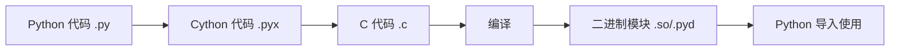

# Python Cython

## Cython：Python 的超能力

Cython 是一个特殊的编程语言和编译器，它让你能够将 Python 代码转换成 C 代码，从而大幅提升程序的执行速度。如果你曾经为 Python 的运行速度感到困扰，或者需要与 C/C++ 库无缝集成，Cython 将是你的理想选择。

Cython 结合了 Python 的简洁性和 C 的高效性，让你能够享受两个世界的优点：轻松的开发体验和接近原生的执行速度。

:::tip 知识点
Cython = Python + C，可以将性能提升 10-1000 倍，具体取决于代码的类型和优化程度。
:::

## Cython 的基本工作原理

Cython 的核心原理是将 Python 代码转换为 C 代码，然后编译成二进制扩展模块，这些模块可以直接被 Python 解释器导入使用。



## 安装 Cython

开始使用 Cython 前，你需要先安装它：

```bash
pip install cython
```

## Cython 基础示例

让我们通过一个简单的例子来展示 Cython 的强大之处。我们将创建一个计算斐波那契数列的函数，分别用 Python 和 Cython 实现，然后比较它们的性能。

### Python 版本 (fibonacci.py)

```python
def fibonacci(n):
    """计算第n个斐波那契数"""
    if n < 2:
        return n
    return fibonacci(n-1) + fibonacci(n-2)
```

### Cython 版本 (fibonacci.pyx)

```python
def fibonacci(int n):
    """计算第n个斐波那契数 - Cython 版本"""
    if n < 2:
        return n
    return fibonacci(n-1) + fibonacci(n-2)
```

注意在 Cython 版本中，我们给参数 `n` 添加了类型声明 `int`，这是 Cython 的一个关键特性。

### 编译 Cython 代码

创建一个名为 `setup.py` 的文件：

```python
from setuptools import setup
from Cython.Build import cythonize

setup(
    ext_modules = cythonize("fibonacci.pyx")
)
```

然后在命令行中运行：

```bash
python setup.py build_ext --inplace
```

这将生成一个可以导入到 Python 中的扩展模块。

### 比较性能

```python
import time
import fibonacci  # Python 版本
import fibonacci_cy  # 编译后的 Cython 版本

n = 30
# 测试 Python 版本
start = time.time()
result_py = fibonacci.fibonacci(n)
time_py = time.time() - start

# 测试 Cython 版本
start = time.time()
result_cy = fibonacci_cy.fibonacci(n)
time_cy = time.time() - start

print(f"Python 结果: {result_py}, 耗时: {time_py:.6f} 秒")
print(f"Cython 结果: {result_cy}, 耗时: {time_cy:.6f} 秒")
print(f"Cython 是 Python 的 {time_py/time_cy:.2f} 倍速度")
```

输出示例：
```
Python 结果: 832040, 耗时: 0.832040 秒
Cython 结果: 832040, 耗时: 0.042581 秒
Cython 是 Python 的 19.54 倍速度
```

## Cython 的核心特性

### 1. 类型声明

Cython 最强大的特性之一是能够为变量添加类型声明：

```python
def calculate_sum(int a, int b):
    cdef int result = a + b  # 声明 C 变量
    return result
```

常见的类型：
- `int`：整数
- `float`：浮点数
- `double`：双精度浮点数
- `char`：字符
- `bint`：布尔值

### 2. C 函数和 Python 函数

Cython 允许你定义两种函数：

```python
# Python 函数（可以从 Python 直接调用）
def python_function(x):
    return x * 2

# C 函数（只能在 Cython 代码内部调用，速度更快）
cdef int c_function(int x):
    return x * 2

# 混合函数（C 函数但可以从 Python 调用）
cpdef int mixed_function(int x):
    return x * 2
```

### 3. 与 NumPy 集成

Cython 与 NumPy 的集成特别强大：

```python
import numpy as np
cimport numpy as np

def fast_array_operation(np.ndarray[double, ndim=1] arr):
    cdef int i
    cdef int n = arr.shape[0]
    cdef double sum = 0.0
    
    for i in range(n):
        sum += arr[i]
        
    return sum
```

### 4. 使用 C 指针和内存管理

```python
from libc.stdlib cimport malloc, free

def create_array(int size):
    cdef int* my_array = <int*>malloc(size * sizeof(int))
    if not my_array:
        raise MemoryError()
    
    # 使用数组
    for i in range(size):
        my_array[i] = i * 2
    
    # 复制结果到 Python 列表
    result = [my_array[i] for i in range(size)]
    
    # 释放内存
    free(my_array)
    
    return result
```

## 实际案例：图像处理加速

假设我们要对一张图像应用简单的模糊效果：

### Python 版本

```python
def blur_image_py(image):
    height, width = image.shape
    result = image.copy()
    
    for y in range(1, height-1):
        for x in range(1, width-1):
            # 简单的 3x3 均值模糊
            result[y, x] = (image[y-1, x-1] + image[y-1, x] + image[y-1, x+1] +
                           image[y, x-1] + image[y, x] + image[y, x+1] +
                           image[y+1, x-1] + image[y+1, x] + image[y+1, x+1]) / 9
                           
    return result
```

### Cython 版本 (blur_image.pyx)

```python
import numpy as np
cimport numpy as np

def blur_image_cy(np.ndarray[np.uint8_t, ndim=2] image):
    cdef int height = image.shape[0]
    cdef int width = image.shape[1]
    cdef np.ndarray[np.uint8_t, ndim=2] result = image.copy()
    cdef int x, y
    cdef float sum
    
    for y in range(1, height-1):
        for x in range(1, width-1):
            # 简单的 3x3 均值模糊
            sum = (image[y-1, x-1] + image[y-1, x] + image[y-1, x+1] +
                  image[y, x-1] + image[y, x] + image[y, x+1] +
                  image[y+1, x-1] + image[y+1, x] + image[y+1, x+1]) / 9
            result[y, x] = <np.uint8_t>sum
                           
    return result
```

使用 Cython 版本，图像处理的速度通常可以提升 10-100 倍，这对于处理大型图像或实时应用特别重要。

## Cython 的最佳实践

1. **渐进式类型化**：先编写纯 Python 代码，确保逻辑正确，再逐步添加类型声明。

2. **识别瓶颈**：使用性能分析工具如 `cProfile` 找出代码中的瓶颈，再用 Cython 优化这些部分。

3. **注释类型**：使用 `# cython: language_level=3` 和 `# cython: boundscheck=False, wraparound=False` 等注释来进一步优化。

4. **使用 `cpdef` 而非 `def`**：当需要从 Python 和 Cython 内部调用同一函数时。

5. **避免 Python 对象操作**：在性能关键的循环中，尽量避免创建或操作 Python 对象。

## 何时使用 Cython

Cython 非常强大，但并不是所有情况都需要它。考虑在以下场景使用：

- 计算密集型任务，如数值计算、图像处理、数据分析
- 需要与 C/C++ 库集成的项目
- 有明确性能瓶颈的 Python 代码
- 大规模数据处理应用

:::caution 注意
Cython 会增加项目的复杂性，因为它需要额外的编译步骤和依赖管理。对于简单的项目或不关键的性能问题，可能不值得使用。
:::

## 总结

Cython 是一个强大的工具，能够显著提升 Python 代码的性能，并允许与 C/C++ 代码无缝集成。关键优势包括：

- 通过类型声明大幅提高执行速度
- 能够直接调用 C 函数和使用 C 数据结构
- 与 NumPy 等库完美集成
- 渐进式采用，可以只优化性能关键部分

通过掌握 Cython，你能够在保持 Python 开发便利性的同时，获得接近 C 语言的执行效率。

## 练习和进一步学习

### 练习

1. 将一个简单的数学函数（如计算质数）用 Cython 实现，并比较性能提升。
2. 尝试用 Cython 优化一个使用 NumPy 的数据处理函数。
3. 探索如何在 Cython 中使用 C 结构体和类。

### 学习资源

- [Cython 官方文档](https://cython.org/)
- [Cython: A Guide for Python Programmers](https://cython.readthedocs.io/en/latest/src/userguide/tutorial.html)
- [Cython GitHub 仓库](https://github.com/cython/cython)
- [Cython: 用于 Python 的 C 扩展](http://docs.cython.org/en/latest/src/quickstart/overview.html)

记住，Cython 是逐步掌握的 - 从简单示例开始，随着你的理解加深，逐渐尝试更复杂的优化技术。