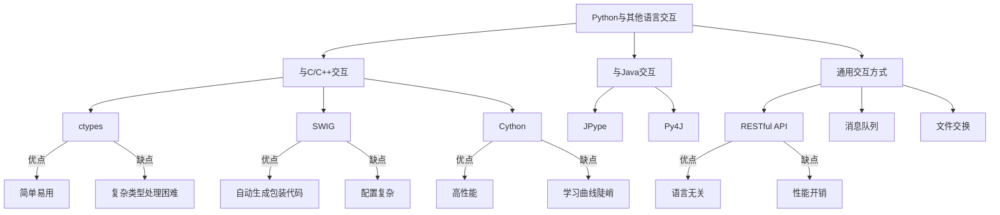

# Python 与其他语言交互

在实际开发中，我们可能需要将Python与其他编程语言结合使用，以充分利用各语言的优势。比如，我们可能需要调用C/C++编写的高性能代码，或者与Java程序进行交互。本文将介绍Python如何与其他编程语言交互的常见方法。

## 为什么需要语言交互

在深入学习具体的交互方法之前，让我们先了解为什么需要Python与其他语言交互：

1. **性能优化**：某些计算密集型任务可以用C/C++实现，以获得更好的性能
2. **重用现有代码**：避免重写已经在其他语言中实现的功能
3. **特定领域需求**：某些领域可能有特定语言的专业库
4. **系统集成**：在复杂系统中连接不同语言编写的组件

## Python 与C/C++交互

### 使用ctypes

`ctypes`是Python的外部函数库，提供了与C兼容的数据类型，允许调用DLL或共享库中的函数。

#### 示例：调用C函数

首先，我们创建一个简单的C语言文件 `mathlib.c`：

```c
// mathlib.c
#include <stdio.h>

// 导出函数，计算两数之和
int add(int a, int b) {
    return a + b;
}
```

将其编译为共享库：

在Linux/Mac上：
```bash
gcc -fPIC -shared -o libmathlib.so mathlib.c
```

在Windows上：
```bash
gcc -shared -o mathlib.dll mathlib.c
```

然后在Python中调用它：

```python
import ctypes

# 加载库文件
# 在Windows上使用：math_lib = ctypes.CDLL('./mathlib.dll')
math_lib = ctypes.CDLL('./libmathlib.so')

# 调用C函数
result = math_lib.add(5, 3)
print(f"5 + 3 = {result}")  # 输出: 5 + 3 = 8
```

### 使用SWIG

SWIG (Simplified Wrapper and Interface Generator) 是一个工具，能够将C/C++代码连接到多种高级编程语言，包括Python。

#### SWIG使用步骤

1. 首先，创建C代码文件 `example.c`：

```c
// example.c
double multiply(double a, double b) {
    return a * b;
}
```

2. 创建SWIG接口文件 `example.i`：

```
/* example.i */
%module example
%{
extern double multiply(double a, double b);
%}

extern double multiply(double a, double b);
```

3. 使用SWIG生成包装代码：

```bash
swig -python example.i
```

4. 编译源文件和SWIG生成的包装代码：

```bash
gcc -fPIC -c example.c example_wrap.c -I/usr/include/python3.8
gcc -shared example.o example_wrap.o -o _example.so
```

5. 在Python中使用：

```python
import example

result = example.multiply(5.0, 3.0)
print(f"5.0 * 3.0 = {result}")  # 输出: 5.0 * 3.0 = 15.0
```

### 使用Cython

Cython是Python的C扩展，允许你直接在Python代码中嵌入C代码，或者将Python代码转译成C代码以提高性能。

#### Cython示例

创建一个Cython文件 `fast_math.pyx`：

```python
# fast_math.pyx
def fast_sum(int n):
    cdef int i
    cdef int total = 0
    for i in range(n):
        total += i
    return total
```

创建`setup.py`文件用于编译：

```python
from setuptools import setup
from Cython.Build import cythonize

setup(
    ext_modules = cythonize("fast_math.pyx")
)
```

编译模块：

```bash
python setup.py build_ext --inplace
```

在Python中使用：

```python
import fast_math
import time

# 使用纯Python计算
def py_sum(n):
    total = 0
    for i in range(n):
        total += i
    return total

# 比较性能
n = 10000000
start = time.time()
result1 = py_sum(n)
py_time = time.time() - start

start = time.time()
result2 = fast_math.fast_sum(n)
cy_time = time.time() - start

print(f"Python结果: {result1}, 用时: {py_time:.4f}秒")
print(f"Cython结果: {result2}, 用时: {cy_time:.4f}秒")
print(f"Cython比Python快: {py_time/cy_time:.2f}倍")
```

输出示例：
```
Python结果: 49999995000000, 用时: 0.6832秒
Cython结果: 49999995000000, 用时: 0.0421秒
Cython比Python快: 16.23倍
```

## Python 与Java交互

### JPype

JPype是一个允许Python程序访问Java类的库。

#### JPype使用示例

```python
import jpype
import jpype.imports
from jpype.types import *

# 启动JVM
jpype.startJVM(classpath=['path/to/your.jar'])

# 导入Java类
from java.util import ArrayList

# 创建Java对象
arrayList = ArrayList()
arrayList.add("Hello")
arrayList.add("World")

# 遍历Java集合
for item in arrayList:
    print(item)

# 关闭JVM
jpype.shutdownJVM()
```

### Py4J

Py4J允许Python程序动态访问Java对象。

#### Py4J使用示例

Java端代码：

```java
// HelloWorld.java
import py4j.GatewayServer;

public class HelloWorld {
    public String sayHello(String name) {
        return "Hello, " + name + "!";
    }

    public static void main(String[] args) {
        HelloWorld app = new HelloWorld();
        // 启动GatewayServer，监听Python端连接
        GatewayServer server = new GatewayServer(app);
        server.start();
        System.out.println("Gateway Server Started");
    }
}
```

编译并运行Java程序：

```bash
javac -cp py4j.jar HelloWorld.java
java -cp .:py4j.jar HelloWorld
```

Python端代码：

```python
from py4j.java_gateway import JavaGateway

# 连接到Java端
gateway = JavaGateway()

# 获取Java对象的引用
hello_world = gateway.entry_point

# 调用Java方法
result = hello_world.sayHello("Python")
print(result)  # 输出: Hello, Python!
```

## Python 与其他语言的通用交互方式

### RESTful API

不同语言开发的系统可以通过RESTful API进行通信，这是一种语言无关的交互方式。

#### 示例：使用Python调用RESTful API

```python
import requests

# 调用外部API
response = requests.get('https://api.example.com/data')

if response.status_code == 200:
    data = response.json()
    print("接收到的数据:", data)
else:
    print(f"请求失败: {response.status_code}")
```

### 使用消息队列

消息队列如RabbitMQ、Kafka等可用于不同语言编写的系统之间的异步通信。

#### Python 使用RabbitMQ发送消息

```python
import pika

# 建立到RabbitMQ服务器的连接
connection = pika.BlockingConnection(pika.ConnectionParameters('localhost'))
channel = connection.channel()

# 声明队列
channel.queue_declare(queue='task_queue')

# 发送消息
message = "Hello from Python!"
channel.basic_publish(
    exchange='',
    routing_key='task_queue',
    body=message
)
print(f"[x] 发送消息: {message}")

# 关闭连接
connection.close()
```

其他语言可以从同一队列接收消息，实现跨语言通信。

## 实际应用案例

### 案例1：Python调用C++机器学习库

假设我们有一个用C++实现的高性能机器学习算法，我们可以通过以下方式在Python中使用它：

```python
# 使用pybind11绑定C++库
import ml_algorithm_cpp

# 加载数据
data = [1.2, 3.4, 5.6, 7.8]

# 调用C++实现的算法
result = ml_algorithm_cpp.process_data(data)
print("处理结果:", result)
```

### 案例2：Python Web应用与Java后端集成

Python Flask应用调用Java实现的企业级服务：

```python
from flask import Flask, jsonify
import requests

app = Flask(__name__)

@app.route('/user/<int:user_id>')
def get_user(user_id):
    # 调用Java微服务
    response = requests.get(f'http://java-service:8080/api/users/{user_id}')
    
    if response.status_code == 200:
        return jsonify(response.json())
    else:
        return jsonify({'error': '用户数据获取失败'}), 404

if __name__ == '__main__':
    app.run(debug=True)
```

:::tip 最佳实践
选择最适合你项目需求的语言交互方式：
- 对于性能要求高的计算密集型任务，考虑C/C++扩展
- 对于企业级应用，RESTful API或消息队列通常是更好的选择
- 对于需要Java生态系统功能的项目，可以使用JPype或Py4J
:::

## 语言交互的比较

下面是不同交互方式的比较：



## 总结

Python与其他语言的交互为我们提供了灵活性，使我们能够结合不同语言的优势构建复杂的系统：

1. **与C/C++交互**：当需要高性能计算时，可以使用ctypes、SWIG或Cython。
2. **与Java交互**：JPype和Py4J提供了在Python中使用Java代码的能力。
3. **通用交互方式**：RESTful API和消息队列提供了语言无关的通信方法。

选择合适的交互方式应考虑性能需求、开发复杂度和团队技能等因素。

## 练习

1. 使用ctypes创建一个简单的Python程序，调用C语言编写的函数计算斐波那契数列。
2. 编写一个Python程序，通过RESTful API与用其他语言编写的服务进行通信。
3. 使用Cython优化一个计算密集型的Python函数，并比较优化前后的性能差异。
4. 如果你同时了解Java和Python，尝试使用JPype让Python程序调用Java类库中的功能。

## 扩展阅读

- [Python官方文档 - ctypes](https://docs.python.org/3/library/ctypes.html)
- [Cython官方文档](https://cython.readthedocs.io/)
- [SWIG官方网站](http://www.swig.org/)
- [JPype官方文档](https://jpype.readthedocs.io/)
- [Py4J官方网站](https://www.py4j.org/)

通过掌握这些与其他语言交互的技术，你将能够在保留Python简洁易用的特性的同时，充分利用其他语言的强大功能和生态系统。