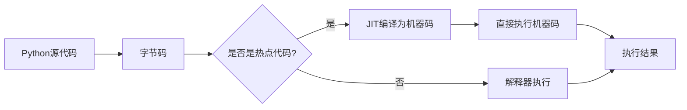

# Python JIT编译

## 什么是JIT编译？

JIT（Just-In-Time）编译，即"即时编译"，是一种提高程序执行效率的技术。与传统的编译方式不同，JIT编译器在程序运行时（而非之前）将代码编译成机器码，从而在保持动态语言灵活性的同时获得接近编译型语言的执行效率。

:::note
在标准Python实现(CPython)中，Python代码首先被编译成字节码，然后由Python解释器执行。这种解释执行的方式虽然灵活但通常比直接执行机器码要慢。
:::

## Python 为什么需要JIT编译？

Python以其简洁的语法和强大的库生态系统而闻名，但也常因执行速度较慢而被批评。这种速度问题主要源于以下原因：

1. **解释执行**: Python是解释型语言，代码在执行时被逐行解释
2. **动态类型**: Python的动态类型系统需要在运行时进行类型检查
3. **GIL限制**: 全局解释器锁(Global Interpreter Lock)限制了多线程性能

JIT编译技术可以在不改变Python语言特性的情况下，显著提高执行速度，特别是对于计算密集型任务。

## Python 中的JIT编译器

### PyPy

PyPy是Python的一个替代解释器，内置了JIT编译器。它可以运行大多数Python代码，并且通常比CPython快很多。

```python
# 使用标准Python(CPython)运行
# 文件名: fibonacci.py
def fibonacci(n):
    if n <= 1:
        return n
    return fibonacci(n-1) + fibonacci(n-2)

print(fibonacci(30))
```

在普通Python和PyPy中运行该代码的性能比较：

```bash
# CPython
$ time python fibonacci.py
832040
real    0m12.978s

# PyPy
$ time pypy fibonacci.py
832040
real    0m0.452s
```

这个简单的例子展示了PyPy在递归计算上的巨大性能优势。

### Numba

Numba是一个开源的JIT编译器，专为Python数值计算设计，可以将Python函数编译成优化的机器码。

```python
import numpy as np
import time
from numba import jit

# 定义一个简单的数值计算函数
def standard_function(size):
    result = np.zeros(size)
    for i in range(size):
        result[i] = i * np.sin(i) * np.cos(i)
    return result

# 使用Numba JIT装饰器优化同样的函数
@jit(nopython=True)
def numba_function(size):
    result = np.zeros(size)
    for i in range(size):
        result[i] = i * np.sin(i) * np.cos(i)
    return result

# 性能测试
size = 10000000

# 测试标准函数
start = time.time()
standard_result = standard_function(size)
standard_time = time.time() - start
print(f"标准函数执行时间: {standard_time:.4f}秒")

# 测试Numba优化函数
start = time.time()
numba_result = numba_function(size)  # 第一次运行包含编译时间
first_run_time = time.time() - start
print(f"Numba函数首次执行时间(包含编译): {first_run_time:.4f}秒")

# 再次运行Numba函数(已编译)
start = time.time()
numba_result = numba_function(size)
second_run_time = time.time() - start
print(f"Numba函数第二次执行时间: {second_run_time:.4f}秒")
print(f"性能提升: {standard_time/second_run_time:.1f}倍")
```

输出示例：
```
标准函数执行时间: 5.8231秒
Numba函数首次执行时间(包含编译): 0.3842秒
Numba函数第二次执行时间: 0.1245秒
性能提升: 46.8倍
```

:::tip
Numba特别适合数值计算、循环密集型操作和NumPy数组处理，但并非所有Python代码都能从Numba中受益。
:::

### 其他JIT解决方案

- **Pyston**: 一个使用JIT技术的Python变体，专注于Web应用性能优化
- **Cython**: 虽然严格来说不是JIT，但可以将Python代码转换为C代码并编译
- **Pyjion**: 一个为CPython设计的JIT编译插件
- **PyCUDA/PyOpenCL**: 允许Python使用GPU进行并行计算

## JIT编译的工作原理

JIT编译器通常采用以下步骤：

1. **分析热点**: 监控程序执行，识别频繁执行的代码段（"热点"）
2. **编译优化**: 将这些热点代码编译成优化的机器码
3. **动态替换**: 在运行时用编译后的代码替换解释执行的代码
4. **继续监控**: 如果代码行为变化，可能会重新编译



## 实际应用案例

### 案例1：科学计算

数据科学家经常使用Python处理大量数据和复杂计算模型：

```python
import numpy as np
from numba import jit
import time

# 模拟蒙特卡罗方法计算圆周率
@jit(nopython=True)
def monte_carlo_pi(samples):
    count = 0
    for i in range(samples):
        x = np.random.random()
        y = np.random.random()
        if x*x + y*y <= 1:
            count += 1
    return 4 * count / samples

# 不使用JIT
def standard_monte_carlo_pi(samples):
    count = 0
    for i in range(samples):
        x = np.random.random()
        y = np.random.random()
        if x*x + y*y <= 1:
            count += 1
    return 4 * count / samples

# 性能比较
samples = 10000000
start = time.time()
pi1 = standard_monte_carlo_pi(samples)
time1 = time.time() - start
print(f"标准函数计算结果: π ≈ {pi1}, 用时: {time1:.2f}秒")

start = time.time()
pi2 = monte_carlo_pi(samples)
time2 = time.time() - start
print(f"JIT函数计算结果: π ≈ {pi2}, 用时: {time2:.2f}秒")
print(f"速度提升: {time1/time2:.1f}倍")
```

### 案例2：Web服务器性能优化

使用PyPy运行Python Web框架可以显著提高性能：

```python
# 使用Flask创建简单的API服务
from flask import Flask, jsonify
import time

app = Flask(__name__)

@app.route('/compute/<int:n>')
def compute_factorial(n):
    if n > 20:
        n = 20  # 限制最大值防止计算过大
    
    # 计算阶乘的函数（计算密集型）
    def factorial(n):
        if n <= 1:
            return 1
        return n * factorial(n-1)
    
    start = time.time()
    result = factorial(n)
    compute_time = time.time() - start
    
    return jsonify({
        'input': n,
        'factorial': result,
        'compute_time': compute_time
    })

if __name__ == '__main__':
    app.run(debug=True)
```

在标准Python和PyPy下运行此服务器，对高负载请求的响应时间会有显著差异。

### 案例3：游戏开发

使用Pygame开发的游戏中，物理计算和AI可以使用JIT加速：

```python
import numpy as np
from numba import jit
import pygame

# 使用Numba加速物理计算
@jit(nopython=True)
def calculate_particle_physics(positions, velocities, accelerations, dt, count):
    new_positions = np.zeros_like(positions)
    new_velocities = np.zeros_like(velocities)
    
    for i in range(count):
        # 更新速度和位置的简化物理计算
        new_velocities[i] = velocities[i] + accelerations[i] * dt
        new_positions[i] = positions[i] + new_velocities[i] * dt
        
        # 简单边界碰撞检测
        if new_positions[i][0] < 0 or new_positions[i][0] > 800:
            new_velocities[i][0] *= -0.9
        if new_positions[i][1] < 0 or new_positions[i][1] > 600:
            new_velocities[i][1] *= -0.9
    
    return new_positions, new_velocities
```

## 使用JIT的最佳实践

1. **识别瓶颈**: 使用分析工具如cProfile或line_profiler确定代码中的性能瓶颈
2. **适用场景**: JIT最适合数值密集型任务和算法
3. **避免过早优化**: 先写正确的代码，再考虑使用JIT优化
4. **维持兼容性**: 注意不同JIT实现之间的语言特性支持差异
5. **测试验证**: 总是测量优化前后的性能差异，确保结果正确

:::warning
JIT编译不是万能的。I/O密集型任务、纯Python对象操作和调用C扩展的代码可能不会从JIT编译中获得显著收益。
:::

## 限制和挑战

使用JIT编译技术时需要注意以下几点：

1. **编译开销**: JIT编译需要时间，对于一次性执行的脚本可能不值得
2. **内存使用**: JIT编译器通常需要更多内存来存储编译后的代码
3. **调试难度**: JIT编译的代码可能更难调试
4. **兼容性问题**: 并非所有Python库都能与JIT解决方案兼容
5. **语言限制**: 某些动态特性可能不受支持或性能提升有限

## 总结

Python JIT编译技术为解决Python性能瓶颈提供了强大的解决方案，特别适用于计算密集型任务。几个关键点：

- **Python JIT编译器**主要包括PyPy（整体替代）和Numba（选择性优化）
- JIT编译通过**在运行时将热点代码编译为机器码**来提高性能
- 在**科学计算、Web服务器和游戏开发**等场景中，JIT可以带来显著性能提升
- 使用JIT编译需要认真考虑**适用场景并测量实际性能提升**

## 练习与实践

1. 使用标准Python和PyPy运行同一个计算密集型程序，比较执行时间
2. 尝试使用Numba的`@jit`装饰器优化你自己的一个数值计算函数
3. 使用分析工具找出一个现有Python程序中的性能瓶颈，并应用JIT技术优化
4. 比较不同JIT参数（如Numba的`nopython`和`parallel`选项）对性能的影响

## 延伸阅读

- PyPy官方文档: https://doc.pypy.org/
- Numba文档: https://numba.pydata.org/
- Python性能优化指南: https://docs.python.org/3/howto/perf_profiling.html
- "High Performance Python"（O'Reilly）一书包含优化Python性能的详细讨论