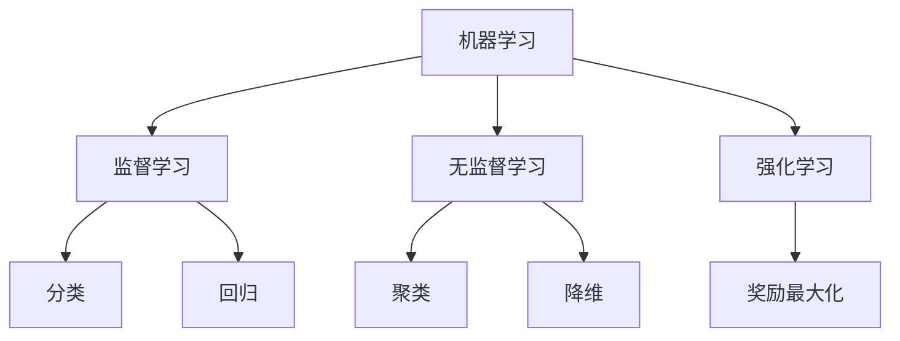

# Python 机器学习基础

## 引言

机器学习是人工智能的一个子领域，它使计算机系统能够自动从数据中学习并改进，而无需明确编程。Python因其简洁的语法、丰富的库以及强大的社区支持，已成为机器学习领域的首选编程语言。本文将介绍Python机器学习的基础知识，帮助你踏入这一令人兴奋的领域。

:::tip 学习提示
机器学习可能看起来很复杂，但只要掌握基础知识和工作流程，你就能逐步构建自己的机器学习应用。
:::

## 什么是机器学习？

机器学习是一种让计算机通过经验自动改进的方法。它主要分为三类：



1. **监督学习**：使用已标记的数据训练模型，用于预测或分类。
2. **无监督学习**：在没有标记的数据中寻找模式和结构。
3. **强化学习**：通过与环境互动和获取反馈来学习最佳行动。

## Python 机器学习必备库

要开始Python机器学习，你需要熟悉以下几个核心库：

### NumPy

NumPy是数值计算的基础库，提供了强大的多维数组对象和各种处理数组的函数。

```python
import numpy as np

# 创建数组
arr = np.array([1, 2, 3, 4, 5])
print(arr)
# 输出: [1 2 3 4 5]

# 数组操作
print(arr.mean())  # 平均值
# 输出: 3.0
print(arr.std())   # 标准差
# 输出: 1.4142135623730951
```

### Pandas

Pandas是数据分析和操作的核心库，提供了DataFrame等数据结构。

```python
import pandas as pd

# 创建DataFrame
data = {
    'Name': ['John', 'Anna', 'Peter', 'Linda'],
    'Age': [28, 34, 29, 32],
    'City': ['New York', 'Paris', 'Berlin', 'London']
}
df = pd.DataFrame(data)
print(df)
# 输出:
#     Name  Age      City
# 0   John   28  New York
# 1   Anna   34     Paris
# 2  Peter   29    Berlin
# 3  Linda   32    London

# 数据筛选
print(df[df['Age'] > 30])
# 输出:
#     Name  Age    City
# 1   Anna   34   Paris
# 3  Linda   32  London
```

### Matplotlib与Seaborn

这两个库用于数据可视化，帮助你理解数据和模型结果。

```python
import matplotlib.pyplot as plt
import seaborn as sns

# 简单折线图
x = [1, 2, 3, 4, 5]
y = [2, 4, 6, 8, 10]

plt.figure(figsize=(8, 4))
plt.plot(x, y, 'b-o', linewidth=2, markersize=8)
plt.title('简单折线图')
plt.xlabel('X轴')
plt.ylabel('Y轴')
plt.grid(True)
plt.show()
```

### Scikit-learn

Scikit-learn是最流行的机器学习库，提供了各种算法和工具。

```python
from sklearn import datasets, model_selection, linear_model
from sklearn.metrics import mean_squared_error

# 加载数据集
boston = datasets.load_boston()
X = boston.data
y = boston.target

# 划分训练集和测试集
X_train, X_test, y_train, y_test = model_selection.train_test_split(
    X, y, test_size=0.2, random_state=42)

# 创建并训练模型
model = linear_model.LinearRegression()
model.fit(X_train, y_train)

# 预测并评估
y_pred = model.predict(X_test)
mse = mean_squared_error(y_test, y_pred)
print(f"均方误差: {mse:.2f}")
# 输出可能是: 均方误差: 24.29
```

:::note
在新版本的scikit-learn中，`load_boston()`数据集已被弃用。你可以使用`fetch_california_housing()`或其他数据集替代。
:::

## 机器学习工作流程

一个典型的机器学习项目包含以下步骤：


### 1. 数据预处理

数据预处理是机器学习中的关键步骤，包括：

- 处理缺失值
- 编码分类变量
- 特征缩放

```python
import pandas as pd
from sklearn.preprocessing import StandardScaler, OneHotEncoder
from sklearn.impute import SimpleImputer
import numpy as np

# 创建含有缺失值的数据集
data = {
    'Age': [25, 30, np.nan, 40],
    'Income': [50000, np.nan, 70000, 90000],
    'Gender': ['M', 'F', 'M', 'F']
}
df = pd.DataFrame(data)

# 处理缺失值
imputer = SimpleImputer(strategy='mean')
df[['Age', 'Income']] = imputer.fit_transform(df[['Age', 'Income']])

# 编码分类变量
encoder = OneHotEncoder()
gender_encoded = encoder.fit_transform(df[['Gender']]).toarray()
gender_df = pd.DataFrame(gender_encoded, columns=['Gender_F', 'Gender_M'])
df = pd.concat([df.drop('Gender', axis=1), gender_df], axis=1)

# 特征缩放
scaler = StandardScaler()
df[['Age', 'Income']] = scaler.fit_transform(df[['Age', 'Income']])

print(df)
# 输出示例:
#          Age    Income  Gender_F  Gender_M
# 0 -0.888835 -0.612372      0.0       1.0
# 1  0.000000 -0.612372      1.0       0.0
# 2  0.000000  0.408248      0.0       1.0
# 3  0.888835  0.816497      1.0       0.0
```

### 2. 特征工程

特征工程是从原始数据中创建、选择或转换特征的过程，以提高模型性能。

```python
from sklearn.feature_selection import SelectKBest, f_regression

# 假设X和y已定义
# X是特征矩阵，y是目标变量

# 选择最佳的3个特征
selector = SelectKBest(f_regression, k=3)
X_new = selector.fit_transform(X, y)

# 查看选择的特征
selected_features = selector.get_support(indices=True)
print("选中的特征索引:", selected_features)
# 输出例如: 选中的特征索引: [0 3 5]
```

### 3. 模型训练与评估

接下来，我们将训练一个简单的分类模型，并评估其性能：

```python
from sklearn.datasets import load_iris
from sklearn.model_selection import train_test_split
from sklearn.ensemble import RandomForestClassifier
from sklearn.metrics import accuracy_score, classification_report

# 加载鸢尾花数据集
iris = load_iris()
X = iris.data
y = iris.target

# 划分数据集
X_train, X_test, y_train, y_test = train_test_split(
    X, y, test_size=0.3, random_state=42)

# 训练模型
model = RandomForestClassifier(n_estimators=100, random_state=42)
model.fit(X_train, y_train)

# 预测
y_pred = model.predict(X_test)

# 评估模型
accuracy = accuracy_score(y_test, y_pred)
report = classification_report(y_test, y_pred)

print(f"准确率: {accuracy:.4f}")
print("\n分类报告:")
print(report)

# 输出示例：
# 准确率: 0.9556
# 
# 分类报告:
#               precision    recall  f1-score   support
#
#           0       1.00      1.00      1.00        16
#           1       0.93      0.93      0.93        15
#           2       0.93      0.93      0.93        14
#
#    accuracy                           0.96        45
#   macro avg       0.95      0.95      0.95        45
# weighted avg      0.96      0.96      0.96        45
```

### 4. 模型优化

使用交叉验证和网格搜索优化模型参数：

```python
from sklearn.model_selection import GridSearchCV

# 定义参数网格
param_grid = {
    'n_estimators': [50, 100, 200],
    'max_depth': [None, 10, 20, 30],
    'min_samples_split': [2, 5, 10]
}

# 创建网格搜索对象
grid_search = GridSearchCV(
    RandomForestClassifier(random_state=42),
    param_grid,
    cv=5,
    scoring='accuracy',
    return_train_score=True
)

# 执行网格搜索
grid_search.fit(X, y)

# 输出最佳参数
print("最佳参数:", grid_search.best_params_)
# 输出例如: 最佳参数: {'max_depth': 10, 'min_samples_split': 2, 'n_estimators': 100}

# 使用最佳参数的模型
best_model = grid_search.best_estimator_
```

## 实际案例：鸢尾花分类

下面我们将完成一个完整的机器学习项目，从数据加载到可视化结果：

```python
import numpy as np
import pandas as pd
import matplotlib.pyplot as plt
import seaborn as sns
from sklearn.datasets import load_iris
from sklearn.model_selection import train_test_split
from sklearn.preprocessing import StandardScaler
from sklearn.neighbors import KNeighborsClassifier
from sklearn.metrics import confusion_matrix, accuracy_score

# 1. 加载数据
iris = load_iris()
X = iris.data
y = iris.target
feature_names = iris.feature_names
target_names = iris.target_names

# 转换为DataFrame以便于处理
df = pd.DataFrame(X, columns=feature_names)
df['species'] = pd.Categorical.from_codes(y, target_names)

# 2. 数据探索
print("数据集形状:", df.shape)
# 输出: 数据集形状: (150, 5)
print("\n数据预览:")
print(df.head())
# 输出了数据前5行

# 3. 数据可视化
plt.figure(figsize=(12, 10))

plt.subplot(2, 2, 1)
sns.boxplot(x='species', y='sepal length (cm)', data=df)
plt.title('花萼长度')

plt.subplot(2, 2, 2)
sns.boxplot(x='species', y='sepal width (cm)', data=df)
plt.title('花萼宽度')

plt.subplot(2, 2, 3)
sns.boxplot(x='species', y='petal length (cm)', data=df)
plt.title('花瓣长度')

plt.subplot(2, 2, 4)
sns.boxplot(x='species', y='petal width (cm)', data=df)
plt.title('花瓣宽度')

plt.tight_layout()
plt.show()

# 4. 数据预处理
X = df.drop('species', axis=1).values
y = iris.target

# 划分训练集和测试集
X_train, X_test, y_train, y_test = train_test_split(
    X, y, test_size=0.3, random_state=42)

# 标准化特征
scaler = StandardScaler()
X_train = scaler.fit_transform(X_train)
X_test = scaler.transform(X_test)

# 5. 模型训练
knn = KNeighborsClassifier(n_neighbors=5)
knn.fit(X_train, y_train)

# 6. 模型评估
y_pred = knn.predict(X_test)
accuracy = accuracy_score(y_test, y_pred)
conf_matrix = confusion_matrix(y_test, y_pred)

print(f"\n模型准确率: {accuracy:.4f}")
# 输出例如: 模型准确率: 0.9778

# 混淆矩阵可视化
plt.figure(figsize=(8, 6))
sns.heatmap(conf_matrix, annot=True, fmt='d', cmap='Blues',
            xticklabels=target_names, yticklabels=target_names)
plt.xlabel('预测')
plt.ylabel('真实')
plt.title('混淆矩阵')
plt.show()
```

## 进阶：简单神经网络

使用TensorFlow和Keras构建简单的神经网络：

```python
import tensorflow as tf
from tensorflow.keras.models import Sequential
from tensorflow.keras.layers import Dense
from sklearn.model_selection import train_test_split
from sklearn.preprocessing import StandardScaler
from sklearn.datasets import load_iris

# 加载数据
iris = load_iris()
X = iris.data
y = iris.target

# 将目标变量转换为独热编码
y = tf.keras.utils.to_categorical(y, num_classes=3)

# 划分数据集
X_train, X_test, y_train, y_test = train_test_split(
    X, y, test_size=0.3, random_state=42)

# 标准化特征
scaler = StandardScaler()
X_train = scaler.fit_transform(X_train)
X_test = scaler.transform(X_test)

# 构建模型
model = Sequential([
    Dense(10, activation='relu', input_shape=(4,)),
    Dense(8, activation='relu'),
    Dense(3, activation='softmax')
])

# 编译模型
model.compile(optimizer='adam',
              loss='categorical_crossentropy',
              metrics=['accuracy'])

# 训练模型
history = model.fit(X_train, y_train, 
                    epochs=100,
                    batch_size=8,
                    validation_split=0.2,
                    verbose=0)

# 评估模型
test_loss, test_acc = model.evaluate(X_test, y_test)
print(f'测试准确率: {test_acc:.4f}')
# 输出例如: 测试准确率: 0.9778

# 可视化训练过程
plt.figure(figsize=(12, 4))

plt.subplot(1, 2, 1)
plt.plot(history.history['accuracy'], label='训练准确率')
plt.plot(history.history['val_accuracy'], label='验证准确率')
plt.title('模型准确率')
plt.xlabel('Epoch')
plt.ylabel('准确率')
plt.legend()

plt.subplot(1, 2, 2)
plt.plot(history.history['loss'], label='训练损失')
plt.plot(history.history['val_loss'], label='验证损失')
plt.title('模型损失')
plt.xlabel('Epoch')
plt.ylabel('损失')
plt.legend()

plt.tight_layout()
plt.show()
```

## 总结

本文介绍了Python机器学习的基础知识，从必备库的介绍到完整的机器学习工作流程，再到实际案例的实现。通过这些内容，你应该已经掌握了：

1. Python机器学习的主要库：NumPy、Pandas、Matplotlib、Scikit-learn等
2. 机器学习的工作流程：数据预处理、特征工程、模型训练与评估、模型优化
3. 如何实现一个完整的机器学习项目
4. 神经网络的基础实现

机器学习是一个广阔的领域，本文只是一个起点。随着你的深入学习，你将能够应用这些技术解决更加复杂的问题。

:::caution
请记住，机器学习模型只在它们的训练数据范围内有效。始终警惕过拟合问题，并确保你的模型能够泛化到新数据上。
:::

## 扩展练习

1. **数据集探索**：尝试使用Scikit-learn中的其他数据集（如波士顿房价、葡萄酒、乳腺癌等），应用本文学到的技术进行分析和建模。

2. **算法比较**：在同一数据集上尝试不同的机器学习算法（如决策树、支持向量机、随机森林等），比较它们的性能。

3. **参数调优**：使用网格搜索或随机搜索为你的模型找到最优参数。

4. **特征工程实践**：尝试创建新特征或使用主成分分析(PCA)等降维技术，观察它们对模型性能的影响。

## 推荐资源

- **书籍**：
  - 《Python机器学习》 - Sebastian Raschka
  - 《机器学习实战》 - Peter Harrington

- **在线课程**：
  - Coursera上的Andrew Ng机器学习课程
  - 吴恩达的deeplearning.ai系列课程
  - Kaggle上的实践教程

- **网站与社区**：
  - Scikit-learn官方文档
  - Kaggle竞赛平台
  - PyTorch和TensorFlow教程

通过这些资源，你可以进一步扩展你的机器学习知识，并在这一令人兴奋的领域中不断成长。