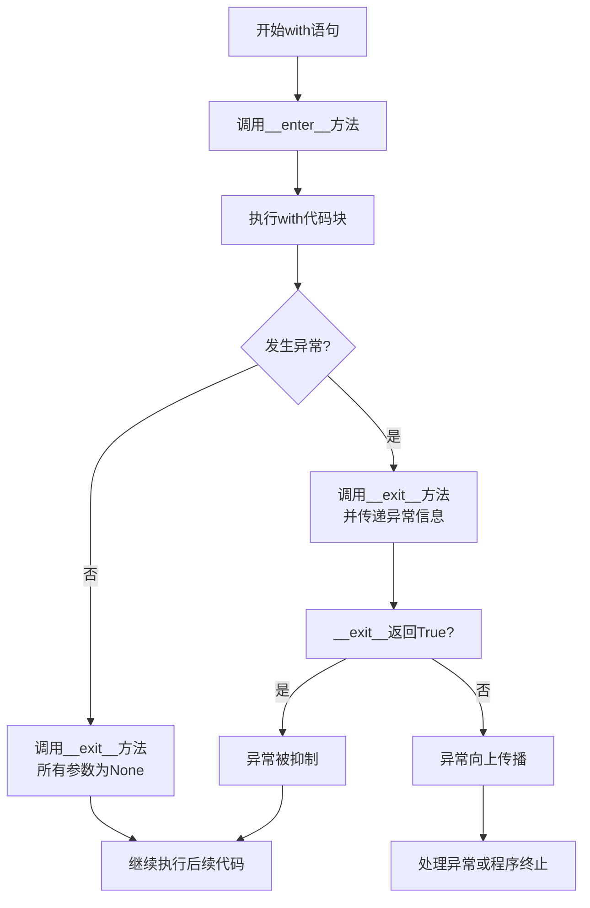

# Python 上下文管理器

## 什么是上下文管理器？

上下文管理器是Python中一个非常实用的特性，它允许你在进入和退出一段代码块时执行特定的操作。最常见的用例是资源管理：当你需要获取某个资源，使用它，然后确保它被正确释放，无论代码执行过程中是否发生异常。

你可能已经使用过上下文管理器，即使你不知道它的名称。每当你使用 `with` 语句操作文件时，就是在使用上下文管理器：

```python
with open('file.txt', 'r') as file:
    content = file.read()
    # 文件会在这个代码块结束时自动关闭
```

## 上下文管理器的工作原理

上下文管理器的核心是实现了两个特殊方法：`__enter__()` 和 `__exit__()`。

1. 当执行 `with` 语句时，Python调用上下文管理器对象的 `__enter__()` 方法
2. `__enter__()` 方法的返回值被赋给 `as` 子句中指定的变量
3. 执行 `with` 代码块中的代码
4. 无论代码块正常结束还是因异常而终止，都会调用 `__exit__()` 方法

`__exit__()` 方法接收三个参数：异常类型、异常值和异常追踪信息。如果代码块正常执行（无异常），这三个参数都为 `None`。



## 内置的上下文管理器

Python标准库中包含许多内置的上下文管理器：

### 文件操作

```python
with open('example.txt', 'w') as f:
    f.write('Hello, World!')
# 文件已自动关闭
```

### 锁机制（threading模块）

```python
import threading

lock = threading.Lock()

with lock:
    # 这里的代码是线程安全的
    # 离开with块时锁会自动释放
```

### 网络连接

```python
from urllib.request import urlopen

with urlopen('https://python.org') as response:
    html = response.read()
    # 连接会在这个代码块结束时自动关闭
```

## 使用contextlib创建上下文管理器

Python的 `contextlib` 模块提供了一些工具，可以更简单地实现上下文管理器。

### @contextmanager装饰器

使用 `@contextmanager` 装饰器，你可以创建一个基于生成器的上下文管理器：

```python
from contextlib import contextmanager

@contextmanager
def my_context():
    print("进入上下文")
    try:
        yield "上下文值"  # 这个值会被赋给as后面的变量
        print("正常退出上下文")
    except Exception as e:
        print(f"异常退出上下文: {e}")
        raise  # 重新抛出异常

# 使用自定义上下文管理器
with my_context() as value:
    print(f"在上下文中, 值为: {value}")
    # 正常情况
```

输出：
```
进入上下文
在上下文中, 值为: 上下文值
正常退出上下文
```

如果发生异常：

```python
with my_context() as value:
    print(f"在上下文中, 值为: {value}")
    raise ValueError("发生了错误")
```

输出：
```
进入上下文
在上下文中, 值为: 上下文值
异常退出上下文: 发生了错误
Traceback (most recent call last):
  ...
ValueError: 发生了错误
```

### 创建自定义上下文管理器类

你也可以通过实现 `__enter__` 和 `__exit__` 方法来创建自己的上下文管理器类：

```python
class MyContextManager:
    def __init__(self, name):
        self.name = name
    
    def __enter__(self):
        print(f"{self.name} 上下文开始")
        return self  # 返回值将被赋给as后面的变量
    
    def __exit__(self, exc_type, exc_val, exc_tb):
        if exc_type:
            print(f"{self.name} 上下文异常退出: {exc_val}")
            # 返回True表示异常已处理，不再向上传播
            return True
        print(f"{self.name} 上下文正常结束")
        return False  # 允许异常传播

# 使用自定义上下文管理器
with MyContextManager("测试") as ctx:
    print(f"在{ctx.name}上下文中执行")
    # 正常执行
```

输出：
```
测试 上下文开始
在测试上下文中执行
测试 上下文正常结束
```

### 嵌套上下文管理器

上下文管理器可以嵌套使用：

```python
with open('input.txt', 'r') as infile, open('output.txt', 'w') as outfile:
    for line in infile:
        outfile.write(line.upper())
```

## 实际应用案例

### 案例1: 计时器上下文管理器

创建一个上下文管理器来测量代码块执行时间：

```python
import time
from contextlib import contextmanager

@contextmanager
def timer(name):
    start_time = time.time()
    try:
        yield
    finally:
        elapsed = time.time() - start_time
        print(f"{name} 用时: {elapsed:.4f} 秒")

# 使用计时器
with timer("排序操作"):
    # 假设这里有一个耗时操作
    sorted_list = sorted([5, 2, 8, 1, 9, 3] * 100000)
```

输出可能是：
```
排序操作 用时: 0.1234 秒
```

### 案例2: 数据库连接管理

一个管理数据库连接的上下文管理器：

```python
import sqlite3
from contextlib import contextmanager

@contextmanager
def db_connection(db_name):
    conn = sqlite3.connect(db_name)
    try:
        yield conn
    finally:
        conn.close()

# 使用数据库连接
with db_connection("example.db") as conn:
    cursor = conn.cursor()
    cursor.execute("SELECT * FROM users")
    users = cursor.fetchall()
    print(f"找到 {len(users)} 个用户")
```

### 案例3: 临时更改工作目录

一个临时更改工作目录的上下文管理器：

```python
import os
from contextlib import contextmanager

@contextmanager
def change_directory(path):
    original_dir = os.getcwd()
    try:
        os.chdir(path)
        yield
    finally:
        os.chdir(original_dir)

# 临时更改工作目录
with change_directory("/tmp"):
    # 在/tmp目录下执行操作
    print(f"当前工作目录: {os.getcwd()}")
```

输出：
```
当前工作目录: /tmp
```

:::tip 实际应用
上下文管理器在日志记录、事务处理、资源管理等场景中非常有用。例如，你可以创建一个上下文管理器来记录函数的进入和退出、自动开始和提交数据库事务、管理临时目录等。
:::

## 上下文管理器进阶特性

### 处理多个异常类型

你可以在 `__exit__` 方法中处理不同类型的异常：

```python
class MultiExceptionHandler:
    def __enter__(self):
        return self
    
    def __exit__(self, exc_type, exc_val, exc_tb):
        if exc_type is ValueError:
            print("处理值错误")
            return True  # 抑制ValueError异常
        elif exc_type is KeyError:
            print("处理键错误")
            return True  # 抑制KeyError异常
        return False  # 其他异常将传播
```

### 可重入的上下文管理器

有些上下文管理器可以多次进入：

```python
from threading import RLock

lock = RLock()  # 可重入锁

with lock:
    # 获取锁
    with lock:
        # 再次获取同一个锁
        print("嵌套锁获取成功")
```

### contextlib.ExitStack

`ExitStack` 允许你动态组合多个上下文管理器：

```python
from contextlib import ExitStack

with ExitStack() as stack:
    files = [stack.enter_context(open(f'file{i}.txt')) for i in range(3)]
    # 所有文件都将在with块结束时关闭
```

## 总结

上下文管理器是Python中一个强大的特性，它允许你：

1. 自动管理资源的获取和释放
2. 简化异常处理
3. 使代码更加简洁和可读
4. 确保代码块退出时执行必要的清理操作

通过使用内置的上下文管理器或创建自己的上下文管理器，你可以更有效地管理资源并编写更健壮的代码。

## 练习

1. 创建一个简单的上下文管理器，在进入时打印"开始"，在退出时打印"结束"。
2. 创建一个上下文管理器，临时将标准输出重定向到文件。
3. 创建一个上下文管理器，可以在代码块中抑制特定类型的异常。
4. 修改之前的计时器上下文管理器，使其支持嵌套使用并正确显示层级关系。

## 延伸阅读

- Python官方文档：[contextlib模块](https://docs.python.org/3/library/contextlib.html)
- PEP 343：[The "with" Statement](https://www.python.org/dev/peps/pep-0343/)
- 《Fluent Python》，作者Luciano Ramalho，第15章

:::caution 注意
虽然上下文管理器强大，但不要过度使用。只有在需要确保资源正确获取和释放时才使用上下文管理器。对于简单的情况，普通的 try/finally 或函数封装可能更合适。
:::