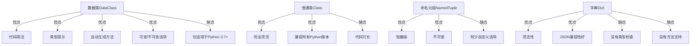

# Python 数据类

## 什么是数据类？

数据类（Data Classes）是Python 3.7引入的一个新特性，它为创建主要用于存储数据的类提供了一种简洁的方式。在开发过程中，我们经常需要创建一些主要目的是存储值的类，这些类通常需要实现特殊方法如`__init__()`、`__repr__()`和`__eq__()`等。数据类通过自动生成这些特殊方法，极大地简化了代码。

:::note
数据类由`dataclasses`模块提供，它是Python 3.7及更高版本的标准库的一部分。
:::

## 为什么需要数据类？

让我们先看一个传统方式定义的类：

```python
class Student:
    def __init__(self, name, age, grade):
        self.name = name
        self.age = age
        self.grade = grade
    
    def __repr__(self):
        return f"Student(name='{self.name}', age={self.age}, grade={self.grade})"
    
    def __eq__(self, other):
        if not isinstance(other, Student):
            return NotImplemented
        return (self.name, self.age, self.grade) == (other.name, other.age, other.grade)
```

现在，让我们看看使用数据类如何实现相同的功能：

```python
from dataclasses import dataclass

@dataclass
class Student:
    name: str
    age: int
    grade: str
```

这两段代码功能相同，但数据类版本更加简洁，并且自动生成了`__init__()`, `__repr__()`, 和 `__eq__()`等方法。

## 数据类的基本用法

### 创建和使用数据类

要创建一个数据类，我们需要导入`dataclass`装饰器，并将其应用于类定义：

```python
from dataclasses import dataclass

@dataclass
class Point:
    x: int
    y: int
```

现在我们可以创建和使用这个类的实例：

```python
# 创建点对象
p1 = Point(10, 20)
p2 = Point(10, 20)

# 输出：Point(x=10, y=20)
print(p1)

# 比较两个点
# 输出：True
print(p1 == p2)

# 访问属性
# 输出：10
print(p1.x)
```

### 默认值

数据类支持设置默认值：

```python
from dataclasses import dataclass

@dataclass
class Product:
    name: str
    price: float = 0.0
    quantity: int = 1
```

使用示例：

```python
# 使用默认值
p1 = Product("Laptop")
# 输出：Product(name='Laptop', price=0.0, quantity=1)
print(p1)

# 自定义值
p2 = Product("Phone", 599.99, 2)
# 输出：Product(name='Phone', price=599.99, quantity=2)
print(p2)
```

## 数据类的高级特性

### 不可变数据类

通过设置`frozen=True`，我们可以创建不可变的数据类：

```python
from dataclasses import dataclass

@dataclass(frozen=True)
class ImmutablePoint:
    x: int
    y: int
```

示例：

```python
p = ImmutablePoint(5, 10)
# 输出：ImmutablePoint(x=5, y=10)
print(p)

try:
    p.x = 20  # 这会引发错误
except Exception as e:
    print(f"错误：{e}")
# 输出类似：错误：dataclasses.FrozenInstanceError: cannot assign to field 'x'
```

### 后初始化处理

使用`__post_init__`方法可以在初始化后执行额外的处理逻辑：

```python
from dataclasses import dataclass

@dataclass
class Rectangle:
    width: float
    height: float
    area: float = 0.0
    
    def __post_init__(self):
        self.area = self.width * self.height
```

示例：

```python
rect = Rectangle(5.0, 3.0)
# 输出：Rectangle(width=5.0, height=3.0, area=15.0)
print(rect)
```

### 字段选项

`dataclasses`模块提供了`field`函数，用于自定义字段行为：

```python
from dataclasses import dataclass, field

@dataclass
class User:
    name: str
    email: str
    # 排除密码字段不在repr中显示
    password: str = field(repr=False)
    # 生成默认ID
    user_id: int = field(default_factory=lambda: id(object()))
    # 不参与比较的字段
    last_login: str = field(default="never", compare=False)
```

示例：

```python
user1 = User("Alice", "alice@example.com", "secret123")
# 输出类似：User(name='Alice', email='alice@example.com', user_id=140371459766656, last_login='never')
# 注意密码不会显示
print(user1)

user2 = User("Alice", "alice@example.com", "different_password")
# last_login字段不参与比较，所以即使值不同也相等
# 输出：True
print(user1 == user2)
```

### 继承

数据类支持继承：

```python
from dataclasses import dataclass

@dataclass
class Person:
    name: str
    age: int

@dataclass
class Employee(Person):
    employee_id: str
    department: str
```

示例：

```python
emp = Employee("John", 30, "E12345", "Engineering")
# 输出：Employee(name='John', age=30, employee_id='E12345', department='Engineering')
print(emp)
```

## 实际应用场景

### 数据验证应用

结合`__post_init__`，我们可以创建包含验证逻辑的数据类：

```python
from dataclasses import dataclass
import re

@dataclass
class EmailContact:
    name: str
    email: str
    
    def __post_init__(self):
        # 验证邮箱格式
        if not re.match(r"[^@]+@[^@]+\.[^@]+", self.email):
            raise ValueError(f"Invalid email address: {self.email}")
```

使用示例：

```python
# 有效邮箱
valid_contact = EmailContact("Alice", "alice@example.com")
print(valid_contact)  # 输出：EmailContact(name='Alice', email='alice@example.com')

try:
    # 无效邮箱
    invalid_contact = EmailContact("Bob", "invalid-email")
except ValueError as e:
    print(e)  # 输出：Invalid email address: invalid-email
```

### 配置管理

数据类可以用于应用程序的配置管理：

```python
from dataclasses import dataclass, field
from typing import List, Dict, Optional

@dataclass
class AppConfig:
    app_name: str
    version: str
    debug_mode: bool = False
    log_level: str = "INFO"
    api_keys: Dict[str, str] = field(default_factory=dict)
    allowed_ips: List[str] = field(default_factory=list)
    max_connections: Optional[int] = None
```

使用示例：

```python
config = AppConfig(
    app_name="MyApp",
    version="1.0.0",
    debug_mode=True,
    api_keys={"google": "abc123", "aws": "xyz789"},
    allowed_ips=["192.168.1.1", "10.0.0.1"],
    max_connections=100
)

print(f"应用名称: {config.app_name}")
print(f"调试模式: {'开启' if config.debug_mode else '关闭'}")
print(f"API密钥数量: {len(config.api_keys)}")
```

### 数据处理流水线

数据类可以用于构建数据处理流水线：

```python
from dataclasses import dataclass
from typing import List, Optional
import statistics

@dataclass
class DataPoint:
    values: List[float]
    label: Optional[str] = None
    
    @property
    def mean(self) -> float:
        return statistics.mean(self.values)
    
    @property
    def median(self) -> float:
        return statistics.median(self.values)
    
    @property
    def std_dev(self) -> float:
        return statistics.stdev(self.values) if len(self.values) > 1 else 0.0
```

使用示例：

```python
temperature_data = DataPoint([22.5, 23.1, 23.8, 22.9, 24.0], "温度")
print(f"{temperature_data.label} 均值: {temperature_data.mean:.2f}°C")
print(f"{temperature_data.label} 中位数: {temperature_data.median:.2f}°C")
print(f"{temperature_data.label} 标准差: {temperature_data.std_dev:.2f}")
```

## 数据类与其他类型的比较

数据类与普通类、命名元组和字典的比较：



## 总结

Python数据类是一个强大的特性，它通过自动生成特殊方法大大简化了创建数据容器类的过程。数据类的优势在于：

1. **代码简洁**：减少样板代码，使类定义更加清晰
2. **内置功能**：自动生成`__init__`, `__repr__`, `__eq__`等方法
3. **类型提示**：支持类型注解，增强代码可读性和IDE支持
4. **可定制性**：提供丰富的选项，如不可变实例、自定义比较行为等

数据类适用于许多场景，包括配置管理、数据验证、API响应处理等，是Python开发中一个不可或缺的工具。

## 练习与挑战

1. 创建一个表示图书的数据类，包含标题、作者、出版年份和ISBN字段。
2. 扩展上述数据类，添加一个`__post_init__`方法验证ISBN格式。
3. 创建一个不可变的地址数据类，包含街道、城市、邮编等字段。
4. 实现一个数据类层次结构，表示不同类型的银行账户(如储蓄账户、支票账户)。
5. 设计一个使用数据类的简单购物车系统，包含商品、价格和数量信息。

## 额外资源

- [Python官方文档：dataclasses模块](https://docs.python.org/3/library/dataclasses.html)
- [PEP 557：数据类](https://www.python.org/dev/peps/pep-0557/)
- 《Fluent Python》第二版中关于数据类的章节

:::tip
数据类是Python中处理数据的一个重要工具，但它并非万能的。在某些情况下，如需要高度优化的性能、处理大量数据或者需要与较旧版本的Python兼容，可能需要考虑其他方案。
:::