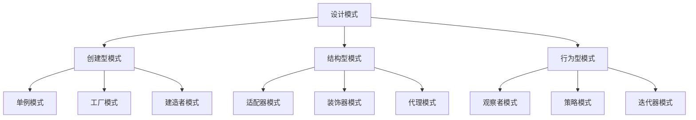

# Python 设计模式

## 什么是设计模式？

设计模式是软件开发过程中常见问题的通用解决方案。它们是经过时间检验的编程模板，可以帮助你编写更加灵活、可维护和可扩展的代码。设计模式不是完整的代码，而是一种解决特定问题的模式，可以适应各种情况。

:::tip
设计模式就像是经验丰富的开发者总结出的"最佳实践"，学习它们可以帮助你避免重复发明轮子，并提高代码质量。
:::

## 为什么要学习设计模式？

- **解决常见问题**：提供经过验证的解决方案
- **提高代码质量**：使代码更易于理解和维护
- **促进团队协作**：提供共同的语言和概念
- **提高开发效率**：减少开发时间和错误
- **增强职业技能**：设计模式是高级开发者必备的知识

## 设计模式的分类

设计模式通常分为三大类：



## 1. 创建型模式

创建型模式关注对象的创建过程，帮助创建对象的同时隐藏创建逻辑。

### 单例模式 (Singleton)

单例模式确保一个类只有一个实例，并提供对该实例的全局访问点。

```python
class Singleton:
    _instance = None
    
    def __new__(cls):
        if cls._instance is None:
            cls._instance = super(Singleton, cls).__new__(cls)
        return cls._instance

# 使用示例
s1 = Singleton()
s2 = Singleton()

print(s1 is s2)  # 输出: True
```

**实际应用场景**：数据库连接、日志记录器、配置管理器。

### 工厂模式 (Factory)

工厂模式提供创建对象的接口，但让子类决定要实例化的类是哪一个。

```python
class Animal:
    def speak(self):
        pass

class Dog(Animal):
    def speak(self):
        return "Woof!"

class Cat(Animal):
    def speak(self):
        return "Meow!"

class AnimalFactory:
    def create_animal(self, animal_type):
        if animal_type == "dog":
            return Dog()
        elif animal_type == "cat":
            return Cat()
        else:
            raise ValueError(f"Unknown animal type: {animal_type}")

# 使用示例
factory = AnimalFactory()
dog = factory.create_animal("dog")
cat = factory.create_animal("cat")

print(dog.speak())  # 输出: Woof!
print(cat.speak())  # 输出: Meow!
```

**实际应用场景**：UI组件创建、不同数据库连接器的实例化。

## 2. 结构型模式

结构型模式关注类和对象的组合，形成更大的结构，同时保持结构的灵活和高效。

### 装饰器模式 (Decorator)

装饰器模式允许向一个现有的对象添加新的功能，同时不改变其结构。

```python
class Coffee:
    def cost(self):
        return 5

class MilkDecorator:
    def __init__(self, coffee):
        self._coffee = coffee
    
    def cost(self):
        return self._coffee.cost() + 2

class SugarDecorator:
    def __init__(self, coffee):
        self._coffee = coffee
    
    def cost(self):
        return self._coffee.cost() + 1

# 使用示例
coffee = Coffee()
coffee_with_milk = MilkDecorator(coffee)
coffee_with_milk_and_sugar = SugarDecorator(coffee_with_milk)

print(f"普通咖啡: ${coffee.cost()}")  # 输出: 普通咖啡: $5
print(f"加奶咖啡: ${coffee_with_milk.cost()}")  # 输出: 加奶咖啡: $7
print(f"加奶加糖咖啡: ${coffee_with_milk_and_sugar.cost()}")  # 输出: 加奶加糖咖啡: $8
```

:::note
Python中的装饰器语法(@decorator)实际上是这种设计模式的一种实现。
:::

**实际应用场景**：权限检查、日志记录、性能监控。

### 适配器模式 (Adapter)

适配器模式作为两个不兼容的接口之间的桥梁，使它们能够一起工作。

```python
class OldSystem:
    def old_operation(self):
        return "旧系统的操作结果"

class NewSystem:
    def new_operation(self):
        return "新系统的操作结果"

class SystemAdapter:
    def __init__(self, new_system):
        self.new_system = new_system
    
    def old_operation(self):
        # 将新接口转换为旧接口
        result = self.new_system.new_operation()
        return f"适配后的结果: {result}"

# 使用示例
old_system = OldSystem()
new_system = NewSystem()
adapter = SystemAdapter(new_system)

# 兼容旧代码
print(old_system.old_operation())  # 输出: 旧系统的操作结果
print(adapter.old_operation())     # 输出: 适配后的结果: 新系统的操作结果
```

**实际应用场景**：第三方库接口适配、旧系统集成。

## 3. 行为型模式

行为型模式关注对象之间的通信和职责分配。

### 观察者模式 (Observer)

观察者模式定义了对象之间一对多的依赖关系，当一个对象状态改变时，所有依赖它的对象都会收到通知。

```python
class Subject:
    def __init__(self):
        self._observers = []
    
    def attach(self, observer):
        if observer not in self._observers:
            self._observers.append(observer)
    
    def detach(self, observer):
        try:
            self._observers.remove(observer)
        except ValueError:
            pass
    
    def notify(self, message):
        for observer in self._observers:
            observer.update(message)

class Observer:
    def __init__(self, name):
        self.name = name
    
    def update(self, message):
        print(f"{self.name} 收到消息: {message}")

# 使用示例
subject = Subject()

observer1 = Observer("观察者1")
observer2 = Observer("观察者2")

subject.attach(observer1)
subject.attach(observer2)

subject.notify("大家好!")  # 输出:
# 观察者1 收到消息: 大家好!
# 观察者2 收到消息: 大家好!

subject.detach(observer1)
subject.notify("只有观察者2能看到这条消息")  # 输出:
# 观察者2 收到消息: 只有观察者2能看到这条消息
```

**实际应用场景**：事件处理系统、用户界面更新、发布-订阅模式。

### 策略模式 (Strategy)

策略模式定义了算法族，分别封装起来，让它们之间可以互相替换，此模式让算法的变化独立于使用算法的客户。

```python
class PaymentStrategy:
    def pay(self, amount):
        pass

class CreditCardPayment(PaymentStrategy):
    def __init__(self, card_number, expiry_date):
        self.card_number = card_number
        self.expiry_date = expiry_date
    
    def pay(self, amount):
        return f"使用信用卡 {self.card_number} 支付了 ${amount}"

class PayPalPayment(PaymentStrategy):
    def __init__(self, email):
        self.email = email
    
    def pay(self, amount):
        return f"使用PayPal账户 {self.email} 支付了 ${amount}"

class ShoppingCart:
    def __init__(self):
        self.items = []
        self.payment_strategy = None
    
    def add_item(self, item, price):
        self.items.append((item, price))
    
    def set_payment_strategy(self, payment_strategy):
        self.payment_strategy = payment_strategy
    
    def checkout(self):
        total = sum(price for _, price in self.items)
        if self.payment_strategy is None:
            raise Exception("请先设置支付方式")
        return self.payment_strategy.pay(total)

# 使用示例
cart = ShoppingCart()
cart.add_item("书", 50)
cart.add_item("笔", 5)

# 选择信用卡支付
cart.set_payment_strategy(CreditCardPayment("1234-5678-9012-3456", "12/24"))
print(cart.checkout())  # 输出: 使用信用卡 1234-5678-9012-3456 支付了 $55

# 改用PayPal支付
cart.set_payment_strategy(PayPalPayment("example@example.com"))
print(cart.checkout())  # 输出: 使用PayPal账户 example@example.com 支付了 $55
```

**实际应用场景**：排序算法选择、支付处理、验证策略。

## Python 内置的设计模式

Python语言本身就实现了许多设计模式，使用起来非常简便：

1. **迭代器模式**：Python的`for`循环和生成器
2. **单例模式**：Python的模块导入机制
3. **装饰器模式**：Python的`@decorator`语法
4. **命令模式**：Python的高阶函数和回调
5. **观察者模式**：Python的信号分发库(如Django信号)

## 如何选择合适的设计模式？

选择设计模式时，需要考虑以下几点：

1. **问题的性质**：明确你要解决的是什么问题
2. **模式的适用性**：确认该模式是否适合你的场景
3. **模式的成本**：考虑实现模式所需的复杂性是否值得
4. **团队经验**：团队是否熟悉这个模式

:::caution
不要为了使用设计模式而使用设计模式。过度使用或不适当使用设计模式可能会使代码更加复杂而不是更加简洁。
:::

## 总结

设计模式是软件开发中的重要工具，能帮助我们更优雅地解决常见问题，提高代码质量和可维护性。在Python中，我们可以灵活地应用这些模式，同时利用Python自身的特性简化实现。

理解设计模式不仅仅是记住它们的结构，更重要的是理解每种模式解决的问题类型，以及何时应用它们。随着经验的积累，你将能够更自然地在日常编程中运用这些模式。

## 练习与深入学习

1. 尝试用单例模式实现一个配置管理器
2. 用工厂模式实现不同类型文件的解析器
3. 用观察者模式实现一个简单的事件系统
4. 分析一个开源项目，找出其中使用的设计模式

## 进一步学习资源

- 《设计模式：可复用面向对象软件的基础》(GoF)
- 《Python设计模式》
- 《流畅的Python》中有关Python设计模式的章节