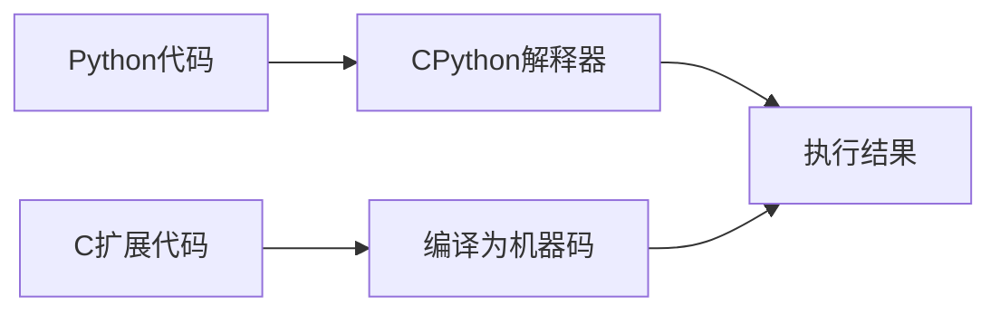

# Python C扩展

Python作为一种高级解释型语言，提供了极佳的开发体验和灵活性。然而，在某些场景下，Python的执行速度可能成为限制因素。这时，Python C扩展便成为了一种强大的解决方案，允许我们将性能关键部分用C语言实现，同时保持Python的易用性。

## 什么是Python C扩展？

Python C扩展是用C语言编写的模块，可以从Python代码中调用。通过C扩展，我们可以：

1. 大幅提高计算密集型任务的执行速度
2. 访问只有C语言接口的系统库或第三方库
3. 实现Python中难以表达的底层操作

:::note
许多流行的Python库，如NumPy、SciPy和Pandas，都在内部使用C扩展来实现高性能计算。
:::

## 为什么需要Python C扩展？

虽然Python是一种强大的编程语言，但由于其解释型和动态特性，在某些场景下可能不如编译型语言高效：



使用C扩展的主要优势包括：

- **性能提升**：C代码直接编译为机器码，通常比Python快10-100倍
- **内存效率**：可以更精确地控制内存分配和释放
- **与现有代码集成**：可以重用现有的C/C++库
- **底层访问**：可以执行Python难以实现的底层系统操作

## 创建简单的C扩展

让我们来创建一个简单的C扩展，实现两个数相加的功能。虽然这个例子非常基础，但它展示了C扩展的基本结构。

### 步骤1：编写C模块

首先，创建一个名为`mathextension.c`的文件：

```c
#define PY_SSIZE_T_CLEAN
#include <Python.h>

// 实现加法函数
static PyObject* math_add(PyObject* self, PyObject* args) {
    int a, b;
    
    // 解析Python传入的参数
    if (!PyArg_ParseTuple(args, "ii", &a, &b)) {
        return NULL;
    }
    
    // 执行加法操作
    return Py_BuildValue("i", a + b);
}

// 模块的方法表
static PyMethodDef MathExtensionMethods[] = {
    {"add", math_add, METH_VARARGS, "Add two integers."},
    {NULL, NULL, 0, NULL}  // 哨兵值，标记方法表结束
};

// 模块定义
static struct PyModuleDef mathextension = {
    PyModuleDef_HEAD_INIT,
    "mathextension",  // 模块名
    "A simple math extension module",  // 模块文档
    -1,  // 模块保持全局状态
    MathExtensionMethods
};

// 初始化函数
PyMODINIT_FUNC PyInit_mathextension(void) {
    return PyModule_Create(&mathextension);
}
```

### 步骤2：创建setup.py

接下来，创建`setup.py`文件，用于构建扩展：

```python
from setuptools import setup, Extension

module = Extension('mathextension',
                  sources=['mathextension.c'])

setup(name='MathExtension',
      version='1.0',
      description='Simple math extension module',
      ext_modules=[module])
```

### 步骤3：编译扩展

在终端中执行以下命令编译扩展：

```bash
python setup.py build_ext --inplace
```

这将生成一个扩展模块文件（在Windows上是`.pyd`，在Unix系统上是`.so`）。

### 步骤4：使用扩展

现在我们可以在Python代码中导入并使用这个扩展：

```python
import mathextension

result = mathextension.add(5, 3)
print(f"5 + 3 = {result}")
```

输出：
```
5 + 3 = 8
```

## Python C API基础

编写C扩展需要理解Python C API的基本概念：

### PyObject

在Python C API中，所有Python对象都由`PyObject`表示。无论是整数、字符串还是自定义类实例，在C层面都是`PyObject`指针。

### 引用计数

Python使用引用计数进行内存管理。在C扩展中，我们需要正确管理对象的引用计数：

- `Py_INCREF(obj)` - 增加引用计数
- `Py_DECREF(obj)` - 减少引用计数

:::caution
错误的引用计数管理可能导致内存泄漏或程序崩溃！
:::

### 参数解析

`PyArg_ParseTuple`函数用于从Python函数参数解析C值。常见的格式说明符包括：

- `i` - 整数
- `f` - 浮点数
- `s` - 字符串
- `O` - Python对象

### 构建返回值

`Py_BuildValue`函数用于将C值转换为Python对象。

## 实用案例：高性能数组处理

让我们创建一个更实用的C扩展，实现数组元素求和：

```c
#define PY_SSIZE_T_CLEAN
#include <Python.h>

static PyObject* array_sum(PyObject* self, PyObject* args) {
    PyObject* list;
    PyObject* item;
    long sum = 0;
    Py_ssize_t size, i;
    
    // 解析参数，期望一个列表对象
    if (!PyArg_ParseTuple(args, "O!", &PyList_Type, &list)) {
        return NULL;
    }
    
    // 获取列表大小
    size = PyList_Size(list);
    
    // 遍历列表并求和
    for (i = 0; i < size; i++) {
        item = PyList_GetItem(list, i);
        if (!PyLong_Check(item)) {
            PyErr_SetString(PyExc_TypeError, "list items must be integers");
            return NULL;
        }
        sum += PyLong_AsLong(item);
    }
    
    // 返回求和结果
    return PyLong_FromLong(sum);
}

static PyMethodDef ArrayMethods[] = {
    {"sum", array_sum, METH_VARARGS, "Sum all elements in a list."},
    {NULL, NULL, 0, NULL}
};

static struct PyModuleDef arraymodule = {
    PyModuleDef_HEAD_INIT,
    "arrayext",
    "Array processing extension",
    -1,
    ArrayMethods
};

PyMODINIT_FUNC PyInit_arrayext(void) {
    return PyModule_Create(&arraymodule);
}
```

对应的`setup.py`:

```python
from setuptools import setup, Extension

module = Extension('arrayext',
                  sources=['arrayext.c'])

setup(name='ArrayExtension',
      version='1.0',
      description='Array processing extension',
      ext_modules=[module])
```

编译后，我们可以对比Python原生实现和C扩展的性能差异：

```python
import arrayext
import time

# 创建一个大数组
data = list(range(10000000))

# 测试Python原生sum
start = time.time()
result1 = sum(data)
python_time = time.time() - start
print(f"Python sum: {result1}, 耗时: {python_time:.6f}秒")

# 测试C扩展sum
start = time.time()
result2 = arrayext.sum(data)
c_time = time.time() - start
print(f"C扩展 sum: {result2}, 耗时: {c_time:.6f}秒")

print(f"性能提升: {python_time/c_time:.2f}倍")
```

输出示例：
```
Python sum: 49999995000000, 耗时: 0.325631秒
C扩展 sum: 49999995000000, 耗时: 0.078452秒
性能提升: 4.15倍
```

## 利用Cython简化C扩展开发

虽然直接使用Python C API功能强大，但编写过程较为复杂。Cython是一个简化C扩展开发的工具，它允许我们编写类似Python的代码，然后将其转换为C代码。

### 使用Cython实现上述求和函数

创建一个名为`array_sum.pyx`的Cython文件：

```python
def sum_array(list numbers):
    cdef long total = 0
    cdef int i
    cdef int size = len(numbers)
    
    for i in range(size):
        total += numbers[i]
    
    return total
```

创建`setup.py`：

```python
from setuptools import setup
from Cython.Build import cythonize

setup(
    name='CythonArraySum',
    ext_modules=cythonize("array_sum.pyx")
)
```

编译和使用方法与前面类似：

```bash
python setup.py build_ext --inplace
```

```python
import array_sum

result = array_sum.sum_array([1, 2, 3, 4, 5])
print(f"Sum: {result}")
```

## 在实际项目中使用C扩展

C扩展在许多流行的Python库中广泛应用，以下是一些实际应用场景：

1. **数据科学和机器学习**：NumPy、SciPy和TensorFlow等库都大量使用C扩展来实现高性能数组操作和计算。

2. **图像处理**：Pillow库使用C扩展来实现快速图像处理。

3. **数据库接口**：许多数据库驱动程序如psycopg2（PostgreSQL）使用C扩展来高效处理数据交换。

4. **网络和系统编程**：需要低级系统访问的库如socket、ssl模块都依赖C扩展。

5. **游戏开发**：PyGame等游戏库使用C扩展实现高性能渲染和物理计算。

## 最佳实践与注意事项

在开发Python C扩展时，请牢记以下几点：

1. **谨慎管理内存**：正确使用引用计数，避免内存泄漏。

2. **处理异常**：在C代码中适当设置Python异常，并在出错时返回NULL。

3. **线程安全**：注意全局解释器锁(GIL)的影响，必要时使用`Py_BEGIN_ALLOW_THREADS`和`Py_END_ALLOW_THREADS`。

4. **优先考虑Cython**：对于大多数场景，Cython提供了更简单的开发体验。

5. **适度使用**：只有在性能关键部分才使用C扩展，大部分代码仍应使用Python实现。

:::tip
开始时，考虑使用Numba、PyPy等替代方案提高性能，只有在这些方法不足时才转向C扩展。
:::

## 总结

Python C扩展为我们提供了结合Python的易用性和C的高性能的强大方式。通过将计算密集型任务移至C扩展，我们可以显著提高应用程序的性能，同时保持Python的开发效率。

虽然C扩展的开发需要更多的技术知识和小心处理，但对于性能关键的应用来说，这些额外的工作是值得的。现代工具如Cython也大大简化了这一过程。

## 练习

1. 使用C扩展实现一个计算斐波那契数列的函数，并与纯Python实现比较性能。

2. 尝试用Cython重写上面的斐波那契函数。

3. 创建一个C扩展，实现一个简单的矩阵乘法函数，处理二维整数数组。

## 进一步学习资源

- [Python/C API参考手册](https://docs.python.org/3/c-api/index.html)
- [Cython官方文档](https://cython.readthedocs.io/)
- [Extending and Embedding the Python Interpreter](https://docs.python.org/3/extending/index.html)
- 《Python扩展编程》(Python Extension Programming)，作者：Seppe vanden Broucke

通过本教程，你应该已经了解了Python C扩展的基础知识，能够创建简单的C扩展，并了解如何在实际项目中应用这些技术来提高性能。随着你的深入学习，你将能够开发更复杂、更高效的Python应用程序。