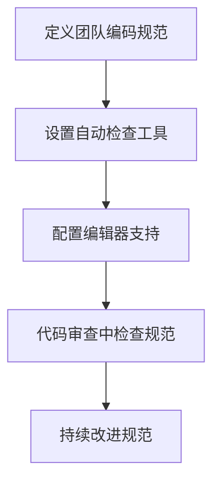

# Python PEP 8规范

## 什么是PEP 8？

PEP 8是Python官方推出的代码风格指南，全称"Python增强提案#8"(Python Enhancement Proposal #8)。它提供了编写Python代码的规范和建议，旨在提高代码的可读性和一致性。掌握并遵循PEP 8是每一个Python开发者的基本功，也是迈向专业编程的重要一步。

:::tip 为什么PEP 8很重要？
"代码被阅读的次数远多于被编写的次数。" —— Guido van Rossum（Python的创始人）
:::

## PEP 8主要规范内容

### 1. 缩进

PEP 8建议使用4个空格作为缩进单位，而不是制表符(Tab)。

```python
# 正确的缩进方式
def function():
    if True:
        print("使用4个空格缩进")
```

```python
# 不推荐的缩进方式
def function():
  if True:
    print("使用2个空格缩进")  # 不符合PEP 8
```

### 2. 行长度

每行代码的最大长度不应超过79个字符。对于注释和文档字符串(docstring)，最大长度不应超过72个字符。

```python
# 行太长时的处理方式
long_variable = very_long_function_name(parameter1, parameter2,
                                        parameter3, parameter4)
```

### 3. 空行使用

- 顶级函数和类定义之间用两个空行分隔
- 类内的方法定义之间用一个空行分隔
- 可以使用额外的空行分隔相关功能的代码块

```python
def top_function1():
    pass


def top_function2():
    pass


class MyClass:
    def method1(self):
        pass
    
    def method2(self):
        pass
```

### 4. 导入规范

导入应该分组放置，按照标准库、相关第三方库和本地应用/库的顺序，每组之间用一个空行分隔。

```python
# 标准库导入
import os
import sys

# 第三方库导入
import numpy as np
import pandas as pd

# 本地应用/库导入
from myproject.models import User
from myproject.utils import helpers
```

### 5. 命名规范

PEP 8提供了详细的命名约定，帮助代码更具可读性：

| 类型 | 命名规范 | 示例 |
|-----|----------|------|
| 模块/包 | 小写，可使用下划线 | `my_module.py` |
| 类 | 驼峰命名法(CamelCase) | `MyClass` |
| 函数/方法 | 小写，用下划线分隔 | `my_function()` |
| 变量 | 小写，用下划线分隔 | `my_variable` |
| 常量 | 全大写，用下划线分隔 | `MAX_OVERFLOW` |

### 6. 空格使用规则

```python
# 正确的空格使用
spam(ham[1], {eggs: 2})

# 函数参数赋值周围不加空格
def complex(real, imag=0.0):
    return magic(r=real, i=imag)

# 操作符两侧使用一个空格
x = 1 + 2

# 不同优先级的操作符可以使用额外空格增强可读性
x = x*2 - 1
```

### 7. 注释

代码注释应该完整的句子，首字母大写。如果注释很短，可以省略末尾的句号。

```python
# 这是一个注释示例
x = x + 1  # 增加计数器
```

## 实际应用示例

让我们通过一个实际例子来展示如何应用PEP 8规范：

### 不符合PEP 8的代码

```python
# 这个例子演示了不良的编码风格
def calculateArea( width,height ):
    AREA=width*height
    return AREA

def PRINT_AREA(a):
  print( "The area is "+str(a) )

w=5
h=3
area=calculateArea(w,h)
PRINT_AREA(area)
```

### 符合PEP 8的代码

```python
# 这个例子演示了良好的编码风格
def calculate_area(width, height):
    """
    计算矩形面积
    
    参数:
        width (float): 矩形宽度
        height (float): 矩形高度
    
    返回:
        float: 计算得到的面积
    """
    area = width * height
    return area


def print_area(area):
    """打印计算得到的面积"""
    print(f"The area is {area}")


WIDTH = 5
HEIGHT = 3
rectangle_area = calculate_area(WIDTH, HEIGHT)
print_area(rectangle_area)
```

## 如何检查和强制执行PEP 8

有多种工具可以帮助你检查和强制执行PEP 8规范：

1. **pycodestyle** (以前叫pep8)：检查代码是否符合PEP 8。
2. **autopep8**：自动格式化代码以符合PEP 8。
3. **black**：一个更严格的代码格式化工具。
4. **flake8**：结合pycodestyle和其他工具的功能。

使用示例：

```bash
# 安装工具
pip install pycodestyle autopep8 black flake8

# 检查代码
pycodestyle my_script.py

# 自动格式化代码
autopep8 --in-place my_script.py

# 使用Black格式化
black my_script.py

# 使用flake8检查更多问题
flake8 my_script.py
```

:::caution 注意
并非所有PEP 8规则都是绝对的。有时，为了提高代码的可读性，可以适当偏离这些规则。记住，规则的存在是为了服务于代码质量，而非相反。
:::

## PEP 8规范的例外情况

虽然PEP 8很重要，但有些情况下可以适当放宽规则：

1. **保持向后兼容性**：如果修改代码风格会破坏API，优先考虑兼容性
2. **遵循现有项目风格**：如果你在为一个已有的项目贡献代码，遵循该项目已经建立的编码风格
3. **特定上下文需求**：某些特定的代码可能有其特殊的格式要求

## 在团队中实施PEP 8

在团队开发中实施PEP 8，可以考虑以下步骤：



具体实施方法：

1. **设置pre-commit hooks**：在提交代码前自动检查
2. **集成到CI/CD**：在持续集成中加入规范检查
3. **编码规范文档**：创建团队专属的编码规范文档

## 总结

遵循PEP 8规范有助于提高代码的可读性和可维护性，使你的代码更加"Pythonic"。作为Python开发者，熟悉并遵循这些规范是基本功。记住，代码是写给人看的，只是顺便能被机器执行。

关键点回顾：
- 使用4个空格进行缩进
- 每行限制在79个字符以内
- 合理使用空行组织代码结构
- 按照规定顺序和分组导入模块
- 遵循命名约定
- 注释应该是完整的句子

## 练习

1. 找出一段不符合PEP 8规范的代码，并将其重构为符合规范的代码
2. 尝试使用pycodestyle或flake8检查你的一个Python项目
3. 配置你的代码编辑器，使其能够自动提示PEP 8规范问题

## 延伸阅读

- [PEP 8官方文档](https://www.python.org/dev/peps/pep-0008/)
- [Python编程风格指南](https://docs.python-guide.org/writing/style/)
- [Google Python风格指南](https://google.github.io/styleguide/pyguide.html)

:::note
记住，代码风格是开发者之间的一种约定，旨在提高代码质量和团队协作效率。养成良好的编码习惯将使你终身受益！
:::