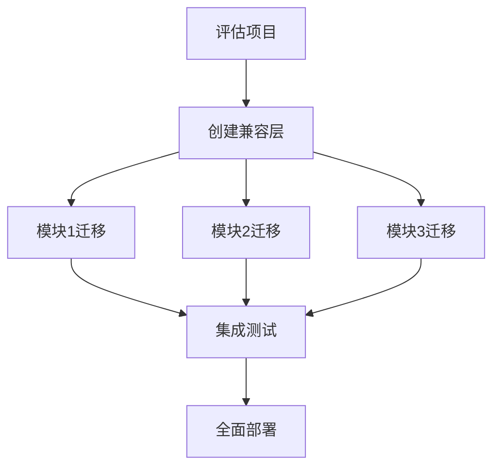

# Python 版本迁移

## 为什么要考虑版本迁移?

随着Python语言的不断发展，新版本引入了更多的功能、性能改进以及安全修复。当前，Python 2已经在2020年1月1日正式停止支持，而Python 3也在不断推出新的版本。版本迁移是每个Python开发者迟早都会面临的技术挑战。

:::note
截至本文撰写时，Python最新的稳定版本是Python 3.11，而Python 2已经不再获得官方支持和安全更新。
:::

## Python 2 vs Python 3：主要区别

在讨论版本迁移前，让我们先了解Python 2和Python 3之间的一些关键区别：

1. **打印函数**：在Python 2中，`print`是一个语句；在Python 3中，它是一个函数。

   ```python
   # Python 2
   print "Hello, World!"
   
   # Python 3
   print("Hello, World!")
   ```

2. **整数除法**：在Python 2中，整数相除会截断结果；在Python 3中，会返回浮点数。

   ```python
   # Python 2
   >>> 5 / 2
   2
   
   # Python 3
   >>> 5 / 2
   2.5
   ```

3. **字符串处理**：Python 3中的字符串默认是Unicode，而Python 2中默认是ASCII。

4. **异常处理**：Python 3改变了异常处理的语法。

   ```python
   # Python 2
   try:
       do_something()
   except Exception, e:
       print e
   
   # Python 3
   try:
       do_something()
   except Exception as e:
       print(e)
   ```

5. **range函数**：在Python 2中，`range()`会创建一个列表；在Python 3中，它返回一个迭代器。

## 版本迁移的步骤

### 1. 评估项目依赖

首先，需要确定项目所依赖的所有库和框架是否支持你要迁移的目标Python版本。

```python
# 生成当前项目依赖
pip freeze > requirements.txt
```

然后，研究每个依赖的兼容性，看是否有更新的版本支持新的Python版本。

### 2. 使用兼容性工具

Python提供了一些工具来帮助迁移：

#### 2.1 2to3工具

`2to3`是Python自带的一个脚本，能够自动将Python 2代码转换为Python 3代码：

```bash
# 在当前目录下转换所有Python文件
2to3 .

# 转换特定文件
2to3 -w my_script.py
```

在上面的命令中，`-w`选项代表直接将修改写入原文件。

#### 2.2 six库

`six`是一个兼容性库，可以帮助编写同时兼容Python 2和Python 3的代码：

```python
import six

# 使用six处理字符串兼容性
text = six.u("Hello, World!")

# 处理迭代器兼容性
for key in six.iterkeys(my_dict):
    print(key)
```

### 3. 测试、测试、再测试

迁移过程中，编写全面的测试至关重要。确保为你的代码编写单元测试，以便在迁移过程中捕获任何兼容性问题。

```python
import unittest

class MyTestCase(unittest.TestCase):
    def test_feature_x(self):
        # 测试代码
        result = feature_x()
        self.assertEqual(result, expected_value)

if __name__ == "__main__":
    unittest.main()
```

### 4. 逐步迁移

对于大型项目，一次性迁移可能风险太大。考虑采用逐步迁移的策略：



## 常见迁移问题及解决方案

### 1. 字符串与字节

在Python 3中，字符串和字节是不同的类型，这常常导致迁移问题。

```python
# Python 2
s = "hello"  # 这是字节字符串

# Python 3
s = "hello"  # 这是Unicode字符串
b = b"hello"  # 这是字节字符串

# 兼容写法
from future.builtins import str
s = str("hello")  # 在两个版本中都是文本字符串
```

### 2. 模块重命名

Python 3中，许多模块被重命名或重组。

```python
# Python 2
import Queue
import urllib2

# Python 3
import queue
import urllib.request

# 兼容写法（使用six）
import six
if six.PY2:
    import Queue as queue
    import urllib2
else:
    import queue
    import urllib.request as urllib2
```

### 3. 内置函数变化

一些内置函数的行为发生了变化。

```python
# Python 2
items = my_dict.items()  # 返回列表
xrange(10)  # 返回迭代器

# Python 3
items = my_dict.items()  # 返回视图对象
range(10)  # xrange已被移除，range现在返回迭代器

# 兼容写法
items = list(my_dict.items())  # 两版本中都是列表
from future.builtins import range
```

## 实际案例研究：迁移Web应用

让我们看一个将Flask应用从Python 2.7迁移到Python 3.9的实例。

### 原始代码（Python 2.7）

```python
# app.py
from flask import Flask, request, render_template
import urllib2
import StringIO
import ConfigParser

app = Flask(__name__)

def get_data(url):
    response = urllib2.urlopen(url)
    return response.read()

@app.route("/")
def home():
    config = ConfigParser.ConfigParser()
    config.read("config.ini")
    api_url = config.get("API", "url")
    
    data = get_data(api_url)
    return render_template("home.html", data=data)

if __name__ == "__main__":
    app.run(debug=True)
```

### 迁移后的代码（Python 3.9）

```python
# app.py
from flask import Flask, request, render_template
import urllib.request
import io
import configparser

app = Flask(__name__)

def get_data(url):
    response = urllib.request.urlopen(url)
    return response.read().decode('utf-8')

@app.route("/")
def home():
    config = configparser.ConfigParser()
    config.read("config.ini")
    api_url = config.get("API", "url")
    
    data = get_data(api_url)
    return render_template("home.html", data=data)

if __name__ == "__main__":
    app.run(debug=True)
```

主要变化：
1. `urllib2` → `urllib.request`
2. `StringIO` → `io`
3. `ConfigParser` → `configparser` (小写)
4. 添加了`.decode('utf-8')`，因为在Python 3中，`read()`返回字节而不是字符串

## 跨版本兼容的最佳实践

### 1. 使用未来导入

在Python 2代码中添加这些导入，让代码更接近Python 3的行为：

```python
from __future__ import absolute_import
from __future__ import division
from __future__ import print_function
from __future__ import unicode_literals
```

### 2. 使用类型注解

Python 3.5+引入了类型注解，可以提高代码可读性和工具支持：

```python
def add_numbers(a: int, b: int) -> int:
    return a + b
```

### 3. 使用pathlib代替os.path

Python 3.4+引入了`pathlib`，提供了更面向对象的文件系统路径操作：

```python
# 旧方式
import os
file_path = os.path.join(os.path.dirname(__file__), "data", "config.ini")

# 新方式
from pathlib import Path
file_path = Path(__file__).parent / "data" / "config.ini"
```

### 4. 使用虚拟环境隔离

使用虚拟环境可以为不同的项目创建隔离的Python环境：

```bash
# Python 3.3+
python -m venv my_env

# 激活环境（Windows）
my_env\Scripts\activate

# 激活环境（Unix/macOS）
source my_env/bin/activate
```

## Python 版本迁移管理工具

### 1. pyenv

`pyenv`允许你在同一系统上安装和管理多个Python版本：

```bash
# 安装Python 3.9.6
pyenv install 3.9.6

# 切换全局Python版本
pyenv global 3.9.6

# 为当前目录设置Python版本
pyenv local 3.8.10
```

### 2. tox

`tox`是一个自动化测试工具，可以在多个Python版本上测试你的代码：

```ini
# tox.ini
[tox]
envlist = py27, py36, py39

[testenv]
deps = pytest
commands = pytest
```

## 总结

Python版本迁移是一个挑战，但通过合适的工具和策略，可以变得相对平滑。关键步骤包括：

1. 评估项目和依赖
2. 使用兼容性工具（如2to3、six）
3. 编写全面的测试
4. 采用逐步迁移策略
5. 处理常见的迁移问题

随着Python 2的正式退役，迁移到Python 3已经不再是选择，而是必要。好消息是，Python 3的各个版本之间的迁移通常比从Python 2迁移到Python 3要容易得多。

:::tip
保持代码更新不仅意味着能够使用新特性，还意味着更好的安全性和性能。定期更新Python版本是软件维护的重要部分。
:::

## 练习与资源

### 练习

1. 尝试将一个简单的Python 2脚本转换为Python 3。
2. 创建一个既能在Python 2中运行也能在Python 3中运行的程序。
3. 使用`2to3`工具转换一个小型项目，并记录遇到的问题。

### 进一步学习资源

- [官方Python 2到3迁移指南](https://docs.python.org/3/howto/pyporting.html)
- [six库文档](https://six.readthedocs.io/)
- [future库文档](https://python-future.org/index.html)
- [Python兼容性工具：Modernize](https://python-modernize.readthedocs.io/en/latest/)

掌握Python版本迁移技能，将使你成为更全面、更有价值的Python开发者！