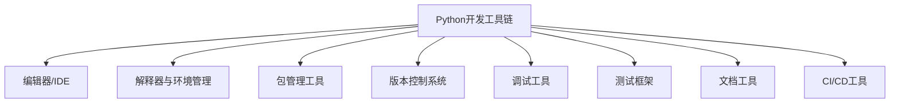

# Python 开发工具链

## 什么是开发工具链？

开发工具链是指在软件开发过程中使用的一系列工具的集合，这些工具协同工作，支持从编写代码到部署应用的整个开发生命周期。对于Python开发者来说，掌握一套高效的工具链可以显著提高开发效率，减少调试时间，并确保代码质量。

:::tip 小贴士
一个好的开发工具链应该像一套精良的厨具：每个工具都有其特定用途，而且彼此配合默契。
:::

## Python 开发工具链的组成部分



### 1. Python解释器与环境管理

#### Python 解释器

Python解释器是运行Python代码的核心组件。最常用的是CPython（官方版本），但还有其他实现如PyPy、Jython等。

```bash
# 检查Python版本
python --version
# 或
python3 --version
```

输出示例：
```
Python 3.9.7
```

#### 虚拟环境

虚拟环境允许你为不同项目创建隔离的Python环境，避免依赖冲突。

##### venv (内置模块)

```bash
# 创建虚拟环境
python -m venv myenv

# 激活虚拟环境(Windows)
myenv\Scripts\activate

# 激活虚拟环境(macOS/Linux)
source myenv/bin/activate

# 退出虚拟环境
deactivate
```

##### Conda

Conda是一个强大的环境和包管理器，特别适合数据科学工作。

```bash
# 创建环境
conda create --name myenv python=3.9

# 激活环境
conda activate myenv

# 退出环境
conda deactivate
```

:::note 为什么使用虚拟环境？
想象一下，如果你同时在开发两个项目：一个需要Django 2.2，另一个需要Django 3.2。如果没有虚拟环境，你将无法在同一台机器上同时满足这两个要求。
:::

### 2. 编辑器/IDE

#### 轻量级编辑器

- **VS Code**：免费、轻量级但功能强大，通过扩展支持Python开发
- **Sublime Text**：速度快，高度可定制
- **Atom**：开源，可通过包扩展功能

#### 集成开发环境(IDE)

- **PyCharm**：专业Python IDE，提供全面的功能（社区版免费）
- **Spyder**：科学计算特别优化的IDE
- **Jupyter Notebook/Lab**：交互式计算环境，特别适合数据分析和教学

:::tip 初学者建议
对初学者而言，VS Code配合Python扩展是一个很好的起点，既易于使用又有强大的功能支持。
:::

### 3. 包管理工具

#### pip

pip是Python的标准包管理器，用于安装和管理Python包。

```bash
# 安装包
pip install package_name

# 安装指定版本
pip install package_name==1.0.4

# 升级包
pip install --upgrade package_name

# 查看已安装的包
pip list

# 生成依赖文件
pip freeze > requirements.txt

# 从依赖文件安装
pip install -r requirements.txt
```

#### pipenv

pipenv结合了pip和virtualenv的功能，为项目创建一个锁定的依赖环境。

```bash
# 安装pipenv
pip install pipenv

# 安装包并自动创建虚拟环境
pipenv install package_name

# 激活虚拟环境
pipenv shell
```

#### Poetry

Poetry是一个现代化的依赖管理和打包工具。

```bash
# 安装Poetry
pip install poetry

# 创建新项目
poetry new project-name

# 添加依赖
poetry add package_name

# 安装所有依赖
poetry install

# 激活虚拟环境
poetry shell
```

### 4. 版本控制系统

Git是目前最流行的版本控制系统，用于跟踪代码更改并促进协作开发。

基本Git命令：

```bash
# 初始化仓库
git init

# 克隆仓库
git clone repository_url

# 添加文件到暂存区
git add filename

# 提交更改
git commit -m "Commit message"

# 推送到远程仓库
git push origin branch_name

# 从远程仓库拉取更新
git pull origin branch_name
```

#### GitHub/GitLab/Bitbucket

这些平台提供Git仓库托管服务，以及许多协作工具如问题跟踪、Pull请求等。

### 5. 代码质量工具

#### Linters

Linters帮助检测代码中的错误、风格问题和潜在的bug。

- **Pylint**：全面的Python代码分析工具
- **Flake8**：结合了PyFlakes、pycodestyle和McCabe复杂性检查的工具
- **Pyright/Mypy**：静态类型检查工具

```bash
# 安装Flake8
pip install flake8

# 运行Flake8
flake8 your_script.py
```

#### 代码格式化工具

- **Black**：无需配置的Python代码格式化工具
- **YAPF**：Google开发的可配置格式化工具
- **isort**：自动排序导入语句的工具

```bash
# 安装Black
pip install black

# 格式化文件
black your_script.py
```

### 6. 测试框架

#### unittest (标准库)

Python内置的测试框架。

```python
import unittest

class TestStringMethods(unittest.TestCase):
    def test_upper(self):
        self.assertEqual('foo'.upper(), 'FOO')
    
    def test_isupper(self):
        self.assertTrue('FOO'.isupper())
        self.assertFalse('Foo'.isupper())

if __name__ == '__main__':
    unittest.main()
```

#### pytest

一个更现代、功能更强大的测试框架。

```python
# test_sample.py
def test_add():
    assert 1 + 1 == 2

def test_str():
    assert 'hello'.upper() == 'HELLO'
```

运行测试：

```bash
pytest test_sample.py
```

### 7. 调试工具

#### pdb (内置)

Python内置的调试器。

```python
def complex_function():
    x = 1
    y = 2
    import pdb; pdb.set_trace()  # 程序会在此处暂停
    z = x / y
    return z
```

常用pdb命令：
- `n`：执行下一行
- `s`：步入函数
- `c`：继续执行
- `p variable`：打印变量值

#### IDE集成调试

大多数IDE如PyCharm和VS Code提供图形化调试界面，支持断点、变量检查等功能。

### 8. 文档工具

#### Docstrings

Python代码文档的标准格式。

```python
def calculate_area(length, width):
    """
    计算矩形面积
    
    Args:
        length (float): 矩形的长
        width (float): 矩形的宽
        
    Returns:
        float: 矩形的面积
    
    Examples:
        >>> calculate_area(5, 3)
        15
    """
    return length * width
```

#### Sphinx

用于生成HTML文档的工具。

```bash
# 安装Sphinx
pip install sphinx

# 创建文档项目
sphinx-quickstart
```

### 9. 持续集成/持续部署(CI/CD)工具

- **GitHub Actions**：直接集成在GitHub中的CI/CD服务
- **Jenkins**：开源自动化服务器
- **Travis CI**：云端CI服务
- **CircleCI**：云端CI/CD平台

GitHub Actions配置示例(.github/workflows/python-app.yml)：

```yaml
name: Python application

on:
  push:
    branches: [ main ]
  pull_request:
    branches: [ main ]

jobs:
  build:
    runs-on: ubuntu-latest
    steps:
    - uses: actions/checkout@v2
    - name: Set up Python
      uses: actions/setup-python@v2
      with:
        python-version: 3.9
    - name: Install dependencies
      run: |
        python -m pip install --upgrade pip
        pip install flake8 pytest
        if [ -f requirements.txt ]; then pip install -r requirements.txt; fi
    - name: Lint with flake8
      run: |
        flake8 . --count --select=E9,F63,F7,F82 --show-source --statistics
    - name: Test with pytest
      run: |
        pytest
```

## 构建个人开发工具链：实际案例

让我们通过一个实际的Web应用开发案例，看看如何整合这些工具：

### 案例：构建一个简单的任务管理应用

1. **环境设置**：
   ```bash
   # 创建虚拟环境
   python -m venv task_app_env
   source task_app_env/bin/activate  # Mac/Linux
   # task_app_env\Scripts\activate  # Windows
   
   # 安装项目依赖
   pip install flask flask-sqlalchemy black pytest
   ```

2. **版本控制设置**：
   ```bash
   git init
   echo "task_app_env/" > .gitignore
   echo "__pycache__/" >> .gitignore
   echo "*.pyc" >> .gitignore
   ```

3. **项目结构**：
   ```
   task_manager/
   ├── app/
   │   ├── __init__.py
   │   ├── models.py
   │   ├── routes.py
   │   └── templates/
   ├── tests/
   │   ├── __init__.py
   │   └── test_app.py
   ├── .gitignore
   ├── requirements.txt
   └── run.py
   ```

4. **开发流程**：
   - 使用VS Code或PyCharm编辑代码
   - 运行`black app/` 格式化代码
   - 使用`git add` 和 `git commit` 提交更改
   - 运行`pytest tests/` 执行测试

5. **CI设置**：
   - 添加GitHub Actions配置文件，在每次推送代码时运行测试和代码检查

通过这个案例，我们可以看到不同工具如何在开发过程中协同工作，从环境设置、编码到测试、版本控制，再到持续集成。

## 为不同类型项目推荐的工具链

### Web开发
- **环境**：venv或Pipenv
- **框架**：Django或Flask
- **IDE**：PyCharm或VS Code
- **测试**：pytest, django-test
- **CI**：GitHub Actions

### 数据科学
- **环境**：Conda
- **工具**：Jupyter Notebooks, Pandas, NumPy, Matplotlib
- **IDE**：Jupyter Lab或VS Code
- **版本控制**：Git + DVC(数据版本控制)
- **文档**：Sphinx + nbsphinx

### 自动化脚本
- **环境**：venv
- **工具**：Click(命令行工具)
- **IDE**：VS Code
- **打包**：PyInstaller
- **文档**：MkDocs

## 总结

完整的Python开发工具链覆盖了从编码到部署的整个开发生命周期。作为初学者，你不需要一次性掌握所有工具，而是可以根据项目需求逐步采用更多工具。建议从以下基础组合开始：

1. Python解释器 + venv虚拟环境
2. VS Code + Python扩展
3. pip包管理
4. Git版本控制
5. pytest进行简单测试

随着你经验的增长，可以逐渐添加更多专业工具，如代码质量工具、CI/CD流程等。记住，工具应该为你服务，而非相反—选择那些能真正提高你生产力的工具，不要仅仅因为它们很流行就采用。

## 进阶学习资源

- [The Hitchhiker's Guide to Python](https://docs.python-guide.org/)
- [Real Python tutorials](https://realpython.com/)
- [Python工匠](http://pythoncraft.com/)
- [Full Stack Python](https://www.fullstackpython.com/)

## 练习

1. 设置一个新的Python虚拟环境并安装三个常用包
2. 为一个小项目创建Git仓库，提交初始代码
3. 编写一个简单的Python函数并为它创建unittest测试
4. 为已有项目添加requirements.txt文件
5. 尝试使用Black格式化你的Python代码，观察变化

通过实践这些工具，你将逐渐建立自己高效的Python开发工作流程！