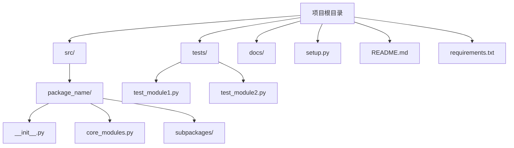

# Python 项目结构

当你刚开始学习Python编程时，可能只关注单个脚本文件的编写。然而，随着你的技能提升和项目规模扩大，良好的项目结构变得至关重要。本文将指导你如何从零开始组织Python项目，采用专业开发者使用的最佳实践。

## 为什么项目结构很重要？

良好的项目结构能带来以下好处：

- **可维护性**：其他人（包括未来的你）能轻松理解和修改代码
- **可扩展性**：添加新功能不会破坏现有功能
- **可测试性**：更容易为代码编写测试
- **可重用性**：代码模块可在其他项目中重复使用

## 从简单到复杂的项目结构

### 级别1：单文件脚本

对于简单的任务，单个`.py`文件完全足够：

```python
# hello_world.py
def greet(name):
    return f"Hello, {name}!"

if __name__ == "__main__":
    print(greet("Python Beginner"))
```

输出：
```
Hello, Python Beginner!
```

:::tip
`if __name__ == "__main__"` 语句确保你的代码在作为主程序运行时才会执行，作为模块导入时则不会执行。这是一个重要的Python惯例。
:::

### 级别2：基本包结构

当你的项目开始增长，将其拆分为多个文件会更有组织性：

```
my_project/
├── main.py
├── helpers.py
└── config.py
```

`main.py`是程序的入口点，`helpers.py`包含辅助函数，`config.py`包含配置信息。

### 级别3：包和模块

对于更大的项目，使用Python的包结构是更好的选择：

```
my_package/
├── __init__.py
├── module1.py
├── module2.py
└── subpackage/
    ├── __init__.py
    └── module3.py
```

`__init__.py`文件（即使为空）告诉Python这是一个包。现在你可以这样导入：

```python
from my_package import module1
from my_package.subpackage import module3
```

### 级别4：标准项目布局

对于专业和开源项目，推荐使用以下结构：

```
project_name/
├── docs/                # 文档
├── src/                 # 源代码
│   └── package_name/
│       ├── __init__.py
│       ├── module1.py
│       └── subpackage/
│           └── __init__.py
├── tests/               # 测试文件
├── README.md            # 项目说明
├── requirements.txt     # 依赖项
├── setup.py             # 安装脚本
└── .gitignore           # Git忽略文件
```

## 实际项目结构案例分析

让我们看一个简单但完整的项目案例——一个天气数据分析工具：

```
weather_analyzer/
├── src/
│   └── weather_analyzer/
│       ├── __init__.py
│       ├── data_fetcher.py      # 获取天气数据的代码
│       ├── data_processor.py    # 处理数据的代码 
│       ├── visualizer.py        # 数据可视化代码
│       └── utils/
│           ├── __init__.py
│           └── helpers.py       # 通用辅助函数
├── tests/
│   ├── test_data_fetcher.py
│   └── test_data_processor.py
├── examples/
│   └── analyze_temperature.py   # 使用示例
├── README.md
├── requirements.txt
└── setup.py
```

### 使用示例

`examples/analyze_temperature.py` 文件可能如下：

```python
from weather_analyzer.data_fetcher import fetch_weather_data
from weather_analyzer.data_processor import calculate_average_temp
from weather_analyzer.visualizer import plot_temperature_trend

# 获取某城市过去7天的天气数据
data = fetch_weather_data("Beijing", days=7)

# 计算平均温度
avg_temp = calculate_average_temp(data)
print(f"过去7天的平均温度是: {avg_temp}°C")

# 绘制温度趋势图
plot_temperature_trend(data)
```

## 从模块到包的进阶

### 创建可导入的包

要创建一个可正常工作的包，你至少需要一个包含 `__init__.py` 文件的目录：

```python
# weather_analyzer/__init__.py
"""天气数据分析包"""

__version__ = '0.1.0'

# 方便用户导入的常用模块
from .data_fetcher import fetch_weather_data
from .data_processor import calculate_average_temp
```

这样，用户可以直接导入：

```python
from weather_analyzer import fetch_weather_data, calculate_average_temp
```

### 绝对导入与相对导入

在包内部，你可以使用绝对导入或相对导入：

```python
# 绝对导入 (推荐)
from weather_analyzer.utils.helpers import format_date

# 相对导入 (在包内部使用)
from ..utils.helpers import format_date
```

:::caution
相对导入只能在包内使用，不能在顶级脚本中使用。在大多数情况下，绝对导入更清晰。
:::

## 项目配置文件

除了Python文件外，一个完整项目通常还包含：

### requirements.txt

列出项目的依赖项：

```
requests>=2.25.1
pandas==1.3.0
matplotlib>=3.4.2
```

### setup.py

让你的包可安装：

```python
from setuptools import setup, find_packages

setup(
    name="weather_analyzer",
    version="0.1.0",
    packages=find_packages(where="src"),
    package_dir={"": "src"},
    install_requires=[
        "requests>=2.25.1",
        "pandas==1.3.0",
        "matplotlib>=3.4.2",
    ],
    author="Your Name",
    author_email="your.email@example.com",
    description="A tool for analyzing weather data",
)
```

### README.md

项目的说明文档：

```markdown
# Weather Analyzer

一个简单的天气数据分析工具。

## 安装方法

```bash
pip install -e .
```

## 使用示例

```python
from weather_analyzer import fetch_weather_data
data = fetch_weather_data("Shanghai", days=5)
```
```

## 项目结构可视化



## 最佳实践总结

1. **从简单开始**：不要过度设计初始结构，随项目增长而调整
2. **遵循Python约定**：使用Snake_case命名文件，使用`__init__.py`定义包
3. **关注点分离**：将不同功能放在不同模块中
4. **避免循环导入**：设计模块时避免互相依赖
5. **合理命名**：名称应该清晰表达模块用途
6. **文档先行**：写好README和文档让他人（包括未来的你）理解项目
7. **包含测试**：为代码编写测试，放在专门的tests目录

## 练习与实践

1. 将现有的单个Python文件拆分成有组织的包结构
2. 创建一个小型项目，采用标准项目布局
3. 尝试编写一个可以通过pip安装的包
4. 为你的项目添加适当的文档和测试

## 进一步学习资源

- [Python Packaging User Guide](https://packaging.python.org/)
- [Hitchhiker's Guide to Python](https://docs.python-guide.org/)
- [Real Python's Python Application Layouts](https://realpython.com/python-application-layouts/)

---

掌握良好的项目结构是从Python初学者成长为专业开发者的重要一步。从简单的脚本开始，随着你的技能和项目复杂度提升，逐步采用更先进的结构模式。记住，好的结构不仅仅是为了当下的开发效率，更是为了长期的可维护性。

祝你在Python项目组织方面取得成功！