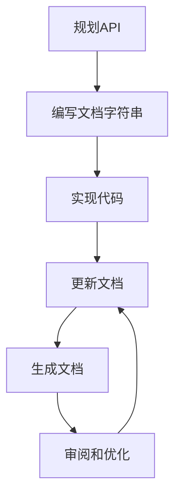

# Python 文档编写

## 什么是Python文档？

Python文档是指解释代码如何工作、如何使用以及为什么以特定方式实现的文字说明。良好的文档不仅对其他开发者有帮助，也会让未来的你感谢现在的自己。本文将介绍如何在Python中编写有效的文档，从简单的注释到详细的模块文档字符串，再到完整的项目文档。

:::tip
优秀的代码可以解释它是如何工作的，但好的文档可以解释为什么要这样做
:::

## Python 文档的三个层次

Python中的文档主要分为三个层次：

1. **代码注释**：解释复杂代码片段的内联注释
2. **文档字符串**：模块、类、函数和方法的详细说明
3. **项目文档**：整个项目的使用指南、架构和设计决策

## 代码注释

代码注释使用井号(`#`)开头，用于解释代码中复杂或不直观的部分。

```python
# 计算身体质量指数(BMI)
height = 1.75  # 身高(米)
weight = 68    # 体重(千克)
bmi = weight / (height ** 2)
```

### 注释的最佳实践：

1. **不要注释显而易见的代码**
   ```python
   # 不好的做法
   x = x + 1  # 将x加1
   
   # 好的做法
   attempts += 1  # 增加尝试次数
   ```

2. **解释为什么，而不仅仅是什么**
   ```python
   # 不好的做法
   time.sleep(300)  # 等待300秒
   
   # 好的做法
   time.sleep(300)  # 等待5分钟以确保API限流重置
   ```

3. **保持注释与代码同步**

:::caution
过时的注释比没有注释更危险，它会误导开发者！
:::

## 文档字符串 (Docstrings)

文档字符串是包含在三重引号(`"""` 或 `'''`)中的多行字符串，用于说明模块、类、函数或方法的用途。它们会被Python的帮助系统访问，可以通过`help()`函数查看。

### 简单文档字符串

```python
def calculate_bmi(height, weight):
    """计算身体质量指数(BMI)。

    将体重(千克)除以身高(米)的平方。
    """
    return weight / (height ** 2)

# 可以通过help()函数查看
# >>> help(calculate_bmi)
```

### Google风格的文档字符串

Google风格的文档字符串是一种流行的格式化风格：

```python
def calculate_bmi(height, weight):
    """计算身体质量指数(BMI)。
    
    Args:
        height (float): 身高，以米为单位
        weight (float): 体重，以千克为单位
        
    Returns:
        float: 身体质量指数
        
    Raises:
        ValueError: 如果身高或体重为非正数
        
    Examples:
        >>> calculate_bmi(1.75, 68)
        22.204081632653061
    """
    if height <= 0 or weight <= 0:
        raise ValueError("身高和体重必须为正数")
    return weight / (height ** 2)
```

### NumPy/SciPy风格的文档字符串

另一种流行的风格是NumPy/SciPy风格：

```python
def calculate_bmi(height, weight):
    """计算身体质量指数(BMI)。
    
    Parameters
    ----------
    height : float
        身高，以米为单位
    weight : float
        体重，以千克为单位
        
    Returns
    -------
    float
        身体质量指数
        
    Raises
    ------
    ValueError
        如果身高或体重为非正数
        
    Examples
    --------
    >>> calculate_bmi(1.75, 68)
    22.204081632653061
    """
    if height <= 0 or weight <= 0:
        raise ValueError("身高和体重必须为正数")
    return weight / (height ** 2)
```

### 类的文档字符串

类的文档字符串应该描述类的行为和属性：

```python
class Person:
    """表示一个带有个人信息的人。
    
    Attributes:
        name (str): 人的名字
        age (int): 人的年龄
        height (float): 人的身高，以米为单位
        weight (float): 人的体重，以千克为单位
    """
    
    def __init__(self, name, age, height, weight):
        """初始化Person实例。
        
        Args:
            name (str): 人的名字
            age (int): 人的年龄
            height (float): 人的身高，以米为单位
            weight (float): 人的体重，以千克为单位
        """
        self.name = name
        self.age = age
        self.height = height
        self.weight = weight
        
    def bmi(self):
        """计算并返回此人的身体质量指数。
        
        Returns:
            float: 身体质量指数
        """
        return self.weight / (self.height ** 2)
```

## 项目文档

对于整个项目，一个好的文档结构通常包括：

1. **README.md** - 项目概述和快速入门指南
2. **CONTRIBUTING.md** - 如何为项目做贡献
3. **CHANGELOG.md** - 版本历史和变更记录
4. **docs/** - 详细的文档目录

### README.md 示例框架

```markdown
# 项目名称

简短的项目描述

## 功能

- 功能点1
- 功能点2
- 功能点3

## 安装

```bash
pip install 项目名称
```

## 快速开始

```python
import project_name

# 简单示例
result = project_name.do_something()
print(result)
```


## 许可证

此项目采用 XXX 许可证 - 详情请参阅 LICENSE 文件
```

## 文档自动生成工具

Python生态系统中有几个工具可以从文档字符串自动生成文档：

1. **Sphinx** - 最流行的Python文档生成工具
2. **pdoc** - 简单的API文档生成器
3. **MkDocs** - 使用Markdown创建项目文档的工具
4. **pydoc** - Python自带的文档生成模块

### 使用Sphinx生成文档

Sphinx是一个强大的文档生成工具，使用简单的目录结构和配置文件：

```bash
# 安装Sphinx
pip install sphinx

# 创建文档目录
mkdir docs
cd docs

# 初始化Sphinx
sphinx-quickstart
```

## 实际案例：文档驱动开发

让我们看一个实际应用场景，采用"文档驱动开发"方法开发一个简单的计算器模块：

```python
"""
calculator.py - 一个简单的计算器模块

这个模块提供基本的数学运算函数，包括加法、减法、乘法和除法。
每个函数都有适当的输入验证和错误处理。
"""

def add(a, b):
    """将两个数字相加。
    
    Args:
        a (int or float): 第一个数字
        b (int or float): 第二个数字
        
    Returns:
        int or float: 两个数字的和
        
    Examples:
        >>> add(1, 2)
        3
        >>> add(-1, 1)
        0
    """
    return a + b

def divide(a, b):
    """将第一个数字除以第二个数字。
    
    Args:
        a (int or float): 被除数
        b (int or float): 除数，不能为零
        
    Returns:
        float: 除法的结果
        
    Raises:
        ZeroDivisionError: 如果除数为零
        
    Examples:
        >>> divide(10, 2)
        5.0
        >>> divide(1, 4)
        0.25
    """
    if b == 0:
        raise ZeroDivisionError("除数不能为零")
    return a / b
```

在这个案例中，我们先编写了详细的文档字符串，包括函数的用途、参数、返回值、可能的异常和使用示例。这个过程帮助我们在编写代码前更清晰地思考函数的行为和边界情况。

## 文档编写流程

良好的文档编写流程可以分为以下几步：



## 总结

良好的文档是优质Python代码的重要组成部分。通过遵循这些最佳实践，你可以：

1. 使你的代码更易于理解和维护
2. 帮助其他开发者更快地使用你的代码
3. 为未来的自己节省时间和精力
4. 提高代码的专业性和质量

记住，文档不是事后的想法，而应该是开发过程的有机组成部分。

## 练习

1. 为你最近编写的Python函数添加Google风格的文档字符串
2. 为一个小型项目创建一个README.md文件
3. 使用Sphinx为一个Python模块生成HTML文档
4. 审查一个现有项目的文档，并提出改进建议

## 其他资源

- [PEP 257 -- Docstring Conventions](https://www.python.org/dev/peps/pep-0257/)
- [Google Python Style Guide](https://google.github.io/styleguide/pyguide.html)
- [Sphinx Documentation](https://www.sphinx-doc.org/)
- [Write the Docs](https://www.writethedocs.org/) - 一个专注于软件文档的社区

通过恰当的文档编写，让你的代码不仅能运行，还能讲述一个清晰的故事！