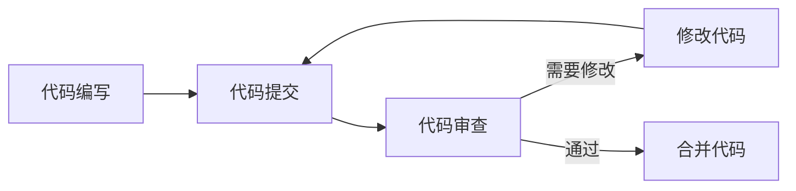

# Python 代码审查

代码审查（Code Review）是软件开发过程中至关重要的一环，它不仅帮助我们发现代码中的错误和问题，还促进了团队成员间的知识共享和协作。对于Python开发者而言，掌握代码审查的技巧和方法可以显著提高代码质量、可维护性和团队效率。

## 什么是代码审查？

代码审查是指开发者系统性地检查另一位开发者编写的代码，目的是发现错误、确保代码质量并验证是否符合项目标准的过程。



## 为什么Python代码审查很重要？

:::tip
良好的代码审查过程可以将错误捕获率提高到60%以上，相比单元测试更有效地发现某些类型的问题。
:::

### 主要优势

1. **提高代码质量** - 发现逻辑错误、性能问题和安全漏洞
2. **知识共享** - 团队成员可以相互学习编程技巧和最佳实践
3. **代码一致性** - 确保所有代码遵循相同的风格和标准
4. **减少技术债务** - 及早发现并修复设计问题和不良实践
5. **提升团队责任感** - 创造团队对代码共同负责的文化

## Python 代码审查的关注点

### 1. 代码风格和PEP 8合规性

Python有明确的代码风格指南PEP 8，审查代码时应检查其是否符合这些约定。

```python
# 不良风格示例
def calculate_something(x,y,z):
    result=x+y*z
    return result

# 良好风格示例
def calculate_something(x, y, z):
    """计算x加上y与z的乘积。"""
    result = x + y * z
    return result
```

### 2. 代码可读性和命名约定

检查变量、函数和类名是否清晰、描述性且符合Python命名约定。

```python
# 不良命名示例
def f(d):
    for i in d:
        print(i)

# 良好命名示例
def display_items(items_collection):
    for item in items_collection:
        print(item)
```

### 3. 文档和注释

评审时确认代码是否有充分的文档字符串(docstrings)和必要的注释。

```python
# 良好文档示例
def calculate_discount(price, discount_rate):
    """
    根据给定价格和折扣率计算折扣后价格。
    
    Args:
        price (float): 原始价格
        discount_rate (float): 0到1之间的折扣率
        
    Returns:
        float: 折扣后的价格
        
    Raises:
        ValueError: 如果折扣率不在0-1范围内
    """
    if not 0 <= discount_rate <= 1:
        raise ValueError("折扣率必须在0到1之间")
    
    return price * (1 - discount_rate)
```

### 4. 错误处理

检查代码中是否包含适当的异常处理。

```python
# 不良错误处理
def read_file(filename):
    f = open(filename, 'r')
    content = f.read()
    f.close()
    return content

# 良好错误处理
def read_file(filename):
    try:
        with open(filename, 'r') as f:
            return f.read()
    except FileNotFoundError:
        print(f"文件 '{filename}' 不存在")
        return None
    except PermissionError:
        print(f"没有权限读取文件 '{filename}'")
        return None
```

### 5. 测试覆盖

审查代码是否有足够的单元测试覆盖率。

```python
# 示例测试代码
import unittest
from discount import calculate_discount

class TestDiscount(unittest.TestCase):
    def test_normal_discount(self):
        self.assertEqual(calculate_discount(100, 0.2), 80)
        
    def test_zero_discount(self):
        self.assertEqual(calculate_discount(100, 0), 100)
        
    def test_full_discount(self):
        self.assertEqual(calculate_discount(100, 1), 0)
        
    def test_invalid_discount(self):
        with self.assertRaises(ValueError):
            calculate_discount(100, 1.5)
```

### 6. 代码性能

评估代码的效率，识别潜在的性能瓶颈。

```python
# 低效代码示例
def find_common_items(list1, list2):
    common = []
    for item1 in list1:
        for item2 in list2:
            if item1 == item2 and item1 not in common:
                common.append(item1)
    return common

# 高效代码示例
def find_common_items(list1, list2):
    return list(set(list1).intersection(set(list2)))
```

### 7. 安全性

检查代码是否存在安全漏洞，如SQL注入、不安全的凭证存储等。

```python
# 不安全示例
def authenticate(username, password):
    query = f"SELECT * FROM users WHERE username = '{username}' AND password = '{password}'"
    # 这可能导致SQL注入攻击

# 安全示例
def authenticate(username, password):
    query = "SELECT * FROM users WHERE username = %s AND password = %s"
    cursor.execute(query, (username, password))
```

## 如何组织Python代码审查

### 代码审查清单

创建一个审查清单可以帮助确保审查过程的系统性和完整性：

1. 代码是否符合PEP 8标准？
2. 函数和变量命名是否清晰、一致？
3. 是否有充分的文档和注释？
4. 错误处理是否完善？
5. 是否有适当的测试覆盖？
6. 代码是否可能存在性能问题？
7. 是否有潜在的安全漏洞？
8. 代码是否重复或可重构？

### 代码审查工具

利用工具可以自动化部分审查过程：

1. **Pylint** - 静态代码分析工具
2. **Flake8** - 结合了PyFlakes、pycodestyle和McCabe复杂度检查
3. **Black** - 自动格式化工具
4. **mypy** - 静态类型检查器
5. **Bandit** - 安全性分析工具

```python
# 使用pylint进行代码检查的示例
# 假设代码保存为example.py
# 终端运行: pylint example.py

# 输出示例:
# ************* Module example
# example.py:10:0: C0303: Trailing whitespace (trailing-whitespace)
# example.py:12:0: C0303: Trailing whitespace (trailing-whitespace)
# example.py:14:0: C0304: Final newline missing (missing-final-newline)
# example.py:1:0: C0111: Missing module docstring (missing-docstring)
# example.py:1:0: C0103: Function name "f" doesn't conform to snake_case naming style (invalid-name)
```

## 实际案例：团队代码审查流程

### 案例1：修复错误和提高可读性

**原始代码：**

```python
def process(d):
    r = []
    for i in range(len(d)):
        if d[i] > 0:
            r.append(d[i] * 2)
        else:
            r.append(0)
    return r
```

**审查评论：**
1. 函数名和变量名不够描述性
2. 使用了低效的索引循环而不是Python的for-each风格
3. 缺少文档字符串
4. 函数功能可以使用列表推导式更简洁地表达

**改进后的代码：**

```python
def process_values(data_points):
    """
    处理数值列表，对正数翻倍，负数和零则变为0。
    
    Args:
        data_points (list): 需要处理的数值列表
        
    Returns:
        list: 处理后的结果列表
    """
    return [value * 2 if value > 0 else 0 for value in data_points]
```

### 案例2：修复安全问题

**原始代码：**

```python
def save_user_data(username, data):
    import os
    filename = f"data/{username}.txt"
    os.system(f"mkdir -p data && echo '{data}' > {filename}")
    print(f"数据已保存到 {filename}")
```

**审查评论：**
1. 命令注入漏洞：用户可以通过注入特殊字符执行任意命令
2. 使用了不安全的`os.system`调用
3. 没有错误处理
4. 没有对文件名进行验证

**改进后的代码：**

```python
import os
import re
from pathlib import Path

def save_user_data(username, data):
    """
    安全地将用户数据保存到文件中。
    
    Args:
        username (str): 用户名，用作文件名的一部分
        data (str): 要保存的数据
        
    Returns:
        bool: 操作是否成功
        
    Raises:
        ValueError: 如果用户名包含非法字符
    """
    # 验证用户名是否符合安全标准
    if not re.match(r'^[a-zA-Z0-9_-]+$', username):
        raise ValueError("用户名只能包含字母、数字、下划线和连字符")
    
    try:
        # 安全地创建目录
        data_dir = Path('data')
        data_dir.mkdir(exist_ok=True)
        
        # 安全地写入文件
        file_path = data_dir / f"{username}.txt"
        with open(file_path, 'w') as file:
            file.write(data)
            
        print(f"数据已保存到 {file_path}")
        return True
        
    except Exception as e:
        print(f"保存数据时出错: {e}")
        return False
```

## 进行有效的代码审查的建议

### 对审查者的建议

1. **保持积极态度** - 聚焦于代码，而非开发者个人
2. **提供具体反馈** - 具体指出问题并提供改进建议
3. **优先处理重要问题** - 关注安全性、功能性和维护性
4. **使用提问而非命令** - "我们能否在这里添加错误处理？"而不是"添加错误处理"
5. **承认优点** - 指出代码中做得好的部分

### 对被审查者的建议

1. **不要把批评个人化** - 记住审查是针对代码，不是针对你
2. **解释而非辩护** - 解释你的决策背后的理由
3. **感谢反馈** - 将审查视为学习机会
4. **提前自我审查** - 在提交前自己先检查常见问题
5. **适当分批提交** - 避免一次提交大量代码

:::caution
代码审查不是一个批评或指责的场合，而应该是一个协作学习和提高的环境。保持开放的心态和相互尊重是成功代码审查的关键。
:::

## 总结

代码审查是Python开发过程中不可或缺的一部分，它不仅能够提高代码质量，还能促进团队协作和知识共享。通过关注代码风格、可读性、错误处理、测试覆盖和安全性等方面，我们可以显著提升Python项目的质量和可维护性。无论是初学者还是有经验的开发者，掌握代码审查的技巧都会对你的编程能力有巨大帮助。

## 练习与资源

### 练习

1. 使用Pylint或Flake8分析你自己的Python代码，并修复所有警告和错误。
2. 与同学或同事交换代码，互相进行代码审查，记录发现的问题和学到的经验。
3. 尝试重构一段现有代码，关注命名、文档和错误处理的改进。

### 附加资源

- [PEP 8 -- Python代码风格指南](https://www.python.org/dev/peps/pep-0008/)
- [The Hitchhiker's Guide to Python](https://docs.python-guide.org/)
- [Python代码质量工具](https://realpython.com/python-code-quality/)
- [Code Review Best Practices](https://www.kevinlondon.com/2015/05/05/code-review-best-practices.html)

通过遵循这些原则和实践，你将逐步掌握Python代码审查的艺术，提高自己的代码质量，并成为团队中更有价值的成员。记住，每次代码审查都是一次学习的机会，无论你是审查者还是被审查者。