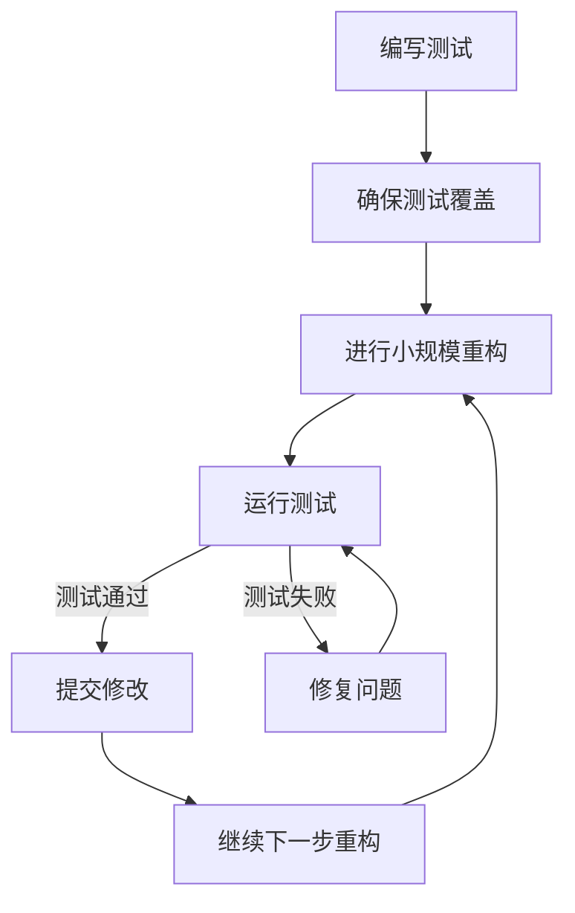

# Python 重构技巧

## 什么是代码重构？

代码重构是指在不改变代码外部行为的前提下，对代码内部结构进行调整，以提高其可读性、可维护性和扩展性。重构是一项重要的编程技能，特别是对于那些需要长期维护的项目。

:::tip
重构不是修复bug或添加新功能，而是优化现有代码，使其更易于理解和修改。
:::

## 为什么需要重构Python代码？

- **提高代码可读性**：让其他开发者（包括未来的自己）更容易理解代码
- **减少代码复杂度**：简化复杂的逻辑，降低"认知负荷"
- **消除代码异味**：修正不良的编程习惯和模式
- **优化性能**：通过更好的算法和数据结构提高效率
- **便于添加新功能**：在良好结构的代码基础上更容易扩展

## 重构前的准备工作

在开始重构之前，务必确保以下事项：

1. **有完善的测试**：自动化测试可以确保重构不会破坏现有功能
2. **小步前进**：每次只做一小部分改动，然后测试
3. **版本控制**：使用Git等版本控制系统，以便在出错时可以回滚



## 常见的Python重构技巧

### 1. 提取函数/方法

将一段复杂的代码块提取为独立的函数或方法，以提高代码可读性和复用性。

**重构前：**

```python
def calculate_total_price(items, discount):
    total = 0
    # 计算原始总价
    for item in items:
        total += item['price'] * item['quantity']
    
    # 应用折扣
    if discount > 0:
        total = total * (1 - discount)
    
    # 添加税费
    tax = total * 0.1
    final_total = total + tax
    
    return final_total
```

**重构后：**

```python
def calculate_subtotal(items):
    subtotal = 0
    for item in items:
        subtotal += item['price'] * item['quantity']
    return subtotal

def apply_discount(amount, discount):
    if discount > 0:
        return amount * (1 - discount)
    return amount

def add_tax(amount):
    return amount * 0.1

def calculate_total_price(items, discount):
    subtotal = calculate_subtotal(items)
    discounted_total = apply_discount(subtotal, discount)
    tax = add_tax(discounted_total)
    return discounted_total + tax
```

这样的重构使每个函数只负责一个明确的任务，更容易理解和测试。

### 2. 代码简化和消除重复

消除重复代码是重构的核心原则之一。

**重构前：**

```python
def validate_user(user):
    if user.name == "":
        print("Error: Name cannot be empty")
        return False
    
    if user.email == "":
        print("Error: Email cannot be empty")
        return False
        
    if not "@" in user.email:
        print("Error: Invalid email format")
        return False
        
    return True
```

**重构后：**

```python
def validate_field(value, field_name):
    if value == "":
        print(f"Error: {field_name} cannot be empty")
        return False
    return True

def validate_email_format(email):
    if not "@" in email:
        print("Error: Invalid email format")
        return False
    return True

def validate_user(user):
    if not validate_field(user.name, "Name"):
        return False
        
    if not validate_field(user.email, "Email"):
        return False
        
    if not validate_email_format(user.email):
        return False
        
    return True
```

### 3. 重命名变量和函数

好的命名可以大幅提高代码可读性。

**重构前：**

```python
def p(d, r):
    t = 0
    for i in d:
        if i['a']:
            t += i['v']
    return t * r
```

**重构后：**

```python
def calculate_price(items, rate):
    total = 0
    for item in items:
        if item['active']:
            total += item['value']
    return total * rate
```

### 4. 分解复杂条件

复杂的条件判断往往使代码难以理解。提取为命名函数可以提高可读性。

**重构前：**

```python
if date.before(SUMMER_START) or date.after(SUMMER_END) and not user.is_premium and user.orders_count < 10:
    charge = quantity * winter_rate + winter_service_charge
else:
    charge = quantity * summer_rate
```

**重构后：**

```python
def is_winter():
    return date.before(SUMMER_START) or date.after(SUMMER_END)
    
def is_eligible_for_winter_discount():
    return not user.is_premium and user.orders_count < 10
    
if is_winter() and is_eligible_for_winter_discount():
    charge = quantity * winter_rate + winter_service_charge
else:
    charge = quantity * summer_rate
```

### 5. 使用类和对象重构数据

将相关数据和行为封装到类中，遵循面向对象的设计原则。

**重构前：**

```python
name = "John"
age = 30
is_student = True

def print_person_info():
    print(f"Name: {name}, Age: {age}, Is student: {is_student}")

def is_adult():
    return age >= 18
```

**重构后：**

```python
class Person:
    def __init__(self, name, age, is_student):
        self.name = name
        self.age = age
        self.is_student = is_student
        
    def print_info(self):
        print(f"Name: {self.name}, Age: {self.age}, Is student: {self.is_student}")
        
    def is_adult(self):
        return self.age >= 18

# 使用示例
person = Person("John", 30, True)
person.print_info()
print(f"Is adult: {person.is_adult()}")
```

### 6. 替换魔数为常量

将代码中出现的魔数（没有明确含义的数字）替换为命名常量。

**重构前：**

```python
def calculate_circle_area(radius):
    return 3.14159 * radius * radius

def calculate_cylinder_volume(radius, height):
    return 3.14159 * radius * radius * height
```

**重构后：**

```python
PI = 3.14159

def calculate_circle_area(radius):
    return PI * radius * radius

def calculate_cylinder_volume(radius, height):
    return PI * radius * radius * height
```

## 实际案例：重构一个简单的游戏

下面我们来看一个更完整的例子，重构一个简单的猜数字游戏。

### 重构前的代码：

```python
import random

def game():
    n = random.randint(1, 100)
    g = 0
    t = 0
    
    print("欢迎参加猜数字游戏！")
    print("我已经想好了一个1到100之间的数字。")
    
    while g != n:
        try:
            g = int(input("请猜一个数字: "))
            t += 1
            
            if g < n:
                print("太小了！")
            elif g > n:
                print("太大了！")
            else:
                print(f"恭喜你猜对了！答案是{n}。")
                print(f"你总共猜了{t}次。")
                
                if t <= 5:
                    print("你真厉害！")
                elif t <= 10:
                    print("还不错！")
                else:
                    print("继续加油！")
                    
                p = input("想再玩一次吗？(y/n): ")
                if p.lower() == 'y':
                    game()
                else:
                    print("谢谢参与！")
                    
        except ValueError:
            print("请输入有效的数字！")
            
game()
```

### 重构后的代码：

```python
import random

class NumberGuessingGame:
    MIN_NUMBER = 1
    MAX_NUMBER = 100
    
    def __init__(self):
        self.secret_number = random.randint(self.MIN_NUMBER, self.MAX_NUMBER)
        self.attempts = 0
        
    def display_welcome_message(self):
        print("欢迎参加猜数字游戏！")
        print(f"我已经想好了一个{self.MIN_NUMBER}到{self.MAX_NUMBER}之间的数字。")
    
    def get_guess(self):
        while True:
            try:
                return int(input("请猜一个数字: "))
            except ValueError:
                print("请输入有效的数字！")
    
    def provide_feedback(self, guess):
        self.attempts += 1
        
        if guess < self.secret_number:
            return "太小了！"
        elif guess > self.secret_number:
            return "太大了！"
        else:
            return None  # 猜对了
    
    def evaluate_performance(self):
        if self.attempts <= 5:
            return "你真厉害！"
        elif self.attempts <= 10:
            return "还不错！"
        else:
            return "继续加油！"
    
    def play_again(self):
        response = input("想再玩一次吗？(y/n): ")
        return response.lower() == 'y'
    
    def play(self):
        self.display_welcome_message()
        
        while True:
            guess = self.get_guess()
            feedback = self.provide_feedback(guess)
            
            if feedback:
                print(feedback)
            else:
                # 猜对了
                print(f"恭喜你猜对了！答案是{self.secret_number}。")
                print(f"你总共猜了{self.attempts}次。")
                print(self.evaluate_performance())
                break
        
        if self.play_again():
            # 创建新游戏实例而不是递归调用
            new_game = NumberGuessingGame()
            new_game.play()
        else:
            print("谢谢参与！")

# 开始游戏
if __name__ == "__main__":
    game = NumberGuessingGame()
    game.play()
```

### 重构前后对比：

1. **组织结构改进**：使用类封装游戏逻辑，将相关数据和行为组合在一起
2. **职责划分**：每个方法只负责一项明确的任务
3. **常量提取**：使用类常量代替魔数
4. **递归调用改进**：避免了递归调用导致的潜在栈溢出问题
5. **错误处理优化**：更好地处理了输入验证
6. **可测试性**：重构后的代码更容易进行单元测试

## 检测需要重构的代码（代码异味）

以下是一些常见的"代码异味"，它们通常表明代码需要重构：

1. **重复代码**：相同或相似的代码出现在多个地方
2. **过长函数**：单个函数超过20-30行代码
3. **大量参数**：函数或方法参数过多（超过3-4个）
4. **复杂条件语句**：嵌套的if-else语句或复杂的条件表达式
5. **注释过多**：需要大量注释解释的代码通常意味着代码本身不够清晰
6. **死代码**：永远不会执行的代码
7. **类职责过多**：一个类做了太多不相关的事情
8. **数据泥团**：总是一起出现的数据应该被组织成结构或类

## 使用工具辅助重构

Python生态系统中有很多工具可以帮助识别需要重构的代码：

- **pylint**: 静态代码分析工具，可以检测代码质量问题
- **black**: 自动代码格式化工具
- **isort**: 自动排序import语句
- **flake8**: 检查代码是否符合PEP 8规范
- **mypy**: 类型检查工具
- **SonarQube**: 更全面的代码质量管理平台

## 重构最佳实践

1. **测试驱动重构**：确保有足够的测试覆盖率
2. **小步前进**：一次只改动一小部分代码
3. **频繁提交**：每完成一个小的重构就提交代码
4. **保持功能不变**：重构不应改变程序的行为
5. **先重构再添加新功能**：不要同时进行重构和功能开发
6. **了解常见的重构模式**：熟悉标准重构技术
7. **遵循SOLID原则**：单一责任、开放封闭、里氏替换、接口隔离和依赖反转

## 总结

重构是提高代码质量的重要过程，通过不断的小幅改进，可以让代码更加清晰、可维护。Python作为一种强调可读性的语言，尤其适合应用各种重构技巧。记住，好的代码不仅能正确运行，还应该易于理解和修改。

重构是一项需要持续练习的技能，随着经验的积累，你会逐渐培养出发现代码问题并加以改进的"直觉"。

## 练习建议

1. 选择一个你之前写过的小项目，尝试应用本文中的重构技巧。
2. 找一个开源项目，查看其代码并思考如何改进。
3. 尝试使用TDD（测试驱动开发）的方式编写新功能，然后重构。
4. 和同事或学习伙伴一起进行代码审查，相互提供重构建议。

## 延伸阅读

- 《重构：改善既有代码的设计》by Martin Fowler
- 《代码整洁之道》by Robert C. Martin
- 《Effective Python》by Brett Slatkin
- Python官方PEP 8风格指南

:::caution
记住，不要过度重构！有时"够好"就是最好的。完美是好代码的敌人，如果代码能够正常工作且足够清晰，那就不要为了追求完美而过度重构。
:::