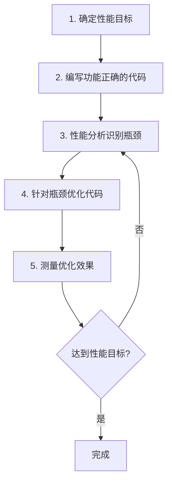

# Python 性能优化

## 性能优化的重要性

Python是一门灵活易用的编程语言，但有时可能面临性能瓶颈。了解如何优化Python代码对于构建高效应用程序至关重要，特别是处理大量数据或需要快速响应的场景。

:::tip 记住
"过早优化是万恶之源" - 唐纳德·克努特。先让代码正确运行，然后再考虑优化性能。
:::

## Python 代码性能分析

在优化之前，我们需要了解程序的瓶颈在哪里。Python提供了多种工具来帮助我们分析代码性能。

### 使用 `time` 模块测量执行时间

最简单的性能分析方式是测量代码执行时间：

```python
import time

start_time = time.time()
# 要测试的代码
result = sum(range(10000000))
end_time = time.time()

print(f"执行时间: {end_time - start_time:.5f} 秒")
# 输出示例: 执行时间: 0.45876 秒
```

### 使用 `timeit` 模块进行精确计时

`timeit` 模块提供了更精确的时间测量，特别适合测试小代码片段：

```python
import timeit

# 测试列表推导式的性能
list_comp_time = timeit.timeit('[i*2 for i in range(1000)]', number=10000)
print(f"列表推导式耗时: {list_comp_time:.5f} 秒")

# 测试for循环的性能
for_loop_time = timeit.timeit('''
result = []
for i in range(1000):
    result.append(i*2)
''', number=10000)
print(f"for循环耗时: {for_loop_time:.5f} 秒")

# 输出示例:
# 列表推导式耗时: 3.14592 秒
# for循环耗时: 5.27843 秒
```

### 使用 `cProfile` 进行详细分析

`cProfile` 是Python标准库中的性能分析工具，可以提供函数调用次数和执行时间的详细信息：

```python
import cProfile

def slow_function():
    result = []
    for i in range(100000):
        result.append(i * i)
    return result

cProfile.run('slow_function()')
# 输出示例:
# 3 function calls in 0.016 seconds
#   ncalls  tottime  percall  cumtime  percall filename:lineno(function)
#        1    0.012    0.012    0.016    0.016 <string>:1(<module>)
#        1    0.004    0.004    0.004    0.004 test.py:3(slow_function)
#        1    0.000    0.000    0.000    0.000 {built-in method builtins.exec}
```

## 常见的Python性能优化技巧

### 1. 使用适当的数据结构

选择正确的数据结构可以显著提高程序性能：

```python
# 低效 - 在列表中查找元素 O(n)
my_list = [1, 2, 3, 4, 5, 6, 7, 8, 9, 10]
if 5 in my_list:  # 需要遍历整个列表
    print("找到了")

# 高效 - 在集合中查找元素 O(1)
my_set = {1, 2, 3, 4, 5, 6, 7, 8, 9, 10}
if 5 in my_set:  # 哈希查找，非常快
    print("找到了")
```

数据结构选择指南：

- 需要快速查找：使用集合（set）或字典（dict）
- 需要有序数据：使用列表（list）
- 频繁插入/删除开头元素：使用双端队列（collections.deque）
- 存储大量布尔值：使用位数组（bitarray模块）

### 2. 使用列表推导式和生成器表达式

列表推导式通常比传统的for循环更快更简洁：

```python
# 低效方式
squares = []
for i in range(1000):
    squares.append(i * i)

# 更高效的列表推导式
squares = [i * i for i in range(1000)]

# 处理大数据时使用生成器表达式节省内存
squares_gen = (i * i for i in range(1000000))
# 只有在实际使用元素时才会计算
for s in squares_gen:
    # 处理数据...
    if s > 100:
        break  # 不会计算剩余元素
```

### 3. 避免在循环中频繁创建对象

在循环外部创建对象，减少内存分配操作：

```python
# 低效 - 每次迭代都创建新字符串
result = ""
for i in range(10000):
    result += str(i)  # 创建新字符串

# 高效 - 使用列表收集片段，最后拼接
fragments = []
for i in range(10000):
    fragments.append(str(i))
result = "".join(fragments)  # 只创建一次最终字符串
```

### 4. 使用局部变量替代全局变量

局部变量访问比全局变量快：

```python
# 低效
global_var = 0
def function():
    global global_var
    for i in range(1000000):
        global_var += i

# 更高效
def function():
    local_var = 0  # 局部变量
    for i in range(1000000):
        local_var += i
    return local_var
```

### 5. 减少函数调用

在性能关键的循环中，减少函数调用可以提高速度：

```python
# 低效 - 每次循环都调用函数
def square(x):
    return x * x

result = [square(i) for i in range(1000000)]

# 更高效 - 内联计算
result = [i * i for i in range(1000000)]
```

### 6. 使用内置函数和库

Python的内置函数和标准库通常是用C语言实现的，执行效率更高：

```python
# 低效 - 手动求和
total = 0
for num in range(10000000):
    total += num

# 高效 - 使用内置sum函数
total = sum(range(10000000))
```

## 更高级的优化技巧

### 1. 使用NumPy进行数值计算

对于数值计算，NumPy可以显著提高性能：

```python
# 普通Python计算
def py_sum_of_squares(n):
    return sum([i * i for i in range(n)])

# NumPy计算
import numpy as np
def np_sum_of_squares(n):
    return np.sum(np.arange(n) ** 2)

# NumPy版本通常快10-100倍
```

### 2. 使用多线程和多进程

对于I/O密集型任务，使用多线程；对于CPU密集型任务，使用多进程：

```python
from concurrent.futures import ThreadPoolExecutor
import requests

urls = ["https://example.com"] * 100

# 串行执行
def fetch_serial(urls):
    results = []
    for url in urls:
        response = requests.get(url)
        results.append(response.status_code)
    return results

# 并行执行
def fetch_parallel(urls):
    with ThreadPoolExecutor(max_workers=10) as executor:
        results = list(executor.map(lambda url: requests.get(url).status_code, urls))
    return results

# 并行版本可能快5-10倍（对于I/O密集型任务）
```

### 3. 使用JIT编译 - Numba

Numba库可以即时编译Python代码，显著提高数值计算性能：

```python
# 普通Python函数
def py_mandelbrot(h, w, max_iters):
    result = []
    for y in range(h):
        for x in range(w):
            # 计算曼德博集合点
            c_real = (x - w / 2) * 4 / w
            c_imag = (y - h / 2) * 4 / h
            z_real, z_imag = 0, 0
            for i in range(max_iters):
                if z_real * z_real + z_imag * z_imag > 4:
                    break
                new_real = z_real * z_real - z_imag * z_imag + c_real
                new_imag = 2 * z_real * z_imag + c_imag
                z_real, z_imag = new_real, new_imag
            result.append(i)
    return result

# 使用Numba加速
import numba

@numba.jit(nopython=True)
def numba_mandelbrot(h, w, max_iters):
    # 与上面相同的代码
    # 但速度可能快100倍以上
    result = []
    for y in range(h):
        # ... 与上面相同的代码
    return result
```

### 4. 使用Cython

Cython允许将Python代码编译为C代码，大幅提高性能：

```python
# 在 fibonacci.pyx 文件中:
def fib(int n):
    cdef int i, a = 0, b = 1
    for i in range(n):
        a, b = a + b, a
    return a
```

## 实际案例：Web应用响应时间优化

考虑一个需要处理用户数据的Web应用程序：

```python
# 优化前 - 处理请求很慢
def process_user_data(user_id):
    # 1. 从数据库获取用户信息
    user = db.get_user(user_id)  # 假设这是耗时操作
    
    # 2. 处理历史数据
    history = []
    for record in db.get_user_history(user_id):  # 循环数据库查询
        processed = complex_calculation(record)
        history.append(processed)
    
    # 3. 生成报告
    report = ""
    for item in history:
        report += generate_report_item(item)  # 字符串连接
    
    return {"user": user, "report": report}

# 优化后
import functools
from concurrent.futures import ThreadPoolExecutor

@functools.lru_cache(maxsize=100)  # 添加缓存
def process_user_data(user_id):
    # 1. 从数据库获取用户信息
    user = db.get_user(user_id)
    
    # 2. 一次性获取所有历史数据
    raw_history = db.get_all_user_history(user_id)  # 批量获取
    
    # 3. 并行处理历史数据
    with ThreadPoolExecutor(max_workers=4) as executor:
        history = list(executor.map(complex_calculation, raw_history))
    
    # 4. 高效生成报告
    report_items = [generate_report_item(item) for item in history]
    report = "".join(report_items)  # 一次性连接
    
    return {"user": user, "report": report}
```

优化效果：
- 加入缓存避免重复计算
- 减少数据库访问次数
- 并行处理提高CPU利用率
- 优化字符串连接操作

响应时间可能从原来的10秒降低到不到1秒。

## 性能优化流程

遵循以下步骤进行系统性优化：



## 总结

Python性能优化是一项平衡艺术，需要在代码可读性和执行效率之间找到平衡点。本文介绍的技巧可以帮助你:

1. 找出代码中的性能瓶颈
2. 选择合适的数据结构和算法
3. 利用Python语言特性提高性能
4. 使用专门的库加速计算密集型任务
5. 通过并行处理提高程序吞吐量

记住，优化应该是有针对性的，先让程序正确运行，然后再根据实际需要进行性能提升。

## 练习与延伸学习

### 练习
1. 使用`timeit`比较列表、元组、集合和字典在不同操作上的性能差异
2. 优化一个处理大文件的程序，使其内存占用更低
3. 使用`cProfile`分析你的一个现有Python程序，找出性能瓶颈

### 进阶学习资源
- 《High Performance Python》by Micha Gorelick和Ian Ozsvald
- 《Fluent Python》by Luciano Ramalho
- Python官方文档中的"性能提示"部分
- Numba和Cython的官方文档

:::caution 注意
性能优化通常会增加代码复杂度，降低可维护性。确保只在必要时进行优化，并保留优化前代码的清晰文档。
:::

祝你在Python性能优化之旅中取得成功！
