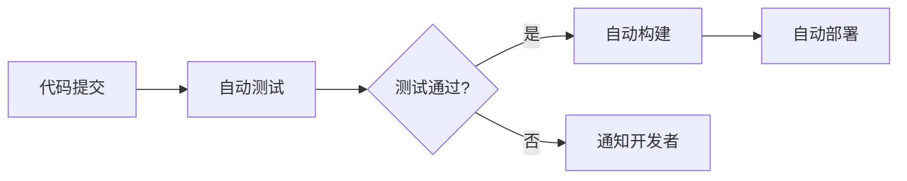

# Python 部署策略

当你的Python项目从本地开发阶段迈向生产环境时，一套完善的部署策略至关重要。本文将引导你了解从开发到部署的全过程，探讨不同的部署选项以及最佳实践。

## 什么是部署？

部署是指将软件应用程序从开发环境转移到生产环境的过程，使最终用户能够使用该应用程序。一个完善的部署流程应确保应用程序稳定、安全、高效地运行。


## 部署前的准备工作

### 1. 虚拟环境管理

使用虚拟环境是Python开发的最佳实践之一，它能够隔离项目依赖，避免不同项目之间的冲突。

```python
# 创建虚拟环境
python -m venv myenv

# 在Windows上激活虚拟环境
myenv\Scripts\activate

# 在Linux/Mac上激活虚拟环境
source myenv/bin/activate

# 安装依赖
pip install -r requirements.txt
```

:::tip
务必将项目依赖记录在`requirements.txt`文件中：
```
pip freeze > requirements.txt
```
:::

### 2. 依赖管理

除了基本的`pip`和`requirements.txt`外，还可以考虑使用更先进的依赖管理工具：

- **Poetry**: 现代化的Python包管理工具
- **Pipenv**: 结合了pip和virtualenv的功能
- **Conda**: 适用于数据科学项目的包管理器

```python
# 使用Poetry示例
poetry init  # 初始化项目
poetry add flask  # 添加依赖
poetry install  # 安装所有依赖
```

### 3. 环境配置

使用环境变量管理不同环境的配置，避免硬编码敏感信息。

```python
import os
from dotenv import load_dotenv

# 加载.env文件中的环境变量
load_dotenv()

# 获取环境变量
DATABASE_URL = os.environ.get("DATABASE_URL")
SECRET_KEY = os.environ.get("SECRET_KEY")
DEBUG = os.environ.get("DEBUG", "False") == "True"
```

## 常见的Python部署策略

### 1. 传统服务器部署

这是最基础的部署方式，适合小型项目或资源有限的情况。

**步骤：**

1. 在服务器上安装Python
2. 配置虚拟环境
3. 拉取代码
4. 安装依赖
5. 配置Web服务器（如Nginx、Apache）
6. 配置WSGI服务器（如Gunicorn、uWSGI）

示例Gunicorn配置:

```python
# 启动Gunicorn服务
gunicorn --workers=4 --bind=0.0.0.0:8000 app:app
```

示例Nginx配置:

```
server {
    listen 80;
    server_name example.com;

    location / {
        proxy_pass http://127.0.0.1:8000;
        proxy_set_header Host $host;
        proxy_set_header X-Real-IP $remote_addr;
    }
}
```

### 2. 容器化部署

使用Docker容器化你的Python应用，实现"一次构建，到处运行"的目标。

**Dockerfile示例:**

```dockerfile
FROM python:3.9-slim

WORKDIR /app

COPY requirements.txt .
RUN pip install --no-cache-dir -r requirements.txt

COPY . .

ENV FLASK_APP=app.py
ENV FLASK_RUN_HOST=0.0.0.0

EXPOSE 5000

CMD ["flask", "run"]
```

**使用Docker Compose管理多容器应用:**

```yaml
version: '3'

services:
  web:
    build: .
    ports:
      - "5000:5000"
    environment:
      - DATABASE_URL=postgresql://user:password@db:5432/mydatabase
    depends_on:
      - db
  
  db:
    image: postgres:13
    environment:
      - POSTGRES_USER=user
      - POSTGRES_PASSWORD=password
      - POSTGRES_DB=mydatabase
    volumes:
      - postgres_data:/var/lib/postgresql/data

volumes:
  postgres_data:
```

### 3. 云平台部署

现代云平台提供了多种Python应用部署选项。

#### PaaS (平台即服务)

适合快速部署且无需深入管理基础架构：

- **Heroku**: 简单易用，适合小型应用
- **Google App Engine**: 高度可扩展
- **Azure App Service**: 微软生态系统
- **AWS Elastic Beanstalk**: 自动处理容量配置、负载均衡等

**Heroku部署示例:**

1. 创建`Procfile`文件:
```
web: gunicorn app:app
```

2. 部署命令:
```bash
heroku login
git add .
git commit -m "Ready for deployment"
heroku create my-python-app
git push heroku main
```

#### IaaS (基础架构即服务)

提供更多控制权，但需要更多配置：

- **AWS EC2**
- **Google Compute Engine**
- **Azure Virtual Machines**
- **DigitalOcean Droplets**

### 4. Serverless部署

无服务器架构适合事件驱动型应用，按需计算资源：

- **AWS Lambda**
- **Google Cloud Functions**
- **Azure Functions**

**AWS Lambda函数示例:**

```python
def lambda_handler(event, context):
    """
    简单的AWS Lambda处理函数
    """
    name = event.get('name', 'World')
    return {
        'statusCode': 200,
        'body': f'Hello, {name}!'
    }
```

## 持续集成/持续部署(CI/CD)

自动化部署流程可以提高效率并减少人为错误。



### GitHub Actions示例

创建`.github/workflows/deploy.yml`文件：

```yaml
name: Deploy Python Application

on:
  push:
    branches: [ main ]

jobs:
  test:
    runs-on: ubuntu-latest
    steps:
    - uses: actions/checkout@v2
    - name: Set up Python
      uses: actions/setup-python@v2
      with:
        python-version: '3.9'
    - name: Install dependencies
      run: |
        python -m pip install --upgrade pip
        pip install pytest
        if [ -f requirements.txt ]; then pip install -r requirements.txt; fi
    - name: Test with pytest
      run: |
        pytest

  deploy:
    needs: test
    runs-on: ubuntu-latest
    steps:
    - uses: actions/checkout@v2
    - name: Deploy to Heroku
      uses: akhileshns/heroku-deploy@v3.12.12
      with:
        heroku_api_key: ${{secrets.HEROKU_API_KEY}}
        heroku_app_name: "my-python-app"
        heroku_email: ${{secrets.HEROKU_EMAIL}}
```

## 监控与日志管理

部署后，监控应用性能和错误至关重要。

### 日志管理

```python
import logging

# 配置日志
logging.basicConfig(
    level=logging.INFO,
    format='%(asctime)s - %(name)s - %(levelname)s - %(message)s',
    handlers=[
        logging.FileHandler("app.log"),
        logging.StreamHandler()
    ]
)

logger = logging.getLogger(__name__)

# 使用日志
def some_function():
    try:
        # 业务逻辑
        result = 10 / 0  # 将引发异常
    except Exception as e:
        logger.error(f"An error occurred: {str(e)}")
        raise
```

### 监控工具

- **New Relic**: 应用性能监控
- **Datadog**: 全栈监控
- **Prometheus + Grafana**: 开源监控解决方案
- **Sentry**: 实时错误跟踪

## 实际案例：Flask应用部署流程

以下是一个Flask应用从开发到部署的完整流程：

### 1. 项目结构

```
my_flask_app/
├── app/
│   ├── __init__.py
│   ├── routes.py
│   ├── models.py
│   └── templates/
├── tests/
├── .env
├── .gitignore
├── Dockerfile
├── docker-compose.yml
├── requirements.txt
└── wsgi.py
```

### 2. 应用代码

`app/__init__.py`:
```python
from flask import Flask
from flask_sqlalchemy import SQLAlchemy
import os

app = Flask(__name__)
app.config['SQLALCHEMY_DATABASE_URI'] = os.environ.get('DATABASE_URL')
app.config['SECRET_KEY'] = os.environ.get('SECRET_KEY')
db = SQLAlchemy(app)

from app import routes
```

`wsgi.py`:
```python
from app import app

if __name__ == "__main__":
    app.run(host='0.0.0.0')
```

### 3. 容器化

构建并启动容器：

```bash
docker-compose build
docker-compose up -d
```

### 4. CI/CD部署

当代码推送到GitHub时，GitHub Actions将自动运行测试并部署到云平台。

### 5. 监控

设置Sentry捕获错误：

```python
import sentry_sdk
from sentry_sdk.integrations.flask import FlaskIntegration

sentry_sdk.init(
    dsn=os.environ.get("SENTRY_DSN"),
    integrations=[FlaskIntegration()]
)
```

## 部署清单

:::info 部署前检查清单
- [ ] 所有测试通过
- [ ] 依赖文件更新
- [ ] 环境变量配置正确
- [ ] 数据库迁移脚本就绪
- [ ] 静态文件管理配置
- [ ] 监控系统设置
- [ ] 备份策略制定
- [ ] 回滚计划准备
:::

## 总结

选择适合你项目规模和需求的部署策略至关重要。随着项目的发展，你可能需要调整部署方式，从简单的传统部署升级到容器化或无服务器架构。

无论选择何种部署策略，自动化测试和部署、良好的监控和日志记录都是成功部署Python应用的关键因素。

## 练习与挑战

1. 创建一个简单的Flask应用并部署到Heroku
2. 使用Docker容器化一个现有的Python应用
3. 为一个Python项目设置GitHub Actions工作流
4. 实现一个基于AWS Lambda的无服务器Python函数
5. 在本地使用Docker Compose搭建包含Python应用和数据库的开发环境

## 推荐资源

- 官方文档:
  - [Python Packaging User Guide](https://packaging.python.org/)
  - [Docker Documentation](https://docs.docker.com/)
  - [GitHub Actions Documentation](https://docs.github.com/actions)

- 工具:
  - [Poetry](https://python-poetry.org/)
  - [Gunicorn](https://gunicorn.org/)
  - [Docker Compose](https://docs.docker.com/compose/)
  - [Sentry](https://sentry.io/)

通过掌握这些部署策略，你将能够更加自信地将Python应用投入生产，并确保它们在各种环境中稳定运行。