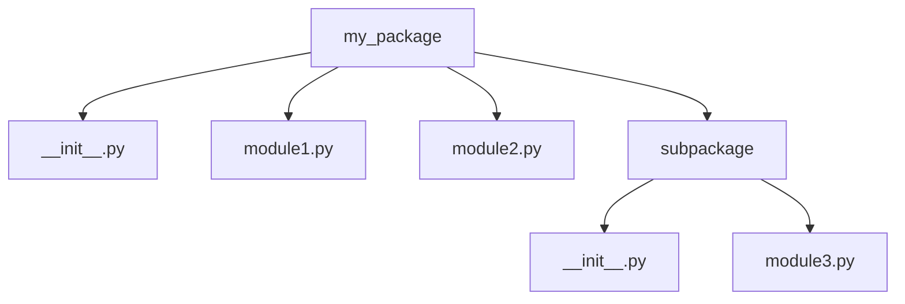

# Python 模块导入

## 什么是Python模块？

Python模块是包含Python定义和语句的文件。模块可以被理解为一个包含函数、类和变量的Python脚本文件（`.py`文件），它能够被其他Python程序导入和使用。模块的文件名就是模块名称加上`.py`后缀。

:::tip
模块使我们能够将代码分解成更小、可管理的部分，并促进代码的重用性和组织性。
:::

## 为什么需要模块？

在开发过程中，我们经常需要：

1. **代码复用**：避免在多个文件中重复编写相同的功能
2. **代码组织**：将相关功能组织在一起，使代码结构更清晰
3. **命名空间管理**：避免不同部分的代码中的命名冲突

## 基本导入语法

### 导入整个模块

```python
import module_name
```

导入后，可以使用`.`访问模块中的函数、变量或类：

```python
import math

# 使用模块中的函数
result = math.sqrt(16)
print(result)  # 输出: 4.0
```

### 导入特定成员

```python
from module_name import name1, name2
```

这样可以直接使用导入的成员，无需模块前缀：

```python
from math import sqrt, pi

# 直接使用导入的函数和变量
result = sqrt(16)
circle_area = pi * (2 ** 2)

print(result)      # 输出: 4.0
print(circle_area) # 输出: 12.566370614359172
```

### 导入时重命名

```python
import module_name as alias
# 或
from module_name import name as alias
```

当模块名称太长或有名称冲突时，重命名非常有用：

```python
import numpy as np

# 使用别名访问
array = np.array([1, 2, 3, 4, 5])
print(array.mean())  # 输出: 3.0
```

### 导入模块中的所有内容

```python
from module_name import *
```

:::caution
不推荐使用这种方式，因为它会导入模块中的所有内容到当前命名空间，可能引起名称冲突并使代码难以理解。
:::

## 模块搜索路径

当你导入一个模块时，Python解释器会按以下顺序搜索模块：

1. 当前目录
2. 由环境变量`PYTHONPATH`指定的目录列表
3. 安装Python时默认指定的目录

可以通过`sys.path`查看当前的模块搜索路径：

```python
import sys
print(sys.path)
```

## 创建自己的模块

创建模块非常简单，只需编写一个`.py`文件：

**my_module.py**:
```python
# 定义一个变量
pi = 3.14159

# 定义一个函数
def square(x):
    return x * x

# 定义一个类
class Circle:
    def __init__(self, radius):
        self.radius = radius
        
    def area(self):
        return pi * self.radius ** 2
```

**使用自定义模块**:
```python
import my_module

# 使用模块中的变量
print(my_module.pi)  # 输出: 3.14159

# 使用模块中的函数
result = my_module.square(4)
print(result)  # 输出: 16

# 使用模块中的类
circle = my_module.Circle(5)
print(circle.area())  # 输出: 78.53975
```

## Python 包

包是一种组织相关模块的方式，可以看作是一个包含多个模块的文件夹。包中必须包含一个特殊的文件`__init__.py`（在Python 3.3+中可选但建议保留）。



### 创建包

1. 创建一个文件夹作为包
2. 在文件夹中创建`__init__.py`文件（可以为空）
3. 在文件夹中添加模块文件（`.py`）

例如，我们创建一个简单的数学运算包：

```
math_operations/
    __init__.py
    basic.py
    advanced.py
```

**math_operations/__init__.py**:
```python
# 可以为空，或包含包级别的初始化代码
print("Math operations package is initialized")
```

**math_operations/basic.py**:
```python
def add(a, b):
    return a + b

def subtract(a, b):
    return a - b
```

**math_operations/advanced.py**:
```python
import math

def square_root(x):
    return math.sqrt(x)

def power(base, exp):
    return base ** exp
```

### 导入包中的模块

```python
# 导入整个包
import math_operations

# 导入包中的特定模块
from math_operations import basic
result = basic.add(5, 3)
print(result)  # 输出: 8

# 导入模块中的特定函数
from math_operations.advanced import square_root
result = square_root(16)
print(result)  # 输出: 4.0
```

## 相对导入

在包内部的模块之间，可以使用相对导入：

```python
# 导入同一包中的模块（相对导入）
from . import module_name

# 导入父包中的模块
from .. import module_name

# 导入父包的父包中的模块
from ... import module_name
```

例如，如果`advanced.py`需要使用`basic.py`中的函数：

```python
# math_operations/advanced.py
from . import basic

def multiply_and_add(a, b, c):
    return basic.add(a * b, c)
```

## 模块导入的最佳实践

1. **导入放在文件顶部**：所有导入语句应该放在文件的开头，在任何代码之前
2. **按组排列导入**：
   - 标准库导入
   - 第三方库导入
   - 本地应用/库导入
3. **避免使用 `from module import *`**：明确导入所需的特定对象
4. **使用绝对导入**：更加清晰和可维护
5. **模块名应简短且描述性**：避免使用过长或含糊不清的名称

## `if __name__ == "__main__"`的作用

这是一个Python惯用法，用于确定模块是作为独立程序运行还是被导入到其他模块中：

```python
# my_module.py
def hello():
    return "Hello, World!"

# 当作为独立程序运行时执行
if __name__ == "__main__":
    print(hello())
    print("This module is being run directly")
else:
    print("This module is being imported")
```

当直接运行`my_module.py`时，输出：
```
Hello, World!
This module is being run directly
```

但当导入模块时，只会输出：
```
This module is being imported
```

## 实际应用场景

### 场景1：数据处理工具包

假设我们正在开发一个数据分析项目，可以创建一个包含不同数据处理功能的包：

```
data_tools/
    __init__.py
    readers.py      # 包含从不同来源读取数据的函数
    cleaners.py     # 包含清理数据的函数
    analyzers.py    # 包含分析数据的函数
    visualizers.py  # 包含可视化数据的函数
```

使用示例：

```python
# 主程序
from data_tools.readers import read_csv
from data_tools.cleaners import remove_duplicates
from data_tools.analyzers import basic_stats
from data_tools.visualizers import plot_histogram

# 读取数据
data = read_csv('data.csv')

# 清理数据
clean_data = remove_duplicates(data)

# 分析数据
stats = basic_stats(clean_data)
print(stats)

# 可视化数据
plot_histogram(clean_data, 'age')
```

### 场景2：API封装

当与外部API交互时，可以创建模块来封装API调用：

```python
# weather_api.py
import requests

API_KEY = "your_api_key_here"
BASE_URL = "https://api.weatherservice.com/v1"

def get_current_weather(city):
    """获取指定城市的当前天气"""
    url = f"{BASE_URL}/current?city={city}&key={API_KEY}"
    response = requests.get(url)
    return response.json()

def get_forecast(city, days=5):
    """获取指定城市的天气预报"""
    url = f"{BASE_URL}/forecast?city={city}&days={days}&key={API_KEY}"
    response = requests.get(url)
    return response.json()
```

使用模块：

```python
import weather_api

# 获取当前天气
weather = weather_api.get_current_weather("Beijing")
print(f"当前温度: {weather['temperature']}°C")

# 获取天气预报
forecast = weather_api.get_forecast("Shanghai", 3)
for day in forecast['days']:
    print(f"{day['date']}: {day['condition']}, {day['temp_max']}°C / {day['temp_min']}°C")
```

## 总结

- **模块**是包含Python代码的文件，可以被导入到其他Python程序中重用
- **导入语法**包括`import module`、`from module import name`和`import module as alias`等形式
- **包**是组织相关模块的文件夹，包含`__init__.py`文件
- 相对导入适用于包内模块之间的引用
- 模块搜索遵循特定的路径顺序
- `if __name__ == "__main__"`用于区分直接运行和导入

模块和包是Python代码组织和重用的基础，掌握它们的使用对编写可维护的Python程序至关重要。通过合理使用模块和包，你可以使代码更加模块化、可测试并易于维护。

## 练习

1. 创建一个名为`calculator.py`的模块，包含基本的数学运算函数（加、减、乘、除）
2. 创建另一个Python文件导入这些函数并使用它们
3. 创建一个名为`geometry`的包，包含计算不同几何形状面积和周长的模块
4. 编写一个程序，导入并使用geometry包中的函数

## 进一步学习资源

- [Python官方文档 - 模块](https://docs.python.org/zh-cn/3/tutorial/modules.html)
- [Python导入系统详解](https://docs.python.org/zh-cn/3/reference/import.html)
- [Python包结构最佳实践](https://docs.python-guide.org/writing/structure/)