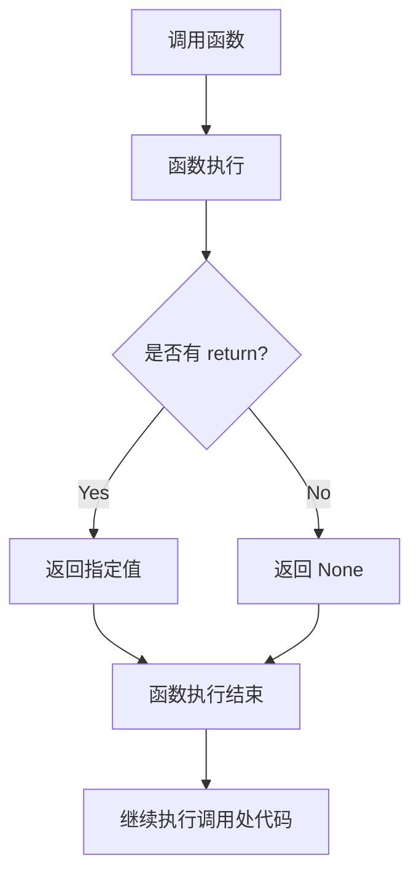

# Python 返回值

## 什么是返回值？

在 Python 中，函数不仅可以接收输入（参数），还可以通过 `return` 语句将结果发送回调用它的代码。这个发送回去的结果就是**返回值**。返回值是函数执行完成后"带回"给调用者的数据，它使得函数可以计算出一个值并将其传递给程序的其他部分使用。

:::note
函数的返回值使得我们可以将函数视为一种"黑盒"，输入某些参数，得到相应的输出，而无需关心内部具体的实现细节。
:::

## 基本语法

Python 中使用 `return` 关键字指定函数的返回值：

```python
def function_name(parameters):
    # 函数体
    return value  # 返回值
```

让我们看一个简单的例子：

```python
def add(a, b):
    result = a + b
    return result

# 调用函数并获取返回值
sum_result = add(5, 3)
print(sum_result)  # 输出: 8
```

在这个例子中：
1. 我们定义了一个 `add` 函数，它接收两个参数
2. 函数计算这两个参数的和，并通过 `return` 语句返回结果
3. 当我们调用 `add(5, 3)` 时，函数返回 8，这个值被存储在 `sum_result` 变量中

## 不同类型的返回值

Python 函数可以返回任何类型的数据，包括数字、字符串、列表、字典、对象等。

### 返回数字

```python
def square(number):
    return number * number

result = square(4)
print(result)  # 输出: 16
```

### 返回字符串

```python
def greeting(name):
    return f"Hello, {name}!"

message = greeting("Alice")
print(message)  # 输出: Hello, Alice!
```

### 返回列表

```python
def create_list(start, end):
    return list(range(start, end + 1))

my_list = create_list(1, 5)
print(my_list)  # 输出: [1, 2, 3, 4, 5]
```

### 返回字典

```python
def create_person(name, age):
    return {"name": name, "age": age}

person = create_person("Bob", 25)
print(person)  # 输出: {'name': 'Bob', 'age': 25}
```

## 多个返回值

Python 允许函数返回多个值。实际上，这是通过将这些值打包成一个元组来实现的。

```python
def get_dimensions():
    length = 10
    width = 5
    height = 3
    return length, width, height

# 方法1：接收元组
dimensions = get_dimensions()
print(dimensions)  # 输出: (10, 5, 3)
print(type(dimensions))  # 输出: <class 'tuple'>

# 方法2：解包到多个变量
length, width, height = get_dimensions()
print(f"长度: {length}, 宽度: {width}, 高度: {height}")  
# 输出: 长度: 10, 宽度: 5, 高度: 3
```

:::tip
当函数返回多个值时，Python 实际上是创建了一个元组。你可以选择将它赋值给一个变量（得到一个元组），或者使用多个变量"解包"这些返回值。
:::

## 没有 return 语句或空的 return

如果函数没有 `return` 语句，或者 `return` 语句后面没有表达式，函数将默认返回 `None`。

```python
def function_without_return():
    print("This function doesn't return anything")

def function_with_empty_return():
    print("This function has an empty return")
    return

result1 = function_without_return()
result2 = function_with_empty_return()

print(result1)  # 输出: None
print(result2)  # 输出: None
```

## return 语句的特性

`return` 语句有一个重要特性：一旦执行，函数立即终止，不再执行后续代码。

```python
def early_return(x):
    if x < 0:
        print("负数，提前返回")
        return "负数不处理"
    
    print("继续处理正数")
    return x * 2

print(early_return(-5))  # 输出: 负数，提前返回 然后是 负数不处理
print(early_return(5))   # 输出: 继续处理正数 然后是 10
```

这个特性使得 `return` 可以用作提前退出函数的方式，避免不必要的计算。

## 返回值的条件判断

函数可以根据不同条件返回不同的值：

```python
def check_temperature(temp):
    if temp < 0:
        return "冰冻"
    elif temp < 10:
        return "寒冷"
    elif temp < 20:
        return "凉爽"
    elif temp < 30:
        return "温暖"
    else:
        return "炎热"

print(check_temperature(-5))  # 输出: 冰冻
print(check_temperature(15))  # 输出: 凉爽
print(check_temperature(35))  # 输出: 炎热
```

## 实际应用案例

### 案例1：计算器函数

创建一个简单的计算器函数，根据操作符返回不同的计算结果：

```python
def calculator(a, b, operation):
    if operation == "+":
        return a + b
    elif operation == "-":
        return a - b
    elif operation == "*":
        return a * b
    elif operation == "/":
        if b == 0:
            return "错误：除数不能为零"
        return a / b
    else:
        return "不支持的操作"

# 测试计算器
print(calculator(10, 5, "+"))  # 输出: 15
print(calculator(10, 5, "-"))  # 输出: 5
print(calculator(10, 5, "*"))  # 输出: 50
print(calculator(10, 5, "/"))  # 输出: 2.0
print(calculator(10, 0, "/"))  # 输出: 错误：除数不能为零
print(calculator(10, 5, "%"))  # 输出: 不支持的操作
```

### 案例2：数据处理函数

编写一个函数，处理学生成绩数据并返回统计信息：

```python
def analyze_scores(scores):
    if not scores:
        return {
            "error": "没有提供成绩数据"
        }
    
    total = sum(scores)
    count = len(scores)
    average = total / count
    highest = max(scores)
    lowest = min(scores)
    
    return {
        "count": count,
        "average": average,
        "highest": highest,
        "lowest": lowest,
        "range": highest - lowest
    }

# 测试成绩分析
student_scores = [85, 90, 78, 92, 88]
result = analyze_scores(student_scores)
print(f"学生数量: {result['count']}")
print(f"平均分: {result['average']}")
print(f"最高分: {result['highest']}")
print(f"最低分: {result['lowest']}")
print(f"分数范围: {result['range']}")
```

### 案例3：数据验证与处理

编写一个函数，验证用户输入的年龄并返回适当的消息：

```python
def validate_age(age_str):
    try:
        age = int(age_str)
    except ValueError:
        return {"success": False, "message": "年龄必须是数字"}
    
    if age < 0:
        return {"success": False, "message": "年龄不能为负数"}
    elif age > 120:
        return {"success": False, "message": "年龄不太可能超过120岁"}
    else:
        category = "儿童" if age < 18 else "成人"
        return {"success": True, "age": age, "category": category}

# 测试年龄验证
result1 = validate_age("25")
result2 = validate_age("-5")
result3 = validate_age("abc")

if result1["success"]:
    print(f"验证成功: {result1['age']}岁, 类别: {result1['category']}")
else:
    print(f"验证失败: {result1['message']}")

if result2["success"]:
    print(f"验证成功: {result2['age']}岁, 类别: {result2['category']}")
else:
    print(f"验证失败: {result2['message']}")

if result3["success"]:
    print(f"验证成功: {result3['age']}岁, 类别: {result3['category']}")
else:
    print(f"验证失败: {result3['message']}")
```

## 返回值的流程

以下是函数返回值的工作流程图：



## 总结

返回值是 Python 函数的重要组成部分，它使函数能够将计算结果传递回调用代码。关于 Python 函数返回值，你应该记住：

1. 使用 `return` 关键字指定函数的返回值
2. 函数可以返回任何类型的数据（数字、字符串、列表、字典等）
3. 可以通过逗号分隔返回多个值（实际上是返回一个元组）
4. 没有 `return` 语句或空的 `return` 语句会返回 `None`
5. `return` 语句会立即终止函数执行
6. 函数可以根据条件返回不同的值

掌握返回值的使用，能够帮助你编写更灵活、更有用的函数，充分发挥函数的作用。

## 练习题

1. 编写一个函数 `is_prime(n)`，判断一个数是否为质数，如果是返回 `True`，否则返回 `False`。
2. 编写一个函数 `get_info()`，返回你的姓名、年龄和城市（三个返回值）。
3. 编写一个函数 `divide(a, b)`，如果 b 不为零，返回 a/b 的结果，否则返回一个错误信息。
4. 编写一个函数 `process_list(numbers)`，返回一个字典，包含列表的和、平均值、最大值和最小值。

这些练习将帮助你巩固对 Python 函数返回值的理解。祝你学习愉快！