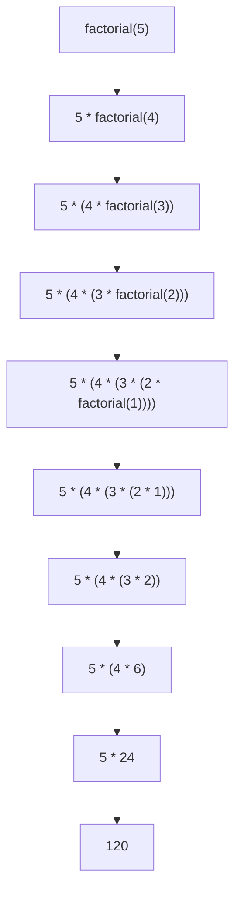

# Python 函数定义

函数是Python编程中最基础也是最强大的概念之一。简单来说，函数是一段可重复使用的代码块，用于执行特定任务。通过函数，我们可以将复杂的程序分解成更小、更可管理的部分，提高代码的可读性和可维护性。

## 为什么需要函数？

在开始学习如何定义函数之前，让我们先了解为什么需要函数：

- **代码重用**：避免编写重复的代码
- **模块化**：将大型程序分解成小块，便于管理
- **抽象**：隐藏复杂的实现细节，只关注功能的使用
- **可维护性**：更容易修改和扩展

## 函数定义语法

在Python中，我们使用`def`关键字来定义函数。基本语法如下：

```python
def 函数名(参数1, 参数2, ...):
    """文档字符串（可选）"""
    # 函数体（代码块）
    return 返回值  # 可选
```

让我们逐个分析这些组成部分：

1. **函数名**：遵循变量命名规则，通常使用小写字母和下划线
2. **参数列表**：函数可以接收的输入值（可选）
3. **文档字符串**：解释函数功能（可选但推荐）
4. **函数体**：实际执行的代码
5. **返回值**：函数执行后返回的结果（可选）

## 简单函数示例

让我们从一个简单的示例开始：

```python
def say_hello():
    """这个函数打印一条欢迎消息"""
    print("Hello, welcome to Python functions!")
    
# 调用函数
say_hello()
```

输出：
```
Hello, welcome to Python functions!
```

这是一个最简单的函数，没有参数，也没有返回值，只是打印一条消息。

## 带参数的函数

大多数情况下，我们需要函数接收一些输入值，这就是参数的作用：

```python
def greet(name):
    """这个函数向特定的人打招呼"""
    print(f"Hello, {name}! How are you today?")
    
# 调用函数并传递参数
greet("Alice")
greet("Bob")
```

输出：
```
Hello, Alice! How are you today?
Hello, Bob! How are you today?
```

### 多个参数

函数可以接收多个参数：

```python
def add_numbers(a, b):
    """这个函数返回两个数字的和"""
    sum_result = a + b
    print(f"{a} + {b} = {sum_result}")
    return sum_result

# 调用带有两个参数的函数
result = add_numbers(5, 3)
print(f"返回的结果是: {result}")
```

输出：
```
5 + 3 = 8
返回的结果是: 8
```

:::tip
注意上面的例子中，我们不仅打印了结果，还使用`return`关键字返回了结果。这意味着函数的结果可以被存储并在其他地方使用。
:::

## 参数类型

Python函数支持多种参数类型，让我们逐一了解：

### 默认参数

可以为参数设置默认值，当调用函数时没有提供该参数，将使用默认值：

```python
def greet(name, greeting="Hello"):
    """使用指定的问候语向某人打招呼"""
    print(f"{greeting}, {name}!")
    
# 不指定greeting参数，将使用默认值
greet("Alex")

# 指定greeting参数
greet("Emma", "Good morning")
```

输出：
```
Hello, Alex!
Good morning, Emma!
```

### 关键字参数

可以使用参数名来指定参数，这样参数顺序就不重要了：

```python
def describe_pet(pet_name, animal_type):
    """显示宠物信息"""
    print(f"I have a {animal_type} named {pet_name}.")
    
# 使用位置参数
describe_pet("Harry", "hamster")

# 使用关键字参数
describe_pet(animal_type="dog", pet_name="Rex")
```

输出：
```
I have a hamster named Harry.
I have a dog named Rex.
```

### 可变参数

有时我们不知道函数会接收多少个参数，可以使用`*args`和`**kwargs`：

```python
def make_pizza(size, *toppings):
    """打印披萨的配料信息"""
    print(f"Making a {size}-inch pizza with the following toppings:")
    for topping in toppings:
        print(f"- {topping}")
        
# 调用带有不同数量参数的函数
make_pizza(12, "mushrooms")
make_pizza(16, "extra cheese", "pepperoni", "olives")
```

输出：
```
Making a 12-inch pizza with the following toppings:
- mushrooms
Making a 16-inch pizza with the following toppings:
- extra cheese
- pepperoni
- olives
```

使用`**kwargs`接收任意关键字参数：

```python
def build_profile(first, last, **user_info):
    """创建用户资料字典"""
    profile = {'first_name': first, 'last_name': last}
    
    # 添加其他所有信息到字典
    for key, value in user_info.items():
        profile[key] = value
        
    return profile
    
# 创建用户资料
user = build_profile('Albert', 'Einstein',
                    location='Princeton',
                    field='Physics',
                    age=76)
                    
print(user)
```

输出：
```
{'first_name': 'Albert', 'last_name': 'Einstein', 'location': 'Princeton', 'field': 'Physics', 'age': 76}
```

## 函数返回值

函数可以通过`return`语句返回值。一旦执行到`return`，函数就会立即结束并返回指定的值：

```python
def square(number):
    """返回数字的平方"""
    return number ** 2
    
result = square(4)
print(f"4的平方是: {result}")
```

输出：
```
4的平方是: 16
```

### 返回多个值

Python函数可以返回多个值，实际上是返回一个元组：

```python
def get_name_parts(full_name):
    """分割全名为姓和名"""
    parts = full_name.split()
    if len(parts) >= 2:
        first_name = parts[0]
        last_name = ' '.join(parts[1:])
        return first_name, last_name
    else:
        return parts[0], ""
        
# 获取姓名的各部分
first, last = get_name_parts("Marie Curie")
print(f"姓: {last}")
print(f"名: {first}")
```

输出：
```
姓: Curie
名: Marie
```

## 函数的作用域

变量的作用域指的是变量在程序中可被访问的区域：

```python
def my_function():
    # 局部变量，只在函数内部可见
    local_var = "I am local"
    print(local_var)
    
# 全局变量，在整个模块中可见
global_var = "I am global"

my_function()
print(global_var)
# print(local_var)  # 这会产生错误，因为local_var是局部变量
```

输出：
```
I am local
I am global
```

:::caution
如果取消注释最后一行，将会出现`NameError`错误，因为`local_var`只在函数内部可见。
:::

### 使用global关键字

如果需要在函数内部修改全局变量，可以使用`global`关键字：

```python
counter = 0

def increment():
    global counter
    counter += 1
    print(f"内部计数: {counter}")
    
print(f"初始计数: {counter}")
increment()
increment()
print(f"最终计数: {counter}")
```

输出：
```
初始计数: 0
内部计数: 1
内部计数: 2
最终计数: 2
```

## 实际应用案例

让我们通过一个更实际的例子来展示函数的强大功能：一个简单的温度转换程序。

```python
def celsius_to_fahrenheit(celsius):
    """将摄氏度转换为华氏度"""
    return (celsius * 9/5) + 32
    
def fahrenheit_to_celsius(fahrenheit):
    """将华氏度转换为摄氏度"""
    return (fahrenheit - 32) * 5/9
    
def main():
    """主函数，处理用户输入和显示结果"""
    print("温度转换程序")
    print("1. 摄氏度转华氏度")
    print("2. 华氏度转摄氏度")
    
    choice = input("请选择转换类型 (1/2): ")
    
    if choice == '1':
        temp = float(input("请输入摄氏度: "))
        converted = celsius_to_fahrenheit(temp)
        print(f"{temp}°C = {converted:.2f}°F")
    elif choice == '2':
        temp = float(input("请输入华氏度: "))
        converted = fahrenheit_to_celsius(temp)
        print(f"{temp}°F = {converted:.2f}°C")
    else:
        print("无效的选择")

# 运行程序
main()
```

示例输出1：
```
温度转换程序
1. 摄氏度转华氏度
2. 华氏度转摄氏度
请选择转换类型 (1/2): 1
请输入摄氏度: 25
25.0°C = 77.00°F
```

示例输出2：
```
温度转换程序
1. 摄氏度转华氏度
2. 华氏度转摄氏度
请选择转换类型 (1/2): 2
请输入华氏度: 98.6
98.6°F = 37.00°C
```

在这个例子中，我们定义了三个函数：
- 两个用于温度转换
- 一个`main`函数用于协调整个程序的运行

这是函数的一个关键优势：将程序分解为更小的、专注于特定任务的模块。

## 函数文档

在Python中，使用文档字符串（docstring）来说明函数的功能是一个很好的习惯：

```python
def calculate_area(length, width):
    """
    计算矩形的面积。
    
    参数:
        length (float): 矩形的长度
        width (float): 矩形的宽度
        
    返回:
        float: 矩形的面积
    """
    return length * width
    
# 可以使用help函数查看文档
help(calculate_area)
```

输出：
```
Help on function calculate_area in module __main__:

calculate_area(length, width)
    计算矩形的面积。
    
    参数:
        length (float): 矩形的长度
        width (float): 矩形的宽度
        
    返回:
        float: 矩形的面积
```

## 函数式编程演示

Python支持函数式编程风格，这意味着函数可以：
1. 赋值给变量
2. 作为参数传递给其他函数
3. 从其他函数返回

```python
def add(a, b):
    return a + b
    
def subtract(a, b):
    return a - b
    
def apply_operation(a, b, operation):
    """应用指定的操作到两个数字上"""
    return operation(a, b)
    
# 函数作为参数传递
result1 = apply_operation(10, 5, add)
result2 = apply_operation(10, 5, subtract)

print(f"10 + 5 = {result1}")
print(f"10 - 5 = {result2}")

# 函数赋值给变量
my_operation = add
print(f"使用变量调用函数: {my_operation(7, 3)}")
```

输出：
```
10 + 5 = 15
10 - 5 = 5
使用变量调用函数: 10
```

## 递归函数

递归是指函数调用自身的过程。这是解决某些问题的强大技术：

```python
def factorial(n):
    """计算n的阶乘"""
    # 基本情况
    if n == 0 or n == 1:
        return 1
    # 递归情况
    else:
        return n * factorial(n-1)
        
# 测试阶乘函数
for i in range(6):
    print(f"{i}! = {factorial(i)}")
```

输出：
```
0! = 1
1! = 1
2! = 2
3! = 6
4! = 24
5! = 120
```

递归的工作原理可以用图表表示：



:::warning
递归函数必须有一个基本情况（停止条件），否则会导致无限递归，最终导致栈溢出错误。
:::

## 总结

Python函数是一段可重用的代码块，可以执行特定任务。我们了解了：

- 如何使用`def`关键字定义函数
- 不同类型的参数（默认参数、关键字参数、可变参数）
- 函数返回值
- 变量作用域
- 文档字符串的重要性
- 函数式编程概念
- 递归函数

函数是构建可维护和可扩展程序的基础。通过将代码分解成小的、专注的函数，我们可以提高代码的可读性、可测试性和可维护性。

## 练习

为了强化你对Python函数的理解，尝试完成以下练习：

1. 编写一个函数，接收一个列表并返回其中的最大值和最小值。
2. 创建一个计算器函数，可以执行基本算术运算（加减乘除）。
3. 编写一个函数，接收一个字符串并返回该字符串是否为回文（正着读和倒着读都一样）。
4. 实现一个函数，使用递归计算斐波那契数列的第n个数。
5. 创建一个函数，可以计算任意数量参数的平均值。

## 进一步学习资源

如果你想深入学习Python函数，可以参考以下资源：

- [Python官方文档 - 定义函数](https://docs.python.org/zh-cn/3/tutorial/controlflow.html#defining-functions)
- [Python官方文档 - 函数定义的更多信息](https://docs.python.org/zh-cn/3/tutorial/controlflow.html#more-on-defining-functions)
- 《Python编程：从入门到实践》第8章 - 函数

函数是Python编程的核心概念之一，掌握它将使你能够编写更简洁、更有组织的代码。继续练习，不断探索新的函数功能和使用场景！