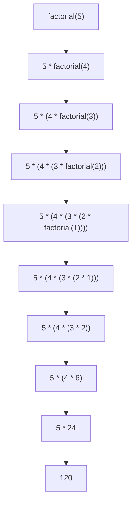

# Python 递归

## 什么是递归？

递归是一种编程技术，指的是**函数调用自身**的过程。换句话说，当一个函数在其定义中直接或间接地调用自己时，这种函数就被称为递归函数。

递归的核心思想可以概括为：**把大问题分解成相似的小问题来解决**。

:::note
递归在编程中非常重要，它可以让我们用简洁的代码解决复杂的问题，特别是那些具有分治特性的问题。
:::

## 递归的基本结构

一个典型的递归函数包含两个主要部分：

1. **基本情况（Base Case）**：当问题简单到可以直接解决时的情况，这是递归停止的条件。
2. **递归情况（Recursive Case）**：将原问题分解为更小的子问题，并调用自身解决这些子问题。

```python
def recursive_function(parameters):
    # 基本情况
    if base_case_condition:
        return base_case_value
    
    # 递归情况
    return recursive_function(modified_parameters)
```

## 递归示例：阶乘计算

阶乘是递归的一个经典应用。n的阶乘（表示为n!）是指从1到n的所有整数的乘积。

### 数学定义
- 0! = 1
- n! = n × (n-1)!，当n > 0

### Python 实现

```python
def factorial(n):
    # 基本情况
    if n == 0 or n == 1:
        return 1
    
    # 递归情况
    return n * factorial(n - 1)

# 测试阶乘函数
print(factorial(5))  # 输出: 120
print(factorial(0))  # 输出: 1
```

### 执行过程

以计算`factorial(5)`为例，我们可以看到递归的执行过程：



## 理解递归的关键点

### 1. 递归出口

每个递归函数必须有一个或多个基本情况（递归出口），否则函数将无限递归下去，最终导致栈溢出错误。

```python
# 错误的递归（没有基本情况）
def bad_recursion(n):
    return n * bad_recursion(n - 1)  # 永远不会结束！
```

### 2. 递归深度

Python对递归深度有默认限制（通常为1000），以防止无限递归导致的栈溢出。可以通过`sys.getrecursionlimit()`查看当前限制：

```python
import sys
print(sys.getrecursionlimit())  # 输出默认递归限制
```

:::caution
虽然可以通过`sys.setrecursionlimit()`增加递归深度限制，但这并不能真正解决问题，因为Python的递归本身就较为消耗资源。对于需要深度递归的问题，考虑使用迭代方法或尾递归优化更为合适。
:::

### 3. 递归 vs 迭代

递归和迭代（循环）通常可以相互转换。以阶乘为例：

```python
# 递归版本
def factorial_recursive(n):
    if n == 0 or n == 1:
        return 1
    return n * factorial_recursive(n - 1)

# 迭代版本
def factorial_iterative(n):
    result = 1
    for i in range(1, n + 1):
        result *= i
    return result
```

**比较**：
- 递归版本通常代码更简洁，更直观地反映了问题的数学定义。
- 迭代版本通常更高效，不会有栈溢出的风险。

## 经典递归案例

### 1. 斐波那契数列

斐波那契数列是另一个递归的经典应用：第1个和第2个数都是1，从第3个数开始，每个数都是前两个数的和。

```python
def fibonacci(n):
    # 基本情况
    if n <= 0:
        return 0
    if n == 1 or n == 2:
        return 1
    
    # 递归情况
    return fibonacci(n - 1) + fibonacci(n - 2)

# 测试
for i in range(1, 11):
    print(f"fibonacci({i}) = {fibonacci(i)}")
```

输出：
```
fibonacci(1) = 1
fibonacci(2) = 1
fibonacci(3) = 2
fibonacci(4) = 3
fibonacci(5) = 5
fibonacci(6) = 8
fibonacci(7) = 13
fibonacci(8) = 21
fibonacci(9) = 34
fibonacci(10) = 55
```

:::tip
纯递归计算斐波那契数列效率很低，因为有大量重复计算。在实际应用中，建议使用动态规划或记忆化递归来优化。
:::

### 2. 汉诺塔问题

汉诺塔是一个古老的数学问题：有三根柱子和多个大小不同的圆盘，开始时所有圆盘都叠在第一根柱子上，目标是将所有圆盘移动到第三根柱子上，并保持从小到大的顺序。移动过程中必须遵守以下规则：
- 每次只能移动一个圆盘
- 大圆盘不能放在小圆盘上面

```python
def hanoi(n, source, auxiliary, target):
    if n == 1:
        print(f"把圆盘 1 从 {source} 移动到 {target}")
        return
    
    # 将n-1个圆盘从source移到auxiliary
    hanoi(n - 1, source, target, auxiliary)
    
    # 将第n个圆盘从source移到target
    print(f"把圆盘 {n} 从 {source} 移动到 {target}")
    
    # 将n-1个圆盘从auxiliary移到target
    hanoi(n - 1, auxiliary, source, target)

# 测试汉诺塔问题
hanoi(3, 'A', 'B', 'C')
```

输出：
```
把圆盘 1 从 A 移动到 C
把圆盘 2 从 A 移动到 B
把圆盘 1 从 C 移动到 B
把圆盘 3 从 A 移动到 C
把圆盘 1 从 B 移动到 A
把圆盘 2 从 B 移动到 C
把圆盘 1 从 A 移动到 C
```

## 递归的实际应用场景

除了上述经典案例，递归在实际编程中有很多应用：

### 1. 目录遍历

递归是遍历目录结构的自然方式：

```python
import os

def list_files(directory):
    """递归列出目录中的所有文件"""
    for item in os.listdir(directory):
        path = os.path.join(directory, item)
        if os.path.isfile(path):
            print(f"文件: {path}")
        elif os.path.isdir(path):
            print(f"目录: {path}")
            # 递归调用处理子目录
            list_files(path)

# 使用示例
# list_files('/path/to/directory')
```

### 2. 数据结构操作

递归在操作树形数据结构（如二叉树）时非常有用：

```python
class TreeNode:
    def __init__(self, value):
        self.value = value
        self.left = None
        self.right = None

def inorder_traversal(node):
    """中序遍历二叉树"""
    if node is None:
        return
    
    # 先遍历左子树
    inorder_traversal(node.left)
    # 访问当前节点
    print(node.value)
    # 再遍历右子树
    inorder_traversal(node.right)

# 创建一个简单的二叉树
root = TreeNode(1)
root.left = TreeNode(2)
root.right = TreeNode(3)
root.left.left = TreeNode(4)
root.left.right = TreeNode(5)

# 中序遍历
inorder_traversal(root)  # 输出: 4 2 5 1 3
```

### 3. 分治算法

递归是分治算法的核心，如归并排序：

```python
def merge_sort(arr):
    """归并排序"""
    if len(arr) <= 1:
        return arr
    
    # 分解
    mid = len(arr) // 2
    left = merge_sort(arr[:mid])
    right = merge_sort(arr[mid:])
    
    # 合并
    return merge(left, right)

def merge(left, right):
    """合并两个已排序的数组"""
    result = []
    i = j = 0
    
    while i < len(left) and j < len(right):
        if left[i] < right[j]:
            result.append(left[i])
            i += 1
        else:
            result.append(right[j])
            j += 1
    
    result.extend(left[i:])
    result.extend(right[j:])
    return result

# 测试归并排序
arr = [38, 27, 43, 3, 9, 82, 10]
sorted_arr = merge_sort(arr)
print("排序结果:", sorted_arr)  # 输出: [3, 9, 10, 27, 38, 43, 82]
```

## 递归优化技巧

### 1. 尾递归

尾递归是指递归调用是函数的最后一个操作的特殊情形，这种形式的递归可以被编译器或解释器优化。

```python
# 普通递归版本的阶乘
def factorial(n):
    if n == 0:
        return 1
    return n * factorial(n - 1)  # 递归调用后还有乘法操作

# 尾递归版本的阶乘
def factorial_tail(n, accumulator=1):
    if n == 0:
        return accumulator
    return factorial_tail(n - 1, n * accumulator)  # 递归调用是最后操作
```

:::warning
虽然尾递归在理论上可以被优化，但Python解释器没有实现尾递归优化，因此在Python中尾递归和普通递归在性能上没有显著差异。
:::

### 2. 记忆化递归

记忆化是一种优化技术，它通过存储已经计算过的结果来避免重复计算。

```python
# 未优化的斐波那契数列计算
def fib(n):
    if n <= 1:
        return n
    return fib(n-1) + fib(n-2)

# 使用记忆化的斐波那契数列计算
def fib_memo(n, memo={}):
    if n in memo:
        return memo[n]
    if n <= 1:
        return n
    memo[n] = fib_memo(n-1, memo) + fib_memo(n-2, memo)
    return memo[n]

# 使用Python内置的functools.lru_cache进行记忆化
from functools import lru_cache

@lru_cache(maxsize=None)
def fib_cached(n):
    if n <= 1:
        return n
    return fib_cached(n-1) + fib_cached(n-2)

# 比较性能
import time

n = 35

start = time.time()
print(f"fib({n}) = {fib(n)}")
print(f"未优化用时: {time.time() - start:.2f}秒")

start = time.time()
print(f"fib_memo({n}) = {fib_memo(n)}")
print(f"记忆化优化用时: {time.time() - start:.2f}秒")

start = time.time()
print(f"fib_cached({n}) = {fib_cached(n)}")
print(f"lru_cache优化用时: {time.time() - start:.2f}秒")
```

## 总结

递归是一种强大的编程技术，它利用函数自我调用来解决问题。虽然递归可能不像迭代那样高效，但它往往能提供更为简洁和直观的解决方案，特别是对于本质具有递归性质的问题。

掌握递归需要理解：
1. 基本情况（递归终止条件）
2. 递归步骤（问题分解）
3. 递归深度和效率考虑
4. 何时使用递归，何时选择迭代

通过实践和不断练习，你将能够更自然地应用递归来解决各种编程挑战。

## 练习题

通过完成以下练习来提升你对递归的理解：

1. 编写一个递归函数计算整数的幂（x^n）。
2. 使用递归实现二分查找算法。
3. 编写一个递归函数来判断字符串是否为回文。
4. 实现递归版本的快速排序。
5. 创建一个递归函数，计算给定数字的所有数字之和（例如，对于123，返回1+2+3=6）。

## 更多资源

- [Python官方文档中的递归函数](https://docs.python.org/3/tutorial/controlflow.html#defining-functions)
- [递归与动态规划](https://en.wikipedia.org/wiki/Dynamic_programming)
- [Master定理 - 分析递归算法的复杂度](https://en.wikipedia.org/wiki/Master_theorem_(analysis_of_algorithms))

祝你在递归学习中取得进步！递归学习的最佳方式就是：学习递归，然后递归地学习。🔄