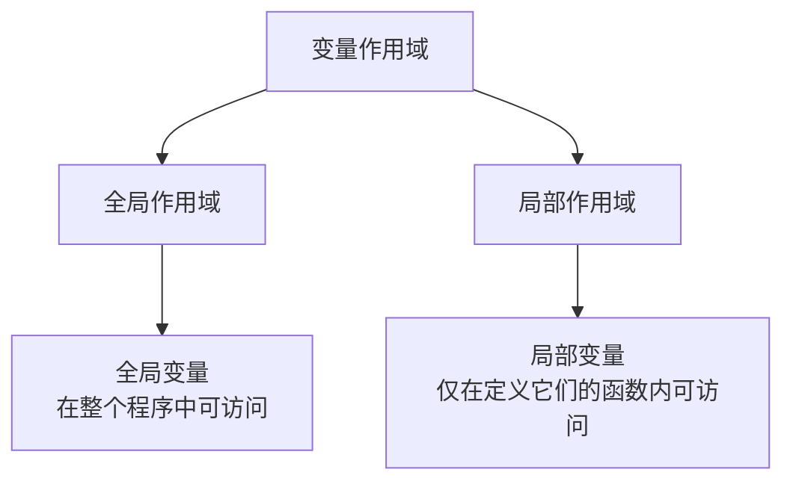
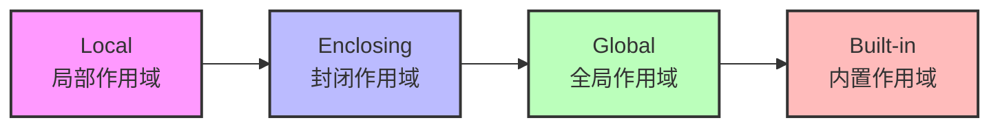

# Python 全局变量与局部变量

在Python编程中，理解变量的作用域是编写高效、无错代码的关键。变量的作用域决定了它在程序的哪些部分是可见和可访问的。Python主要有两种类型的变量作用域：全局变量和局部变量。

## 什么是变量作用域？

变量作用域是指变量在程序中可被访问的范围。这决定了在代码的特定部分中，哪些变量可以被使用。



## 全局变量

全局变量是在任何函数或类之外定义的变量，可以在整个程序中的任何地方访问。

### 定义全局变量

```python
# 这是一个全局变量
global_var = 100

def print_global():
    print(f"全局变量的值: {global_var}")

print_global()  # 输出: 全局变量的值: 100
```

在上面的例子中，`global_var` 是一个全局变量，可以在函数 `print_global()` 内部访问。

## 局部变量

局部变量是在函数内部定义的，只能在定义它们的函数内部访问。

### 定义局部变量

```python
def my_function():
    # 这是一个局部变量
    local_var = 200
    print(f"局部变量的值: {local_var}")

my_function()  # 输出: 局部变量的值: 200

# 尝试在函数外部访问局部变量会导致错误
# print(local_var)  # 这行代码会引发 NameError: name 'local_var' is not defined
```

在这个例子中，`local_var` 是函数 `my_function()` 内部的一个局部变量，只能在函数内部使用。

## 全局变量与局部变量的区别

理解全局变量和局部变量的区别对于编写可维护的代码至关重要：

1. **作用域**：全局变量在整个程序中都可访问，而局部变量只在定义它们的函数内部可访问。
2. **生命周期**：全局变量在程序运行期间始终存在，而局部变量只在函数执行期间存在。
3. **命名冲突**：局部变量可以与全局变量同名，此时局部变量会覆盖全局变量（在函数内部）。

### 命名冲突示例

```python
message = "这是全局变量"

def show_message():
    message = "这是局部变量"  # 与全局变量同名
    print(f"函数内部: {message}")

show_message()  # 输出: 函数内部: 这是局部变量
print(f"函数外部: {message}")  # 输出: 函数外部: 这是全局变量
```

在函数 `show_message()` 内部，局部变量 `message` 覆盖了全局变量 `message`，但只在函数内部有效。

## 在函数内部修改全局变量

如果你想在函数内部修改全局变量，需要使用 `global` 关键字。

```python
counter = 0  # 全局变量

def increment():
    global counter  # 声明使用全局变量
    counter += 1
    print(f"计数器值: {counter}")

increment()  # 输出: 计数器值: 1
increment()  # 输出: 计数器值: 2
print(f"全局计数器值: {counter}")  # 输出: 全局计数器值: 2
```

:::caution 警告
过度使用全局变量可能导致代码难以维护和调试，因为任何函数都可能修改它们。
:::

## 嵌套函数中的变量作用域

在嵌套函数中，内部函数可以访问外部函数的变量，但不能修改它们，除非使用 `nonlocal` 关键字。

```python
def outer_function():
    outer_var = "外部变量"
    
    def inner_function():
        print(f"内部函数可以访问: {outer_var}")
    
    inner_function()

outer_function()  # 输出: 内部函数可以访问: 外部变量
```

### 使用 nonlocal 修改外部函数变量

```python
def counter_function():
    count = 0
    
    def increment():
        nonlocal count  # 声明变量为非局部变量
        count += 1
        return count
    
    return increment

counter = counter_function()
print(counter())  # 输出: 1
print(counter())  # 输出: 2
print(counter())  # 输出: 3
```

## 变量查找顺序 (LEGB 规则)

Python在查找变量时遵循LEGB规则：

1. **Local** (局部) - 首先在当前函数的局部作用域中查找
2. **Enclosing** (封闭) - 然后在封闭函数(外层函数)的作用域中查找
3. **Global** (全局) - 接着在全局作用域中查找
4. **Built-in** (内置) - 最后在Python内置作用域中查找



## 实际应用案例

### 案例1: 跟踪游戏分数

```python
# 全局游戏状态
score = 0
game_active = True

def play_game():
    # 使用全局变量
    global score
    
    if game_active:
        # 游戏逻辑
        score += 10
        print(f"当前得分: {score}")
    else:
        print("游戏已结束")

def game_over():
    global game_active
    game_active = False
    print(f"游戏结束! 最终得分: {score}")

# 游戏进行
play_game()  # 输出: 当前得分: 10
play_game()  # 输出: 当前得分: 20
game_over()  # 输出: 游戏结束! 最终得分: 20
play_game()  # 输出: 游戏已结束
```

### 案例2: 计数器闭包

```python
def create_counter(start=0):
    """创建一个计数器函数"""
    count = start  # 封闭作用域变量
    
    def increment(step=1):
        nonlocal count  # 使用nonlocal关键字访问封闭作用域变量
        count += step
        return count
    
    return increment

# 创建两个独立的计数器
counter1 = create_counter()
counter2 = create_counter(100)

print(counter1())  # 输出: 1
print(counter1())  # 输出: 2

print(counter2())  # 输出: 101
print(counter2(5))  # 输出: 106
```

## 最佳实践

1. **尽量减少全局变量的使用**：过多的全局变量会使代码难以维护。
2. **使用函数参数和返回值传递数据**：这是比使用全局变量更清晰的方法。
3. **当需要在函数间共享数据时，考虑使用类**：类提供了更结构化的方法来共享数据。
4. **为必要的全局变量使用明确的命名约定**：例如使用大写字母（`MAX_VALUE`）。
5. **不要忘记在函数内部使用 `global` 关键字来修改全局变量**。

## 总结

- **全局变量**在整个程序中可访问，定义在任何函数外部。
- **局部变量**只在定义它们的函数内部可访问。
- 使用 `global` 关键字在函数内修改全局变量。
- 使用 `nonlocal` 关键字在嵌套函数中修改外部函数的变量。
- Python使用LEGB规则查找变量。
- 尽量限制全局变量的使用，优先使用参数传递和返回值。

## 练习题

1. 编写一个程序，包含一个全局变量和一个修改该全局变量的函数。
2. 创建一个嵌套函数，其中内部函数可以修改外部函数的变量。
3. 编写一个程序，演示当局部变量与全局变量同名时会发生什么。
4. 创建一个简单的计数器程序，使用全局变量跟踪计数。
5. 实现一个简单的温度转换程序，包含全局设置（如温度单位）和局部计算函数。

:::tip 提示
记住，理解变量作用域不仅可以帮助你避免常见的编程错误，还能让你编写更清晰、更易于维护的代码！
:::