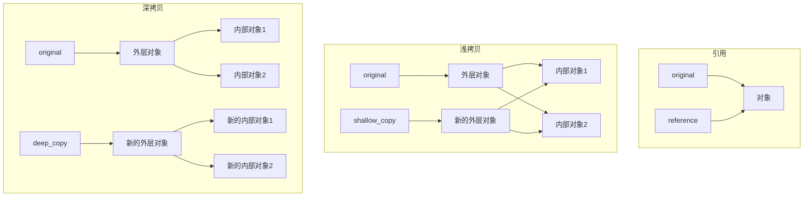

# Python 浅拷贝与深拷贝

当我们在Python中处理数据时，经常需要创建对象的副本。这时候就会涉及到"拷贝"的概念。Python提供了两种主要的拷贝方式：浅拷贝（Shallow Copy）和深拷贝（Deep Copy）。理解它们的区别对于编写正确的Python程序至关重要。

## 引用与拷贝

在详细讲解浅拷贝和深拷贝之前，让我们先理解Python中的变量引用机制：

```python
# 创建一个列表
original_list = [1, 2, 3]
# 创建一个引用
reference_list = original_list

# 修改reference_list
reference_list.append(4)

print("original_list:", original_list)
print("reference_list:", reference_list)
```

输出结果：
```
original_list: [1, 2, 3, 4]
reference_list: [1, 2, 3, 4]
```

从上面的例子可以看出，当我们将一个变量赋值给另一个变量时，实际上只是创建了一个新的引用，指向同一个对象。这不是拷贝，而是引用。

:::warning
在Python中，简单的赋值语句不会创建对象的副本，而只是创建一个新的引用！
:::

## 浅拷贝（Shallow Copy）

浅拷贝会创建一个新的对象，但它包含的元素仍是原始对象元素的引用。Python提供了多种方式来创建浅拷贝：

1. 使用切片操作 `[:]`
2. 使用列表的 `copy()` 方法
3. 使用 `list()` 构造函数
4. 使用 `copy` 模块的 `copy()` 函数

让我们通过一个例子来理解浅拷贝：

```python
import copy

# 创建一个包含列表的列表
original = [[1, 2, 3], [4, 5, 6]]

# 使用不同的方法创建浅拷贝
shallow_copy1 = original[:]
shallow_copy2 = original.copy()
shallow_copy3 = list(original)
shallow_copy4 = copy.copy(original)

# 修改内部列表
original[0][0] = 100

print("original:", original)
print("shallow_copy1:", shallow_copy1)
print("shallow_copy2:", shallow_copy2)
print("shallow_copy3:", shallow_copy3)
print("shallow_copy4:", shallow_copy4)
```

输出结果：
```
original: [[100, 2, 3], [4, 5, 6]]
shallow_copy1: [[100, 2, 3], [4, 5, 6]]
shallow_copy2: [[100, 2, 3], [4, 5, 6]]
shallow_copy3: [[100, 2, 3], [4, 5, 6]]
shallow_copy4: [[100, 2, 3], [4, 5, 6]]
```

可以看到，虽然我们创建了新的列表对象，但内部的子列表仍是原始列表的引用。因此，当我们修改原始列表的内部元素时，所有的浅拷贝也会受到影响。

:::note
浅拷贝仅复制对象的第一层，对于嵌套的可变对象，只复制其引用。
:::

## 深拷贝（Deep Copy）

与浅拷贝不同，深拷贝会递归地复制对象中的所有元素，创建一个完全独立的副本。Python中通过 `copy` 模块的 `deepcopy()` 函数实现深拷贝：

```python
import copy

# 创建一个包含列表的列表
original = [[1, 2, 3], [4, 5, 6]]

# 创建深拷贝
deep_copy = copy.deepcopy(original)

# 修改原始列表的内部元素
original[0][0] = 100

print("original:", original)
print("deep_copy:", deep_copy)
```

输出结果：
```
original: [[100, 2, 3], [4, 5, 6]]
deep_copy: [[1, 2, 3], [4, 5, 6]]
```

从结果可以看出，深拷贝创建了一个完全独立的副本，对原始对象的修改不会影响深拷贝对象。

:::tip
当需要创建完全独立的数据副本时，应该使用深拷贝。
:::

## 浅拷贝与深拷贝的图解

下面用图表方式直观展示浅拷贝和深拷贝的区别：



## 可变对象与不可变对象的拷贝

理解浅拷贝和深拷贝的关键在于区分Python中的可变对象（如列表、字典、集合）和不可变对象（如整数、字符串、元组）：

- 对于不可变对象，无论是浅拷贝还是深拷贝，其行为都类似于简单的引用，因为不可变对象无法被修改。
- 对于可变对象，浅拷贝和深拷贝的区别就显得尤为重要。

```python
import copy

# 不可变对象示例
original_tuple = (1, 2, 3)
shallow_tuple = copy.copy(original_tuple)
deep_tuple = copy.deepcopy(original_tuple)

print(original_tuple is shallow_tuple)  # 可能输出 True，因为不可变对象可能被优化
print(original_tuple is deep_tuple)     # 可能输出 True，因为不可变对象可能被优化

# 包含可变对象的元组
original_tuple_with_list = (1, [2, 3], 4)
shallow_tuple_with_list = copy.copy(original_tuple_with_list)
deep_tuple_with_list = copy.deepcopy(original_tuple_with_list)

# 修改内部列表
original_tuple_with_list[1][0] = 200

print("original:", original_tuple_with_list)
print("shallow:", shallow_tuple_with_list)
print("deep:", deep_tuple_with_list)
```

输出结果：
```
True
True
original: (1, [200, 3], 4)
shallow: (1, [200, 3], 4)
deep: (1, [2, 3], 4)
```

## 实际应用场景

理解浅拷贝和深拷贝在实际编程中非常重要，下面是几个应用场景：

### 1. 数据备份

当你需要处理重要数据并尝试不同算法时，可以使用深拷贝保留原始数据：

```python
import copy

# 原始用户数据
user_data = {
    "name": "张三",
    "scores": [85, 92, 78],
    "contact": {
        "email": "zhangsan@example.com",
        "phone": "13812345678"
    }
}

# 创建数据备份
backup_data = copy.deepcopy(user_data)

# 尝试处理数据
user_data["scores"].append(88)
user_data["contact"]["email"] = "new_email@example.com"

# 如果处理出错，可以恢复原始数据
if error_occurred:
    user_data = backup_data
```

### 2. 状态管理

在游戏或应用程序中保存对象状态：

```python
import copy

class GameState:
    def __init__(self):
        self.player_position = [0, 0]
        self.enemies = [{"position": [5, 5], "health": 100},
                       {"position": [10, 10], "health": 80}]
        self.score = 0
    
    def save_checkpoint(self):
        return copy.deepcopy(self)

# 游戏进行中
game = GameState()
game.score = 100
game.player_position = [3, 4]

# 保存检查点
checkpoint = game.save_checkpoint()

# 继续游戏
game.score = 150
game.enemies[0]["health"] = 50

# 如果玩家失败，回到检查点
if player_dies:
    game = checkpoint
```

### 3. 函数参数传递

在传递可变对象给函数时，可能需要考虑使用拷贝：

```python
import copy

def process_data(data):
    # 创建数据的深拷贝，避免修改原始数据
    local_data = copy.deepcopy(data)
    local_data.append(100)
    return local_data

original_data = [1, 2, 3]
processed_data = process_data(original_data)

print("原始数据:", original_data)        # [1, 2, 3]
print("处理后的数据:", processed_data)    # [1, 2, 3, 100]
```

## 性能考虑

需要注意的是，深拷贝会递归复制所有对象，可能会消耗更多的内存和时间。如果对象结构非常复杂或大小很大，深拷贝可能会导致性能问题。

- 使用浅拷贝的性能成本较低，适用于简单结构或只需要复制第一层的场景
- 深拷贝的性能成本较高，但提供完全独立的副本
- 对于性能关键的应用，可能需要自定义拷贝逻辑，只复制必要的部分

```python
import copy
import time

# 创建一个大型嵌套列表
big_list = [[i for i in range(1000)] for _ in range(100)]

# 测量浅拷贝性能
start_time = time.time()
shallow = copy.copy(big_list)
shallow_time = time.time() - start_time
print(f"浅拷贝耗时: {shallow_time:.6f} 秒")

# 测量深拷贝性能
start_time = time.time()
deep = copy.deepcopy(big_list)
deep_time = time.time() - start_time
print(f"深拷贝耗时: {deep_time:.6f} 秒")
```

## 总结

Python中的浅拷贝与深拷贝是处理对象复制的两种不同方法：

1. **浅拷贝** 创建新对象，但内部元素仍是原始对象的引用。
   - 使用 `copy.copy()`、`list.copy()`、切片操作 `[:]` 或列表构造函数 `list()`
   - 适用于只需要复制第一层对象的场景

2. **深拷贝** 递归复制所有对象，创建完全独立的副本。
   - 使用 `copy.deepcopy()`
   - 适用于需要完全独立数据副本的场景

3. **关键区别**:
   - 对于可变对象内部的修改，浅拷贝会受影响，深拷贝不会
   - 对于不可变对象，两种拷贝方式行为类似

:::caution
选择拷贝方式时，需要考虑数据结构、修改需求以及性能因素。使用不当的拷贝方式可能导致难以察觉的bug。
:::

## 练习题

1. 创建一个包含不同类型对象（列表、字典、集合）的复杂数据结构，然后分别使用浅拷贝和深拷贝，观察修改原始数据后两种拷贝的差异。

2. 编写一个函数，接收一个嵌套列表作为参数，返回此列表的自定义深拷贝（不使用 `copy.deepcopy()`）。

3. 分析一个程序，找出可能因为没有正确使用深拷贝而导致的潜在问题，并修复它。

## 进一步学习资源

- Python官方文档中关于[`copy`模块](https://docs.python.org/3/library/copy.html)的说明
- 阅读Python标准库中`copy.py`的源代码，了解深浅拷贝的具体实现
- 探索更复杂场景下的拷贝问题，如循环引用、自定义类的拷贝行为

掌握Python的浅拷贝与深拷贝概念，将帮助你编写更健壮、更可靠的代码，避免因数据意外修改而导致的难以追踪的bug。