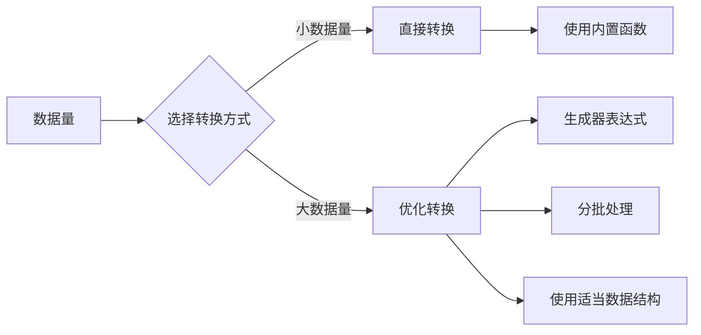

# Python 数据结构转换

## 介绍

在Python编程中，数据结构转换是一项基础且重要的技能。不同的数据结构各有优缺点，我们经常需要在它们之间进行转换以满足特定的需求。本文将详细介绍Python中常见数据结构（列表、元组、集合、字典、字符串等）之间的转换方法、使用场景以及注意事项。

:::tip
掌握数据结构转换可以帮助你更灵活地处理数据，提高代码效率，并解决许多实际问题！
:::

## 基础数据结构回顾

在学习转换之前，让我们先简要回顾Python的主要数据结构：

1. **列表(List)**: 有序、可变、允许重复元素 `[1, 2, 3]`
2. **元组(Tuple)**: 有序、不可变、允许重复元素 `(1, 2, 3)`
3. **集合(Set)**: 无序、可变、不允许重复元素 `{1, 2, 3}`
4. **字典(Dict)**: 无序、可变、键-值对 `{"a": 1, "b": 2}`
5. **字符串(String)**: 不可变的字符序列 `"hello"`

## 列表转换到其他数据结构

### 列表转元组

将列表转换为元组非常简单，只需使用`tuple()`函数：

```python
my_list = [1, 2, 3, 4]
my_tuple = tuple(my_list)
print(my_tuple)  # 输出: (1, 2, 3, 4)
```

### 列表转集合

使用`set()`函数可以将列表转换为集合，这会自动去除重复元素：

```python
my_list = [1, 2, 2, 3, 4, 4]
my_set = set(my_list)
print(my_set)  # 输出: {1, 2, 3, 4}
```

### 列表转字典

列表转字典有几种方式，最常见的是使用列表中的键值对：

```python
# 方法1：使用包含元组的列表
pairs = [('a', 1), ('b', 2), ('c', 3)]
my_dict = dict(pairs)
print(my_dict)  # 输出: {'a': 1, 'b': 2, 'c': 3}

# 方法2：使用zip函数将两个列表合并
keys = ['a', 'b', 'c']
values = [1, 2, 3]
my_dict = dict(zip(keys, values))
print(my_dict)  # 输出: {'a': 1, 'b': 2, 'c': 3}
```

### 列表转字符串

将列表元素连接成字符串：

```python
my_list = ['hello', 'world', 'python']
# 使用join方法
my_string = ' '.join(my_list)
print(my_string)  # 输出: hello world python

# 如果列表包含非字符串元素，需要先转换
num_list = [1, 2, 3, 4]
my_string = ' '.join(map(str, num_list))
print(my_string)  # 输出: 1 2 3 4
```

## 元组转换到其他数据结构

### 元组转列表

使用`list()`函数：

```python
my_tuple = (1, 2, 3, 4)
my_list = list(my_tuple)
print(my_list)  # 输出: [1, 2, 3, 4]
```

### 元组转集合

使用`set()`函数：

```python
my_tuple = (1, 2, 2, 3, 4, 4)
my_set = set(my_tuple)
print(my_set)  # 输出: {1, 2, 3, 4}
```

### 元组转字典

与列表转字典类似：

```python
# 元组中包含键值对元组
tuple_pairs = (('a', 1), ('b', 2), ('c', 3))
my_dict = dict(tuple_pairs)
print(my_dict)  # 输出: {'a': 1, 'b': 2, 'c': 3}
```

## 集合转换到其他数据结构

### 集合转列表

使用`list()`函数：

```python
my_set = {1, 2, 3, 4}
my_list = list(my_set)
print(my_list)  # 输出: [1, 2, 3, 4]（注意：顺序可能不同）
```

### 集合转元组

使用`tuple()`函数：

```python
my_set = {1, 2, 3, 4}
my_tuple = tuple(my_set)
print(my_tuple)  # 输出: (1, 2, 3, 4)（注意：顺序可能不同）
```

:::caution
由于集合是无序的，转换后的列表或元组的元素顺序可能是不确定的。
:::

## 字典转换到其他数据结构

### 字典转列表

从字典可以提取不同的数据形成列表：

```python
my_dict = {'a': 1, 'b': 2, 'c': 3}

# 获取键列表
keys_list = list(my_dict.keys())
print(keys_list)  # 输出: ['a', 'b', 'c']

# 获取值列表
values_list = list(my_dict.values())
print(values_list)  # 输出: [1, 2, 3]

# 获取键值对列表
items_list = list(my_dict.items())
print(items_list)  # 输出: [('a', 1), ('b', 2), ('c', 3)]
```

### 字典转元组

与列表类似，可以获取键、值或键值对的元组：

```python
my_dict = {'a': 1, 'b': 2, 'c': 3}

# 获取键元组
keys_tuple = tuple(my_dict.keys())
print(keys_tuple)  # 输出: ('a', 'b', 'c')

# 获取值元组
values_tuple = tuple(my_dict.values())
print(values_tuple)  # 输出: (1, 2, 3)

# 获取键值对元组
items_tuple = tuple(my_dict.items())
print(items_tuple)  # 输出: (('a', 1), ('b', 2), ('c', 3))
```

## 字符串转换到其他数据结构

### 字符串转列表

将字符串拆分成列表有多种方式：

```python
# 将字符串的每个字符转为列表元素
my_string = "hello"
char_list = list(my_string)
print(char_list)  # 输出: ['h', 'e', 'l', 'l', 'o']

# 使用split方法按特定分隔符拆分
words = "hello world python"
word_list = words.split(" ")
print(word_list)  # 输出: ['hello', 'world', 'python']
```

### 字符串转字典

使用字符串创建字典通常需要额外的处理：

```python
# 从格式化字符串创建字典
key_value_pairs = "name=John,age=30,city=New York"
items = key_value_pairs.split(",")
my_dict = {}
for item in items:
    key, value = item.split("=")
    my_dict[key] = value
print(my_dict)  # 输出: {'name': 'John', 'age': '30', 'city': 'New York'}

# 使用字典推导式
my_dict = {key: value for key, value in (item.split("=") for item in key_value_pairs.split(","))}
print(my_dict)  # 输出: {'name': 'John', 'age': '30', 'city': 'New York'}
```

## 复杂转换示例

### JSON字符串与Python对象转换

在处理API或文件数据时，JSON转换非常常见：

```python
import json

# Python 对象转JSON字符串
python_dict = {
    "name": "John",
    "age": 30,
    "courses": ["Python", "JavaScript", "SQL"]
}
json_string = json.dumps(python_dict)
print(json_string)
# 输出: {"name": "John", "age": 30, "courses": ["Python", "JavaScript", "SQL"]}

# JSON字符串转Python对象
parsed_dict = json.loads(json_string)
print(parsed_dict)
# 输出: {'name': 'John', 'age': 30, 'courses': ['Python', 'JavaScript', 'SQL']}
```

### 嵌套数据结构转换

处理复杂嵌套结构时的转换：

```python
# 嵌套列表转为字典树
nested_list = [
    ["电子产品", ["手机", ["iPhone", "三星"], "电脑", ["笔记本", "台式机"]]],
    ["家具", ["桌子", "椅子"]]
]

def list_to_dict(nested_list):
    result = {}
    for item in nested_list:
        if isinstance(item, list) and len(item) == 2:
            key, value = item
            if isinstance(value, list):
                result[key] = list_to_dict(value)
            else:
                result[key] = value
    return result

category_dict = list_to_dict(nested_list)
print(category_dict)
```

## 实际应用场景

### 数据清洗和预处理

在数据分析中，数据结构转换是常见操作：

```python
# 从CSV数据中提取唯一值
csv_data = "apple,orange,banana,apple,grape,orange,apple"
fruits_list = csv_data.split(",")
unique_fruits = list(set(fruits_list))  # 转换为集合去重，再转回列表
print(unique_fruits)  # 输出可能是：['grape', 'orange', 'banana', 'apple']

# 计数统计
fruit_count = {}
for fruit in fruits_list:
    if fruit in fruit_count:
        fruit_count[fruit] += 1
    else:
        fruit_count[fruit] = 1
print(fruit_count)  # 输出: {'apple': 3, 'orange': 2, 'banana': 1, 'grape': 1}
```

### 配置文件解析

将配置文件转换为程序可用的数据结构：

```python
# 假设我们有一个config字符串
config_string = """
app_name = MyApp
version = 1.0
debug = True
allowed_ips = 192.168.1.1,192.168.1.2,192.168.1.3
"""

# 解析为字典
config_dict = {}
for line in config_string.strip().split('\n'):
    if line and '=' in line:
        key, value = line.split('=', 1)
        key = key.strip()
        value = value.strip()
        
        # 处理特殊类型
        if value == 'True':
            value = True
        elif value == 'False':
            value = False
        elif ',' in value:
            value = value.split(',')
            
        config_dict[key] = value

print(config_dict)
# 输出: {'app_name': 'MyApp', 'version': '1.0', 'debug': True, 'allowed_ips': ['192.168.1.1', '192.168.1.2', '192.168.1.3']}
```

### 数据结构优化

根据操作需求选择最合适的数据结构：

```python
# 假设我们有一个大列表，需要频繁检查元素是否存在
big_list = list(range(10000))

# 列表查询性能
import time
start_time = time.time()
5000 in big_list  # 使用列表查询
list_time = time.time() - start_time

# 转换为集合后查询性能
big_set = set(big_list)
start_time = time.time()
5000 in big_set  # 使用集合查询
set_time = time.time() - start_time

print(f"列表查询时间: {list_time}")  # 例如：0.0005
print(f"集合查询时间: {set_time}")   # 例如：0.00001（快很多倍）
```

## 数据结构转换的性能考虑

在处理大量数据时，不同的转换方式可能会影响性能：



### 大数据集优化示例

```python
# 处理大量数据时的优化转换

# 不好的方式：一次性加载所有数据到内存
def bad_approach(filename):
    with open(filename, 'r') as f:
        lines = f.readlines()  # 一次读取所有行
    
    # 所有处理都在内存中完成
    words = []
    for line in lines:
        words.extend(line.split())
    
    word_count = {}
    for word in words:
        if word in word_count:
            word_count[word] += 1
        else:
            word_count[word] = 1
    return word_count

# 更好的方式：逐行处理，使用生成器
def better_approach(filename):
    word_count = {}
    
    with open(filename, 'r') as f:
        for line in f:  # 逐行读取
            for word in line.split():
                word_count[word] = word_count.get(word, 0) + 1
    
    return word_count
```

## 总结

Python数据结构之间的转换是编程中常见且重要的操作。通过本文，我们学习了：

1. 列表、元组、集合、字典、字符串之间的基本转换方法
2. 复杂数据结构的转换技巧
3. 实际应用场景中的数据结构转换
4. 数据转换时的性能考虑

掌握这些转换技巧不仅能让我们更灵活地处理数据，还能根据具体需求选择最合适的数据结构，提高程序的效率和可读性。

## 练习

为了巩固所学知识，尝试完成以下练习：

1. 编写一个函数，将一个包含重复元素的列表转换为无重复元素的列表，同时保持原顺序。
2. 将字符串 "key1=value1;key2=value2;key3=value3" 转换为字典。
3. 有一个列表 `[{"name": "Alice", "score": 85}, {"name": "Bob", "score": 92}]`，将其转换为 `{"Alice": 85, "Bob": 92}`。
4. 创建一个函数，接受一个字典列表，输出一个新的字典，其中键是指定键的值，值是满足该键值的所有字典。

:::tip 学习建议
数据结构转换是Python编程的基础能力，建议多写代码实践，特别是在处理实际数据时，思考哪种数据结构最适合当前的操作需求。
:::

## 进一步学习资源

- Python官方文档：[Data Structures](https://docs.python.org/3/tutorial/datastructures.html)
- 《Python Cookbook》第1章：数据结构和算法
- 在线练习平台：LeetCode、HackerRank上寻找数据结构相关的题目