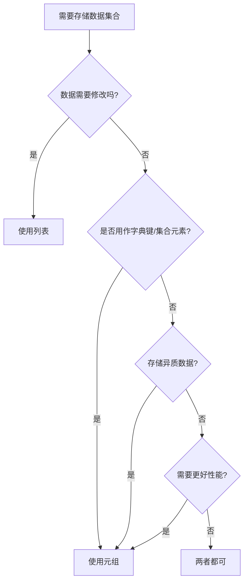

# Python 元组不可变性

在Python中，元组(tuple)是一种常用的数据结构，它与列表(list)非常相似，但有一个关键区别：**元组是不可变的**。这个特性看似简单，但在实际编程中有着重要的意义和应用价值。

## 什么是元组的不可变性？

元组的不可变性意味着一旦创建了元组，就不能修改其内容。具体来说：

- 不能添加或移除元素
- 不能替换元素
- 不能改变元素的顺序

这与列表形成鲜明对比，因为列表是可变的，允许以上所有操作。

## 元组的基本语法

### 创建元组

```python
# 创建一个空元组
empty_tuple = ()

# 创建带有元素的元组
fruits = ("apple", "banana", "cherry")

# 创建只有一个元素的元组（注意逗号）
single_item = ("apple",)  # 必须加逗号，否则Python会将其视为字符串

# 不使用括号也可以创建元组
another_tuple = 1, 2, 3, 4
```

### 访问元组元素

```python
fruits = ("apple", "banana", "cherry")
print(fruits[0])  # 输出: apple
print(fruits[-1])  # 输出: cherry
print(fruits[1:3])  # 输出: ('banana', 'cherry')
```

输出：
```
apple
cherry
('banana', 'cherry')
```

## 验证元组的不可变性

让我们通过一些示例来验证元组的不可变性：

```python
fruits = ("apple", "banana", "cherry")

# 尝试修改元组元素
try:
    fruits[0] = "orange"
except TypeError as e:
    print(f"错误: {e}")

# 尝试添加元素
try:
    fruits.append("orange")
except AttributeError as e:
    print(f"错误: {e}")
    
# 尝试删除元素
try:
    del fruits[0]
except TypeError as e:
    print(f"错误: {e}")
```

输出：
```
错误: 'tuple' object does not support item assignment
错误: 'tuple' object has no attribute 'append'
错误: 'tuple' object doesn't support item deletion
```

:::note
所有这些错误都证明了元组是不可变的。一旦创建，就不能修改其内容。
:::

## 元组不可变性的深入理解

### 元组与可变对象

虽然元组本身是不可变的，但如果元组包含可变对象（如列表），那么这些可变对象的内容是可以改变的：

```python
# 包含列表的元组
mixed_tuple = (1, 2, ["a", "b"])

# 不能改变元组的结构
# mixed_tuple[0] = 5  # 这会报错

# 但可以修改元组中可变对象的内容
mixed_tuple[2].append("c")
print(mixed_tuple)  # 输出: (1, 2, ['a', 'b', 'c'])
```

输出：
```
(1, 2, ['a', 'b', 'c'])
```

:::caution
这不违反元组的不可变性，因为元组的结构（引用的对象）没有改变，改变的只是被引用对象的内容。
:::

### 元组的哈希性

由于元组的不可变性，如果元组仅包含不可变对象，它就是可哈希的（hashable）。这意味着元组可以用作字典的键或集合的元素：

```python
# 元组作为字典键
coord_values = {(0, 0): "origin", (1, 0): "x-axis", (0, 1): "y-axis"}
print(coord_values[(0, 0)])  # 输出: origin

# 列表不能作为键
try:
    bad_dict = {[1, 2]: "value"}
except TypeError as e:
    print(f"错误: {e}")
```

输出：
```
origin
错误: unhashable type: 'list'
```

## 元组不可变性的优势

元组的不可变性提供了几个重要的优势：

### 1. 数据安全性

元组保证了数据不会被意外修改，这在某些情况下非常重要：

```python
# 表示RGB颜色的元组
red = (255, 0, 0)
green = (0, 255, 0)
blue = (0, 0, 255)

def process_color(color):
    # 安全地处理颜色，知道它不会被修改
    r, g, b = color
    return f"RGB({r}, {g}, {b})"

print(process_color(red))  # 输出: RGB(255, 0, 0)
```

### 2. 性能优势

由于元组是不可变的，Python可以对其进行一些内部优化：

```python
import sys

# 比较列表和元组的内存占用
list_example = [1, 2, 3, 4, 5]
tuple_example = (1, 2, 3, 4, 5)

print(f"列表占用内存: {sys.getsizeof(list_example)} 字节")
print(f"元组占用内存: {sys.getsizeof(tuple_example)} 字节")
```

输出（具体值可能因Python版本而异）：
```
列表占用内存: 104 字节
元组占用内存: 80 字节
```

### 3. 线程安全

在多线程环境中，不可变对象更安全，因为它们不会在执行过程中被修改。

## 实际应用场景

### 1. 函数返回多个值

Python中，当函数需要返回多个值时，通常使用元组：

```python
def get_user_info():
    # 假设这些信息来自数据库
    name = "Alice"
    age = 30
    city = "New York"
    return name, age, city  # 隐式创建元组

# 解包元组
user_name, user_age, user_city = get_user_info()
print(f"用户 {user_name} 年龄为 {user_age}，居住在 {user_city}")
```

输出：
```
用户 Alice 年龄为 30，居住在 New York
```

### 2. 数据集中的固定字段

当处理具有固定结构的数据时，元组非常有用：

```python
# 表示学生记录：(id, name, grade)
students = [
    (1, "Alice", 95),
    (2, "Bob", 82),
    (3, "Charlie", 88)
]

# 按成绩排序
sorted_students = sorted(students, key=lambda student: student[2], reverse=True)
for id, name, grade in sorted_students:
    print(f"ID: {id}, 姓名: {name}, 成绩: {grade}")
```

输出：
```
ID: 1, 姓名: Alice, 成绩: 95
ID: 3, 姓名: Charlie, 成绩: 88
ID: 2, 姓名: Bob, 成绩: 82
```

### 3. 作为字典键

使用元组作为字典键可以创建复合键：

```python
# 棋盘状态，键是坐标
chess_board = {}
chess_board[(0, 0)] = "白车"
chess_board[(0, 1)] = "白马"
chess_board[(7, 0)] = "黑车"

for position, piece in chess_board.items():
    print(f"位置 {position}: {piece}")
```

输出：
```
位置 (0, 0): 白车
位置 (0, 1): 白马
位置 (7, 0): 黑车
```

## 元组 vs 列表：何时选择何者？

选择元组还是列表主要取决于你的需求：



### 选择元组的情况：

- 数据不应该被修改
- 需要将序列用作字典的键
- 存储不同类型的数据项（如数据库记录）
- 需要轻微的性能优化

### 选择列表的情况：

- 需要频繁修改集合
- 需要大量添加/删除元素
- 需要使用列表特有方法（如`sort()`, `append()`, `extend()`等）

## 实用技巧与注意事项

### 命名元组

如果需要更清晰的代码，可以使用`collections`模块中的`namedtuple`：

```python
from collections import namedtuple

# 创建命名元组类型
Person = namedtuple('Person', ['name', 'age', 'city'])

# 创建实例
alice = Person("Alice", 30, "New York")

# 通过名称或索引访问
print(alice.name)  # 输出: Alice
print(alice[0])    # 输出: Alice
print(alice)       # 输出: Person(name='Alice', age=30, city='New York')
```

输出：
```
Alice
Alice
Person(name='Alice', age=30, city='New York')
```

### 元组解包

元组解包是一种强大的语法糖：

```python
# 基本解包
coordinates = (10, 20)
x, y = coordinates
print(f"x: {x}, y: {y}")

# 使用*运算符收集剩余项目
first, *rest = (1, 2, 3, 4, 5)
print(f"First: {first}, Rest: {rest}")

# 忽略某些值（使用_）
name, _, city = ("Alice", 30, "New York")
print(f"Name: {name}, City: {city}")
```

输出：
```
x: 10, y: 20
First: 1, Rest: [2, 3, 4, 5]
Name: Alice, City: New York
```

## 总结

元组的不可变性是Python中的一个重要特性，它提供了数据安全性、性能优势以及适用于多线程环境等好处。虽然这种不可变性可能看起来是一种限制，但在很多场景下，正是这种"限制"使得代码更加安全和高效。

理解元组的不可变性及其应用场景，将帮助你更好地选择数据结构，并在Python编程中写出更加优雅、高效的代码。

## 练习题

为了巩固对元组不可变性的理解，尝试完成以下练习：

1. 创建一个元组，包含四个季节的名称。尝试修改其中一个季节名称，观察并解释会发生什么。

2. 创建一个包含列表的元组，然后修改列表的内容。这合法吗？为什么？

3. 编写一个函数，接受一个二维坐标点（x, y）作为元组，并返回该点到原点的距离。

4. 创建一个字典，使用表示日期的元组（年、月、日）作为键，事件描述作为值。添加至少三个日期和相应的事件。

:::tip
完成这些练习后，尝试思考每个场景中使用元组而不是列表的原因。这将帮助你更好地理解元组不可变性的价值。
:::

## 进一步学习

想要更深入地了解元组和其他Python数据结构，可以参考以下资源：

- Python官方文档中关于元组的章节
- 《Fluent Python》by Luciano Ramalho，特别是关于元组和序列的章节
- Python数据结构与算法相关的在线课程

通过掌握元组的不可变性及其应用，你将在Python编程旅程中更进一步！