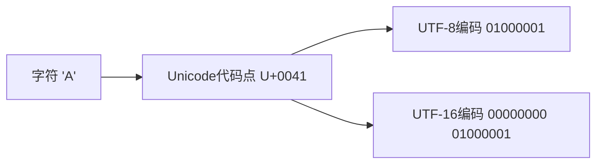

# Python Unicode处理

## Unicode简介

在全球化的数字世界中，我们需要处理各种语言和符号。Unicode是一种字符编码标准，它为世界上几乎所有的字符提供了唯一的数字标识（代码点）。Python 3在设计上对Unicode提供了出色的支持，这让Python成为处理国际化文本的理想选择。

:::note
Python 3中，所有的字符串默认都是Unicode字符串，这与Python 2有很大不同（Python 2中需要特别标记Unicode字符串）。
:::

## Unicode与字符编码基础

在理解Python的Unicode处理之前，我们需要明确几个基本概念：

- **字符(Character)**: 人类可读的符号，如字母、数字、标点符号等
- **代码点(Code Point)**: Unicode为每个字符分配的唯一数值
- **编码(Encoding)**: 将代码点转换为字节序列的规则（例如UTF-8、UTF-16等）



## Python 中的Unicode字符串

在Python 3中，`str`类型表示Unicode字符串，而`bytes`类型表示字节序列。

### 创建Unicode字符串

```python
# 普通字符串(默认为Unicode)
s1 = "Hello, World!"

# 显式Unicode字符串(使用Unicode转义序列)
s2 = "Hello, \u4E16\u754C"  # Hello, 世界

print(s1)
print(s2)
```

输出:
```
Hello, World!
Hello, 世界
```

### Unicode转义序列

Python支持多种Unicode字符表示方法：

```python
# \u 后接四个十六进制数字(表示BMP平面的字符)
chinese = "\u4E2D\u6587"  # 中文

# \U 后接八个十六进制数字(表示超出BMP平面的字符)
emoji = "\U0001F600"  # 😀

# 使用Unicode字符名称
omega = "\N{GREEK CAPITAL LETTER OMEGA}"  # Ω

print(chinese)
print(emoji)
print(omega)
```

输出:
```
中文
😀
Ω
```

## 编码与解码

编码和解码是Unicode处理中最基本的操作。

### 编码(Unicode → 字节)

```python
text = "你好，世界！"
print(f"原始文本: {text}")

# 使用UTF-8编码
utf8_bytes = text.encode('utf-8')
print(f"UTF-8编码: {utf8_bytes}")

# 使用UTF-16编码
utf16_bytes = text.encode('utf-16')
print(f"UTF-16编码: {utf16_bytes}")

# 使用GBK编码(中文常用)
gbk_bytes = text.encode('gbk')
print(f"GBK编码: {gbk_bytes}")
```

输出:
```
原始文本: 你好，世界！
UTF-8编码: b'\xe4\xbd\xa0\xe5\xa5\xbd\xef\xbc\x8c\xe4\xb8\x96\xe7\x95\x8c\xef\xbc\x81'
UTF-16编码: b'\xff\xfe`N}Y\x0cV\x1aV\x16R!'
GBK编码: b'\xc4\xe3\xba\xc3\xa3\xac\xca\xc0\xbd\xe7\xa3\xa1'
```

### 解码(字节 → Unicode)

```python
# 从UTF-8解码
decoded_utf8 = utf8_bytes.decode('utf-8')
print(f"UTF-8解码: {decoded_utf8}")

# 从UTF-16解码
decoded_utf16 = utf16_bytes.decode('utf-16')
print(f"UTF-16解码: {decoded_utf16}")

# 从GBK解码
decoded_gbk = gbk_bytes.decode('gbk')
print(f"GBK解码: {decoded_gbk}")
```

输出:
```
UTF-8解码: 你好，世界！
UTF-16解码: 你好，世界！
GBK解码: 你好，世界！
```

:::caution
如果使用错误的编码方式解码，会引发`UnicodeDecodeError`错误。在解码时，必须知道数据的原始编码。
:::

### 处理编码错误

Python提供了多种处理编码/解码错误的方式：

```python
text = "你好，世界！"

# 尝试使用ascii编码(不支持中文)
try:
    ascii_bytes = text.encode('ascii')
except UnicodeEncodeError as e:
    print(f"错误: {e}")

# 使用错误处理选项
ascii_bytes_ignore = text.encode('ascii', errors='ignore')
print(f"忽略错误: {ascii_bytes_ignore}")

ascii_bytes_replace = text.encode('ascii', errors='replace')
print(f"替换错误: {ascii_bytes_replace}")

ascii_bytes_xmlcharrefreplace = text.encode('ascii', errors='xmlcharrefreplace')
print(f"XML替换: {ascii_bytes_xmlcharrefreplace}")
```

输出:
```
错误: 'ascii' codec can't encode character '\u4f60' in position 0: ordinal not in range(128)
忽略错误: b''
替换错误: b'??????'
XML替换: b'&#20320;&#22909;&#65292;&#19990;&#30028;&#65281;'
```

常用错误处理选项：
- `strict`：默认选项，遇到错误时抛出异常
- `ignore`：忽略无法编码/解码的字符
- `replace`：用问号替换无法编码/解码的字符
- `xmlcharrefreplace`：(仅编码时)使用XML字符引用

## Unicode字符属性和操作

Python的`unicodedata`模块提供了许多Unicode字符分析工具。

```python
import unicodedata

# 获取字符的Unicode名称
char = 'é'
name = unicodedata.name(char)
print(f"字符 '{char}' 的Unicode名称: {name}")

# 通过名称查找字符
char_from_name = unicodedata.lookup("LATIN SMALL LETTER E WITH ACUTE")
print(f"名称对应的字符: {char_from_name}")

# 获取规范化形式
text = "café"  # 包含组合字符
nfc = unicodedata.normalize('NFC', text)  # 组合形式
nfd = unicodedata.normalize('NFD', text)  # 分解形式

print(f"原始文本: {text}")
print(f"NFC形式: {nfc}, 长度: {len(nfc)}")
print(f"NFD形式: {nfd}, 长度: {len(nfd)}")
print(f"NFC字符编码: {[hex(ord(c)) for c in nfc]}")
print(f"NFD字符编码: {[hex(ord(c)) for c in nfd]}")
```

输出:
```
字符 'é' 的Unicode名称: LATIN SMALL LETTER E WITH ACUTE
名称对应的字符: é
原始文本: café
NFC形式: café, 长度: 4
NFD形式: café, 长度: 5
NFC字符编码: ['0x63', '0x61', '0x66', '0xe9']
NFD字符编码: ['0x63', '0x61', '0x66', '0x65', '0x301']
```

## 实际应用案例

### 案例1：读取不同编码的文件

```python
def read_file_with_encoding(filename, encoding):
    try:
        with open(filename, 'r', encoding=encoding) as f:
            return f.read()
    except UnicodeDecodeError:
        print(f"无法使用{encoding}编码读取文件")
        return None

# 假设我们有一个UTF-8编码的文件和一个GBK编码的文件
# utf8_content = read_file_with_encoding('utf8_file.txt', 'utf-8')
# gbk_content = read_file_with_encoding('gbk_file.txt', 'gbk')
```

### 案例2：网络请求中的编码处理

```python
import requests

def fetch_webpage(url):
    response = requests.get(url)
    
    # 尝试检测编码
    encoding = response.encoding
    print(f"检测到的编码: {encoding}")
    
    # 使用检测到的编码
    content = response.text
    
    # 如果需要，可以强制使用特定编码
    # response.encoding = 'utf-8'
    # content = response.text
    
    return content

# 示例：获取网页
# webpage = fetch_webpage('https://www.example.com')
# print(webpage[:100])  # 打印前100个字符
```

### 案例3：多语言文本排序

```python
import locale

def sort_multilingual_text(text_list, language_code):
    try:
        # 尝试设置区域设置
        locale.setlocale(locale.LC_COLLATE, language_code)
        
        # 根据当前区域设置排序
        sorted_list = sorted(text_list, key=locale.strxfrm)
        return sorted_list
    except locale.Error:
        print(f"不支持的区域设置: {language_code}")
        # 退回到默认排序
        return sorted(text_list)

# 示例：按西班牙语规则排序
spanish_words = ["ñandú", "naranja", "ñu", "niño", "manzana"]
sorted_default = sorted(spanish_words)
sorted_spanish = sort_multilingual_text(spanish_words, 'es_ES.UTF-8')  # 在支持此区域的系统上

print(f"默认排序: {sorted_default}")
print(f"西班牙语排序: {sorted_spanish}")
```

输出（取决于系统支持）:
```
默认排序: ['manzana', 'naranja', 'niño', 'ñandú', 'ñu']
西班牙语排序: ['manzana', 'naranja', 'niño', 'ñandú', 'ñu']
```

## Unicode的常见问题与解决方案

### 1. 文件编码检测

```python
import chardet

def detect_encoding(file_path):
    # 读取文件的二进制数据
    with open(file_path, 'rb') as f:
        raw_data = f.read()
    
    # 检测编码
    result = chardet.detect(raw_data)
    encoding = result['encoding']
    confidence = result['confidence']
    
    print(f"检测到的编码: {encoding} (置信度: {confidence})")
    return encoding

# 示例用法
# encoding = detect_encoding('unknown_encoding.txt')
# if encoding:
#     with open('unknown_encoding.txt', 'r', encoding=encoding) as f:
#         text = f.read()
#         print(text)
```

### 2. 规范化处理

```python
def normalize_unicode_text(text, form='NFC'):
    """
    规范化Unicode文本，使其更容易比较
    form可以是: 'NFC', 'NFKC', 'NFD', 或 'NFKD'
    """
    import unicodedata
    return unicodedata.normalize(form, text)

# 示例
text1 = "café"  # 使用组合字符
text2 = "café"  # 使用预组合字符

print(f"原始比较: {text1 == text2}")
print(f"规范化后比较: {normalize_unicode_text(text1) == normalize_unicode_text(text2)}")
```

输出:
```
原始比较: False
规范化后比较: True
```

## 总结

Unicode处理是Python编程中处理文本的基础知识，特别是在开发国际化应用程序时。本文涵盖了以下内容：

1. Unicode基础概念——字符、代码点和编码
2. Python中创建和处理Unicode字符串的方法
3. 字符串的编码与解码操作
4. 处理Unicode属性和规范化
5. 实际应用案例中的Unicode处理

掌握Unicode处理能力将使你的程序能够更好地处理各种语言和符号，避免字符集相关的问题。

## 练习

1. 创建一个函数，接受一个字符串并打印出其中每个字符的Unicode代码点。
2. 编写一个程序，读取一个UTF-8编码的文件，并将其转换为GBK编码保存。
3. 尝试比较不同规范化形式下的Unicode字符串。
4. 创建一个能检测并正确读取不同编码文件的工具函数。

## 附加资源

- [Python Unicode HOWTO](https://docs.python.org/3/howto/unicode.html)
- [Unicode标准](https://www.unicode.org/standard/standard.html)
- [Python unicodedata模块文档](https://docs.python.org/3/library/unicodedata.html)

:::tip
当处理Unicode和不同编码时，最佳实践是在程序的边界进行编码/解码（如文件I/O、网络请求），而在程序内部始终使用Unicode字符串。这种方法被称为"Unicode三明治"。
:::