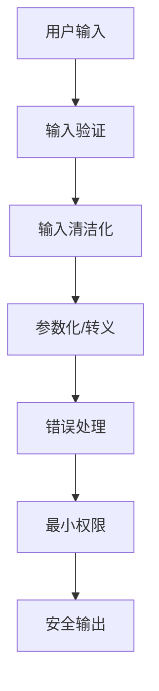

# Python 字符串安全

字符串处理是几乎所有程序的基础部分，但不当的字符串处理可能导致严重的安全问题。在本文中，我们将探讨Python字符串处理中的安全考虑因素，帮助你编写更安全的代码。

## 为什么字符串安全很重要？

字符串常常是用户输入的载体，也是程序与外部系统交互的媒介。不安全的字符串处理可能导致：

- SQL注入攻击
- 命令注入攻击
- 跨站脚本攻击(XSS)
- 信息泄露
- 不当数据解析

## 常见字符串安全问题及解决方案

### 1. SQL注入攻击

SQL注入是最常见的安全漏洞之一，发生在将未经过滤的用户输入直接拼接到SQL查询中。

❌ **不安全的代码：**

```python
username = input("输入用户名：")
query = "SELECT * FROM users WHERE username = '" + username + "'"
cursor.execute(query)
```

如果用户输入 `' OR '1'='1`，查询将变为：

```sql
SELECT * FROM users WHERE username = '' OR '1'='1'
```

这会返回所有用户记录！

✅ **安全的代码：**

```python
username = input("输入用户名：")
query = "SELECT * FROM users WHERE username = %s"
cursor.execute(query, (username,))
```

**输出：**
无论用户输入什么，查询都会被正确参数化，防止SQL注入。

:::tip 参数化查询
始终使用数据库API提供的参数化查询功能，而不是手动拼接SQL字符串。
:::

### 2. 命令注入攻击

当程序使用`os.system()`或`subprocess`模块执行系统命令，并在其中包含用户提供的输入时，可能发生命令注入。

❌ **不安全的代码：**

```python
import os

filename = input("输入要处理的文件名：")
os.system(f"process {filename}")
```

如果用户输入 `document.txt; rm -rf /`，将执行：

```bash
process document.txt; rm -rf /
```

这可能会删除整个文件系统！

✅ **安全的代码：**

```python
import subprocess

filename = input("输入要处理的文件名：")
subprocess.run(["process", filename], check=True)
```

**输出：**
`subprocess.run()`使用列表参数时不会执行shell解析，因此即使文件名中包含特殊字符也是安全的。

### 3. 字符串编码和解码安全

不当的字符串编码/解码处理可能导致数据损坏或安全问题。

❌ **不安全的代码：**

```python
data = get_bytes_from_somewhere()
text = data.decode()  # 未指定编码和错误处理
```

✅ **安全的代码：**

```python
data = get_bytes_from_somewhere()
try:
    text = data.decode("utf-8", errors="replace")
except UnicodeDecodeError:
    print("无法解码数据")
```

**输出：**
即使数据包含无效的UTF-8序列，程序也会安全处理而不会崩溃。

### 4. 格式字符串漏洞

在旧版Python中使用`%`格式化字符串可能存在安全隐患。

❌ **风险代码：**

```python
user_input = input("输入格式化字符串：")
print(user_input % {"secret": "敏感数据"})
```

如果用户输入包含格式说明符如`%(secret)s`，可能会泄露敏感信息。

✅ **安全的代码：**

```python
user_input = input("输入消息：")
print(f"用户消息: {user_input}")  # 使用f-string，不解释用户输入中的格式化字符
```

## 实际应用案例：构建安全的Web表单处理

下面是一个使用Flask处理Web表单的实际案例，展示了如何安全地处理用户输入：

```python
from flask import Flask, request, render_template
import re
import html

app = Flask(__name__)

@app.route('/register', methods=['GET', 'POST'])
def register():
    if request.method == 'POST':
        # 获取用户输入
        username = request.form.get('username', '')
        
        # 1. 验证输入是否符合预期格式
        if not re.match(r'^[a-zA-Z0-9_]{3,20}$', username):
            return "用户名只能包含字母、数字和下划线，长度3-20"
            
        # 2. 在HTML输出前对数据进行转义，防止XSS攻击
        safe_username = html.escape(username)
        
        # 3. 存储数据时使用参数化查询 (使用ORM或参数化SQL)
        # db.execute("INSERT INTO users (username) VALUES (?)", (username,))
        
        return f"注册成功，欢迎 {safe_username}！"
    
    return render_template('register.html')
```

## 字符串安全最佳实践

总结一下Python字符串安全的最佳实践：

1. **输入验证**：永远不要信任用户输入，使用正则表达式或其他方法验证格式。
2. **使用参数化查询**：处理SQL时，使用参数化查询而不是字符串拼接。
3. **正确处理编码**：明确指定编码和错误处理策略。
4. **命令执行安全**：使用`subprocess`模块的列表形式，避免shell注入。
5. **输出编码**：在将数据输出到HTML、XML等环境前，进行适当的转义。
6. **使用安全的API**：优先使用现代、安全的API，如f-strings而非%格式化。
7. **错误处理**：妥善处理解析错误，避免异常泄露敏感信息。

## 防御深度策略

安全不仅仅是一个层面的问题，应采用多层防御策略：



## 实践练习

1. 编写一个函数，安全地解析并验证JSON格式的用户输入。
2. 创建一个简单的备忘录程序，确保存储和显示笔记时防止XSS攻击。
3. 比较以下两种处理SQL查询的方法，并解释为什么一种更安全：
   - 直接字符串拼接
   - 使用参数化查询

## 总结

字符串安全是编程安全的基础部分。正确处理字符串可以防止许多常见的安全漏洞，如SQL注入、命令注入和XSS攻击。通过遵循本文介绍的最佳实践，你可以编写更安全、更健壮的Python程序。

记住：安全不是事后的想法，而应该是设计和编码过程中的核心考虑因素。

## 附加资源

- Python官方文档：[安全考虑](https://docs.python.org/3/library/security_warnings.html)
- OWASP (开放Web应用安全项目)：[注入攻击防御](https://owasp.org/www-community/Injection_Flaws)
- PyPI包：[bleach](https://pypi.org/project/bleach/) - 用于清理和净化HTML

:::caution 记住
永远不要信任用户输入！验证、清洁和转义是处理外部数据的关键步骤。
:::