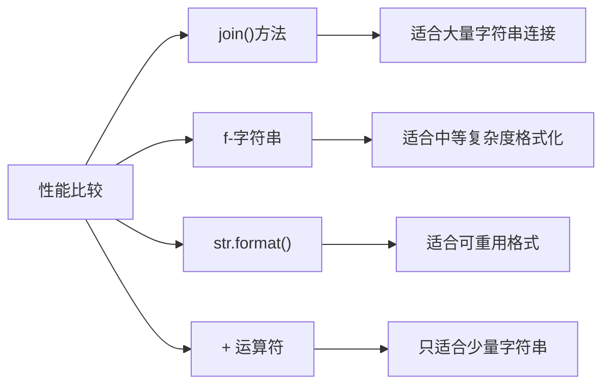

# Python 字符串连接

字符串连接是Python编程中最常见的操作之一，它允许你将多个字符串合并成一个单一的字符串。掌握不同的字符串连接方法能够帮助你更高效地处理文本数据，优化代码性能，并提高代码可读性。

## 为什么需要学习字符串连接？

在日常编程中，我们经常需要:
- 构建用户界面文本
- 生成报告
- 处理用户输入
- 格式化数据输出
- 从多个来源组合信息

本教程将介绍Python中常用的字符串连接方法，并帮助你了解每种方法的优缺点以及最佳使用场景。

## 使用+运算符连接字符串

最直观的字符串连接方式是使用`+`运算符。这种方法简单易懂，适合连接少量字符串。

### 基本用法

```python
first_name = "Python"
last_name = "初学者"
full_name = first_name + " " + last_name
print(full_name)  # 输出: Python 初学者
```

### 多字符串连接

```python
str1 = "学习"
str2 = "Python"
str3 = "真有趣！"
message = str1 + str2 + str3
print(message)  # 输出: 学习Python真有趣！
```

:::caution
使用`+`运算符连接大量字符串会导致性能问题，因为Python字符串是不可变的，每次连接都会创建新的字符串对象。
:::

## 使用join()方法连接字符串

`join()`方法是连接多个字符串的最高效方式，特别是在处理大量字符串时。

### 基本语法

```python
分隔符.join(可迭代字符串对象)
```

### 示例

```python
words = ["Python", "是", "一种", "强大的", "编程语言"]
sentence = " ".join(words)
print(sentence)  # 输出: Python 是 一种 强大的 编程语言
```

### 使用不同分隔符

```python
# 使用逗号分隔
fruits = ["苹果", "香蕉", "橙子"]
fruit_list = ", ".join(fruits)
print(fruit_list)  # 输出: 苹果, 香蕉, 橙子

# 使用空字符串连接
characters = ["P", "y", "t", "h", "o", "n"]
word = "".join(characters)
print(word)  # 输出: Python

# 使用换行符连接
lines = ["第一行", "第二行", "第三行"]
text = "\n".join(lines)
print(text)
# 输出:
# 第一行
# 第二行
# 第三行
```

:::tip
当需要连接大量字符串时，`join()`方法比`+`运算符更高效，因为它只创建一个新的字符串对象。
:::

## 使用f-字符串（Python 3.6+）

自Python 3.6引入的f-字符串（格式化字符串字面量）提供了一种优雅且易读的方式来构建包含变量的字符串。

### 基本语法

```python
f"字符串内容 {变量名} 更多内容"
```

### 简单示例

```python
name = "小明"
age = 20
introduction = f"我叫{name}，今年{age}岁。"
print(introduction)  # 输出: 我叫小明，今年20岁。
```

### 使用表达式

```python
x = 10
y = 5
result = f"{x} + {y} = {x + y}"
print(result)  # 输出: 10 + 5 = 15
```

### 格式化数字

```python
pi = 3.14159
formatted = f"圆周率保留两位小数: {pi:.2f}"
print(formatted)  # 输出: 圆周率保留两位小数: 3.14

percentage = 0.8563
formatted_percentage = f"完成度: {percentage:.2%}"
print(formatted_percentage)  # 输出: 完成度: 85.63%
```

:::note
f-字符串是Python 3.6及以上版本中最推荐的字符串格式化方法，它结合了简洁性和灵活性。
:::

## 使用str.format()方法

`str.format()`方法是Python 3中另一种常用的字符串格式化方法，适用于需要复用格式的场景。

### 基本语法

```python
"字符串内容 {} 更多内容 {}".format(值1, 值2)
```

### 基本用法

```python
name = "小红"
age = 18
introduction = "我叫{}，今年{}岁。".format(name, age)
print(introduction)  # 输出: 我叫小红，今年18岁。
```

### 位置参数与关键字参数

```python
# 位置参数
coordinates = "X: {0}, Y: {1}, Z: {2}".format(10, 20, 30)
print(coordinates)  # 输出: X: 10, Y: 20, Z: 30

# 重用位置参数
repeated = "{0}，{1}，再一次 {0}!".format("你好", "世界")
print(repeated)  # 输出: 你好，世界，再一次 你好!

# 关键字参数
person_info = "姓名: {name}, 年龄: {age}, 职业: {job}".format(name="张三", age=25, job="程序员")
print(person_info)  # 输出: 姓名: 张三, 年龄: 25, 职业: 程序员
```

### 格式规范

```python
# 数字格式化
pi_value = "圆周率: {:.5f}".format(3.14159265359)
print(pi_value)  # 输出: 圆周率: 3.14159

# 宽度与对齐
table = "|{:15}|{:10}|".format("产品名称", "价格")
print(table)  # 输出: |产品名称           |价格        |

# 千位分隔符
large_number = "人口数量: {:,}".format(1234567890)
print(large_number)  # 输出: 人口数量: 1,234,567,890
```

## 实际应用场景

### 场景1: 构建HTML标记

```python
def create_html_element(tag, content, **attributes):
    attr_str = " ".join([f'{key}="{value}"' for key, value in attributes.items()])
    return f"<{tag} {attr_str}>{content}</{tag}>"

button = create_html_element("button", "点击我", id="btn1", class_="primary", disabled="true")
print(button)  # 输出: <button id="btn1" class_="primary" disabled="true">点击我</button>
```

### 场景2: 构建SQL查询

```python
def build_select_query(table, fields, conditions):
    fields_str = ", ".join(fields)
    where_clauses = " AND ".join([f"{key} = '{value}'" for key, value in conditions.items()])
    return f"SELECT {fields_str} FROM {table} WHERE {where_clauses};"

query = build_select_query(
    "users", 
    ["id", "name", "email"], 
    {"status": "active", "age": "18"}
)
print(query)
# 输出: SELECT id, name, email FROM users WHERE status = 'active' AND age = '18';
```

### 场景3: 生成报告

```python
def generate_sales_report(sales_data):
    lines = ["销售报告", "=" * 30]
    
    total = sum(amount for _, amount in sales_data)
    
    for product, amount in sales_data:
        percentage = amount / total * 100
        lines.append(f"{product}: ¥{amount:.2f} ({percentage:.1f}%)")
    
    lines.append("=" * 30)
    lines.append(f"总计: ¥{total:.2f}")
    
    return "\n".join(lines)

sales = [("产品A", 1200.50), ("产品B", 850.75), ("产品C", 1500.00)]
report = generate_sales_report(sales)
print(report)
# 输出:
# 销售报告
# ==============================
# 产品A: ¥1200.50 (33.8%)
# 产品B: ¥850.75 (24.0%)
# 产品C: ¥1500.00 (42.2%)
# ==============================
# 总计: ¥3551.25
```

## 字符串连接方法性能比较

不同的字符串连接方法在性能上有显著差异，特别是处理大量字符串时。



:::warning
在循环中反复使用`+`运算符连接字符串会导致严重的性能问题。对于大型字符串构建，总是首选`join()`方法。
:::

## 总结

Python提供了多种字符串连接方法，每种方法都有其适用场景：

1. **`+`运算符**: 简单直观，适合连接少量字符串
2. **`join()`方法**: 高效，适合连接大量字符串
3. **f-字符串**: 现代、可读性强，适合需要内嵌变量和表达式的场景
4. **`str.format()`**: 灵活，适合需要复杂格式化的场景

选择合适的字符串连接方法可以提高代码的可读性和性能。对于初学者，建议从f-字符串开始，因为它结合了简洁性和功能性，而在需要处理大量字符串时，记得使用`join()`方法。

## 练习

1. 使用不同的连接方法创建一个包含你的个人信息的字符串（姓名、年龄、爱好）。
2. 编写一个函数，接受一个字符串列表，返回一个由逗号分隔的字符串。
3. 创建一个生成简单表格（如学生成绩表）的函数，使用f-字符串格式化输出。
4. 比较使用`+`运算符和`join()`方法连接1000个字符串的性能差异。

## 进一步学习资源

- Python官方文档中的[字符串方法](https://docs.python.org/zh-cn/3/library/stdtypes.html#string-methods)章节
- [PEP 498](https://www.python.org/dev/peps/pep-0498/) - Python增强提案: f-字符串的介绍

通过多练习不同的字符串连接方法，你将能够在实际编程中选择最适合的方法，写出更高效、更清晰的Python代码。