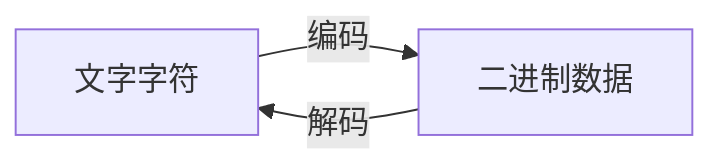

# Python 字符串编码

在Python编程中，字符串编码是一个非常重要的概念，尤其是处理多语言文本、文件操作或网络通信时。理解字符串编码可以帮助你避免很多常见的错误，如乱码问题或编码/解码异常。

## 什么是字符编码？

字符编码是将字符（如文字、数字、符号等）转换为计算机可以存储和处理的数字系统的方法。计算机只能处理数字，因此我们需要一种方法将字符转换为数字。



## 常见的编码方式

### ASCII

ASCII（American Standard Code for Information Interchange，美国信息交换标准代码）是最早的编码标准之一，它使用7位二进制数表示128个不同的字符。

```python
# ASCII编码示例
s = "Hello"
for c in s:
    print(f"字符 '{c}' 的ASCII值是: {ord(c)}")
```

输出：
```
字符 'H' 的ASCII值是: 72
字符 'e' 的ASCII值是: 101
字符 'l' 的ASCII值是: 108
字符 'l' 的ASCII值是: 108
字符 'o' 的ASCII值是: 111
```

### Unicode与UTF-8

Unicode是一个旨在包含所有人类语言中所有字符的字符集。UTF-8是Unicode的一种具体实现方式，是一种变长编码，使用1到4个字节表示不同的字符。

:::note
Python 3中，所有的字符串默认是Unicode字符串。
:::

```python
# UTF-8编码示例
s = "你好，世界"
utf8_bytes = s.encode('utf-8')
print(f"原字符串: {s}")
print(f"UTF-8编码后: {utf8_bytes}")
print(f"解码回来: {utf8_bytes.decode('utf-8')}")
```

输出：
```
原字符串: 你好，世界
UTF-8编码后: b'\xe4\xbd\xa0\xe5\xa5\xbd\xef\xbc\x8c\xe4\xb8\x96\xe7\x95\x8c'
解码回来: 你好，世界
```

### Latin-1 (ISO-8859-1)

Latin-1是一种8位编码，可表示西欧语言中的字符。

```python
# Latin-1编码示例
s = "café"
latin1_bytes = s.encode('latin-1')
print(f"原字符串: {s}")
print(f"Latin-1编码后: {latin1_bytes}")
print(f"解码回来: {latin1_bytes.decode('latin-1')}")
```

输出：
```
原字符串: café
Latin-1编码后: b'caf\xe9'
解码回来: café
```

## Python 中的字符串编码操作

### 编码（encode）

将Unicode字符串转换为特定编码的字节序列。

```python
text = "Python编程"
encoded_text = text.encode('utf-8')
print(f"编码前: {text}")
print(f"编码后: {encoded_text}")
```

输出：
```
编码前: Python编程
编码后: b'Python\xe7\xbc\x96\xe7\xa8\x8b'
```

### 解码（decode）

将特定编码的字节序列转换回Unicode字符串。

```python
encoded_text = b'Python\xe7\xbc\x96\xe7\xa8\x8b'
decoded_text = encoded_text.decode('utf-8')
print(f"解码前: {encoded_text}")
print(f"解码后: {decoded_text}")
```

输出：
```
解码前: b'Python\xe7\xbc\x96\xe7\xa8\x8b'
解码后: Python编程
```

### 检测字符串的编码

Python提供了一个`chardet`库来检测字节序列的编码方式。

```python
# 需要先安装: pip install chardet
import chardet

sample = "你好世界".encode('utf-8')
result = chardet.detect(sample)
print(f"检测结果: {result}")
```

输出：
```
检测结果: {'encoding': 'utf-8', 'confidence': 0.99, 'language': ''}
```

## 常见的编码问题和解决方案

### 1. UnicodeEncodeError

当你尝试将含有非ASCII字符的Unicode字符串编码为不支持这些字符的编码（如ASCII）时，会发生此错误。

```python
try:
    text = "你好"
    encoded = text.encode('ascii')
except UnicodeEncodeError as e:
    print(f"编码错误: {e}")
    # 处理方案：使用errors参数
    encoded = text.encode('ascii', errors='ignore')  # 忽略不能编码的字符
    print(f"忽略后的结果: {encoded}")
    
    encoded = text.encode('ascii', errors='replace')  # 用?替换不能编码的字符
    print(f"替换后的结果: {encoded}")
```

输出：
```
编码错误: 'ascii' codec can't encode characters in position 0-1: ordinal not in range(128)
忽略后的结果: b''
替换后的结果: b'??'
```

### 2. UnicodeDecodeError

当你尝试以错误的编码方式解码字节序列时，会发生此错误。

```python
try:
    # 这是一个UTF-8编码的字节序列
    bytes_data = b'\xe4\xbd\xa0\xe5\xa5\xbd'
    # 尝试用latin-1解码
    text = bytes_data.decode('latin-1')
    print(f"错误解码的结果: {text}")  # 这不会引发错误，但会得到错误的结果
    
    # 尝试用ascii解码
    text = bytes_data.decode('ascii')
except UnicodeDecodeError as e:
    print(f"解码错误: {e}")
```

输出：
```
错误解码的结果: ä½ å¥½
解码错误: 'ascii' codec can't decode byte 0xe4 in position 0: ordinal not in range(128)
```

## 实际应用场景

### 1. 读写不同编码的文本文件

```python
# 写入UTF-8编码的文件
with open('utf8_file.txt', 'w', encoding='utf-8') as f:
    f.write('你好，世界！')

# 写入GBK编码的文件（常用于中文Windows系统）
with open('gbk_file.txt', 'w', encoding='gbk') as f:
    f.write('你好，世界！')

# 读取UTF-8编码的文件
with open('utf8_file.txt', 'r', encoding='utf-8') as f:
    content = f.read()
    print(f"读取UTF-8文件: {content}")

# 读取GBK编码的文件
with open('gbk_file.txt', 'r', encoding='gbk') as f:
    content = f.read()
    print(f"读取GBK文件: {content}")
```

### 2. 处理网页请求和响应

```python
import requests

# 发送请求并处理响应
response = requests.get('https://www.python.org')
# 自动检测并处理网页编码
print(f"网页编码: {response.encoding}")
# 将响应内容解码为Unicode字符串
content = response.text
print(f"网页内容片段: {content[:50]}...")
```

### 3. 数据库操作

```python
import sqlite3

# 建立数据库连接
conn = sqlite3.connect('test.db')
cursor = conn.cursor()

# 创建表并插入Unicode数据
cursor.execute('CREATE TABLE IF NOT EXISTS users (name TEXT)')
cursor.execute("INSERT INTO users VALUES ('张三')")
conn.commit()

# 查询数据
cursor.execute('SELECT name FROM users')
result = cursor.fetchone()
print(f"查询结果: {result[0]}")

conn.close()
```

## 总结

理解Python字符串编码是处理文本数据的基础。在Python 3中，字符串默认是Unicode，只有在需要将其转换为特定编码（如UTF-8、ASCII等）进行存储或传输时，才需要使用`encode()`方法。同样，当从外部源（如文件、网络等）读取字节数据时，需要使用正确的编码方式通过`decode()`方法将其转换为Python的Unicode字符串。

掌握字符串编码知识，可以帮助你避免在处理多语言文本、文件操作和网络通信时遇到的许多常见问题。

## 练习

1. 创建一个包含多种语言字符的字符串，尝试将其编码为不同的编码方式，观察结果。
2. 写一个程序，读取一个文本文件并尝试检测其编码，然后正确地解码显示其内容。
3. 模拟一个UnicodeEncodeError和UnicodeDecodeError，并使用不同的错误处理策略（'ignore'、'replace'、'xmlcharrefreplace'等）来处理它们。

## 延伸阅读

- [Python官方文档：Unicode HOWTO](https://docs.python.org/3/howto/unicode.html)
- [字符编码笔记：ASCII，Unicode和UTF-8](https://www.ruanyifeng.com/blog/2007/10/ascii_unicode_and_utf-8.html)
- [Python标准库：codecs](https://docs.python.org/3/library/codecs.html)