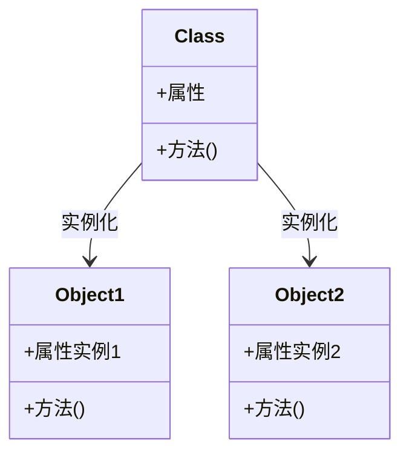

# Python 对象创建

## 什么是对象？

在Python中，一切皆对象。无论是简单的数字、字符串，还是复杂的函数、类，它们都是对象。对象是Python面向对象编程的核心概念，它是数据和操作这些数据的方法的集合。

对象具有三个基本特性：
- **标识（Identity）**：对象在内存中的地址，可以通过`id()`函数获取
- **类型（Type）**：对象所属的类，决定了对象能做什么，可以通过`type()`函数获取
- **值（Value）**：对象的内容

:::note
在Python中，变量并不直接存储值，而是存储对象的引用（内存地址）。
:::

## 类与对象的关系

在Python中，**类（class）**是创建对象的蓝图或模板，而**对象（object）**是类的实例。类定义了对象拥有的属性（数据）和方法（函数），而对象是这些属性和方法的具体载体。



## 创建类和对象

### 定义类

```python
class Person:
    """这是一个表示人的类"""
    
    # 类变量（被所有实例共享）
    species = "Homo sapiens"
    
    # 初始化方法（构造器）
    def __init__(self, name, age):
        # 实例变量（每个实例独有）
        self.name = name
        self.age = age
    
    # 实例方法
    def introduce(self):
        return f"你好，我是{self.name}，我今年{self.age}岁"
    
    # 类方法（使用类变量）
    @classmethod
    def get_species(cls):
        return cls.species
```

### 创建对象（实例化）

```python
# 创建Person类的实例
person1 = Person("张三", 25)
person2 = Person("李四", 30)

# 访问实例变量
print(person1.name)  # 输出: 张三
print(person2.age)   # 输出: 30

# 调用实例方法
print(person1.introduce())  # 输出: 你好，我是张三，我今年25岁

# 访问类变量
print(Person.species)  # 输出: Homo sapiens
print(person1.species)  # 也可以通过实例访问类变量

# 调用类方法
print(Person.get_species())  # 输出: Homo sapiens
```

## `__init__` 方法详解

`__init__` 方法是一个特殊方法（也称为构造方法），它在创建对象时自动调用。它的主要作用是初始化对象的属性。

:::tip
`__init__` 方法的第一个参数始终是 `self`，代表实例本身。在创建实例时，我们不需要显式传递这个参数，Python解释器会自动处理。
:::

```python
class Book:
    def __init__(self, title, author, pages):
        self.title = title
        self.author = author
        self.pages = pages
        self.current_page = 1  # 默认值
    
    def read(self):
        print(f"正在阅读《{self.title}》第{self.current_page}页")
        self.current_page += 1

# 创建Book实例
my_book = Book("Python编程", "张三", 300)
my_book.read()  # 输出: 正在阅读《Python编程》第1页
my_book.read()  # 输出: 正在阅读《Python编程》第2页
```

## 实例化的高级方法

### 使用 `__new__` 方法

`__new__` 是创建对象时调用的第一个方法，它负责返回一个新的实例。`__init__` 只是负责初始化这个实例。

```python
class Singleton:
    _instance = None
    
    def __new__(cls, *args, **kwargs):
        if cls._instance is None:
            cls._instance = super().__new__(cls)
        return cls._instance
    
    def __init__(self, name):
        self.name = name

# 测试单例模式
s1 = Singleton("实例1")
s2 = Singleton("实例2")

print(s1 is s2)  # 输出: True
print(s1.name)   # 输出: 实例2
print(s2.name)   # 输出: 实例2
```

:::caution
在上面的单例模式实现中，虽然`s1`和`s2`是同一个对象，但`__init__`方法会在每次实例化时被调用，因此`name`属性会被最后一次调用的值覆盖。
:::

### 使用类方法作为构造器

类方法可以用作替代构造器，提供不同的对象创建方式。

```python
class Date:
    def __init__(self, year, month, day):
        self.year = year
        self.month = month
        self.day = day
    
    @classmethod
    def from_string(cls, date_string):
        year, month, day = map(int, date_string.split('-'))
        return cls(year, month, day)
    
    @classmethod
    def today(cls):
        import datetime
        now = datetime.datetime.now()
        return cls(now.year, now.month, now.day)
    
    def __str__(self):
        return f"{self.year}-{self.month}-{self.day}"

# 使用不同的构造方式
d1 = Date(2023, 10, 15)  # 普通构造
d2 = Date.from_string("2023-10-16")  # 从字符串构造
d3 = Date.today()  # 获取今天的日期

print(d1)  # 输出: 2023-10-15
print(d2)  # 输出: 2023-10-16
print(d3)  # 输出: 当前日期
```

## 实际案例：银行账户系统

下面是一个更复杂的例子，展示了如何使用类和对象创建一个简单的银行账户系统：

```python
class BankAccount:
    # 类变量，跟踪所有账户
    accounts = {}
    next_account_number = 10000
    
    def __init__(self, owner_name, initial_balance=0):
        self.owner = owner_name
        self.balance = initial_balance
        self.account_number = BankAccount.next_account_number
        BankAccount.next_account_number += 1
        
        # 将账户添加到账户字典中
        BankAccount.accounts[self.account_number] = self
    
    def deposit(self, amount):
        if amount > 0:
            self.balance += amount
            return f"存款成功，当前余额：{self.balance}"
        return "存款金额必须大于0"
    
    def withdraw(self, amount):
        if amount <= 0:
            return "取款金额必须大于0"
        if amount > self.balance:
            return "余额不足"
        
        self.balance -= amount
        return f"取款成功，当前余额：{self.balance}"
    
    def get_balance(self):
        return f"账户余额：{self.balance}"
    
    @classmethod
    def get_account(cls, account_number):
        return cls.accounts.get(account_number, None)
    
    def __str__(self):
        return f"账号：{self.account_number}，户主：{self.owner}，余额：{self.balance}"

# 创建账户
account1 = BankAccount("张三", 1000)
account2 = BankAccount("李四", 500)

# 进行操作
print(account1)  # 输出: 账号：10000，户主：张三，余额：1000
print(account2)  # 输出: 账号：10001，户主：李四，余额：500

print(account1.deposit(500))  # 输出: 存款成功，当前余额：1500
print(account2.withdraw(200))  # 输出: 取款成功，当前余额：300

# 通过账号获取账户
retrieved_account = BankAccount.get_account(10000)
print(retrieved_account)  # 输出: 账号：10000，户主：张三，余额：1500
```

## 总结

在Python中，对象创建是面向对象编程的核心概念之一。通过定义类和创建实例，我们可以构建复杂的系统和模型。关键点包括：

1. **类**是创建对象的蓝图，定义了对象的属性和方法
2. **对象**是类的实例，代表具体的数据和操作
3. **`__init__`**方法用于初始化对象属性
4. 可以通过**类变量**在所有实例间共享数据
5. **实例变量**则属于每个对象自己
6. **类方法**可以作为替代构造器，提供多种对象创建方式
7. **`__new__`**方法允许在创建实例时进行干预，适用于特殊模式如单例

## 练习

1. 创建一个`Rectangle`类，包含`width`和`height`属性，以及计算面积和周长的方法。
2. 扩展`BankAccount`类，添加一个利息计算方法，并创建一个`SavingsAccount`子类，实现不同的利息计算规则。
3. 实现一个`Logger`类的单例模式，确保应用中只有一个日志记录器实例。

## 延伸阅读

- Python官方文档中关于[类](https://docs.python.org/zh-cn/3/tutorial/classes.html)的部分
- 了解Python中的魔术方法（Magic Methods），它们以双下划线开头和结尾，如`__init__`、`__str__`等
- 探索Python的元类（metaclass）概念，了解类的创建过程更深层次的机制