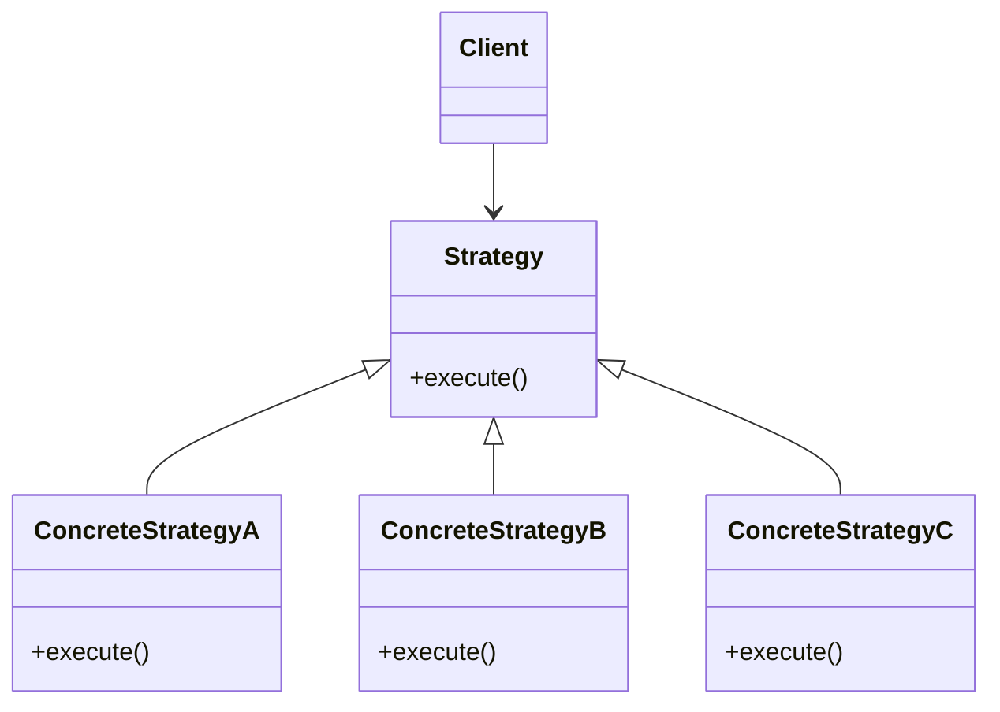

# Python 多态

## 什么是多态？

多态（Polymorphism）是面向对象编程的重要概念之一，字面意思是"多种形态"。在Python中，多态允许不同类的对象对同一消息（方法调用）作出不同的响应。简单来说，多态就是同一个接口，不同的实现。

多态的核心思想是：
- 允许使用父类型引用指向子类对象
- 当调用父类型引用的方法时，实际执行的是子类对象的方法

:::tip
多态是面向对象编程的三大特性（封装、继承、多态）之一，它极大地增强了代码的灵活性和可扩展性。
:::

## Python 中的多态实现

与一些静态类型语言不同，Python是动态类型语言，天生就支持多态。在Python中，我们不需要像Java那样显式声明接口或抽象类来实现多态（虽然Python也有抽象类的概念）。Python的"鸭子类型"（Duck Typing）使得多态的实现更为简洁。

>"如果它走起路来像鸭子，叫起来像鸭子，那么它就是鸭子。"

这意味着Python关注的是对象的行为（方法），而不是对象的类型。

### 基本多态示例

让我们通过一个简单的例子来理解多态：

```python
class Animal:
    def speak(self):
        pass

class Dog(Animal):
    def speak(self):
        return "汪汪!"

class Cat(Animal):
    def speak(self):
        return "喵喵!"

class Duck(Animal):
    def speak(self):
        return "嘎嘎!"

# 函数接受任何Animal对象
def animal_sound(animal):
    print(animal.speak())

# 创建不同动物对象
dog = Dog()
cat = Cat()
duck = Duck()

# 同一个函数可以处理不同类型的对象
animal_sound(dog)  # 输出: 汪汪!
animal_sound(cat)  # 输出: 喵喵!
animal_sound(duck)  # 输出: 嘎嘎!
```

在上面的例子中：
1. 我们定义了一个基类`Animal`，它有一个`speak()`方法。
2. 三个子类`Dog`、`Cat`和`Duck`继承自`Animal`，并各自实现了`speak()`方法。
3. `animal_sound()`函数接受一个`Animal`类型的参数，并调用其`speak()`方法。
4. 当我们向`animal_sound()`函数传递不同的动物对象时，它会调用对应对象类型的`speak()`方法。

这就是多态的体现：同一个方法调用可以根据对象类型执行不同的操作。

## 鸭子类型：Python的多态方式

Python的多态更多地体现为"鸭子类型"。这意味着我们甚至不需要继承关系就能实现多态。只要对象实现了相同的方法，它们就可以以相同的方式被使用。

```python
class Dog:
    def speak(self):
        return "汪汪!"

class Cat:
    def speak(self):
        return "喵喵!"

class Person:
    def speak(self):
        return "你好!"

def make_speak(entity):
    print(entity.speak())

dog = Dog()
cat = Cat()
person = Person()

make_speak(dog)     # 输出: 汪汪!
make_speak(cat)     # 输出: 喵喵!
make_speak(person)  # 输出: 你好!
```

在上面的例子中，`Dog`、`Cat`和`Person`类之间没有继承关系，但它们都实现了`speak()`方法。`make_speak()`函数可以处理任何实现了`speak()`方法的对象，这就是"鸭子类型"的体现。

## 多态的实际应用

### 1. 文件操作

Python中文件操作的多态体现：

```python
def read_data(file_obj):
    return file_obj.read()

# 从实际文件读取
with open('example.txt', 'r') as f:
    data = read_data(f)

# 从内存字符串读取
import io
string_io = io.StringIO("这是内存中的字符串数据")
data = read_data(string_io)
```

`read_data()`函数可以接受任何实现了`read()`方法的对象，无论是实际的文件对象还是内存中的字符串IO对象。

### 2. 图形用户界面

在GUI编程中，多态用于处理不同的界面元素：

```python
class UIElement:
    def draw(self):
        pass

class Button(UIElement):
    def draw(self):
        return "绘制按钮"

class TextBox(UIElement):
    def draw(self):
        return "绘制文本框"

class Window:
    def __init__(self):
        self.elements = []
    
    def add_element(self, element):
        self.elements.append(element)
    
    def draw_all(self):
        results = []
        for element in self.elements:
            results.append(element.draw())
        return results

# 创建窗口并添加元素
window = Window()
window.add_element(Button())
window.add_element(TextBox())

# 绘制所有元素
print(window.draw_all())  # 输出: ['绘制按钮', '绘制文本框']
```

### 3. 多态在数据序列化中的应用

```python
def serialize(obj):
    if hasattr(obj, 'to_json'):
        return obj.to_json()
    elif hasattr(obj, 'to_xml'):
        return obj.to_xml()
    else:
        return str(obj)

class User:
    def __init__(self, name, age):
        self.name = name
        self.age = age
    
    def to_json(self):
        return f'{{"name": "{self.name}", "age": {self.age}}}'

class Product:
    def __init__(self, name, price):
        self.name = name
        self.price = price
    
    def to_xml(self):
        return f'<product><name>{self.name}</name><price>{self.price}</price></product>'

user = User("张三", 25)
product = Product("手机", 3999)

print(serialize(user))    # 输出: {"name": "张三", "age": 25}
print(serialize(product)) # 输出: <product><name>手机</name><price>3999</price></product>
print(serialize(42))      # 输出: 42
```

在这个例子中，`serialize()`函数根据对象是否实现了`to_json()`或`to_xml()`方法来决定如何序列化它。

## 抽象基类：更规范的多态

虽然Python的鸭子类型很灵活，但有时我们希望强制子类实现特定的方法。Python的`abc`模块（Abstract Base Classes）提供了这种能力：

```python
from abc import ABC, abstractmethod

class Shape(ABC):
    @abstractmethod
    def area(self):
        pass
    
    @abstractmethod
    def perimeter(self):
        pass

class Rectangle(Shape):
    def __init__(self, width, height):
        self.width = width
        self.height = height
    
    def area(self):
        return self.width * self.height
    
    def perimeter(self):
        return 2 * (self.width + self.height)

class Circle(Shape):
    def __init__(self, radius):
        self.radius = radius
    
    def area(self):
        return 3.14 * self.radius * self.radius
    
    def perimeter(self):
        return 2 * 3.14 * self.radius

# 这将引发错误，因为Triangle没有实现所有抽象方法
# class Triangle(Shape):
#     def __init__(self, a, b, c):
#         self.a = a
#         self.b = b
#         self.c = c
#
#     def perimeter(self):
#         return self.a + self.b + self.c

def print_shape_info(shape):
    print(f"面积: {shape.area()}")
    print(f"周长: {shape.perimeter()}")

rectangle = Rectangle(5, 3)
circle = Circle(4)

print_shape_info(rectangle)  # 输出: 面积: 15, 周长: 16
print_shape_info(circle)     # 输出: 面积: 50.24, 周长: 25.12
```

在这个例子中，`Shape`是一个抽象基类，它声明了两个抽象方法`area()`和`perimeter()`。任何继承`Shape`的类必须实现这两个方法，否则Python会抛出错误。

:::caution
如果一个类继承自抽象基类，但没有实现所有抽象方法，那么这个类本身也会变成抽象类。只有实现了所有抽象方法的子类才能被实例化。
:::

## 多态与方法重写的区别

方法重写（Override）是实现多态的一种手段，但两者概念不同：

- **方法重写**：子类重新定义父类中已有的方法，使其具有不同于父类的行为。
- **多态**：同一操作作用于不同的对象，产生不同的行为。

多态依赖于继承和方法重写来实现，但多态强调的是接口的统一性和实现的多样性。

## 多态的好处

1. **代码更加灵活**：不需要编写针对每种具体类型的代码
2. **提高可扩展性**：新增类型只需实现相同接口，无需修改现有代码
3. **促进代码重用**：一个函数可以处理多种类型
4. **降低耦合度**：代码依赖于抽象接口而非具体实现

## 多态在设计模式中的应用

多态是许多设计模式的基础，例如：



这是策略模式的类图，通过多态，客户端代码可以与不同的策略交互，而不需要知道具体的实现细节。

### 策略模式示例

```python
class SortStrategy:
    def sort(self, dataset):
        pass

class QuickSort(SortStrategy):
    def sort(self, dataset):
        print("使用快速排序")
        # 快速排序实现...
        return sorted(dataset)

class MergeSort(SortStrategy):
    def sort(self, dataset):
        print("使用归并排序")
        # 归并排序实现...
        return sorted(dataset)

class BubbleSort(SortStrategy):
    def sort(self, dataset):
        print("使用冒泡排序")
        # 冒泡排序实现...
        return sorted(dataset)

class Context:
    def __init__(self, strategy):
        self.strategy = strategy
    
    def set_strategy(self, strategy):
        self.strategy = strategy
    
    def sort_data(self, dataset):
        return self.strategy.sort(dataset)

# 客户端代码
data = [5, 3, 8, 1, 9, 2]

# 使用快速排序
context = Context(QuickSort())
result = context.sort_data(data)
print(result)

# 切换到归并排序
context.set_strategy(MergeSort())
result = context.sort_data(data)
print(result)

# 切换到冒泡排序
context.set_strategy(BubbleSort())
result = context.sort_data(data)
print(result)
```

输出：
```
使用快速排序
[1, 2, 3, 5, 8, 9]
使用归并排序
[1, 2, 3, 5, 8, 9]
使用冒泡排序
[1, 2, 3, 5, 8, 9]
```

## 总结

Python多态是面向对象编程中的重要概念，它允许我们编写更加灵活、可扩展的代码。在Python中，多态主要通过以下方式实现：

1. **继承和方法重写**：子类继承父类并重写其方法
2. **鸭子类型**：对象的行为（方法）比对象的类型更重要
3. **抽象基类**：强制子类实现特定的接口

通过多态，我们可以:
- 编写通用代码，处理不同类型的对象
- 降低代码的耦合度
- 提高代码的可扩展性和可维护性
- 实现更加优雅的设计模式

在Python的日常编程中，我们经常不自觉地使用多态，比如对不同类型的对象调用相同的方法（如`len()`、`str()`等）。理解和掌握多态能让我们设计出更加灵活、强大的程序。

## 练习

1. 创建一个`Calculator`类层次结构，包含`Addition`、`Subtraction`、`Multiplication`和`Division`子类，每个子类都实现`calculate()`方法，接受两个参数并返回相应的运算结果。

2. 设计一个简单的形状绘制系统，通过多态实现不同形状的绘制。

3. 实现一个简单的插件系统，所有插件继承自`Plugin`基类并实现`activate()`和`deactivate()`方法。

## 扩展阅读

- Python的`abc`模块：深入学习抽象基类
- 设计模式中的多态应用
- SOLID原则中的Liskov替换原则（LSP）

尝试在你的项目中寻找多态的应用场景，体会它带来的灵活性和可扩展性！