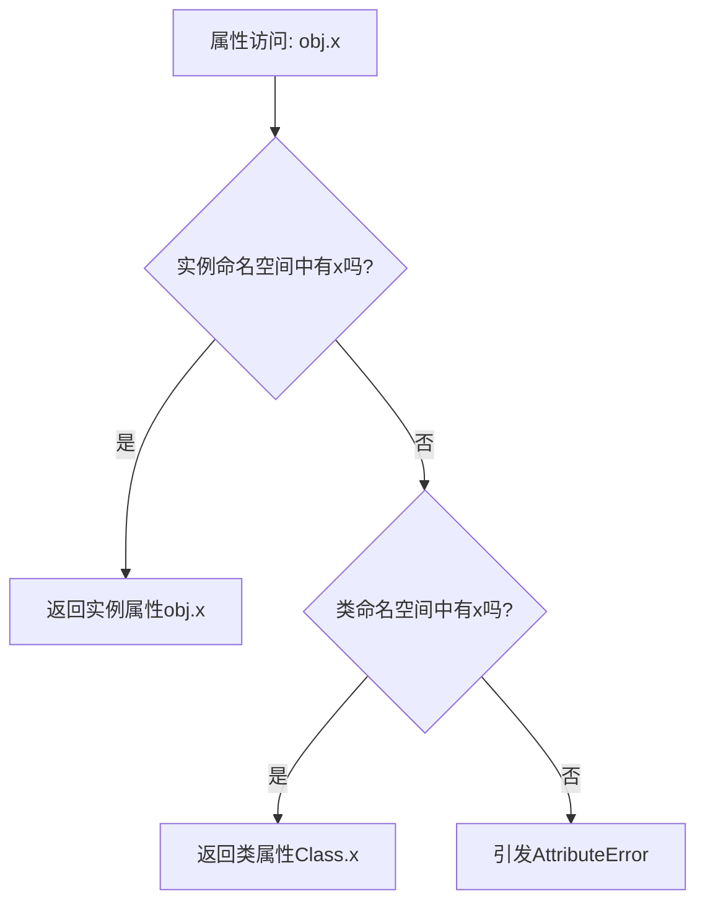

# Python 类属性

## 什么是类属性

在Python面向对象编程中，类属性是直接定义在类中、属于整个类的变量，而不是属于某个特定实例。与实例属性不同，类属性被该类的所有实例共享，并且可以通过类名直接访问。

类属性通常用于定义对于特定类所有实例都相同的特性或常量。

:::tip
类属性存储在类的命名空间中，而非实例的命名空间中。
:::

## 类属性vs实例属性

让我们通过一个简单的例子来区分类属性和实例属性：

```python
class Student:
    # 类属性
    school_name = "Python编程学院"  
    
    def __init__(self, name, age):
        # 实例属性
        self.name = name  
        self.age = age

# 创建两个Student实例
student1 = Student("小明", 18)
student2 = Student("小红", 19)

# 通过类访问类属性
print(Student.school_name)  # 输出: Python编程学院

# 通过实例访问类属性
print(student1.school_name)  # 输出: Python编程学院
print(student2.school_name)  # 输出: Python编程学院

# 修改类属性
Student.school_name = "Python高级学院"
# 所有实例都能看到修改后的类属性值
print(student1.school_name)  # 输出: Python高级学院
print(student2.school_name)  # 输出: Python高级学院
```

### 注意事项

当你通过实例修改类属性时，Python实际上是在该实例上创建了一个同名实例属性，而不是修改类属性：

```python
class Student:
    school_name = "Python编程学院"

student1 = Student()
student2 = Student()

# 通过实例修改"类属性"
student1.school_name = "数据科学学院"  # 实际上创建了实例属性

# 查看结果
print(Student.school_name)    # 输出: Python编程学院 (类属性未变)
print(student1.school_name)   # 输出: 数据科学学院 (实例属性)
print(student2.school_name)   # 输出: Python编程学院 (使用类属性)
```

## 类属性的使用场景

### 1. 常量和配置值

类属性非常适合存储类级别的常量或配置值：

```python
class MathConstants:
    PI = 3.14159265359
    E = 2.71828182846
    GOLDEN_RATIO = 1.61803398875
    
print(MathConstants.PI)  # 输出: 3.14159265359
```

### 2. 跟踪类的实例数量

```python
class User:
    # 类属性用于跟踪创建了多少个用户
    user_count = 0
    
    def __init__(self, username):
        self.username = username
        # 增加用户计数
        User.user_count += 1
    
    @classmethod
    def display_user_count(cls):
        print(f"当前共有 {cls.user_count} 个用户")

# 创建用户
user1 = User("alice")
User.display_user_count()  # 输出: 当前共有 1 个用户

user2 = User("bob")
user3 = User("charlie")
User.display_user_count()  # 输出: 当前共有 3 个用户
```

### 3. 定义类的默认属性

```python
class Circle:
    # 默认半径
    default_radius = 1
    
    def __init__(self, radius=None):
        # 如果没有提供半径，使用默认值
        self.radius = radius if radius is not None else Circle.default_radius
    
    def area(self):
        return 3.14 * self.radius ** 2

# 不指定半径，使用默认值
c1 = Circle()
print(c1.radius)  # 输出: 1
print(c1.area())  # 输出: 3.14

# 指定半径
c2 = Circle(5)
print(c2.radius)  # 输出: 5
print(c2.area())  # 输出: 78.5
```

## 类属性与类方法

类属性经常与类方法（使用`@classmethod`装饰器定义的方法）结合使用，这些方法可以访问和修改类属性：

```python
class Temperature:
    # 类属性
    unit = "摄氏度"  # 默认单位
    
    def __init__(self, value):
        self.value = value
    
    def display(self):
        return f"{self.value} {Temperature.unit}"
    
    @classmethod
    def set_unit(cls, unit):
        """修改温度单位的类方法"""
        if unit in ["摄氏度", "华氏度", "开尔文"]:
            cls.unit = unit
        else:
            print("不支持的温度单位")
            
temp = Temperature(25)
print(temp.display())  # 输出: 25 摄氏度

# 使用类方法修改单位
Temperature.set_unit("华氏度")

# 所有实例都使用新的单位
print(temp.display())  # 输出: 25 华氏度

# 尝试设置无效单位
Temperature.set_unit("未知单位")  # 输出: 不支持的温度单位
```

## 在实际项目中的应用

### 游戏开发中的使用示例

```python
class GameSettings:
    # 游戏全局设置作为类属性
    difficulty = "中等"
    sound_volume = 70
    music_volume = 50
    screen_resolution = (1920, 1080)
    
    @classmethod
    def set_difficulty(cls, level):
        if level in ["简单", "中等", "困难"]:
            cls.difficulty = level
            # 根据难度调整其他参数
            if level == "简单":
                cls.enemy_speed = 0.8
                cls.player_health = 120
            elif level == "中等":
                cls.enemy_speed = 1.0
                cls.player_health = 100
            else:  # 困难
                cls.enemy_speed = 1.2
                cls.player_health = 80
            
            print(f"游戏难度已设置为: {level}")
        else:
            print("无效的难度级别")


# 在游戏初始化时设置难度
GameSettings.set_difficulty("困难")  # 输出: 游戏难度已设置为: 困难

# 在游戏进行中读取设置
print(f"当前音量: {GameSettings.sound_volume}")  # 输出: 当前音量: 70
print(f"当前难度: {GameSettings.difficulty}")     # 输出: 当前难度: 困难
print(f"玩家生命值: {GameSettings.player_health}") # 输出: 玩家生命值: 80
```

### 数据库连接池

```python
class DatabaseConnection:
    # 数据库连接配置
    host = "localhost"
    port = 3306
    user = "root"
    password = "password"
    database = "myapp"
    max_connections = 100
    
    # 跟踪活动连接
    active_connections = 0
    
    def __init__(self):
        if DatabaseConnection.active_connections >= DatabaseConnection.max_connections:
            raise Exception("达到最大连接数限制")
        
        # 模拟连接到数据库
        print(f"连接到 {DatabaseConnection.host}:{DatabaseConnection.port}/{DatabaseConnection.database}")
        DatabaseConnection.active_connections += 1
    
    def close(self):
        # 关闭连接
        print("关闭数据库连接")
        DatabaseConnection.active_connections -= 1
    
    @classmethod
    def get_connection_stats(cls):
        return f"活动连接: {cls.active_connections}/{cls.max_connections}"

# 创建连接
conn1 = DatabaseConnection()  # 输出: 连接到 localhost:3306/myapp
conn2 = DatabaseConnection()  # 输出: 连接到 localhost:3306/myapp

# 查看状态
print(DatabaseConnection.get_connection_stats())  # 输出: 活动连接: 2/100

# 关闭一个连接
conn1.close()  # 输出: 关闭数据库连接
print(DatabaseConnection.get_connection_stats())  # 输出: 活动连接: 1/100
```

## 类属性的特性和限制

### 类属性的命名空间

类属性存在于类的命名空间中。当通过实例访问属性时，Python会首先检查实例命名空间，如果没有找到，才会查找类命名空间。



### 可变类属性的陷阱

使用可变对象（如列表、字典）作为类属性时需要特别小心：

```python
class Student:
    # 使用可变对象作为类属性
    all_scores = []
    
    def __init__(self, name):
        self.name = name
    
    def add_score(self, score):
        # 这将修改共享的类属性!
        Student.all_scores.append(score)

s1 = Student("Alice")
s2 = Student("Bob")

s1.add_score(90)
s2.add_score(85)

# 两个学生共享同一个成绩列表
print(Student.all_scores)  # 输出: [90, 85]
print(s1.all_scores)       # 输出: [90, 85]
print(s2.all_scores)       # 输出: [90, 85]
```

:::warning
当需要为每个实例提供独立的可变对象时，应该在`__init__`中创建实例属性，而非使用类属性。
:::

正确的做法:

```python
class Student:
    def __init__(self, name):
        self.name = name
        # 每个实例有自己的成绩列表
        self.scores = []
    
    def add_score(self, score):
        self.scores.append(score)

s1 = Student("Alice")
s2 = Student("Bob")

s1.add_score(90)
s2.add_score(85)

# 每个学生有独立的成绩列表
print(s1.scores)  # 输出: [90]
print(s2.scores)  # 输出: [85]
```

## 私有类属性

类属性也可以是私有的，通过双下划线前缀定义：

```python
class Config:
    # 公有类属性
    version = "1.0.0"
    
    # 私有类属性
    __api_key = "sk_1234567890abcdef"
    
    @classmethod
    def get_api_key(cls):
        return cls.__api_key

# 访问公有类属性
print(Config.version)  # 输出: 1.0.0

# 尝试直接访问私有类属性
try:
    print(Config.__api_key)
except AttributeError as e:
    print(f"错误: {e}")  # 输出错误消息

# 通过方法访问
print(Config.get_api_key())  # 输出: sk_1234567890abcdef
```

:::note
Python中的私有属性是通过名称改写实现的，实际上可以通过`_类名__属性名`访问，但应避免这样做。
:::

## 总结

Python中的类属性是面向对象编程的重要概念，它们：

1. 属于类而非实例，被所有实例共享
2. 在类定义的缩进中直接声明
3. 可以通过类名或实例访问
4. 适合存储类级别的常量、计数器或默认值
5. 与类方法结合使用效果更佳
6. 使用可变对象作为类属性需谨慎

掌握类属性的使用将帮助你更好地组织代码，提高代码复用性，并实现更优雅的面向对象设计。

## 练习

1. 创建一个`BankAccount`类，使用类属性跟踪所有账户的总余额和账户总数。
2. 实现一个`Logger`类，使用类属性定义日志级别（DEBUG、INFO、WARNING、ERROR），并提供类方法来修改当前日志级别。
3. 创建一个`ShoppingCart`类，使用类属性定义商店的折扣策略，并确保所有购物车实例都应用相同的折扣。

## 延伸阅读

- Python官方文档中关于类和对象的介绍
- Python数据模型中关于命名空间和作用域的讨论
- 设计模式中的单例模式与类属性的关系

通过深入理解类属性，你将能够更有效地使用Python的面向对象特性，编写更优雅、更易维护的代码。