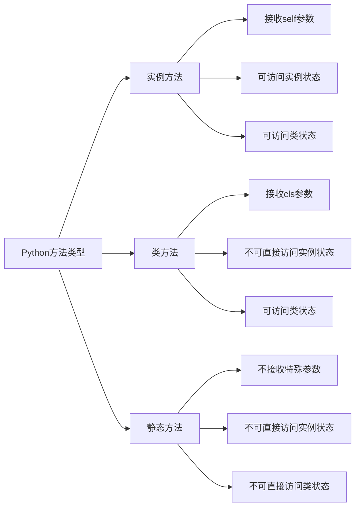

# Python 静态方法

在面向对象编程中，Python提供了多种类型的方法来满足不同的需求。除了常见的实例方法外，Python还提供了静态方法这一重要特性。静态方法让我们能够在类的上下文中定义方法，而不需要访问实例或类本身。本文将详细介绍Python静态方法的概念、用法及其应用场景。

## 什么是静态方法

静态方法是属于类而不是实例的方法，它不会自动传递类（`cls`）或实例（`self`）作为第一个参数。静态方法的行为更像是定义在类中的普通函数，主要用于组织代码结构和逻辑分组。

:::note 关键特点
- 使用`@staticmethod`装饰器定义
- 不自动接收`self`或`cls`参数
- 不能访问或修改类或实例的状态
- 可以通过类名或实例名调用
:::

## 定义静态方法

Python使用`@staticmethod`装饰器来定义静态方法：

```python
class Calculator:
    @staticmethod
    def add(x, y):
        return x + y
    
    @staticmethod
    def subtract(x, y):
        return x - y

# 通过类名调用静态方法
print(Calculator.add(5, 3))       # 输出: 8
print(Calculator.subtract(10, 4)) # 输出: 6

# 通过实例调用静态方法
calc = Calculator()
print(calc.add(2, 3))             # 输出: 5
```

在上面的例子中，`add`和`subtract`是`Calculator`类的静态方法。它们可以直接通过类名调用，也可以通过类的实例调用。

## 静态方法vs实例方法vs类方法

为了更好地理解静态方法，让我们比较一下Python中的三种方法类型：

```python
class Example:
    value = "Class Value"
    
    def __init__(self):
        self.instance_value = "Instance Value"
    
    # 实例方法
    def instance_method(self):
        return f"实例方法可以访问实例属性: {self.instance_value} 和类属性: {self.value}"
    
    # 类方法
    @classmethod
    def class_method(cls):
        return f"类方法可以访问类属性: {cls.value} 但不能直接访问实例属性"
    
    # 静态方法
    @staticmethod
    def static_method():
        return "静态方法不能直接访问类属性或实例属性"

# 创建实例
obj = Example()

# 调用实例方法
print(obj.instance_method())  
# 输出: 实例方法可以访问实例属性: Instance Value 和类属性: Class Value

# 调用类方法
print(Example.class_method())  
# 输出: 类方法可以访问类属性: Class Value 但不能直接访问实例属性

# 调用静态方法
print(Example.static_method())  
# 输出: 静态方法不能直接访问类属性或实例属性
```

三种方法的主要区别如下：



## 静态方法的应用场景

静态方法在以下情况下特别有用：

### 1. 工具函数

当某个功能与类相关但不需要访问类的内部状态时：

```python
class MathUtils:
    @staticmethod
    def is_prime(n):
        """判断一个数是否为质数"""
        if n <= 1:
            return False
        if n <= 3:
            return True
        if n % 2 == 0 or n % 3 == 0:
            return False
        i = 5
        while i * i <= n:
            if n % i == 0 or n % (i + 2) == 0:
                return False
            i += 6
        return True
    
    @staticmethod
    def gcd(a, b):
        """计算最大公约数"""
        while b:
            a, b = b, a % b
        return a

# 使用这些工具函数
print(MathUtils.is_prime(17))  # 输出: True
print(MathUtils.gcd(48, 18))   # 输出: 6
```

### 2. 工厂方法

静态方法可以作为工厂方法，根据不同的参数创建不同的实例：

```python
class Person:
    def __init__(self, name, age):
        self.name = name
        self.age = age
    
    def __str__(self):
        return f"{self.name}, {self.age}岁"
    
    @staticmethod
    def create_adult(name):
        """创建一个成年人实例"""
        return Person(name, 18)
    
    @staticmethod
    def create_child(name):
        """创建一个孩子实例"""
        return Person(name, 5)

# 使用工厂方法创建实例
adult = Person.create_adult("张三")
child = Person.create_child("小明")

print(adult)  # 输出: 张三, 18岁
print(child)  # 输出: 小明, 5岁
```

### 3. 辅助验证或转换方法

静态方法经常用于执行数据验证或转换：

```python
class DataProcessor:
    def __init__(self, data):
        if DataProcessor.is_valid_data(data):
            self.data = data
        else:
            raise ValueError("Invalid data format")
    
    @staticmethod
    def is_valid_data(data):
        """验证数据格式是否正确"""
        if not isinstance(data, list):
            return False
        return all(isinstance(item, (int, float)) for item in data)
    
    @staticmethod
    def normalize_data(data):
        """将数据规范化到0-1范围"""
        if not DataProcessor.is_valid_data(data):
            raise ValueError("Invalid data format")
        if not data:
            return []
        min_val = min(data)
        max_val = max(data)
        if max_val == min_val:
            return [0.5 for _ in data]
        return [(x - min_val) / (max_val - min_val) for x in data]

# 使用静态方法
try:
    processor = DataProcessor([1, 2, 3, 4, 5])
    normalized = DataProcessor.normalize_data([10, 20, 30, 40, 50])
    print(normalized)  # 输出: [0.0, 0.25, 0.5, 0.75, 1.0]
    
    # 这将抛出异常
    invalid_processor = DataProcessor("not a list")
except ValueError as e:
    print(f"错误: {e}")  # 输出: 错误: Invalid data format
```

## 实际案例：文件处理类

以下是一个使用静态方法的文件处理类实例：

```python
import os
import json
import csv
from datetime import datetime

class FileHandler:
    @staticmethod
    def get_extension(filename):
        """获取文件扩展名"""
        return os.path.splitext(filename)[1].lower()
    
    @staticmethod
    def read_text(filepath):
        """读取文本文件"""
        with open(filepath, 'r', encoding='utf-8') as f:
            return f.read()
    
    @staticmethod
    def write_text(filepath, content):
        """写入文本文件"""
        with open(filepath, 'w', encoding='utf-8') as f:
            f.write(content)
    
    @staticmethod
    def read_json(filepath):
        """读取JSON文件"""
        with open(filepath, 'r', encoding='utf-8') as f:
            return json.load(f)
    
    @staticmethod
    def write_json(filepath, data):
        """写入JSON文件"""
        with open(filepath, 'w', encoding='utf-8') as f:
            json.dump(data, f, ensure_ascii=False, indent=2)
    
    @staticmethod
    def read_csv(filepath):
        """读取CSV文件"""
        data = []
        with open(filepath, 'r', encoding='utf-8') as f:
            reader = csv.reader(f)
            for row in reader:
                data.append(row)
        return data
    
    @staticmethod
    def write_csv(filepath, data):
        """写入CSV文件"""
        with open(filepath, 'w', encoding='utf-8', newline='') as f:
            writer = csv.writer(f)
            writer.writerows(data)
    
    @staticmethod
    def backup_file(filepath):
        """创建文件备份"""
        if not os.path.exists(filepath):
            raise FileNotFoundError(f"无法备份不存在的文件: {filepath}")
        
        timestamp = datetime.now().strftime("%Y%m%d_%H%M%S")
        filename, extension = os.path.splitext(filepath)
        backup_path = f"{filename}_backup_{timestamp}{extension}"
        
        with open(filepath, 'rb') as src, open(backup_path, 'wb') as dst:
            dst.write(src.read())
        
        return backup_path

# 使用FileHandler类
try:
    # 写入文本文件
    FileHandler.write_text("example.txt", "这是一个示例文本文件")
    
    # 读取文本文件
    content = FileHandler.read_text("example.txt")
    print(f"文本内容: {content}")
    
    # 写入JSON数据
    data = {"name": "小明", "age": 18, "scores": [85, 92, 78]}
    FileHandler.write_json("student.json", data)
    
    # 读取JSON数据
    student = FileHandler.read_json("student.json")
    print(f"学生信息: {student}")
    
    # 备份文件
    backup_path = FileHandler.backup_file("example.txt")
    print(f"文件已备份到: {backup_path}")
    
except Exception as e:
    print(f"发生错误: {e}")
```

这个例子展示了如何使用静态方法创建一个工具类，提供文件操作的不同功能。静态方法在这里非常适用，因为这些操作都是独立的功能，不需要维护实例状态。

## 何时使用静态方法

:::tip 使用静态方法的场景
1. 方法不需要访问或修改类或实例的状态
2. 方法的逻辑与类相关，但功能上是独立的
3. 方法作为工具函数或辅助函数，属于类的命名空间
4. 为了提高代码的组织性和可读性
:::

:::caution 不适合使用静态方法的场景
1. 如果方法需要访问实例状态，应使用实例方法
2. 如果方法需要访问或修改类状态，应使用类方法
3. 如果方法完全独立，与类没有逻辑关系，可以考虑定义为模块级别的函数
:::

## 静态方法的优缺点

### 优点
- **代码组织** - 使相关功能在类的命名空间中有序组织
- **代码可读性** - 清晰表明某个方法不依赖对象状态
- **方便调用** - 无需创建实例即可调用
- **命名空间隔离** - 避免全局命名空间污染

### 缺点
- **功能受限** - 不能直接访问类或实例的属性
- **可能被滥用** - 过度使用可能会使类变得臃肿
- **可替代性** - 在很多情况下，普通函数可能是更好的选择

## 总结

Python的静态方法是面向对象编程中的重要工具，它们提供了一种将功能组织到类命名空间中的方法，而无需访问或修改类或实例状态。静态方法使用`@staticmethod`装饰器定义，不会自动接收`self`或`cls`参数。

静态方法适用于：
- 工具函数和辅助方法
- 与类相关但不依赖类状态的功能
- 工厂方法
- 数据验证和转换

理解何时使用静态方法、何时使用实例方法或类方法是掌握Python面向对象编程的重要部分。通过合理使用这些不同类型的方法，你可以创建出组织良好、易于维护的代码。

## 练习

1. 创建一个`StringUtils`类，包含静态方法用于字符串反转、检查回文字符串和计算字符串中特定字符的出现次数。

2. 设计一个`DateConverter`类，包含静态方法用于不同日期格式之间的转换（如 YYYY-MM-DD 转换为 DD/MM/YYYY）。

3. 实现一个`GeometricCalculator`类，使用静态方法计算不同几何形状的面积和周长（圆形、矩形、三角形等）。

4. 创建一个`ValidationUtils`类，包含静态方法用于验证电子邮件地址、密码强度和手机号码格式。

5. 设计一个`CurrencyConverter`类，提供静态方法用于不同货币之间的转换。

通过完成这些练习，你将更好地理解静态方法的应用场景和实践技巧。