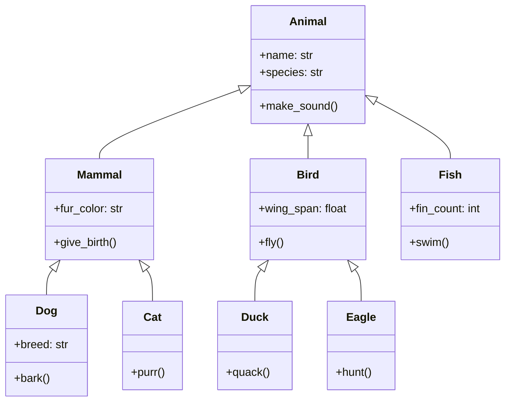

# Python 继承

## 什么是继承？

继承是面向对象编程中最强大的概念之一，它允许我们基于已有的类创建新类，新类（称为子类或派生类）可以获取现有类（称为父类或基类）的所有属性和方法，同时还可以定义自己特有的属性和方法。

继承的主要优点：

- **代码重用**：避免重复编写相同的代码
- **建立类层次结构**：反映真实世界的关系
- **维护简便**：修改基类即可影响所有子类

:::tip
理解继承可以帮助你设计出更具扩展性和更易维护的程序！
:::

## 继承的基本语法

在Python中，定义一个继承自其他类的类非常简单：

```python
class 父类:
    # 父类的属性和方法

class 子类(父类):
    # 子类的属性和方法
```

让我们看一个基本的例子：

```python
class Animal:
    def __init__(self, name, species):
        self.name = name
        self.species = species
        
    def make_sound(self):
        print("一些通用的声音")
        
    def info(self):
        print(f"我是{self.name}，属于{self.species}物种")

# Dog类继承自Animal类
class Dog(Animal):
    def __init__(self, name, breed):
        # 调用父类的初始化方法
        super().__init__(name, species="狗")
        self.breed = breed
        
    def make_sound(self):
        print("汪汪汪!")
        
# 创建一个Dog实例
my_dog = Dog("旺财", "金毛")
my_dog.info()  # 继承自父类的方法
my_dog.make_sound()  # 子类重写的方法
print(f"品种: {my_dog.breed}")
```

输出:
```
我是旺财，属于狗物种
汪汪汪!
品种: 金毛
```

## `super()`函数

你可能注意到了在子类中，我们使用了`super().__init__()`来调用父类的`__init__`方法。`super()`是一个内置函数，用于引用父类，使我们能够调用父类的方法。

```python
super().__init__(name, species="狗")
```

这行代码调用了父类`Animal`的`__init__`方法，传递了必要的参数。

:::caution
如果子类定义了`__init__`方法，它会覆盖父类的`__init__`方法。如果你想保留父类的初始化行为，记得使用`super().__init__()`调用父类的构造函数。
:::

## 方法重写(覆盖)

当子类定义了与父类同名的方法时，子类的方法会覆盖（重写）父类的方法。这被称为"方法重写"或"覆盖"。

在上面的例子中，`Dog`类重写了`Animal`类的`make_sound`方法：

```python
# 父类方法
def make_sound(self):
    print("一些通用的声音")
    
# 子类重写的方法
def make_sound(self):
    print("汪汪汪!")
```

## 多级继承

Python支持多级继承，即一个派生类可以从另一个派生类继承：

```python
class Animal:
    # 属性和方法...
    pass

class Mammal(Animal):
    # 属性和方法...
    pass

class Dog(Mammal):
    # 属性和方法...
    pass
```

这形成了一个继承链：`Dog` → `Mammal` → `Animal`

## 多重继承

Python还支持多重继承，即一个类可以从多个父类继承：

```python
class A:
    def method_a(self):
        print("Method A")

class B:
    def method_b(self):
        print("Method B")

class C(A, B):
    def method_c(self):
        print("Method C")

# 创建C类的实例
obj = C()
obj.method_a()  # 继承自类A
obj.method_b()  # 继承自类B
obj.method_c()  # C类自己的方法
```

输出:
```
Method A
Method B
Method C
```

:::warning
多重继承可能会导致"菱形继承"问题。Python使用C3线性化算法来解决这个问题，确定方法解析顺序(MRO)。你可以使用`ClassName.__mro__`查看类的方法解析顺序。
:::

## 方法解析顺序 (MRO)

当使用多重继承时，如果多个父类有同名的方法，Python需要决定调用哪一个。这个决策过程遵循方法解析顺序(MRO)。

```python
class A:
    def who_am_i(self):
        print("I am A")

class B(A):
    def who_am_i(self):
        print("I am B")

class C(A):
    def who_am_i(self):
        print("I am C")

class D(B, C):
    pass

d = D()
d.who_am_i()  # 输出什么？
print(D.__mro__)
```

输出:
```
I am B
(<class '__main__.D'>, <class '__main__.B'>, <class '__main__.C'>, <class '__main__.A'>, <class 'object'>)
```

Python按照MRO中的顺序查找方法，所以首先找到并使用了B类的`who_am_i`方法。

## isinstance() 和 issubclass()

Python提供了两个函数来检查继承关系：

- `isinstance(对象, 类)`：检查对象是否是该类或该类的子类的实例
- `issubclass(子类, 父类)`：检查一个类是否是另一个类的子类

```python
my_dog = Dog("旺财", "金毛")

print(isinstance(my_dog, Dog))      # True
print(isinstance(my_dog, Animal))   # True
print(isinstance(my_dog, object))   # True (所有类都继承自object)

print(issubclass(Dog, Animal))      # True
print(issubclass(Animal, Dog))      # False
```

## 实际应用案例

### 案例1：电商系统中的产品分类

```python
class Product:
    def __init__(self, id, name, price):
        self.id = id
        self.name = name
        self.price = price
    
    def display_info(self):
        print(f"产品ID: {self.id}")
        print(f"产品名称: {self.name}")
        print(f"价格: ¥{self.price}")
    
class Electronics(Product):
    def __init__(self, id, name, price, warranty_period):
        super().__init__(id, name, price)
        self.warranty_period = warranty_period
    
    def display_info(self):
        super().display_info()
        print(f"保修期: {self.warranty_period}个月")

class Clothing(Product):
    def __init__(self, id, name, price, size, color):
        super().__init__(id, name, price)
        self.size = size
        self.color = color
    
    def display_info(self):
        super().display_info()
        print(f"尺寸: {self.size}")
        print(f"颜色: {self.color}")

# 创建产品实例
laptop = Electronics(1, "ThinkPad X1", 8999, 24)
shirt = Clothing(2, "纯棉T恤", 99, "L", "蓝色")

# 显示产品信息
print("电子产品信息:")
laptop.display_info()
print("\n服装产品信息:")
shirt.display_info()
```

输出:
```
电子产品信息:
产品ID: 1
产品名称: ThinkPad X1
价格: ¥8999
保修期: 24个月

服装产品信息:
产品ID: 2
产品名称: 纯棉T恤
价格: ¥99
尺寸: L
颜色: 蓝色
```

### 案例2：游戏角色系统

```python
class Character:
    def __init__(self, name, health=100):
        self.name = name
        self.health = health
        
    def attack(self):
        print(f"{self.name} 进行了普通攻击")
        
    def take_damage(self, damage):
        self.health -= damage
        print(f"{self.name} 受到了 {damage} 点伤害，剩余生命值: {self.health}")
        
class Warrior(Character):
    def __init__(self, name, health=150, sword_damage=15):
        super().__init__(name, health)
        self.sword_damage = sword_damage
        
    def attack(self):
        print(f"{self.name} 使用剑进行了 {self.sword_damage} 点伤害的攻击")
        
    def shield_block(self):
        print(f"{self.name} 使用盾牌格挡了攻击")
        
class Mage(Character):
    def __init__(self, name, health=80, mana=100):
        super().__init__(name, health)
        self.mana = mana
        
    def attack(self):
        if self.mana >= 20:
            self.mana -= 20
            print(f"{self.name} 施放了火球术，造成25点伤害，剩余法力值: {self.mana}")
        else:
            print(f"{self.name} 法力值不足，无法施放法术")
            super().attack()  # 回退到普通攻击
            
    def heal(self):
        if self.mana >= 40:
            self.mana -= 40
            self.health += 30
            print(f"{self.name} 施放了治疗术，恢复30点生命值，当前生命值: {self.health}，剩余法力值: {self.mana}")
        else:
            print(f"{self.name} 法力值不足，无法施放治疗术")

# 创建角色
warrior = Warrior("亚瑟", health=200, sword_damage=20)
mage = Mage("安琪拉", health=120, mana=150)

# 战斗模拟
print("===== 战斗开始 =====")
warrior.attack()
mage.take_damage(20)
mage.attack()
warrior.take_damage(25)
warrior.shield_block()
mage.heal()
print("===== 战斗结束 =====")
```

输出:
```
===== 战斗开始 =====
亚瑟 使用剑进行了 20 点伤害的攻击
安琪拉 受到了 20 点伤害，剩余生命值: 100
安琪拉 施放了火球术，造成25点伤害，剩余法力值: 130
亚瑟 受到了 25 点伤害，剩余生命值: 175
亚瑟 使用盾牌格挡了攻击
安琪拉 施放了治疗术，恢复30点生命值，当前生命值: 130，剩余法力值: 90
===== 战斗结束 =====
```

## 抽象基类

抽象基类(ABC)定义了一个接口，子类必须实现特定的方法。在Python中，我们使用`abc`模块来定义抽象基类：

```python
from abc import ABC, abstractmethod

class Shape(ABC):
    @abstractmethod
    def area(self):
        pass
    
    @abstractmethod
    def perimeter(self):
        pass

class Rectangle(Shape):
    def __init__(self, width, height):
        self.width = width
        self.height = height
    
    def area(self):
        return self.width * self.height
    
    def perimeter(self):
        return 2 * (self.width + self.height)

class Circle(Shape):
    def __init__(self, radius):
        self.radius = radius
    
    def area(self):
        return 3.14 * self.radius * self.radius
    
    def perimeter(self):
        return 2 * 3.14 * self.radius

# 创建实例
rect = Rectangle(5, 4)
circle = Circle(3)

print(f"矩形面积: {rect.area()}")
print(f"矩形周长: {rect.perimeter()}")
print(f"圆形面积: {circle.area()}")
print(f"圆形周长: {circle.perimeter()}")
```

输出:
```
矩形面积: 20
矩形周长: 18
圆形面积: 28.26
圆形周长: 18.84
```

:::note
尝试实例化抽象基类`Shape`会导致错误，因为它包含抽象方法。抽象基类只能被继承，不能直接实例化。
:::

## 继承的图形表示

以下是类继承关系的图形表示：



## 总结

Python继承是面向对象编程的核心概念，通过继承：

1. 子类可以获得父类的所有属性和方法
2. 子类可以重写父类的方法以适应特定需求
3. 子类可以添加新的属性和方法来扩展功能
4. Python支持多级继承和多重继承
5. 使用`super()`可以调用父类的方法

继承帮助我们实现代码重用，避免重复编写相似功能的代码，同时也能够建立类的层次结构，使代码更加清晰和易于维护。

## 练习

1. 创建一个`Vehicle`基类，包含通用属性如`brand`、`model`和`year`，以及`start_engine()`和`stop_engine()`方法。
   
2. 创建子类`Car`和`Motorcycle`，它们继承自`Vehicle`，并各自添加特定的属性和方法：
   - `Car`添加`doors`属性和`honk()`方法
   - `Motorcycle`添加`has_sidecar`属性和`wheelie()`方法

3. 重写两个子类的`start_engine()`方法，使它们显示不同的消息。

4. 创建一个支持多重继承的案例：设计`Employee`、`Student`和`PartTimeStudentEmployee`类，其中`PartTimeStudentEmployee`同时继承`Employee`和`Student`。

5. 使用抽象基类创建一个简单的插件系统，定义一个`Plugin`抽象基类，然后实现不同的插件类。

记住，面向对象编程的学习需要通过实践来巩固，所以尝试创建自己的类层次结构和继承案例，这将有助于加深对概念的理解！

## 进一步学习资源

- Python官方文档: [继承](https://docs.python.org/zh-cn/3/tutorial/classes.html#inheritance)
- 《Python核心编程》第9章：面向对象编程
- 《流畅的Python》第12章：继承设计模式

通过本文的学习，你应该对Python继承有了全面的了解。随着你编程技能的提升，你会发现继承是设计复杂程序的强大工具，它可以帮助你创建出结构清晰且易于维护的代码。