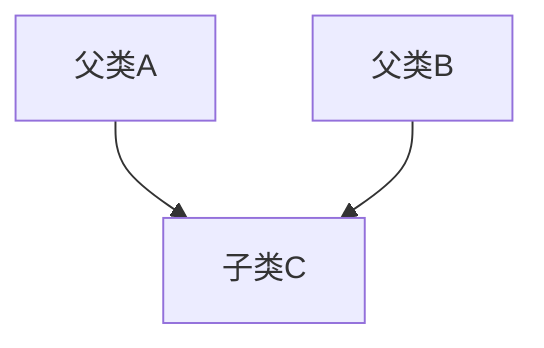
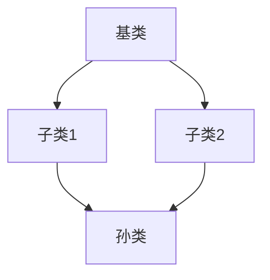

# Python 多重继承

在Python面向对象编程中，多重继承是一个强大但需要小心使用的特性。它允许一个类同时从多个父类继承属性和方法，这为代码重用提供了极大的灵活性。

## 什么是多重继承？

多重继承是指一个子类可以同时继承多个父类的特性（属性和方法）的机制。与单继承（只从一个类继承）不同，多重继承让一个类可以获取多个类的功能。



## 多重继承的基本语法

在Python中，定义多重继承非常简单，只需在类定义时的括号中列出所有父类，用逗号分隔即可：

```python
class 子类名(父类1, 父类2, 父类3, ...):
    # 类的内容
    pass
```

## 多重继承的简单示例

让我们通过一个例子来理解多重继承的基本概念：

```python
class 陆地动物:
    def __init__(self):
        self.can_walk = True
        
    def walk(self):
        return "我能在陆地上行走"
        
class 水生动物:
    def __init__(self):
        self.can_swim = True
        
    def swim(self):
        return "我能在水中游泳"
        
class 两栖动物(陆地动物, 水生动物):
    def __init__(self):
        陆地动物.__init__(self)
        水生动物.__init__(self)
        
    def description(self):
        return "我是两栖动物，" + self.walk() + "，而且" + self.swim()
        
# 创建一个两栖动物实例
frog = 两栖动物()
print(frog.description())
```

输出结果：
```
我是两栖动物，我能在陆地上行走，而且我能在水中游泳
```

在这个例子中，`两栖动物`类同时继承了`陆地动物`和`水生动物`两个类的能力，因此它既可以行走也可以游泳。

## 方法解析顺序(MRO)

多重继承可能导致一个问题：如果多个父类拥有同名方法，子类应该继承哪个父类的方法？Python通过方法解析顺序(Method Resolution Order, MRO)来解决这个问题。

Python使用C3线性化算法来确定MRO。我们可以通过类的`__mro__`属性或`mro()`方法查看方法解析顺序：

```python
class A:
    def greeting(self):
        return "A的问候"
        
class B:
    def greeting(self):
        return "B的问候"
        
class C(A, B):
    pass
    
class D(B, A):
    pass

# 查看类C和类D的方法解析顺序
print(C.__mro__)
print(D.__mro__)

# 测试方法调用
c = C()
d = D()
print(c.greeting())
print(d.greeting())
```

输出结果：
```
(<class '__main__.C'>, <class '__main__.A'>, <class '__main__.B'>, <class 'object'>)
(<class '__main__.D'>, <class '__main__.B'>, <class '__main__.A'>, <class 'object'>)
A的问候
B的问候
```

:::note
MRO按照从左到右的顺序查找方法。对于类C，它首先在C中查找方法，然后是A，接着是B，最后是object（所有Python类的基类）。
:::

## Super()函数与多重继承

在多重继承中，`super()`函数是一个强大的工具，它可以帮助我们调用父类的方法而不必显式命名它们：

```python
class A:
    def __init__(self):
        print("A的初始化")
        
class B:
    def __init__(self):
        print("B的初始化")
        
class C(A, B):
    def __init__(self):
        print("C的初始化")
        super().__init__()  # 调用下一个父类的初始化方法
        
class D(B, A):
    def __init__(self):
        print("D的初始化")
        super().__init__()  # 调用下一个父类的初始化方法

# 测试
c = C()
print("-----")
d = D()
```

输出结果：
```
C的初始化
A的初始化
-----
D的初始化
B的初始化
```

注意，`super().__init__()`只调用了MRO中的下一个类的初始化方法，而不是所有父类。如果需要调用所有父类的初始化方法，我们需要显式地调用它们。

## 使用super()调用所有父类方法的正确方式

在多重继承中正确初始化所有父类的方式是让每个类都使用`super()`：

```python
class A:
    def __init__(self):
        super().__init__()  # 调用object.__init__
        print("A的初始化")
        
class B:
    def __init__(self):
        super().__init__()  # 调用下一个父类的初始化方法
        print("B的初始化")
        
class C(A, B):
    def __init__(self):
        super().__init__()  # 会按照MRO顺序调用A和B的初始化方法
        print("C的初始化")

# 测试
c = C()
print(C.__mro__)
```

输出结果：
```
B的初始化
A的初始化
C的初始化
(<class '__main__.C'>, <class '__main__.A'>, <class '__main__.B'>, <class 'object'>)
```

:::caution
注意输出顺序！由于每个类都使用了`super()`，所以初始化方法的执行顺序看起来是按照MRO的反向进行的，这可能会让人感到困惑。实际上，每个`__init__`方法都是先调用链中的下一个方法，然后再执行自己的代码。
:::

## 钻石继承问题

多重继承中一个经典的问题是"钻石继承"，也称为"菱形继承"。这发生在子类从两个不同的父类继承，而这两个父类又有一个共同的父类：



```python
class 基类:
    def __init__(self):
        print("基类初始化")
        
class 子类1(基类):
    def __init__(self):
        super().__init__()
        print("子类1初始化")
        
class 子类2(基类):
    def __init__(self):
        super().__init__()
        print("子类2初始化")
        
class 孙类(子类1, 子类2):
    def __init__(self):
        super().__init__()
        print("孙类初始化")
        
# 测试
孙类实例 = 孙类()
print(孙类.__mro__)
```

输出结果：
```
基类初始化
子类2初始化
子类1初始化
孙类初始化
(<class '__main__.孙类'>, <class '__main__.子类1'>, <class '__main__.子类2'>, <class '__main__.基类'>, <class 'object'>)
```

注意，基类的`__init__`方法只被调用了一次，这是由于Python的C3线性化算法和`super()`机制共同作用的结果，防止了初始化重复执行。

## 多重继承的实际应用场景

### 1. 混入类（Mixins）

混入是多重继承的一种常见应用模式，用于向类添加功能，而不需要建立"是一个"的关系：

```python
class LoggerMixin:
    def log(self, message):
        print(f"日志: {message}")
        
class DBConnectorMixin:
    def connect_to_db(self):
        print("连接到数据库")
        return "db_connection"
        
class UserManager(LoggerMixin, DBConnectorMixin):
    def create_user(self, username):
        self.log(f"尝试创建用户 {username}")
        connection = self.connect_to_db()
        # 使用数据库连接创建用户
        print(f"在数据库中创建用户 {username}")
        self.log(f"用户 {username} 创建成功")
        
# 测试
manager = UserManager()
manager.create_user("张三")
```

输出结果：
```
日志: 尝试创建用户 张三
连接到数据库
在数据库中创建用户 张三
日志: 用户 张三 创建成功
```

### 2. 接口实现

虽然Python没有显式的接口概念，但我们可以使用多重继承来模拟接口实现：

```python
class 可游泳接口:
    def swim(self):
        raise NotImplementedError("子类必须实现swim方法")
        
class 可飞行接口:
    def fly(self):
        raise NotImplementedError("子类必须实现fly方法")
        
class 鸭子(可游泳接口, 可飞行接口):
    def swim(self):
        return "鸭子在游泳"
        
    def fly(self):
        return "鸭子在飞行"
        
# 测试
duck = 鸭子()
print(duck.swim())
print(duck.fly())
```

输出结果：
```
鸭子在游泳
鸭子在飞行
```

## 多重继承的最佳实践

1. **遵循继承的规则**：只有当"是一个"关系适用时才使用继承。

2. **优先使用组合而非继承**：如果两个类没有明确的"是一个"关系，考虑使用组合而非多重继承。

3. **使用混入类**：对于添加额外功能，应使用短小、专注的混入类。

4. **避免命名冲突**：确保父类之间没有同名方法，或者明确处理方法解析顺序。

5. **保持继承层次简单**：避免深层次、复杂的继承结构。

6. **始终使用super()**：在所有类的`__init__`中使用`super()`来确保方法正确调用。

7. **理解MRO**：了解方法解析顺序以预测方法调用行为。

```python
# 不好的做法
class A:
    def method(self): 
        print("A的方法")

class B:
    def method(self): 
        print("B的方法")

class C(A, B):
    pass  # 没有明确指出要使用哪个父类的方法

# 好的做法
class A:
    def method(self): 
        print("A的方法")

class B:
    def another_method(self): 
        print("B的方法")

class C(A, B):
    def method(self):
        # 明确指出要调用哪个父类的方法
        super().method()  # 调用A的method
        print("C的额外功能")
```

## 总结

Python的多重继承是一个强大的特性，它允许类从多个父类继承属性和方法。当正确使用时，多重继承可以促进代码重用并提高灵活性。然而，它也可能引入复杂性和不可预测的行为，特别是当父类之间有同名方法时。

了解方法解析顺序(MRO)和`super()`函数的工作原理对于有效使用多重继承至关重要。在实践中，混入类是多重继承的一种常见应用模式，用于向类添加功能而不建立全面的"是一个"关系。

## 练习

1. 创建一个`动物`基类，然后创建`哺乳动物`和`鸟类`子类。最后创建一个`蝙蝠`类，它应该从`哺乳动物`和`鸟类`继承特性。

2. 实现一个简单的游戏角色系统，使用混入类为角色添加不同的能力（如魔法攻击、远程攻击、治疗能力等）。

3. 尝试创建一个钻石继承结构，并使用`super()`确保所有初始化方法只被调用一次。

:::tip
记住，虽然多重继承功能强大，但应该谨慎使用。在许多情况下，组合可能是比多重继承更好的选择。
:::

## 更多资源

- Python官方文档中关于[类继承的部分](https://docs.python.org/zh-cn/3/tutorial/classes.html#inheritance)提供了更多关于多重继承的细节。
- Raymond Hettinger的演讲["Python的超能力：super()的正确用法"](https://rhettinger.wordpress.com/2011/05/26/super-considered-super/)深入探讨了`super()`函数。