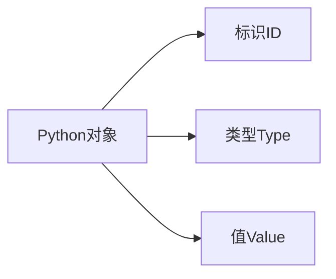

# Python 内存模型

Python作为一种高级编程语言，为开发者隐藏了大部分的内存管理细节。但是，了解Python如何在底层管理内存可以帮助你编写更高效的代码，避免内存泄漏和其他常见问题。本文将带你了解Python的内存模型，从对象的创建到垃圾回收的全过程。

## Python 内存管理的基本原理

Python的内存管理是自动的，主要包含以下几个关键部分：

1. **对象创建与存储**：创建Python对象并为其分配内存空间
2. **内存池管理**：通过内存池机制提高内存分配和释放的效率
3. **引用计数**：跟踪对象的引用数量
4. **垃圾回收**：自动回收不再使用的对象所占用的内存

:::note
Python的内存管理对于初学者来说是透明的，你通常不需要手动分配或释放内存，但理解其工作原理可以帮助你编写更优质的代码。
:::

## 对象在Python中的存储方式

Python中的一切都是对象，每个对象由三部分组成：



- **标识(ID)**：对象在内存中的地址，可以通过`id()`函数获取
- **类型(Type)**：对象的类型，决定了对象可以进行哪些操作，可以通过`type()`函数获取
- **值(Value)**：对象存储的实际数据

让我们通过一个简单的例子来了解这三者：

```python
x = 42
print(f"ID: {id(x)}")
print(f"Type: {type(x)}")
print(f"Value: {x}")

y = "Hello"
print(f"ID: {id(y)}")
print(f"Type: {type(y)}")
print(f"Value: {y}")
```

输出可能如下（ID值在不同运行环境中会有所不同）：

```
ID: 140715270146272
Type: <class 'int'>
Value: 42

ID: 140715269881264
Type: <class 'str'>
Value: Hello
```

## 变量与对象的关系

在Python中，变量实际上是对象的引用（或指针）。当我们创建一个变量并为其赋值时，我们实际上是创建了一个对象，并让变量引用这个对象。

```python
a = 10  # 创建一个整数对象10，并让变量a引用它
b = a   # 变量b现在也引用同一个对象
print(id(a) == id(b))  # 输出: True，表明a和b引用同一个对象
```

输出：

```
True
```

这种引用机制是Python内存模型的核心，也是理解后续引用计数和垃圾回收机制的基础。

## Python 的内存分配策略

### 小整数对象池

Python为了优化性能，会预先创建一些小整数对象（通常是-5到256之间的整数），这些对象存储在一个池中，当需要这些值时，Python不会创建新对象，而是直接引用池中的对象。

```python
a = 256
b = 256
print(a is b)  # 输出: True，因为两者引用相同的对象

c = 257
d = 257
print(c is d)  # 输出可能为False，因为257超出了小整数池的范围
```

输出：

```
True
False
```

### 字符串驻留（String Interning）

类似地，Python也会对一些字符串进行"驻留"——将其存储在一个特殊的表中，以便重复使用。

```python
str1 = "hello"
str2 = "hello"
print(str1 is str2)  # 输出: True，因为字符串被驻留

str3 = "hello world"
str4 = "hello world"
print(str3 is str4)  # 输出可能为True或False，取决于具体的Python实现
```

输出：

```
True
True
```

:::caution
字符串驻留的行为可能因Python版本和实现方式而异，不要在代码中依赖这一行为。
:::

## 引用计数机制

Python使用引用计数作为主要的内存管理机制。每个对象都有一个引用计数，表示当前有多少变量引用这个对象。

- 当一个对象被创建或被一个新变量引用时，其引用计数增加
- 当一个引用该对象的变量被重新赋值或离开作用域时，该对象的引用计数减少
- 当一个对象的引用计数降为0时，Python会自动回收其占用的内存

可以使用`sys.getrefcount()`函数查看对象的引用计数：

```python
import sys

x = 42
print(sys.getrefcount(x))  # 输出会比预期大1，因为将x作为参数传给getrefcount时会创建一个临时引用

y = x  # 增加x引用的对象的引用计数
print(sys.getrefcount(x))

del y  # 减少引用计数
print(sys.getrefcount(x))
```

输出可能如下：

```
2
3
2
```

:::note
`sys.getrefcount()`返回的值通常会比实际值大1，因为在调用函数时会临时增加一个引用。
:::

## 循环引用问题

引用计数机制有一个明显的缺点：无法处理循环引用。当两个或多个对象相互引用时，即使它们不被其他对象引用，它们的引用计数也永远不会降为0。

```python
def create_cycle():
    list1 = []
    list2 = []
    # 创建循环引用
    list1.append(list2)
    list2.append(list1)
    
    # 函数结束后，list1和list2的引用计数将为1（相互引用）
    # 尽管它们无法被外部访问，但不会被自动回收

create_cycle()
# 此时存在内存泄漏，因为循环引用的对象没有被回收
```

为了解决这个问题，Python引入了垃圾回收机制。

## Python 的垃圾回收机制

Python的垃圾回收机制主要包含三代回收和循环引用检测：

### 1. 分代回收（Generational Garbage Collection）

Python将对象分为三代：

- 第0代：新创建的对象
- 第1代：经过一次垃圾回收后仍然存活的对象
- 第2代：经过多次垃圾回收后依然存活的对象

回收策略是：对新生代对象执行更频繁的垃圾回收，因为根据"弱代假说"，新创建的对象更容易成为垃圾。

### 2. 循环引用检测

Python的垃圾回收器会定期检测循环引用，并回收那些虽然引用计数不为0但确实无法访问的对象。

我们可以通过`gc`模块手动控制垃圾回收：

```python
import gc

# 查看当前三代对象的数量
print(gc.get_count())

# 手动触发垃圾回收
gc.collect()

# 再次查看三代对象的数量
print(gc.get_count())
```

输出可能如下：

```
(86, 3, 0)
(7, 0, 0)
```

## Python 内存泄漏的常见原因

尽管Python有自动内存管理，但仍然可能出现内存泄漏问题，常见原因包括：

1. **循环引用中包含__del__方法**：垃圾回收器无法确定销毁循环引用中对象的顺序
2. **全局变量**：长期存活的全局变量会占用内存
3. **闭包**：闭包函数可能捕获并长期持有外部变量的引用
4. **缓存未及时清理**：使用字典等结构作为缓存但未设置清理机制

### 实际案例：内存泄漏示例与修复

下面是一个简单的内存泄漏示例，我们创建一个缓存系统但忘记清理：

```python
# 有内存泄漏风险的代码
cache = {}

def process_data(key, data):
    # 将处理结果存入缓存
    cache[key] = data
    # 处理数据...
    return data

# 随着时间推移，cache会不断增长，最终可能导致内存问题
```

修复方法：

```python
import weakref

# 使用弱引用字典
cache = weakref.WeakValueDictionary()

def process_data(key, data):
    # 将处理结果存入缓存
    cache[key] = data
    # 处理数据...
    return data

# 当数据对象不再被其他地方引用时，会自动从cache中删除
```

## 优化Python内存使用的最佳实践

要高效地使用Python的内存，可以遵循以下几点建议：

1. **及时释放不需要的引用**：使用完大型对象后，将其设为`None`
2. **使用生成器**：处理大型数据集时，使用生成器而不是列表
3. **使用适当的数据结构**：例如使用集合代替列表进行成员检查
4. **避免创建不必要的中间对象**：尤其是在循环中
5. **定期清理缓存**：对于长期运行的程序，定期清理缓存很重要

### 示例：使用生成器节省内存

```python
# 内存密集型方法 - 一次性加载所有数据到内存
def read_large_file_list(filename):
    with open(filename, 'r') as f:
        return f.readlines()  # 返回整个文件的所有行作为列表
        
# 内存友好的方法 - 使用生成器逐行处理
def read_large_file_generator(filename):
    with open(filename, 'r') as f:
        for line in f:  # 一次只处理一行
            yield line
            
# 使用示例
for line in read_large_file_generator('huge_log.txt'):
    # 处理每一行...
    pass  # 此处只是示例
```

## 总结

Python的内存模型是其工作原理的重要组成部分。作为初学者，你可能不需要立即深入了解所有细节，但随着你的Python技能提升，理解这些概念将帮助你:

- 编写更高效的代码
- 避免常见的内存相关问题
- 更好地理解Python程序的行为模式

记住，Python的自动内存管理是为了让你专注于解决问题，而不是内存管理。然而，了解其工作原理可以让你成为更强大的Python开发者。

## 练习与深入学习

为了巩固所学概念，可以尝试以下练习：

1. 使用`id()`函数检查不同类型对象的身份
2. 尝试创建一个小型程序，故意引入循环引用，然后使用`gc`模块检测并清理
3. 比较使用列表和生成器处理大型数据集时的内存使用情况

### 推荐进一步学习的资源

- Python官方文档中的[内存管理](https://docs.python.org/3/c-api/memory.html)部分
- Python的`gc`模块文档
- Python的`sys`模块，特别是与内存相关的函数
- 《Fluent Python》书中关于Python对象模型的章节

:::tip
理解Python内存模型是一个渐进的过程。从基本概念开始，随着编程经验的积累，逐步深入理解更复杂的内存管理机制。
:::