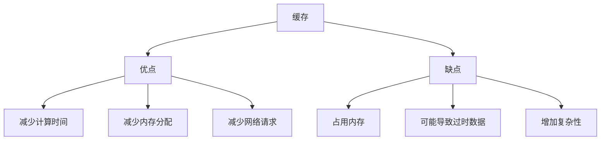

# Python 缓存机制

在Python中，缓存是一种为提高程序性能而存储数据的技术。Python内部实现了多种缓存机制，用于减少对象的创建次数，从而节省内存并提高执行速度。了解这些机制对于编写高效的Python程序非常重要。

## 什么是缓存

缓存是一种将频繁使用的数据存储在快速访问位置的技术。想象一下，如果你经常需要查询某本书的某一页内容，与其每次都从书架上取书再翻到那一页，不如将那一页的内容记在便利贴上放在手边，这样下次需要时就可以直接查看便利贴，这就是缓存的基本思想。

在Python中，缓存主要用于以下几个方面：
1. 避免重复创建相同的对象
2. 加速频繁调用的函数
3. 减少内存使用

## Python 中的内置缓存机制

### 1. 小整数对象池

Python为了优化内存使用和提高性能，对常用的小整数（通常是-5到256之间的整数）进行了缓存。

```python
a = 10
b = 10
print(a is b)  # 输出: True

c = 257
d = 257
print(c is d)  # 输出: False (通常情况下)
```

上面的例子中，`a` 和 `b` 实际上引用的是同一个对象，因为10在小整数对象池中。而 `c` 和 `d` 引用的是不同的对象，因为257超出了小整数对象池的范围。

:::note
实际的小整数对象池范围可能因Python实现而异。CPython中通常是-5到256。
:::

### 2. 字符串驻留（String Interning）

Python也会对某些字符串进行缓存，这种机制称为字符串驻留。

```python
s1 = "hello"
s2 = "hello"
print(s1 is s2)  # 输出: True

s3 = "hello world"
s4 = "hello world"
print(s3 is s4)  # 输出: True (大多数情况下)
```

字符串驻留的规则比较复杂，通常只有纯字母、数字和下划线组成的较短字符串才会被驻留。但在实际编程中，我们应该使用 `==` 而非 `is` 来比较字符串的值。

### 3. 布尔值和None

Python中的布尔值 `True` 和 `False` 以及 `None` 都是单例对象，即全局只有一个实例。

```python
a = True
b = True
print(a is b)  # 输出: True

c = None
d = None
print(c is d)  # 输出: True
```

## functools.lru_cache装饰器

除了Python内置的缓存机制外，`functools` 模块提供了 `lru_cache` 装饰器，允许我们为函数添加缓存功能。LRU (Least Recently Used) 是一种常用的缓存策略，它会优先移除最近最少使用的项。

### 基本用法

```python
from functools import lru_cache

@lru_cache(maxsize=128)
def fibonacci(n):
    if n <= 1:
        return n
    return fibonacci(n-1) + fibonacci(n-2)

# 第一次调用会计算结果并缓存
print(fibonacci(30))  # 输出: 832040

# 第二次调用直接从缓存获取结果，速度极快
print(fibonacci(30))  # 输出: 832040
```

在上面的例子中，`@lru_cache(maxsize=128)` 装饰器为 `fibonacci` 函数添加了缓存功能。`maxsize` 参数指定了缓存的最大条目数，当缓存满时，会移除最近最少使用的条目。

### lru_cache的参数

`lru_cache` 接受以下参数：
- `maxsize`: 指定缓存的最大条目数，默认为128
- `typed`: 如果设为 `True`，则会将不同类型的函数参数视为不同的调用（例如，`f(3)` 和 `f(3.0)` 会被视为不同的调用）

```python
@lru_cache(maxsize=32, typed=True)
def square(n):
    print(f"Computing square of {n}")
    return n * n

print(square(3))    # 输出: Computing square of 3, 9
print(square(3))    # 输出: 9 (直接从缓存获取)
print(square(3.0))  # 输出: Computing square of 3.0, 9.0 (因为typed=True，视为不同调用)
```

### 缓存信息和清理

`lru_cache` 装饰的函数有一些额外的方法：

```python
from functools import lru_cache

@lru_cache(maxsize=32)
def factorial(n):
    return 1 if n <= 1 else n * factorial(n-1)

# 计算一些阶乘
for i in range(10):
    factorial(i)

# 查看缓存信息
print(factorial.cache_info())  # 输出类似: CacheInfo(hits=8, misses=10, maxsize=32, currsize=10)

# 清除缓存
factorial.cache_clear()
print(factorial.cache_info())  # 输出类似: CacheInfo(hits=0, misses=0, maxsize=32, currsize=0)
```

## 实际应用场景

### 1. 优化递归函数

如前面所示，递归函数如斐波那契数列和阶乘计算可以通过缓存大幅提高效率。

### 2. API请求缓存

当程序需要频繁请求相同的API数据时，可以使用缓存减少请求次数：

```python
@lru_cache(maxsize=100)
def get_user_data(user_id):
    print(f"Fetching data for user {user_id} from API...")
    # 模拟API请求
    import time
    time.sleep(1)  # 模拟网络延迟
    return {"id": user_id, "name": f"User {user_id}"}

# 第一次调用
print(get_user_data(123))  # 会显示获取数据的消息并等待1秒

# 第二次调用同一用户ID
print(get_user_data(123))  # 直接返回缓存结果，几乎没有延迟
```

### 3. 数据处理和计算密集型任务

对于需要大量计算的函数，缓存可以避免重复计算：

```python
@lru_cache(maxsize=None)  # 无限缓存大小
def compute_complex_data(param1, param2):
    print(f"Computing with {param1}, {param2}...")
    # 假设这里有复杂的计算
    import math
    result = 0
    for i in range(1000000):
        result += math.sin(param1 * i) * math.cos(param2 * i)
    return result

# 第一次调用
compute_complex_data(0.5, 0.3)  # 会进行复杂计算

# 再次使用相同参数调用
compute_complex_data(0.5, 0.3)  # 直接返回缓存结果
```

## 缓存的性能影响

缓存提高了程序的性能，但也有一些注意事项：



### 内存占用权衡

缓存会占用内存，因此需要根据实际情况选择合适的`maxsize`值：
- 设置为`None`意味着无限制缓存
- 设置为较小的数字可以控制内存使用
- 对于频繁使用少量不同参数的函数，小缓存就足够了
- 对于可能有大量不同参数组合的函数，需要更大的缓存或考虑其他策略

## 使用缓存的最佳实践

1. **仅缓存纯函数**: 只缓存那些对于相同输入总是产生相同输出的函数，不要缓存有副作用的函数

2. **合理设置maxsize**: 根据函数可能的不同输入组合数量和内存限制设置合适的缓存大小

3. **注意缓存失效**: 对于可能变化的数据，考虑添加缓存过期机制或主动清除缓存

4. **避免缓存大对象**: 缓存大型对象可能会导致内存问题

5. **监控缓存效率**: 使用`cache_info()`方法检查命中率，根据实际情况调整缓存策略

## 自定义缓存实现

有时候内置的缓存机制可能不满足特定需求，我们可以实现自己的缓存装饰器：

```python
def simple_cache(func):
    """一个简单的缓存装饰器"""
    cache = {}
    
    def wrapper(*args, **kwargs):
        # 创建缓存键，包含位置参数和关键字参数
        key = str(args) + str(sorted(kwargs.items()))
        if key not in cache:
            cache[key] = func(*args, **kwargs)
        return cache[key]
    
    wrapper.cache = cache  # 添加一个属性以便访问缓存字典
    return wrapper

@simple_cache
def slow_function(a, b):
    print(f"Computing slow_function({a}, {b})")
    import time
    time.sleep(1)  # 模拟耗时操作
    return a + b

# 第一次调用
print(slow_function(1, 2))  # 输出: Computing slow_function(1, 2), 3

# 第二次调用，使用缓存
print(slow_function(1, 2))  # 输出: 3

# 查看缓存内容
print(slow_function.cache)  # 输出: {'(1, 2)[]': 3}
```

## 总结

Python的缓存机制是提高程序性能的重要工具：

1. **内置缓存**包括小整数对象池、字符串驻留等，自动为常用对象节省内存

2. **functools.lru_cache**提供了易于使用的函数缓存装饰器，特别适用于递归函数和计算密集型操作

3. **应用场景**包括递归优化、API请求缓存、计算密集型任务等

4. **缓存策略**需要权衡内存使用和计算速度，选择适合具体情况的缓存大小和过期策略

理解和正确使用缓存机制可以显著提高Python程序的性能，但也需要注意内存使用和数据一致性方面的问题。

## 练习题

1. 写一个使用`@lru_cache`装饰的函数计算第n个卡塔兰数，并比较使用缓存前后的执行时间。

2. 创建一个带有过期时间的缓存装饰器，使得缓存的数据在一定时间后失效。

3. 观察Python中不同长度和内容的字符串驻留情况，探索字符串驻留的规则。

## 进一步学习资源

- [Python functools模块官方文档](https://docs.python.org/3/library/functools.html)
- [Python缓存机制详解](https://realpython.com/lru-cache-python/)
- [Python内存管理官方文档](https://docs.python.org/3/c-api/memory.html)

通过合理使用缓存机制，你可以让Python程序运行得更快、更高效！