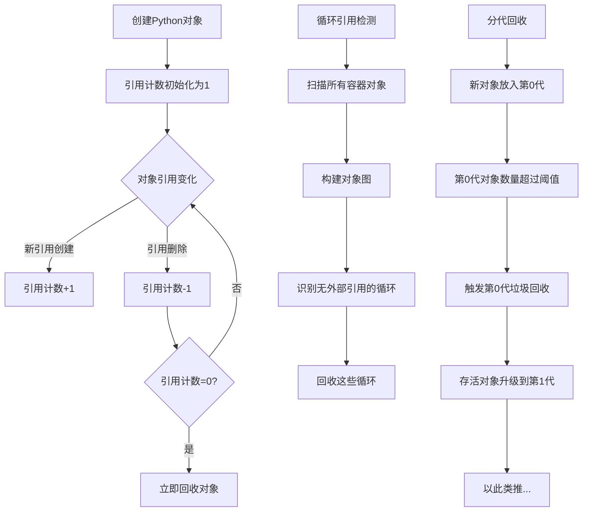

# Python 垃圾回收

## 什么是垃圾回收？

垃圾回收是Python内存管理的核心组成部分，负责自动释放不再使用的内存，防止内存泄漏。当一个对象不再被程序中的任何变量引用时，这块内存就可以被回收并重新使用。

对于初学者来说，这是Python的一大优势——你不需要像C语言那样手动管理内存。而了解垃圾回收机制可以帮助你写出更高效的代码。

:::note 内存管理的重要性
即使Python自动处理内存，理解垃圾回收仍然很重要——它能帮你解决性能问题和内存泄漏。
:::

## Python 垃圾回收的三种机制

Python的垃圾回收主要依靠三种机制：

1. **引用计数**（主要机制）
2. **循环引用检测**
3. **分代回收**

让我们逐一了解这些机制。

## 引用计数机制

Python中的每个对象都有一个引用计数器，记录当前有多少变量引用了该对象。当引用计数降为0时，对象就会被自动回收。

### 引用计数如何工作

以下几种情况会改变对象的引用计数：

- **增加引用计数**：
  - 创建对象的新引用
  - 将对象作为参数传递给函数
  - 将对象放入容器（列表、元组、字典等）

- **减少引用计数**：
  - 引用超出作用域
  - 引用被重新赋值
  - 对象从容器中移除
  - `del` 语句删除引用

### 代码示例

```python
import sys

# 创建一个对象
my_list = [1, 2, 3]
# 查看引用计数
print(f"引用计数: {sys.getrefcount(my_list) - 1}")  # 减1是因为getrefcount本身会创建一个临时引用

# 创建另一个引用
another_reference = my_list
print(f"增加引用后计数: {sys.getrefcount(my_list) - 1}")

# 删除引用
del another_reference
print(f"删除引用后计数: {sys.getrefcount(my_list) - 1}")
```

输出：
```
引用计数: 1
增加引用后计数: 2
删除引用后计数: 1
```

:::tip
`sys.getrefcount()` 会临时增加一个引用计数（因为函数参数传递也是引用），所以我们减1来显示真实值。
:::

## 循环引用问题与解决方案

引用计数有一个致命的弱点：无法处理循环引用。当两个对象互相引用但没有其他引用指向它们时，它们的引用计数都不会降为0，造成内存泄漏。

### 循环引用示例

```python
def create_cycle():
    # 创建两个列表
    list1 = []
    list2 = []
    
    # 它们互相引用
    list1.append(list2)
    list2.append(list1)
    
    # 函数结束后，从函数外部已经无法访问这两个列表
    # 但由于它们互相引用，引用计数不为0，不会被回收

# 调用函数
create_cycle()
# 这里应该有内存泄漏，但Python的循环检测会处理它
```

### 循环引用检测

为了解决循环引用问题，Python引入了循环垃圾收集器。它会定期检查并回收循环引用的对象。

Python的`gc`模块允许我们手动控制垃圾收集器：

```python
import gc

# 禁用自动垃圾收集
gc.disable()

def create_cycle():
    list1 = []
    list2 = []
    list1.append(list2)
    list2.append(list1)
    
# 创建循环引用
create_cycle()

# 手动运行垃圾收集
print(f"垃圾收集前未回收对象数: {gc.collect()}")
print(f"垃圾收集后未回收对象数: {gc.collect()}")
```

输出：
```
垃圾收集前未回收对象数: 2
垃圾收集后未回收对象数: 0
```

### 弱引用解决循环引用

另一种处理循环引用的方法是使用弱引用（`weakref`模块）。弱引用不会增加对象的引用计数。

```python
import weakref

class Node:
    def __init__(self, value):
        self.value = value
        self.parent = None
        self.children = []
        
    def add_child(self, child):
        self.children.append(child)
        # 使用弱引用避免循环引用问题
        child.parent = weakref.proxy(self)

# 创建节点
root = Node("Root")
child = Node("Child")

# 添加子节点
root.add_child(child)

# 验证关系
print(f"Child的父节点: {child.parent.value}")
print(f"Root的子节点: {root.children[0].value}")
```

输出：
```
Child的父节点: Root
Root的子节点: Child
```

## 分代回收策略

Python的垃圾收集器还采用了"分代回收"策略，基于以下观察：

1. 大多数对象生命周期很短
2. 存活时间长的对象往往会继续存活

因此，垃圾收集器将对象分为三代：

- **第0代**：新创建的对象
- **第1代**：经过一次垃圾收集后仍然存活的对象
- **第2代**：经过多次垃圾收集后仍然存活的对象

算法会更频繁地检查年轻代对象，而对老年代对象的检查频率较低，这样可以提高效率。

```python
import gc

# 获取当前的阈值
print(f"垃圾回收阈值(第0代,第1代,第2代): {gc.get_threshold()}")

# 获取当前各代对象的数量
print(f"当前各代对象数量: {gc.get_count()}")

# 手动执行第0代垃圾回收
gc.collect(0)
```

输出：
```
垃圾回收阈值(第0代,第1代,第2代): (700, 10, 10)
当前各代对象数量: (431, 2, 1)
```

:::tip
默认阈值(700, 10, 10)表示：
- 当第0代对象数达到700时，触发第0代收集
- 当第0代收集达到10次时，触发第1代收集
- 当第1代收集达到10次时，触发第2代收集
:::

## 垃圾回收对性能的影响

垃圾回收对Python程序的性能有两面性：
1. 它自动管理内存，减轻开发者的负担
2. 但垃圾回收过程本身会消耗CPU资源

### 优化建议

1. **减少创建临时对象**：尤其是在循环中
   ```python
   # 低效方式
   result = ""
   for i in range(1000):
       result += str(i)  # 每次创建新字符串
       
   # 优化方式
   parts = []
   for i in range(1000):
       parts.append(str(i))
   result = "".join(parts)  # 只创建一次最终字符串
   ```

2. **使用生成器代替大型列表**：
   ```python
   # 消耗大内存
   big_list = [i*i for i in range(1000000)]
   
   # 更高效
   def square_generator(n):
       for i in range(n):
           yield i*i
           
   gen = square_generator(1000000)  # 不会立即计算所有值
   ```

3. **手动控制垃圾回收**：在关键性能部分临时禁用
   ```python
   import gc
   
   # 记录原始状态
   old_threshold = gc.get_threshold()
   # 禁用自动垃圾收集
   gc.disable()
   
   try:
       # 性能敏感的代码
       for i in range(1000000):
           # 处理...
           pass
   finally:
       # 手动收集垃圾
       gc.collect()
       # 恢复自动垃圾收集
       gc.enable()
       # 恢复原始阈值
       gc.set_threshold(*old_threshold)
   ```

## 实际案例分析：内存泄漏检测

以下是一个使用Python检测内存泄漏的实际案例：

```python
import gc
import weakref

# 跟踪对象创建情况的类
class ObjectTracker:
    def __init__(self, object_type):
        self.object_type = object_type
        self.weak_refs = []  # 保存弱引用的列表
        
    def track(self, obj):
        """跟踪一个对象"""
        self.weak_refs.append(weakref.ref(obj))
    
    def count_alive(self):
        """计数还活着的对象"""
        count = 0
        for ref in self.weak_refs:
            if ref() is not None:  # 如果引用还有效
                count += 1
        return count

# 我们要监控的类
class TestClass:
    def __init__(self, name):
        self.name = name
        tracker.track(self)  # 注册跟踪

# 创建跟踪器
tracker = ObjectTracker(TestClass)

# 创建在函数外部仍然可访问的对象
global_obj = TestClass("global")

# 创建并丢失对象的引用
def create_and_lose_reference():
    local_obj = TestClass("local")
    # 在函数结束时，local_obj应该被回收
    
# 调用函数
create_and_lose_reference()

# 强制垃圾回收
gc.collect()

print(f"存活对象数: {tracker.count_alive()}")
print(f"期望结果: 1 (只有global_obj)")

# 创建循环引用并丢失
def create_cycle():
    a = TestClass("cycle_a")
    b = TestClass("cycle_b")
    a.ref = b
    b.ref = a
    # 当函数结束时，a和b形成循环引用
    
create_cycle()
gc.collect()  # 应该处理循环引用

print(f"垃圾回收后存活对象数: {tracker.count_alive()}")
print(f"期望结果: 1 (只有global_obj)")
```

输出：
```
存活对象数: 1
期望结果: 1 (只有global_obj)
垃圾回收后存活对象数: 1
期望结果: 1 (只有global_obj)
```

:::caution 内存泄漏的常见原因
1. 全局变量引用无法回收的大型对象
2. 未处理的循环引用
3. 长期运行的程序中的缓存不断增长
4. 使用C扩展时，扩展模块中的内存泄漏
5. 使用了`__del__`方法的类参与循环引用
:::

## 垃圾回收工作流程图



## 总结

Python的垃圾回收机制是一个多层次的系统：

1. **引用计数**是主要机制，简单高效但无法处理循环引用
2. **循环引用检测**解决了循环引用问题
3. **分代回收**则通过分类管理对象提高了垃圾回收的效率

了解垃圾回收机制可以帮助你：
- 编写更高效的Python代码
- 避免常见的内存泄漏问题
- 在需要时优化内存使用

## 练习与挑战

1. 使用`sys.getrefcount()`跟踪一个对象在不同操作后的引用计数变化
2. 创建一个包含循环引用的程序，并使用`gc`模块检测它
3. 编写一个使用弱引用的缓存系统，确保不会导致内存泄漏
4. 使用`tracemalloc`模块分析一个实际程序的内存使用情况

## 附加资源

- Python官方文档: [gc — 垃圾回收器接口](https://docs.python.org/zh-cn/3/library/gc.html)
- Python弱引用: [weakref — 弱引用](https://docs.python.org/zh-cn/3/library/weakref.html)
- Python内存分析器: [tracemalloc — 跟踪Python的内存分配](https://docs.python.org/zh-cn/3/library/tracemalloc.html)
- 阅读CPython源码中的垃圾回收实现，深入理解其工作原理

记住：理解垃圾回收并不是为了手动管理它（Python的魅力正在于自动处理这些细节），而是为了编写更高效的代码并解决可能出现的问题。