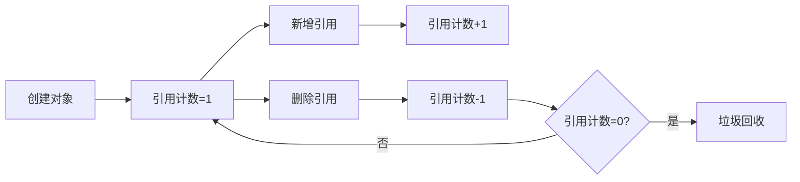

# Python 引用计数

## 引言

Python是一种高级编程语言，广受开发者喜爱的原因之一是它自动管理内存的能力。当我们在Python中创建变量、对象或数据结构时，不需要像C/C++那样手动分配和释放内存。这一切都归功于Python的内存管理机制，而其中最基本的就是**引用计数**。

引用计数是Python内存管理的核心机制之一，它跟踪对象被引用的次数，当引用计数降为零时，对象就会被垃圾回收器回收，从而释放内存。这种机制确保了内存的有效使用，同时也避免了内存泄漏的问题。

## 什么是引用计数？

简单来说，引用计数就是Python记录每个对象被引用次数的方式。每当有一个新的引用指向某个对象时，该对象的引用计数就会增加1；当引用被删除或超出作用域时，引用计数减少1。当引用计数降为0时，Python就知道这个对象不再被使用，可以安全地释放它所占用的内存。



## 查看对象的引用计数

Python提供了`sys.getrefcount()`函数来查看一个对象的引用计数。需要注意的是，调用这个函数本身会创建一个临时引用，因此返回的计数值比实际值大1。

```python
import sys

# 创建一个对象
a = [1, 2, 3]
# 查看引用计数
print(sys.getrefcount(a))  # 输出: 2（1个实际引用 + 函数参数引用）

# 创建另一个引用
b = a
print(sys.getrefcount(a))  # 输出: 3

# 删除一个引用
del b
print(sys.getrefcount(a))  # 输出: 2
```

输出：
```
2
3
2
```

## 引用计数如何增加

引用计数增加的情况包括：

1. **对象创建时**：当一个对象被创建时，它的引用计数设为1。
2. **赋值操作**：将对象赋值给一个新变量时。
3. **作为函数参数**：将对象作为参数传递给函数时。
4. **添加到容器**：当对象被添加到列表、元组、字典等容器中时。

```python
# 1. 对象创建
x = 42  # x引用整数对象42，引用计数为1

# 2. 赋值操作
y = x   # y也引用整数对象42，引用计数增加到2

# 3. 作为函数参数
def print_value(val):
    print(val)
    
print_value(x)  # 传递x给函数，临时增加引用计数

# 4. 添加到容器
my_list = [x]  # x被添加到列表中，引用计数增加
```

## 引用计数如何减少

引用计数减少的情况包括：

1. **局部变量离开作用域**：当函数执行完毕，其中的局部变量会被销毁。
2. **del语句**：显式删除变量引用。
3. **重新赋值**：变量被重新赋予其他值时，原对象的引用计数减少。
4. **从容器中移除**：当对象从列表、元组、字典等容器中移除时。

```python
# 引用计数减少示例
a = 100  # 引用计数为1
b = a    # 引用计数为2

# 1. del语句
del a    # 引用计数减少为1

# 2. 重新赋值
b = 200  # 整数对象100的引用计数减少为0，将被垃圾回收

# 3. 作用域示例
def scope_example():
    c = 300  # 在函数内部创建对象，引用计数为1
    print("c exists here")
    # 函数结束时，c离开作用域，300的引用计数减少为0

scope_example()
# 此处c不存在，300对象已被回收

# 4. 从容器中移除
my_list = [1, 2, 3]
element = 2
my_list.remove(element)  # 从列表中移除，可能导致引用计数减少
```

## 循环引用问题

引用计数机制有一个明显的弱点：无法处理循环引用。当两个对象互相引用对方时，即使它们在程序中不再被使用，它们的引用计数也永远不会降为0，导致内存无法被释放。

:::caution 循环引用
循环引用是Python内存管理中的一个重要问题，如果不小心处理，可能导致内存泄漏。
:::

```python
import sys

# 创建循环引用
def create_cycle():
    a = {}
    b = {}
    a['b'] = b  # a引用b
    b['a'] = a  # b引用a
    
    # 打印引用计数
    print(f"a的引用计数: {sys.getrefcount(a)}")
    print(f"b的引用计数: {sys.getrefcount(b)}")
    
    # 即使函数结束，a和b互相引用，引用计数不为0
    # 它们不会被自动回收

create_cycle()
```

输出：
```
a的引用计数: 3
b的引用计数: 3
```

为了解决循环引用问题，Python引入了垃圾回收器（Garbage Collector），它能够检测并清理循环引用的对象。Python的垃圾回收器使用了一种称为"标记-清除"的算法来处理循环引用问题。

## 弱引用

Python提供了`weakref`模块来创建对象的弱引用。弱引用不会增加对象的引用计数，因此不会阻止对象被垃圾回收。

```python
import weakref

class MyClass:
    def __init__(self, name):
        self.name = name
    
    def __repr__(self):
        return f"MyClass({self.name})"

# 创建一个对象
obj = MyClass("example")
print(obj)  # 输出: MyClass(example)

# 创建一个弱引用
weak_ref = weakref.ref(obj)
print(weak_ref())  # 输出: MyClass(example)

# 删除原始引用
del obj

# 弱引用现在返回None，因为被引用的对象已经被回收
print(weak_ref())  # 输出: None
```

输出：
```
MyClass(example)
MyClass(example)
None
```

## 实际应用案例

### 案例1: 缓存管理

引用计数对于实现缓存系统非常有用。在以下例子中，我们创建一个简单的缓存类，使用弱引用来避免内存泄漏：

```python
import weakref

class Cache:
    def __init__(self):
        # 使用弱引用字典，当键没有其他引用时自动删除
        self._cache = weakref.WeakKeyDictionary()
    
    def get(self, key):
        return self._cache.get(key)
    
    def set(self, key, value):
        self._cache[key] = value
    
    def __len__(self):
        return len(self._cache)

# 使用缓存
cache = Cache()

# 创建一些对象
class DataObject:
    def __init__(self, value):
        self.value = value

# 添加到缓存
obj1 = DataObject("data1")
obj2 = DataObject("data2")

cache.set(obj1, "cached_value_1")
cache.set(obj2, "cached_value_2")

print(f"缓存大小: {len(cache)}")  # 输出: 缓存大小: 2
print(f"obj1的缓存值: {cache.get(obj1)}")  # 输出: obj1的缓存值: cached_value_1

# 删除obj1的引用
del obj1

# 垃圾回收后，缓存中的obj1条目自动清除
import gc
gc.collect()  # 强制垃圾回收

print(f"缓存大小: {len(cache)}")  # 输出: 缓存大小: 1
```

### 案例2: 资源管理

引用计数在管理有限资源（如文件句柄、数据库连接等）时非常有用：

```python
class DatabaseConnection:
    _connections = {}
    
    @classmethod
    def get_connection(cls, connection_string):
        if connection_string not in cls._connections:
            # 创建新连接
            print(f"创建新连接: {connection_string}")
            cls._connections[connection_string] = {"connection": connection_string, "users": 0}
        
        # 增加使用计数
        cls._connections[connection_string]["users"] += 1
        return ConnectionProxy(connection_string)
    
    @classmethod
    def release_connection(cls, connection_string):
        if connection_string in cls._connections:
            cls._connections[connection_string]["users"] -= 1
            print(f"连接 {connection_string} 的引用计数: {cls._connections[connection_string]['users']}")
            
            # 如果没有人使用此连接，关闭它
            if cls._connections[connection_string]["users"] <= 0:
                print(f"关闭连接: {connection_string}")
                del cls._connections[connection_string]

class ConnectionProxy:
    def __init__(self, connection_string):
        self.connection_string = connection_string
    
    def __del__(self):
        # 当对象被销毁时释放连接
        DatabaseConnection.release_connection(self.connection_string)

# 使用示例
def do_work():
    # 获取连接
    conn = DatabaseConnection.get_connection("mysql://localhost/db")
    # 使用连接...
    print("正在使用连接...")
    # 连接在函数结束时自动释放（当conn超出作用域）

print("开始第一个任务")
do_work()

print("\n开始第二个任务")
do_work()

print("\n开始第三个任务")
conn = DatabaseConnection.get_connection("mysql://localhost/db")
# 手动删除引用
del conn
```

输出：
```
开始第一个任务
创建新连接: mysql://localhost/db
正在使用连接...
连接 mysql://localhost/db 的引用计数: 0
关闭连接: mysql://localhost/db

开始第二个任务
创建新连接: mysql://localhost/db
正在使用连接...
连接 mysql://localhost/db 的引用计数: 0
关闭连接: mysql://localhost/db

开始第三个任务
创建新连接: mysql://localhost/db
连接 mysql://localhost/db 的引用计数: 0
关闭连接: mysql://localhost/db
```

## 性能影响

引用计数虽然简单高效，但也带来了一些性能开销：

1. **增加内存使用**：每个Python对象都需要额外的内存来存储引用计数。
2. **CPU开销**：每次引用操作都需要更新引用计数，在频繁创建和销毁对象的程序中可能会影响性能。
3. **线程安全问题**：在多线程环境中，引用计数操作需要原子性，这增加了额外的开销。

:::tip 优化提示
对于性能关键型应用，可以考虑使用第三方工具如Cython、NumPy等，它们能更有效地管理内存或减少Python对象的创建。
:::

## 总结

Python的引用计数机制是其内存管理的基础。通过跟踪每个对象的引用数量，Python能够自动回收不再使用的对象，释放内存资源。主要特点包括：

- 每个Python对象都有一个引用计数，记录指向它的引用数量
- 当引用计数降为0时，对象会被自动回收
- 循环引用是引用计数的弱点，需要垃圾回收器来处理
- 弱引用提供了一种不增加引用计数的方式来引用对象

理解引用计数机制不仅有助于编写更高效的Python代码，也是避免内存泄漏和优化程序性能的关键。

## 练习题

1. 编写一个程序，创建一个整数对象，然后通过多种方式增加其引用计数，并使用`sys.getrefcount()`验证。
2. 创建一个循环引用的例子，并使用`gc`模块的函数检测和清理这个循环引用。
3. 实现一个使用弱引用的缓存系统，确保当缓存的对象不再被程序其他部分使用时，能够从缓存中自动删除。

## 进一步阅读

- Python官方文档中关于[垃圾回收](https://docs.python.org/3/library/gc.html)的部分
- [weakref模块](https://docs.python.org/3/library/weakref.html) - 创建弱引用的标准库
- [CPython内存管理](https://docs.python.org/3/c-api/memory.html) - 深入了解Python底层实现

通过深入理解Python的引用计数机制，你将能够编写更高效、更稳定的Python程序，并避免一些常见的内存管理陷阱。